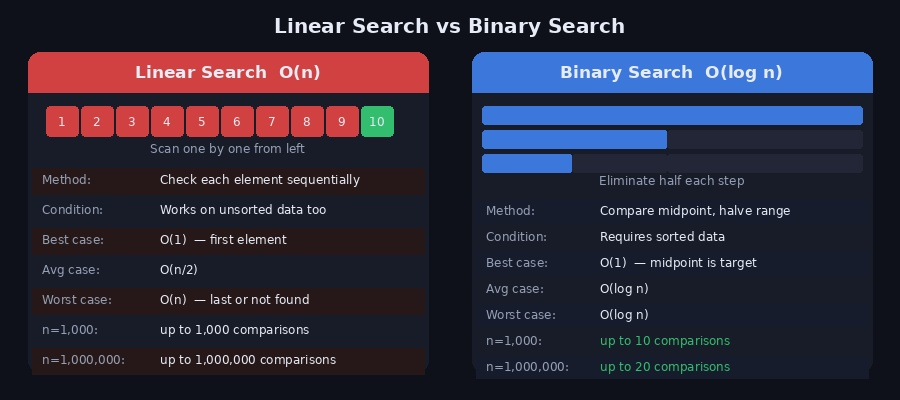
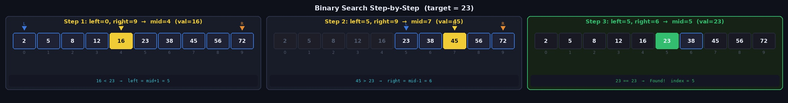
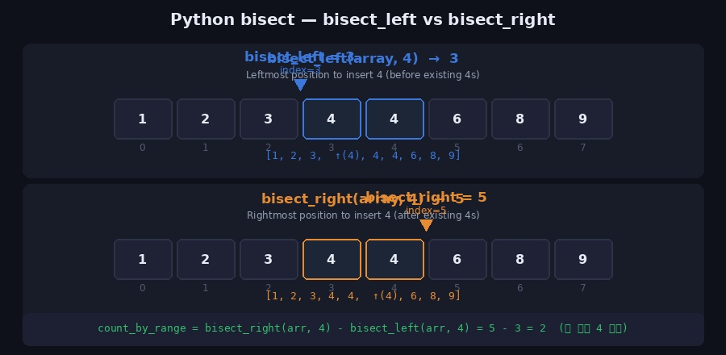

업다운 게임을 떠올려보면 이진 탐색의 원리가 바로 보입니다. 1~100 사이 숫자를 맞출 때 50부터 시작해서 "UP / DOWN"에 따라 절반씩 범위를 좁혀가는 방식이 바로 이진 탐색입니다. 이번 포스트에서는 이진 탐색의 개념부터 구현 방법, Python의 `bisect` 라이브러리 활용법까지 정리합니다.

---

## 1. 이진 탐색이란?

**이진 탐색(Binary Search)** 은 **정렬된** 데이터에서 특정 값을 찾는 알고리즘입니다. 탐색 범위를 절반씩 줄여 나가기 때문에 매우 빠릅니다.

> **전제 조건: 반드시 정렬된 상태여야 합니다.**



### 선형 탐색과의 비교

선형 탐색은 처음부터 하나씩 비교하는 O(n) 방식인 반면, 이진 탐색은 매 단계마다 탐색 범위를 절반으로 줄이는 O(log n) 방식입니다.

| | 선형 탐색 | 이진 탐색 |
|--|---------|---------|
| 시간복잡도 | O(n) | O(log n) |
| 정렬 필요 여부 | 불필요 | **필수** |
| n = 1,000 | 최대 1,000번 | 최대 10번 |
| n = 1,000,000 | 최대 100만번 | 최대 20번 |

n이 100만이어도 단 20번 비교로 탐색이 끝납니다.

---

## 2. 동작 원리

배열 `[2, 5, 8, 12, 16, 23, 38, 45, 56, 72]`에서 target = **23** 을 찾는 과정입니다.



```
초기 상태: left=0, right=9

Step 1: mid = (0+9)//2 = 4  →  arr[4] = 16
        16 < 23  →  left = mid+1 = 5

Step 2: mid = (5+9)//2 = 7  →  arr[7] = 45
        45 > 23  →  right = mid-1 = 6

Step 3: mid = (5+6)//2 = 5  →  arr[5] = 23
        23 == 23  →  Found! index = 5
```

3번의 비교만으로 10개 배열에서 값을 찾았습니다.

---

## 3. Python 구현

### 반복문 (Iterative)

```python
def binary_search(arr, target):
    left, right = 0, len(arr) - 1

    while left <= right:
        mid = (left + right) // 2

        if arr[mid] == target:
            return mid           # 찾으면 인덱스 반환
        elif arr[mid] < target:
            left = mid + 1       # 오른쪽 절반 탐색
        else:
            right = mid - 1      # 왼쪽 절반 탐색

    return -1  # 없으면 -1 반환


arr = [2, 5, 8, 12, 16, 23, 38, 45, 56, 72]
print(binary_search(arr, 23))   # 5
print(binary_search(arr, 10))   # -1
```

### 재귀 (Recursive)

```python
def binary_search_recursive(arr, target, left, right):
    if left > right:
        return -1  # 탐색 범위가 없으면 종료

    mid = (left + right) // 2

    if arr[mid] == target:
        return mid
    elif arr[mid] < target:
        return binary_search_recursive(arr, target, mid + 1, right)
    else:
        return binary_search_recursive(arr, target, left, mid - 1)


arr = [2, 5, 8, 12, 16, 23, 38, 45, 56, 72]
print(binary_search_recursive(arr, 23, 0, len(arr)-1))  # 5
```

> 재귀 방식은 코드가 간결하지만, n이 매우 클 경우 Python의 재귀 깊이 제한에 걸릴 수 있습니다. 실무에서는 반복문 방식을 권장합니다.

---

## 4. 경계값 탐색 — Lower Bound / Upper Bound

이진 탐색의 가장 실용적인 응용입니다. 중복된 값이 있을 때 **가장 왼쪽/오른쪽 위치** 를 찾습니다.

### Lower Bound (하한) — 같거나 큰 첫 번째 위치

```python
def lower_bound(arr, target):
    """target 이상인 값이 처음 등장하는 인덱스 반환"""
    left, right = 0, len(arr)  # right = len(arr) 주의!

    while left < right:        # left < right (등호 없음)
        mid = (left + right) // 2
        if arr[mid] < target:
            left = mid + 1
        else:
            right = mid        # mid 포함해서 왼쪽 탐색

    return left


arr = [1, 2, 3, 4, 4, 4, 6, 8, 9]
print(lower_bound(arr, 4))   # 3  ← 4가 처음 나오는 위치
print(lower_bound(arr, 5))   # 6  ← 5 이상인 값(6)의 첫 위치
```

### Upper Bound (상한) — 초과하는 첫 번째 위치

```python
def upper_bound(arr, target):
    """target 초과인 값이 처음 등장하는 인덱스 반환"""
    left, right = 0, len(arr)

    while left < right:
        mid = (left + right) // 2
        if arr[mid] <= target:  # <= 에 주의 (lower_bound와 차이)
            left = mid + 1
        else:
            right = mid

    return left


arr = [1, 2, 3, 4, 4, 4, 6, 8, 9]
print(upper_bound(arr, 4))   # 6  ← 4 초과인 값(6)의 첫 위치
```

### 특정 값의 개수 구하기

Lower/Upper Bound를 이용하면 **O(log n)** 으로 특정 값의 개수를 셀 수 있습니다.

```python
def count_value(arr, target):
    return upper_bound(arr, target) - lower_bound(arr, target)

arr = [1, 2, 3, 4, 4, 4, 6, 8, 9]
print(count_value(arr, 4))   # 3  ← 4가 3개
print(count_value(arr, 5))   # 0  ← 5가 없음
```

---

## 5. Python bisect 라이브러리

Python은 이진 탐색을 위한 `bisect` 내장 라이브러리를 제공합니다. Lower/Upper Bound를 직접 구현하지 않아도 됩니다.



```python
from bisect import bisect_left, bisect_right
```

### bisect_left(a, x)

정렬 상태를 유지하면서 x를 삽입할 수 있는 **가장 왼쪽 인덱스** 반환 = Lower Bound

```python
from bisect import bisect_left

array = [1, 2, 3, 4, 4, 6, 8, 9]
print(bisect_left(array, 4))   # 3
#  [1, 2, 3, (4), 4, 4, 6, 8, 9]  ← 인덱스 3
```

### bisect_right(a, x)

정렬 상태를 유지하면서 x를 삽입할 수 있는 **가장 오른쪽 인덱스** 반환 = Upper Bound

```python
from bisect import bisect_right

array = [1, 2, 3, 4, 4, 6, 8, 9]
print(bisect_right(array, 4))  # 5
#  [1, 2, 3, 4, 4, (4), 6, 8, 9]  ← 인덱스 5
```

### 범위 내 원소 개수 구하기

```python
from bisect import bisect_left, bisect_right

def count_by_range(a, left_val, right_val):
    """[left_val, right_val] 범위에 포함되는 원소 개수"""
    right_idx = bisect_right(a, right_val)
    left_idx  = bisect_left(a, left_val)
    return right_idx - left_idx

array = [1, 2, 3, 4, 4, 6, 8, 9]

print(count_by_range(array, -1, 3))  # 3  →  1, 2, 3
print(count_by_range(array, 4, 4))   # 2  →  4, 4
print(count_by_range(array, 4, 7))   # 3  →  4, 4, 6
```

### bisect로 정렬 삽입

```python
from bisect import insort_left, insort_right

array = [1, 3, 5, 7]
insort_left(array, 4)   # 정렬 유지하며 삽입
print(array)            # [1, 3, 4, 5, 7]
```

---

## 6. 이진 탐색 응용 — 파라메트릭 서치

이진 탐색은 단순히 값을 찾는 것 외에도 **"조건을 만족하는 최솟값/최댓값"** 을 구하는 파라메트릭 서치(Parametric Search)에 자주 사용됩니다.

> "중간 지점의 값이 조건을 만족하는가?" 를 이진 탐색으로 반복해 최적값을 좁혀 나가는 방식

```python
# 예시: 떡을 최소 M만큼 얻으려면 절단기 높이를 최대 얼마로 설정해야 하는가?
def can_cut(heights, h, target):
    """절단기 높이 h로 잘랐을 때 얻는 떡의 총량 >= target?"""
    total = sum(max(0, rice - h) for rice in heights)
    return total >= target

def solution(heights, target):
    left, right = 0, max(heights)
    answer = 0

    while left <= right:
        mid = (left + right) // 2
        if can_cut(heights, mid, target):
            answer = mid        # 조건 만족 → 더 높은 높이 시도
            left = mid + 1
        else:
            right = mid - 1     # 조건 불만족 → 더 낮은 높이 시도

    return answer

heights = [19, 15, 10, 17]
print(solution(heights, 6))   # 15
```

---

## 7. 주의할 점

**1. 반드시 정렬 후 사용**

```python
arr = [5, 2, 8, 1, 9]
# ❌ 정렬 없이 이진 탐색 → 잘못된 결과
# ✅ 정렬 후 사용
arr.sort()
result = binary_search(arr, 8)
```

**2. right 초기값에 주의**

```python
# 값 탐색 (정확한 인덱스 찾기)
left, right = 0, len(arr) - 1   # right = n-1
while left <= right:             # 등호 포함

# Lower/Upper Bound (경계 탐색)
left, right = 0, len(arr)        # right = n (범위 밖)
while left < right:              # 등호 없음
```

**3. mid 계산 시 오버플로우**

Python은 정수 오버플로우가 없지만, 다른 언어에서는 아래처럼 작성합니다.

```python
# ❌ 다른 언어에서 오버플로우 가능
mid = (left + right) // 2

# ✅ 안전한 방식
mid = left + (right - left) // 2
```

---

## 8. 관련 백준 문제

| 문제 | 난이도 | 핵심 기법 |
|------|--------|-----------|
| [1920 수 찾기](https://www.acmicpc.net/problem/1920) | Silver IV | 이진 탐색 기본 |
| [10816 숫자 카드 2](https://www.acmicpc.net/problem/10816) | Silver IV | bisect / Lower·Upper Bound |
| [2805 나무 자르기](https://www.acmicpc.net/problem/2805) | Silver II | 파라메트릭 서치 |
| [2110 공유기 설치](https://www.acmicpc.net/problem/2110) | Gold IV | 파라메트릭 서치 |
| [1300 K번째 수](https://www.acmicpc.net/problem/1300) | Gold II | 이진 탐색 응용 |

---

## 참고 자료

- [이진 탐색(Binary Search) 알고리즘 개념](https://velog.io/@kwontae1313/%EC%9D%B4%EC%A7%84-%ED%83%90%EC%83%89Binary-Search-%EC%95%8C%EA%B3%A0%EB%A6%AC%EC%A6%98-%EA%B0%9C%EB%85%90)
- [python | 파이썬 이진 탐색 라이브러리 bisect 사용하기](https://dduniverse.tistory.com/entry/python-%ED%8C%8C%EC%9D%B4%EC%8D%AC-%EC%9D%B4%EC%A7%84-%ED%83%90%EC%83%89-%EB%9D%BC%EC%9D%B4%EB%B8%8C%EB%9F%AC%EB%A6%AC-bisect-%EC%82%AC%EC%9A%A9%ED%95%98%EA%B8%B0)
- Claude AI