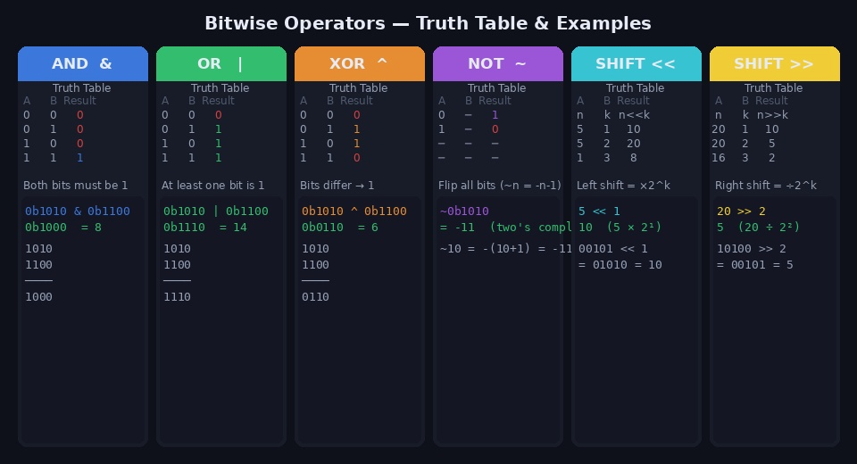
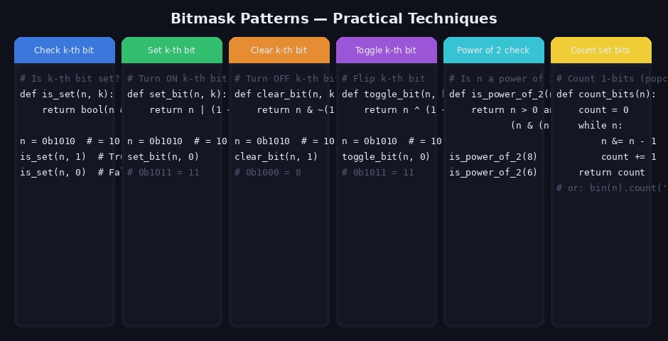
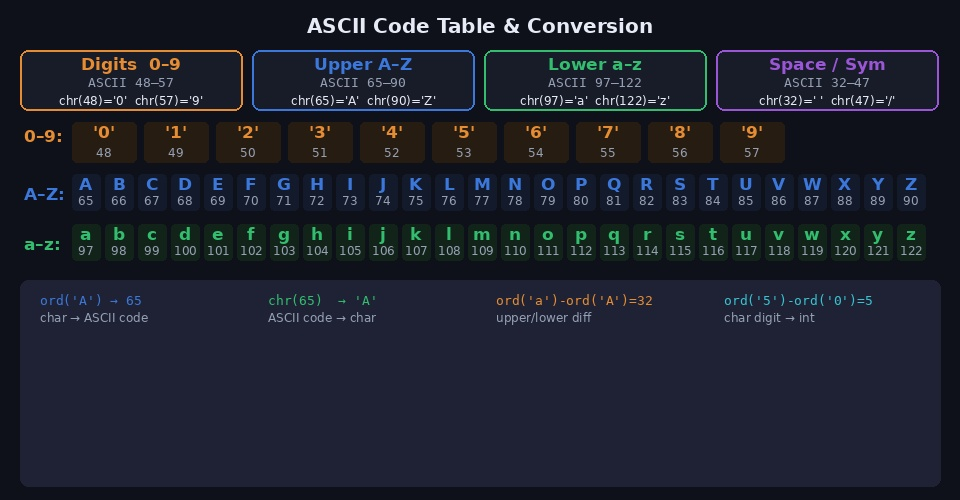
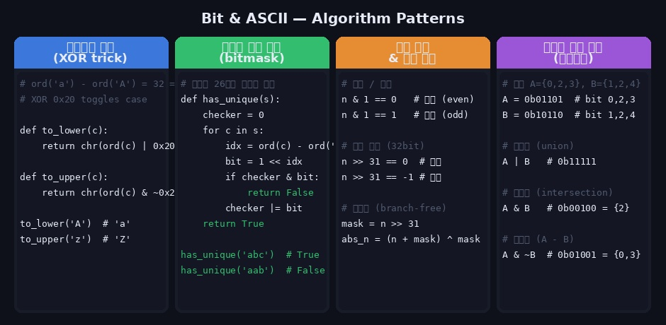

비트 연산과 아스키코드 변환은 코딩테스트에서 단골로 등장하는 테크닉입니다. 특히 비트마스킹은 집합을 정수 하나로 표현해 상태 압축 DP나 방문 체크에 활용되고, 아스키코드는 문자를 숫자처럼 다룰 수 있게 해줍니다. 두 개념을 함께 익히면 문자열과 정수를 넘나드는 문제를 훨씬 간결하게 풀 수 있습니다.

---

## 1. 비트(Bit)와 이진수 기초

비트 연산을 이해하려면 먼저 10진수를 2진수로 표현하는 방식을 알아야 합니다.

```python
# 파이썬에서 진수 변환
print(bin(10))    # '0b1010'  — 10진수 → 2진수 문자열
print(oct(10))    # '0o12'    — 10진수 → 8진수
print(hex(255))   # '0xff'    — 10진수 → 16진수

print(int('1010', 2))   # 10  — 2진수 문자열 → 10진수
print(int('ff', 16))    # 255 — 16진수 문자열 → 10진수

# 비트 수 확인
print((10).bit_length())  # 4  — 1010이므로 4비트
```

```
10진수    2진수 (8비트)
  0   →  0000 0000
  1   →  0000 0001
  5   →  0000 0101
 10   →  0000 1010
255   →  1111 1111
```

---

## 2. 비트 연산자



### AND ( & )

두 비트가 모두 1일 때만 1입니다.

```python
a = 0b1010   # 10
b = 0b1100   # 12

print(a & b)          # 8
print(bin(a & b))     # 0b1000

#   1010
# & 1100
# ------
#   1000  = 8
```

### OR ( | )

두 비트 중 하나라도 1이면 1입니다.

```python
a = 0b1010   # 10
b = 0b1100   # 12

print(a | b)          # 14
print(bin(a | b))     # 0b1110

#   1010
# | 1100
# ------
#   1110  = 14
```

### XOR ( ^ )

두 비트가 서로 다를 때 1입니다. **같으면 0, 다르면 1** 로 기억하면 됩니다.

```python
a = 0b1010   # 10
b = 0b1100   # 12

print(a ^ b)          # 6
print(bin(a ^ b))     # 0b0110

#   1010
# ^ 1100
# ------
#   0110  = 6
```

> XOR의 특성: `a ^ a = 0`, `a ^ 0 = a` — 같은 값을 두 번 XOR하면 원래 값이 됩니다.

### NOT ( ~ )

모든 비트를 뒤집습니다. Python에서 `~n = -(n+1)` 입니다.

```python
n = 10
print(~n)    # -11

# 규칙: ~n = -(n+1)
# ~0  = -1
# ~1  = -2
# ~10 = -11
```

### 왼쪽 시프트 ( << )

비트를 왼쪽으로 k칸 이동합니다. **n × 2^k** 와 같습니다.

```python
print(1 << 0)   # 1    (1 × 2⁰)
print(1 << 1)   # 2    (1 × 2¹)
print(1 << 3)   # 8    (1 × 2³)
print(5 << 2)   # 20   (5 × 2²)

# 0b00101 << 2
# = 0b10100 = 20
```

### 오른쪽 시프트 ( >> )

비트를 오른쪽으로 k칸 이동합니다. **n ÷ 2^k** (몫)와 같습니다.

```python
print(20 >> 1)  # 10   (20 ÷ 2¹)
print(20 >> 2)  # 5    (20 ÷ 2²)
print(16 >> 3)  # 2    (16 ÷ 2³)

# 0b10100 >> 2
# = 0b00101 = 5
```

---

## 3. 비트마스크 패턴



비트마스크는 **정수 하나로 여러 플래그 상태를 동시에 관리**하는 기법입니다.

### k번째 비트 확인 (Check)

```python
def is_set(n, k):
    return bool(n & (1 << k))

n = 0b1010  # = 10

is_set(n, 0)   # False — 0번 비트: 0
is_set(n, 1)   # True  — 1번 비트: 1
is_set(n, 2)   # False — 2번 비트: 0
is_set(n, 3)   # True  — 3번 비트: 1
```

### k번째 비트 켜기 (Set)

```python
def set_bit(n, k):
    return n | (1 << k)

n = 0b1010  # = 10
print(bin(set_bit(n, 0)))   # 0b1011 = 11  (0번 비트 ON)
print(bin(set_bit(n, 2)))   # 0b1110 = 14  (2번 비트 ON)
```

### k번째 비트 끄기 (Clear)

```python
def clear_bit(n, k):
    return n & ~(1 << k)

n = 0b1010  # = 10
print(bin(clear_bit(n, 1)))  # 0b1000 = 8  (1번 비트 OFF)
print(bin(clear_bit(n, 3)))  # 0b0010 = 2  (3번 비트 OFF)
```

### k번째 비트 토글 (Toggle)

```python
def toggle_bit(n, k):
    return n ^ (1 << k)

n = 0b1010  # = 10
print(bin(toggle_bit(n, 0)))  # 0b1011 = 11  (0번 0→1)
print(bin(toggle_bit(n, 1)))  # 0b1000 = 8   (1번 1→0)
```

### 2의 거듭제곱 판별

```python
def is_power_of_2(n):
    return n > 0 and (n & (n - 1)) == 0

# 원리: 2의 거듭제곱은 이진수에서 1비트가 딱 하나
# 8  = 1000
# 7  = 0111
# 8 & 7 = 0000 → True

is_power_of_2(1)    # True  (2⁰)
is_power_of_2(8)    # True  (2³)
is_power_of_2(6)    # False
is_power_of_2(0)    # False
```

### 1인 비트 개수 세기 (Brian Kernighan's Algorithm)

```python
def count_bits(n):
    count = 0
    while n:
        n &= n - 1   # 가장 오른쪽 1비트를 0으로 만듦
        count += 1
    return count

# 또는 Python 내장 방식
bin(13).count('1')   # 3  (13 = 0b1101)
n.bit_count()        # Python 3.10+

count_bits(0b1101)   # 3
count_bits(0b1111)   # 4
```

### 최하위 1비트 추출

```python
n = 0b1100   # 12

lowest_bit = n & (-n)   # 0b0100 = 4  (가장 오른쪽 1비트만)
# -n은 두의 보수: 0b0100
```

---

## 4. 아스키코드 (ASCII Code)



아스키(ASCII)는 문자와 숫자를 대응시키는 인코딩 표준입니다.

### 핵심 범위 외우기

```
숫자  '0'~'9' : 48~57
대문자 'A'~'Z' : 65~90
소문자 'a'~'z' : 97~122
공백   ' '     : 32
```

> **'a' - 'A' = 32 = 0b100000** — 대소문자 차이는 딱 32, 즉 6번 비트 하나의 차이입니다.

### 변환 함수

```python
# 문자 → 아스키 코드
ord('A')    # 65
ord('a')    # 97
ord('0')    # 48
ord(' ')    # 32
ord('Z')    # 90

# 아스키 코드 → 문자
chr(65)     # 'A'
chr(97)     # 'a'
chr(48)     # '0'
chr(90)     # 'Z'
```

### 자주 쓰는 변환 패턴

```python
# 알파벳 인덱스 (a=0, b=1, ..., z=25)
def char_to_idx(c):
    return ord(c) - ord('a')

def idx_to_char(i):
    return chr(i + ord('a'))

char_to_idx('a')   # 0
char_to_idx('z')   # 25
idx_to_char(4)     # 'e'

# 문자 숫자 → 정수
def char_to_int(c):
    return ord(c) - ord('0')

char_to_int('5')   # 5
char_to_int('9')   # 9

# 정수 → 문자 숫자
def int_to_char(n):
    return chr(n + ord('0'))

int_to_char(3)     # '3'

# 대문자 ↔ 소문자
def to_upper(c):
    return chr(ord(c) - 32)

def to_lower(c):
    return chr(ord(c) + 32)

to_upper('a')   # 'A'
to_lower('Z')   # 'z'
```

### 알파벳 순환 (카이사르 암호 등)

```python
def shift_char(c, n):
    """알파벳을 n칸 이동 (소문자 기준, 순환)"""
    return chr((ord(c) - ord('a') + n) % 26 + ord('a'))

shift_char('a', 3)    # 'd'
shift_char('z', 1)    # 'a'   — 순환
shift_char('m', 13)   # 'z'
```

---

## 5. 비트 연산 + 아스키코드 알고리즘 활용



### 대소문자 변환 — XOR 트릭

대문자와 소문자의 차이는 정확히 32 = `0b100000`이므로 6번 비트를 XOR로 토글하면 대소문자를 변환할 수 있습니다.

```python
def to_lower_bit(c):
    return chr(ord(c) | 0x20)    # 6번 비트 강제로 1

def to_upper_bit(c):
    return chr(ord(c) & ~0x20)   # 6번 비트 강제로 0

to_lower_bit('A')   # 'a'
to_lower_bit('a')   # 'a'  (이미 소문자 → 그대로)
to_upper_bit('z')   # 'Z'
to_upper_bit('Z')   # 'Z'  (이미 대문자 → 그대로)

# toggle (대소문자 전환)
def toggle_case(c):
    return chr(ord(c) ^ 0x20)

toggle_case('A')   # 'a'
toggle_case('a')   # 'A'
```

### 문자열 중복 문자 검사 — 비트마스크

26개 알파벳을 정수의 비트로 표현해 O(n) 시간, O(1) 공간으로 중복 검사를 할 수 있습니다.

```python
def has_unique_chars(s: str) -> bool:
    """문자열에 중복된 소문자 알파벳이 없으면 True"""
    checker = 0
    for c in s:
        idx = ord(c) - ord('a')   # a=0, b=1, ..., z=25
        bit = 1 << idx
        if checker & bit:          # 이미 본 문자
            return False
        checker |= bit             # 비트 표시
    return True

has_unique_chars("abcde")   # True
has_unique_chars("abcda")   # False  ('a' 중복)

# 어떤 문자들이 있는지도 확인 가능
def get_char_set(s: str) -> str:
    checker = 0
    for c in s:
        checker |= 1 << (ord(c) - ord('a'))
    return ''.join(chr(i + ord('a')) for i in range(26) if checker & (1 << i))

get_char_set("hello")   # 'ehlo'
```

### 홀짝 판별 — 비트 AND

```python
# & 1이 0이면 짝수, 1이면 홀수
def is_even(n): return (n & 1) == 0
def is_odd(n):  return (n & 1) == 1

is_even(4)   # True
is_odd(7)    # True

# 전통 방식 (%) 보다 비트 연산이 빠름
```

### 비트로 집합 연산 표현

n개의 원소로 이루어진 집합을 n비트 정수 하나로 표현합니다.

```python
# 원소: {0, 1, 2, 3, 4}
# A = {0, 2, 3}  →  0b01101 = 13
# B = {1, 2, 4}  →  0b10110 = 22

A = (1<<0) | (1<<2) | (1<<3)   # 0b01101 = 13
B = (1<<1) | (1<<2) | (1<<4)   # 0b10110 = 22

# 합집합 A ∪ B
print(bin(A | B))    # 0b11111 = {0,1,2,3,4}

# 교집합 A ∩ B
print(bin(A & B))    # 0b00100 = {2}

# 차집합 A - B
print(bin(A & ~B))   # 0b01001 = {0,3}  (A에만 있는 원소)

# 여집합 (전체 집합이 5비트라 가정)
ALL = (1 << 5) - 1   # 0b11111
print(bin(ALL ^ A))  # 0b10010 = {1,4}  (A에 없는 원소)

# 원소 포함 여부
def contains(S, elem):
    return bool(S & (1 << elem))

contains(A, 2)   # True
contains(A, 4)   # False
```

### XOR로 중복 없는 수 찾기

```python
# 배열에서 딱 한 번 등장하는 수 찾기 (나머지는 두 번씩)
# 원리: a ^ a = 0, a ^ 0 = a

def find_single(nums):
    result = 0
    for n in nums:
        result ^= n
    return result

find_single([1, 2, 3, 2, 1])    # 3
find_single([4, 1, 2, 1, 2])    # 4

# 두 수만 두 번: 짝수 XOR은 0이 되어 홀수 XOR만 남음
```

---

## 6. 코딩테스트 실전 팁

### 자주 쓰는 비트 표현 모음

```python
# 비트 n개 모두 1인 마스크
mask = (1 << n) - 1     # n=4: 0b1111 = 15

# 전체 방문 상태 (n개 도시)
ALL_VISITED = (1 << n) - 1

# i번째 노드 방문 표시
visited |= (1 << i)

# i번째 노드 방문 여부
is_visited = bool(visited & (1 << i))

# 짝수/홀수
n & 1 == 0    # 짝수
n & 1 == 1    # 홀수

# 2 곱하기 / 나누기
n << 1        # n * 2
n >> 1        # n // 2
```

### 아스키 코드 요약

```python
# 자주 쓰는 ord 값
ord('0') = 48    →   ord('9') = 57
ord('A') = 65    →   ord('Z') = 90
ord('a') = 97    →   ord('z') = 122
ord('a') - ord('A') = 32

# 패턴
ord(c) - ord('a')          # 소문자 알파벳 인덱스 (0~25)
ord(c) - ord('A')          # 대문자 알파벳 인덱스 (0~25)
ord(c) - ord('0')          # 문자 숫자 → 정수 (0~9)
chr(i + ord('a'))          # 인덱스 → 소문자 알파벳
chr(i + ord('0'))          # 정수 → 문자 숫자
```

---

## 7. 관련 백준 문제

| 문제 | 난이도 | 핵심 기법 |
|------|--------|-----------|
| [11723 집합](https://www.acmicpc.net/problem/11723) | Silver V | 비트마스크 집합 연산 기본 |
| [2098 외판원 순회](https://www.acmicpc.net/problem/2098) | Gold I | 비트마스크 DP (TSP) |
| [1062 가르침](https://www.acmicpc.net/problem/1062) | Gold IV | 비트마스크 브루트포스 |
| [1086 박성원](https://www.acmicpc.net/problem/1086) | Platinum V | 비트마스크 DP |
| [10809 알파벳 찾기](https://www.acmicpc.net/problem/10809) | Bronze II | ord() 기초 활용 |
| [1152 단어의 개수](https://www.acmicpc.net/problem/1152) | Bronze II | 문자열 + ord 활용 |
| [1251 단어 나누기](https://www.acmicpc.net/problem/1251) | Silver V | 대소문자 변환 활용 |

---

## 참고 자료

- [Python 공식 문서 — 비트 연산자](https://docs.python.org/3/reference/expressions.html#binary-bitwise-operations)
- [Python 공식 문서 — ord / chr](https://docs.python.org/3/library/functions.html#ord)
- Claude AI