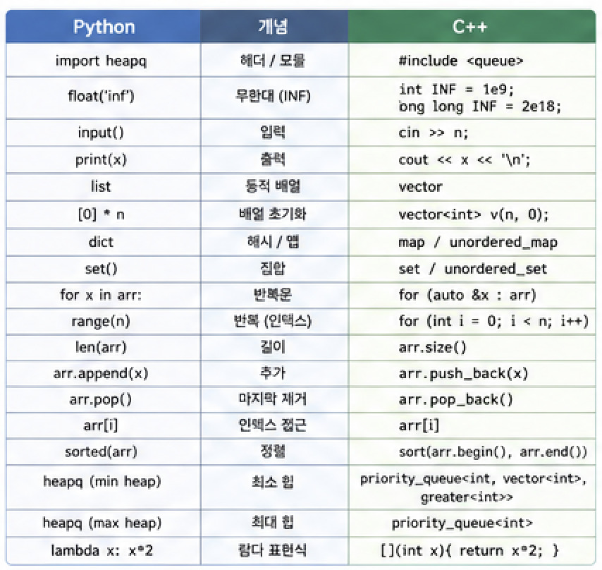
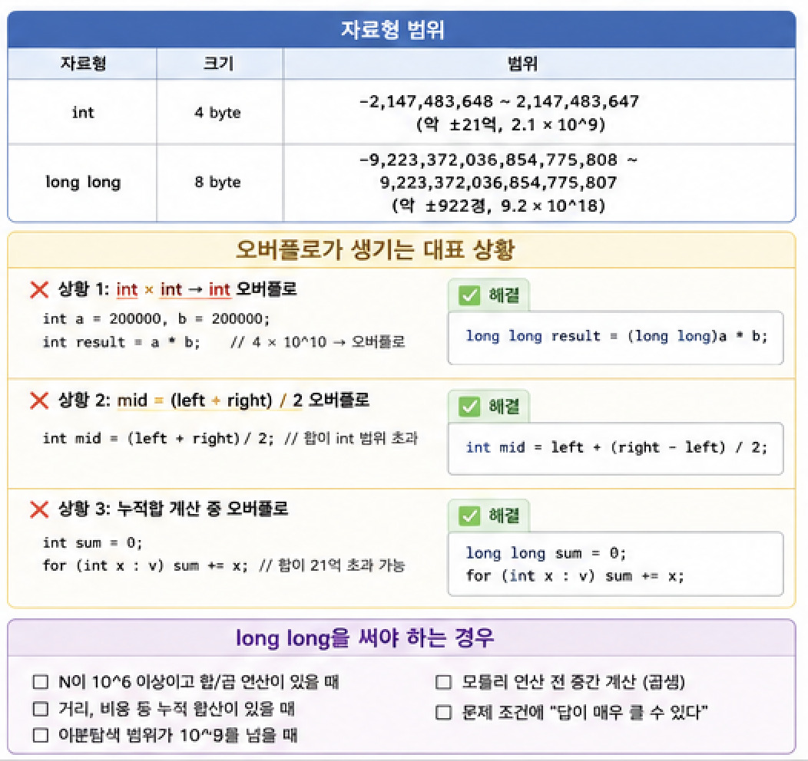
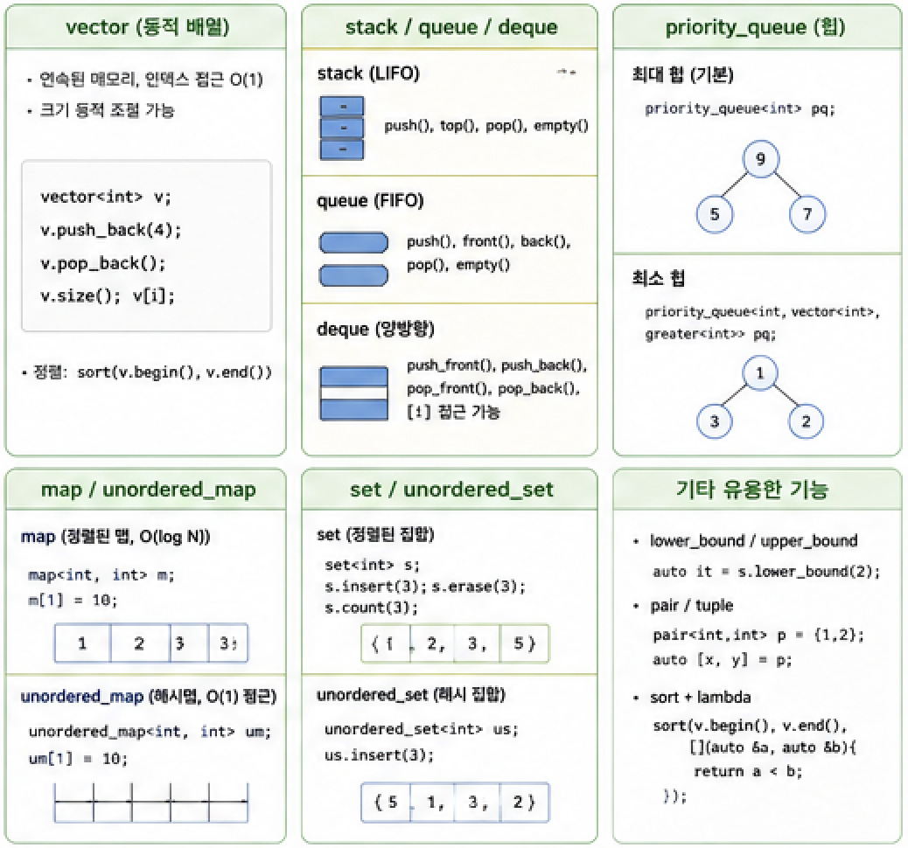
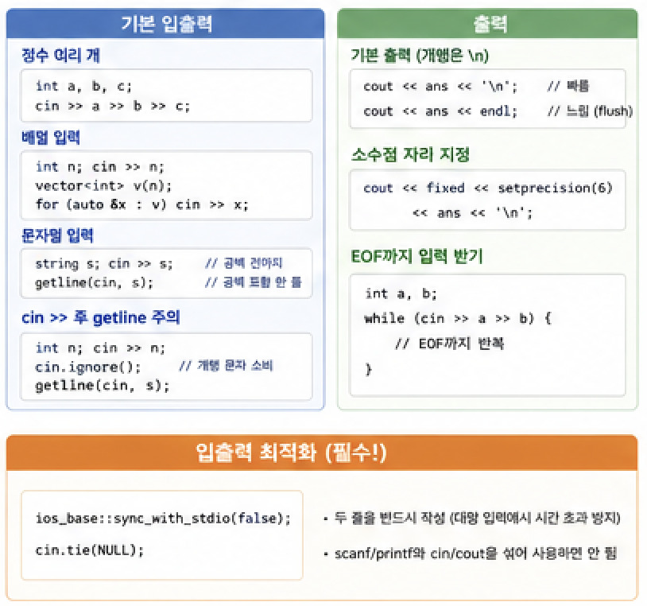
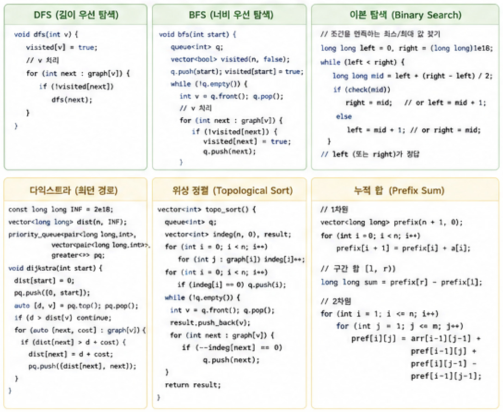
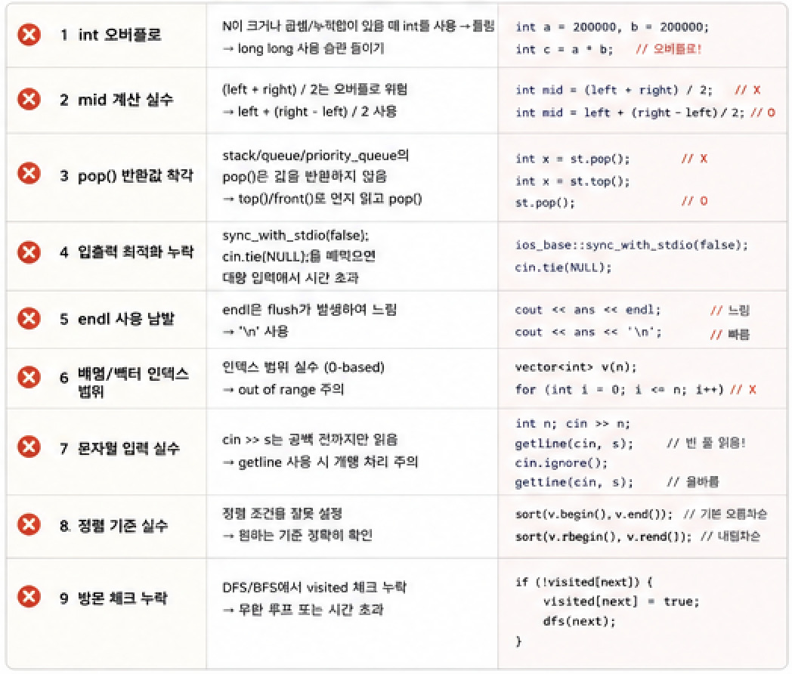

Python으로 익힌 알고리즘 실력은 그대로입니다. C++은 결국 **같은 알고리즘을 다른 문법으로 표현하는 것**입니다. Python과 C++의 대응 관계를 빠르게 파악하고, 코딩테스트에서 자주 걸리는 함정(오버플로, 입출력 속도, 자료형)만 주의하면 생각보다 빠르게 적응할 수 있습니다.

---

## 1. Python vs C++ 문법 대응표



가장 먼저 알아야 할 것은 "Python에서 쓰던 것이 C++에서 무엇인가"입니다.

```cpp
// Python에서 쓰던 것들의 C++ 버전

// import 대신 — 코딩테스트에선 이것 하나로 해결
#include <bits/stdc++.h>
using namespace std;

// float('inf') 대신
int INF = 1e9;           // int 범위 내 무한
long long INF = 2e18;    // long long 범위 내 무한

// input() 대신
int n;
cin >> n;

// list = [0] * n 대신
vector<int> v(n, 0);

// dict = {} 대신
map<int, int> m;
unordered_map<int, int> um;  // 해시맵 (Python dict에 더 가까움)

// set() 대신
set<int> s;
unordered_set<int> us;

// heapq (min heap) 대신
priority_queue<int, vector<int>, greater<int>> pq;  // 최소힙

// heapq max heap (기본이 최대힙)
priority_queue<int> pq;
```

---

## 2. 필수 첫 줄 — 상용구 (Boilerplate)

코딩테스트를 시작하면 항상 이렇게 시작합니다.

```cpp
#include <bits/stdc++.h>   // 모든 헤더 포함 (GCC 한정)
using namespace std;

int main() {
    ios_base::sync_with_stdio(false);  // cin 속도 향상
    cin.tie(NULL);                      // cin과 cout 분리

    // 코드 작성

    return 0;
}
```

`ios_base::sync_with_stdio(false)` 와 `cin.tie(NULL)` 이 두 줄은 **거의 모든 문제에서 반드시** 작성해야 합니다. 없으면 대량 입력 문제에서 시간 초과가 납니다.

> ⚠️ 이 두 줄을 쓰면 `scanf`/`printf`와 `cin`/`cout`을 섞어 쓰면 안 됩니다.

---

## 3. 자료형과 오버플로 — 가장 자주 틀리는 곳



### 자료형 범위 암기

```
int       : 약 ±21억  (2.1 × 10^9)
long long : 약 ±922경  (9.2 × 10^18)

N ≤ 10^9 이하의 연산   → int 사용 가능
N이 크거나 곱셈 포함   → long long 사용
```

### 오버플로가 생기는 대표 상황

```cpp
// ❌ 상황 1: int × int → int 오버플로
int a = 200000, b = 200000;
int result = a * b;         // 4 × 10^10 → int 범위 초과, 쓰레기값

// ✅ 해결: 하나를 long long으로 캐스팅
long long result = (long long)a * b;

// ❌ 상황 2: mid = (left + right) / 2 오버플로
int mid = (left + right) / 2;   // left, right가 크면 합이 int 초과

// ✅ 해결
int mid = left + (right - left) / 2;

// ❌ 상황 3: 누적합 계산 중 오버플로
int sum = 0;
for (int x : v) sum += x;  // v의 합이 21억 초과 가능

// ✅ 해결
long long sum = 0;
for (int x : v) sum += x;
```

### 언제 long long을 쓰는가

```
다음 중 하나라도 해당되면 long long 사용:

□ N이 10^6 이상이고 합/곱 연산이 있을 때
□ 거리, 비용 등 누적 합산이 있을 때
□ 이분탐색 범위가 10^9를 넘을 때
□ 모듈러 연산 전 중간 계산 (곱셈)
□ 문제 조건에 "답이 매우 클 수 있다"
```

---

## 4. STL 컨테이너



### vector — 동적 배열 (Python list)

```cpp
vector<int> v;               // 빈 벡터
vector<int> v(5, 0);         // 크기 5, 모두 0으로 초기화
vector<int> v = {1, 2, 3};   // 초기화

v.push_back(4);              // 맨 뒤에 추가
v.pop_back();                // 맨 뒤 제거
v.size();                    // 크기
v[i];                        // 인덱스 접근
v.empty();                   // 비어있는지

// 2차원 벡터
vector<vector<int>> graph(n, vector<int>(m, 0));

// 정렬
sort(v.begin(), v.end());            // 오름차순
sort(v.rbegin(), v.rend());          // 내림차순

// 범위 기반 for
for (int x : v) cout << x << ' ';
for (auto& x : v) x *= 2;           // 참조로 수정
```

### stack / queue / deque

```cpp
// stack — LIFO
stack<int> st;
st.push(1);
st.top();     // 맨 위 (반환만, 제거 X)
st.pop();     // 맨 위 제거 (반환값 없음!)
st.empty();

// queue — FIFO
queue<int> q;
q.push(1);
q.front();    // 맨 앞 (반환만, 제거 X)
q.back();     // 맨 뒤
q.pop();      // 맨 앞 제거
q.empty();

// deque — 양방향
deque<int> dq;
dq.push_front(1);
dq.push_back(2);
dq.pop_front();
dq.pop_back();
dq[i];        // 인덱스 접근 가능
```

> ⚠️ C++의 `pop()`은 반환값이 없습니다! 값을 먼저 읽고(`top()` 또는 `front()`) 그 다음에 `pop()`해야 합니다.

### priority_queue — 힙

```cpp
// 최대힙 (기본)
priority_queue<int> maxpq;
maxpq.push(3);
maxpq.top();   // 최댓값
maxpq.pop();

// 최소힙
priority_queue<int, vector<int>, greater<int>> minpq;
minpq.push(3);
minpq.top();   // 최솟값

// pair를 담는 최소힙 (다익스트라)
priority_queue<pair<int,int>,
               vector<pair<int,int>>,
               greater<>> pq;
pq.push({dist, node});
auto [d, v] = pq.top(); pq.pop();
```

### map / unordered_map / set

```cpp
// map — 정렬된 Key-Value (O(log N))
map<string, int> m;
m["apple"] = 3;
m.count("apple");    // 있으면 1, 없으면 0
m.find("apple");     // iterator, 없으면 m.end()
m.erase("apple");

for (auto& [key, val] : m) {   // 키 기준 정렬 순회
    cout << key << ": " << val << '\n';
}

// unordered_map — 해시맵 (O(1) 평균, Python dict에 가까움)
unordered_map<int, int> um;
um[1] = 10;

// set — 중복 없는 정렬 집합
set<int> s;
s.insert(3);
s.count(3);      // 있으면 1
s.erase(3);

// lower_bound / upper_bound
auto it = s.lower_bound(2);    // 2 이상인 첫 원소
int idx = it - v.begin();      // vector에서 인덱스로 변환
```

---

## 5. 입출력 패턴



### 기본 입출력

```cpp
// 정수 여러 개
int a, b, c;
cin >> a >> b >> c;

// 배열 입력
int n; cin >> n;
vector<int> v(n);
for (auto& x : v) cin >> x;

// 문자열 입력
string s; cin >> s;          // 공백 전까지
getline(cin, s);             // 공백 포함 한 줄 전체

// cin >> 후 getline 쓸 때 주의
int n; cin >> n;
cin.ignore();                // 개행 문자 소비
getline(cin, s);
```

### 출력

```cpp
// '\n' vs endl — 반드시 '\n' 사용
cout << ans << '\n';   // ✅ 빠름
cout << ans << endl;   // ❌ 느림 (flush 발생)

// 소수점 자리 지정
cout << fixed << setprecision(6) << ans << '\n';

// EOF까지 입력받기
int a, b;
while (cin >> a >> b) {
    // EOF까지 반복
}
```

---

## 6. 자주 쓰는 C++ 문법

### pair & tuple — 여러 값 묶기

```cpp
// pair
pair<int, int> p = {3, 4};
p.first;   // 3
p.second;  // 4

// C++17 구조화 바인딩 (Python의 언패킹)
auto [x, y] = p;

// pair 벡터 — first 기준, 같으면 second 기준으로 자동 정렬
vector<pair<int,int>> vp = {{3,1},{1,2},{2,3}};
sort(vp.begin(), vp.end());

// tuple
auto t = make_tuple(1, 2, 3);
auto [a, b, c] = t;
```

### 람다 & 커스텀 정렬

```cpp
// 두 번째 원소 기준 오름차순
sort(v.begin(), v.end(), [](const auto& a, const auto& b) {
    return a.second < b.second;
});

// 여러 조건 정렬 (first 오름차순, 같으면 second 내림차순)
sort(v.begin(), v.end(), [](const auto& a, const auto& b) {
    if (a.first != b.first) return a.first < b.first;
    return a.second > b.second;
});
```

### 유용한 알고리즘 함수

```cpp
// 최대/최솟값
int mx = *max_element(v.begin(), v.end());
int mn = *min_element(v.begin(), v.end());

// 합계 (long long 주의)
long long sum = accumulate(v.begin(), v.end(), 0LL);

// 채우기
fill(v.begin(), v.end(), -1);

// 이진탐색 (정렬된 배열)
lower_bound(v.begin(), v.end(), x);  // x 이상인 첫 위치
upper_bound(v.begin(), v.end(), x);  // x 초과인 첫 위치
int cnt = upper_bound(v.begin(),v.end(),x)
        - lower_bound(v.begin(),v.end(),x);  // x의 개수

// 중복 제거
sort(v.begin(), v.end());
v.erase(unique(v.begin(), v.end()), v.end());

// 순열 열거
sort(v.begin(), v.end());
do {
    // 현재 순열 처리
} while (next_permutation(v.begin(), v.end()));

// GCD / LCM (C++17)
int g = __gcd(a, b);
long long l = (long long)a / g * b;  // 오버플로 주의
```

### 문자열 처리

```cpp
string s = "hello";
s.length();              // 5
s.substr(1, 3);          // "ell" (시작 인덱스, 길이)
s.find("ll");            // 2 (없으면 string::npos)
s += " world";           // 이어붙이기

// 숫자 변환
int n    = stoi(s);      // string → int
long long n = stoll(s);  // string → long long
string s = to_string(n); // int → string

// 문자 ↔ 아스키
int idx = c - 'a';       // 소문자 인덱스 (a=0)
int idx = c - 'A';       // 대문자 인덱스 (A=0)
int num = c - '0';       // 숫자 문자 → 정수
char c = 'a' + idx;      // 인덱스 → 소문자

// 순회
for (char c : s) { ... }
for (int i = 0; i < (int)s.size(); i++) { ... }
```

---

## 7. 알고리즘 템플릿



### BFS

```cpp
int n, m; cin >> n >> m;
vector<vector<int>> graph(n + 1);

for (int i = 0; i < m; i++) {
    int u, v; cin >> u >> v;
    graph[u].push_back(v);
    graph[v].push_back(u);
}

vector<int> dist(n + 1, -1);
queue<int> q;
dist[1] = 0;
q.push(1);

while (!q.empty()) {
    int v = q.front(); q.pop();
    for (int u : graph[v]) {
        if (dist[u] == -1) {
            dist[u] = dist[v] + 1;
            q.push(u);
        }
    }
}
```

### DFS (재귀)

```cpp
vector<vector<int>> graph(n + 1);
vector<bool> visited(n + 1, false);

void dfs(int v) {
    visited[v] = true;
    for (int u : graph[v]) {
        if (!visited[u]) dfs(u);
    }
}
```

### 이진탐색 (파라메트릭 서치)

```cpp
// 조건을 만족하는 최솟값 찾기
int lo = 0, hi = 1e9, ans = -1;
while (lo <= hi) {
    int mid = lo + (hi - lo) / 2;
    if (check(mid)) {
        ans = mid;
        hi = mid - 1;    // 더 작은 값 탐색
    } else {
        lo = mid + 1;
    }
}
```

### 다익스트라

```cpp
int n; cin >> n;
vector<vector<pair<int,int>>> graph(n + 1);
// graph[u].push_back({v, w});

vector<long long> dist(n + 1, LLONG_MAX);
priority_queue<pair<long long,int>,
               vector<pair<long long,int>>,
               greater<>> pq;

dist[1] = 0;
pq.push({0, 1});

while (!pq.empty()) {
    auto [d, v] = pq.top(); pq.pop();
    if (d > dist[v]) continue;

    for (auto [u, w] : graph[v]) {
        if (dist[v] + w < dist[u]) {
            dist[u] = dist[v] + w;
            pq.push({dist[u], u});
        }
    }
}
```

### Union-Find (서로소 집합)

```cpp
struct UnionFind {
    vector<int> parent, rank_;

    UnionFind(int n) : parent(n), rank_(n, 0) {
        iota(parent.begin(), parent.end(), 0);
    }

    int find(int x) {
        if (parent[x] != x)
            parent[x] = find(parent[x]);  // 경로 압축
        return parent[x];
    }

    bool unite(int a, int b) {
        a = find(a); b = find(b);
        if (a == b) return false;
        if (rank_[a] < rank_[b]) swap(a, b);
        parent[b] = a;
        if (rank_[a] == rank_[b]) rank_[a]++;
        return true;
    }

    bool same(int a, int b) { return find(a) == find(b); }
};

// 사용
UnionFind uf(n + 1);
uf.unite(1, 2);
uf.same(1, 3);  // false
```

### 2D 그리드 BFS

```cpp
int n, m; cin >> n >> m;
vector<string> grid(n);
for (auto& row : grid) cin >> row;

int dx[] = {0, 0, 1, -1};
int dy[] = {1, -1, 0, 0};
// 8방향: dx[] = {-1,-1,-1,0,0,1,1,1}, dy[] = {-1,0,1,-1,1,-1,0,1}

auto inRange = [&](int x, int y) {
    return x >= 0 && x < n && y >= 0 && y < m;
};

vector<vector<int>> dist(n, vector<int>(m, -1));
queue<pair<int,int>> q;
dist[0][0] = 0;
q.push({0, 0});

while (!q.empty()) {
    auto [x, y] = q.front(); q.pop();
    for (int d = 0; d < 4; d++) {
        int nx = x + dx[d], ny = y + dy[d];
        if (inRange(nx, ny) && dist[nx][ny] == -1 && grid[nx][ny] != '#') {
            dist[nx][ny] = dist[x][y] + 1;
            q.push({nx, ny});
        }
    }
}
```

### DP — 기본 패턴

```cpp
// 1차원 DP
vector<long long> dp(n + 1, 0);
dp[0] = 1;
for (int i = 1; i <= n; i++) {
    dp[i] = dp[i-1] + dp[i-2];
}

// 2차원 DP
vector<vector<long long>> dp(n + 1, vector<long long>(m + 1, 0));
for (int i = 1; i <= n; i++)
    for (int j = 1; j <= m; j++)
        dp[i][j] = max(dp[i-1][j], dp[i][j-1]);
```

---

## 8. 그래프 입력 패턴

```cpp
int n, m; cin >> n >> m;

// 인접 리스트 (가중치 없음)
vector<vector<int>> graph(n + 1);
for (int i = 0; i < m; i++) {
    int u, v; cin >> u >> v;
    graph[u].push_back(v);
    graph[v].push_back(u);  // 무방향
}

// 인접 리스트 (가중치 있음)
vector<vector<pair<int,int>>> graph(n + 1);  // {노드, 가중치}
for (int i = 0; i < m; i++) {
    int u, v, w; cin >> u >> v >> w;
    graph[u].push_back({v, w});
    graph[v].push_back({u, w});
}

// 인접 행렬 (N이 작을 때)
vector<vector<int>> adj(n + 1, vector<int>(n + 1, 0));
for (int i = 0; i < m; i++) {
    int u, v; cin >> u >> v;
    adj[u][v] = adj[v][u] = 1;
}
```

---

## 9. Python에서 넘어올 때 자주 하는 실수



**1. `pop()`이 값을 반환하지 않음**

```cpp
// ❌ Python처럼 쓰면 컴파일 에러
int val = st.pop();

// ✅ top() 먼저, 그다음 pop()
int val = st.top();
st.pop();
```

**2. `endl` 남발로 시간 초과**

```cpp
// ❌ 출력마다 flush 발생
for (int i = 0; i < n; i++)
    cout << arr[i] << endl;  // 느림

// ✅ '\n' 사용
for (int i = 0; i < n; i++)
    cout << arr[i] << '\n';
```

**3. 벡터 `size()` 부호 문제**

```cpp
// ❌ v.size()는 unsigned → v.size()-1이 0이면 매우 큰 양수
for (int i = 0; i < v.size() - 1; i++) { ... }  // v 비어있으면 무한루프

// ✅ int로 캐스팅
for (int i = 0; i < (int)v.size() - 1; i++) { ... }
```

**4. 전역변수로 큰 배열 선언해야 함**

```cpp
// ❌ 지역변수로 큰 배열 → 스택 오버플로
int main() {
    int dp[100001][100001];  // 위험!
}

// ✅ 전역변수 또는 vector 사용
int dp[100001][100001];  // 전역 OK
int main() {
    vector<vector<int>> dp(n+1, vector<int>(m+1, 0));  // OK
}
```

**5. 곱셈 오버플로 — 캐스팅 타이밍**

```cpp
// ❌ 계산 결과가 이미 int로 오버플로된 뒤 long long에 저장
long long result = a * b;    // a, b가 int이면 이미 오버플로

// ✅ 계산 전에 캐스팅
long long result = (long long)a * b;
long long result = 1LL * a * b;   // 1LL을 앞에 곱하는 트릭
```

**6. `ios_base::sync_with_stdio` 후 `scanf` 혼용**

```cpp
// ❌ sync 끊은 후 scanf 혼용 → 출력 순서 보장 안 됨
ios_base::sync_with_stdio(false);
scanf("%d", &n);  // 혼용 금지

// ✅ cin만 또는 scanf만 일관되게 사용
```

---

## 10. 복잡도별 허용 N 범위 (C++ 기준)

```
시간 제한 1~2초, 약 10^8 연산 이하 기준

O(N!)       : N ≤ 10
O(2^N)      : N ≤ 25
O(N^3)      : N ≤ 500
O(N^2)      : N ≤ 5,000 ~ 10,000
O(N log N)  : N ≤ 1,000,000 (10^6)
O(N)        : N ≤ 100,000,000 (10^8)
O(log N)    : N ≤ 10^18
```

> Python 대비 C++은 약 30~50배 빠릅니다. Python에서 O(N^2)으로 간신히 통과했던 문제도 C++에서는 여유 있게 통과되는 경우가 많습니다.

---

## 참고 자료

- [cppreference.com — STL 레퍼런스](https://en.cppreference.com/)
- [백준 온라인 저지](https://www.acmicpc.net/)
- [C++ STL 정리 (코딩테스트용)](https://github.com/encrypted-def/basic-algo-lecture)