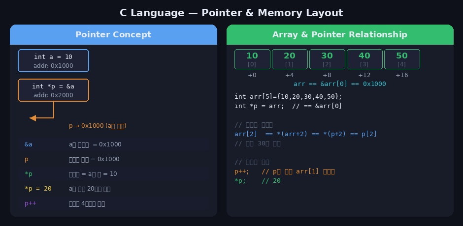
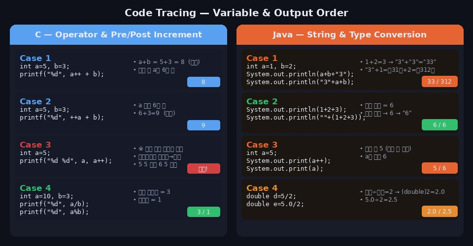
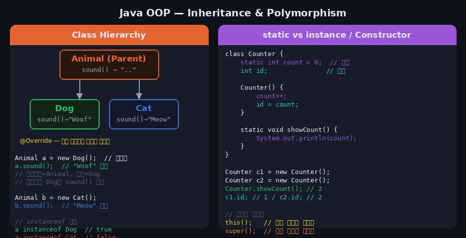
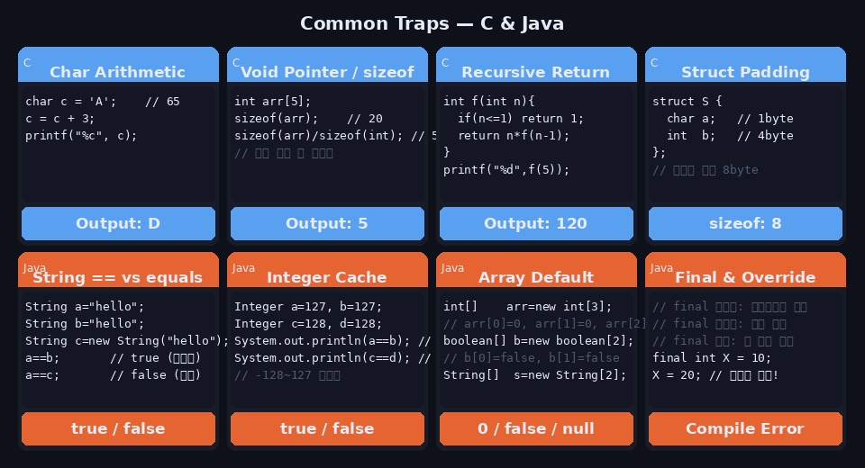

정보처리기사 실기 코딩 문제는 코드를 직접 작성하는 것이 아니라 **코드의 출력값을 맞히는** 형태입니다. 코드를 눈으로 읽고 정확하게 트레이싱하는 능력이 핵심입니다. 시험에서 자주 등장하는 개념과 실수하기 쉬운 함정 패턴을 정리합니다.

---

## C언어 핵심 개념

---

### 1. 자료형과 형 변환

```c
#include <stdio.h>

int main() {
    int   a = 5, b = 2;
    float f;

    printf("%d\n", a / b);      // 2  (정수 나눗셈 → 소수점 버림)
    printf("%f\n", a / b);      // 2.000000  (결과는 여전히 정수 2)
    printf("%f\n", (float)a / b); // 2.500000  (형 변환 후 나눗셈)
    printf("%d\n", a % b);      // 1  (나머지)

    int x = 3.9;                // 소수점 버림 → x = 3
    printf("%d\n", x);          // 3

    return 0;
}
```

> **핵심**: 정수 / 정수 = 정수 (소수점 버림). `float`으로 캐스팅 후 연산해야 실수 결과를 얻습니다.

### 자료형 크기 (32비트 기준)

| 자료형 | 크기 | 범위 |
|--------|------|------|
| `char` | 1 byte | -128 ~ 127 |
| `int` | 4 byte | -2,147,483,648 ~ 2,147,483,647 |
| `float` | 4 byte | 소수점 약 7자리 |
| `double` | 8 byte | 소수점 약 15자리 |
| `long` | 4 or 8 byte | 시스템 의존 |

---

### 2. 연산자 우선순위와 증감 연산자

```c
#include <stdio.h>

int main() {
    int a = 5;

    // 후위 증감: 현재 값 사용 후 증가
    printf("%d\n", a++);  // 5  출력 (출력 후 a=6)
    printf("%d\n", a);    // 6

    // 전위 증감: 먼저 증가 후 사용
    int b = 5;
    printf("%d\n", ++b);  // 6  출력 (먼저 b=6)
    printf("%d\n", b);    // 6

    // 복합 표현식
    int c = 3, d = 4;
    printf("%d\n", c++ + ++d);  // 3 + 5 = 8
    // 출력 후: c=4, d=5

    // 비교 연산자
    printf("%d\n", 5 > 3);   // 1 (true)
    printf("%d\n", 5 == 3);  // 0 (false)

    return 0;
}
```

**연산자 우선순위 (높음 → 낮음)**

```
() [] → .              최우선
++ -- (후위) ! ~ (단항)
* / %
+ -
< <= > >=
== !=
&  ^  |
&&
||
= += -= *=
```

---

### 3. 포인터



```c
#include <stdio.h>

int main() {
    int  a = 10;
    int *p = &a;    // p는 a의 주소를 저장

    printf("%d\n", a);   // 10  (변수 a의 값)
    printf("%p\n", &a);  // a의 주소 (예: 0x1000)
    printf("%p\n", p);   // p가 저장한 주소 = &a
    printf("%d\n", *p);  // 10  (역참조: p가 가리키는 곳의 값)

    *p = 20;            // 역참조로 a의 값 변경
    printf("%d\n", a);  // 20

    return 0;
}
```

#### 배열과 포인터의 관계

```c
int arr[5] = {10, 20, 30, 40, 50};
int *p = arr;   // == &arr[0]

// 아래 네 표현은 모두 동일 (arr[2] = 30)
printf("%d\n", arr[2]);    // 30
printf("%d\n", *(arr+2));  // 30
printf("%d\n", *(p+2));    // 30
printf("%d\n", p[2]);      // 30
```

#### 이중 포인터

```c
int  a  = 10;
int *p  = &a;
int **pp = &p;

printf("%d\n", **pp);  // 10  (**pp → *p → a)
**pp = 99;
printf("%d\n", a);     // 99
```

#### 포인터 연산 주의

```c
int  arr[] = {1, 2, 3};
int *p = arr;

p++;          // 주소가 sizeof(int) = 4바이트 증가
printf("%d\n", *p);  // 2  (arr[1])
```

---

### 4. 문자열과 문자 배열

```c
#include <stdio.h>
#include <string.h>

int main() {
    char str1[] = "hello";      // {'h','e','l','l','o','\0'}
    char str2[10] = "world";

    // 문자열 길이 (null 제외)
    printf("%d\n", strlen(str1));  // 5

    // 배열 크기 (null 포함)
    printf("%d\n", sizeof(str1));  // 6

    // 문자 접근
    printf("%c\n", str1[0]);     // h
    printf("%d\n", str1[0]);     // 104  (ASCII)

    // 문자 산술 연산
    char c = 'A';
    printf("%c\n", c + 3);       // D  (65+3=68='D')
    printf("%c\n", 'a' - 32);    // A  (소문자 → 대문자)
    printf("%d\n", '5' - '0');   // 5  (숫자 문자 → 정수)

    // 주요 문자열 함수
    // strlen(s)       : 길이 반환 (null 제외)
    // strcpy(dst, src): 문자열 복사
    // strcat(dst, src): 문자열 이어 붙이기
    // strcmp(s1, s2)  : 같으면 0, s1<s2이면 음수, s1>s2이면 양수
    // strchr(s, c)    : 문자 c의 첫 위치 포인터 반환

    return 0;
}
```

---

### 5. 구조체 (struct)

```c
#include <stdio.h>

struct Student {
    char name[20];
    int  age;
    double gpa;
};  // 세미콜론 필수!

int main() {
    struct Student s1;
    struct Student s2 = {"Kim", 25, 4.3};

    // 멤버 접근 (. 연산자)
    s1.age = 22;

    // 구조체 포인터 (->) 연산자
    struct Student *p = &s2;
    printf("%s\n", p->name);   // Kim
    printf("%d\n", p->age);    // 25
    // p->name  ==  (*p).name

    // typedef로 타입 이름 단순화
    typedef struct {
        int x, y;
    } Point;

    Point pt = {3, 4};
    printf("%d %d\n", pt.x, pt.y);  // 3 4

    return 0;
}
```

---

### 6. 재귀 함수 트레이싱

재귀 문제는 **콜 스택을 직접 그려가며** 추적하는 것이 가장 확실합니다.

```c
#include <stdio.h>

// 팩토리얼
int factorial(int n) {
    if (n <= 1) return 1;
    return n * factorial(n - 1);
}

// 피보나치
int fib(int n) {
    if (n <= 1) return n;
    return fib(n-1) + fib(n-2);
}

// 트레이싱: factorial(4)
// factorial(4) = 4 × factorial(3)
//                    = 3 × factorial(2)
//                          = 2 × factorial(1)
//                                = 1
//                    = 2 × 1 = 2
//               = 3 × 2 = 6
//           = 4 × 6 = 24

// 트레이싱: fib(5)
// fib(5) = fib(4) + fib(3)
//        = (fib(3)+fib(2)) + (fib(2)+fib(1))
//        = ((fib(2)+fib(1))+fib(2)) + ...
//        = 5

int main() {
    printf("%d\n", factorial(4));  // 24
    printf("%d\n", fib(6));        // 8  (0,1,1,2,3,5,8)
    return 0;
}
```

---

### 7. 반복문과 제어문 트레이싱

```c
#include <stdio.h>

int main() {
    // 중첩 반복문 — break는 가장 안쪽 루프만 탈출
    for (int i = 0; i < 3; i++) {
        for (int j = 0; j < 3; j++) {
            if (j == 1) break;   // 안쪽 for만 종료
            printf("%d %d\n", i, j);
        }
    }
    // 출력: 0 0 / 1 0 / 2 0

    // continue — 현재 반복 건너뜀
    for (int i = 0; i < 5; i++) {
        if (i % 2 == 0) continue;
        printf("%d ", i);
    }
    // 출력: 1 3

    // do-while — 조건 관계없이 최소 한 번 실행
    int x = 10;
    do {
        printf("%d\n", x);
        x--;
    } while (x > 10);
    // 출력: 10  (조건 false여도 한 번 실행)

    return 0;
}
```

---

### 8. 전처리기와 매크로

```c
#include <stdio.h>

#define PI 3.14
#define MAX(a,b) ((a) > (b) ? (a) : (b))
#define SQUARE(x) ((x)*(x))

int main() {
    printf("%f\n", PI);           // 3.140000
    printf("%d\n", MAX(3, 7));    // 7
    printf("%d\n", SQUARE(4));    // 16

    // 주의: 괄호 없으면 함정
    // #define SQ(x) x*x
    // SQ(2+3) → 2+3*2+3 = 11  (의도: 25)
    // 괄호로 감싸야 안전: ((x)*(x))

    return 0;
}
```

---

## Java 핵심 개념

---

### 9. 자료형과 형 변환



```java
public class Main {
    public static void main(String[] args) {
        // 정수 나눗셈
        System.out.println(5 / 2);          // 2
        System.out.println(5.0 / 2);        // 2.5
        System.out.println((double)5 / 2);  // 2.5

        // 문자열 + 숫자 연산 — 실수 주의!
        System.out.println(1 + 2 + "3");    // 33  (1+2=3 → "3"+"3")
        System.out.println("1" + 2 + 3);    // 123 ("1"+2="12"+"3"="123")
        System.out.println("1" + (2 + 3));  // 15  (괄호 먼저)

        // char 산술
        char c = 'A';
        System.out.println(c + 1);          // 66  (int로 자동 변환)
        System.out.println((char)(c + 1));  // B

        // 자동 형 변환 (묵시적)
        // byte → short → int → long → float → double
        int  i = 100;
        long l = i;     // 자동 변환 OK
        // int j = l;   // 에러 — 명시적 캐스팅 필요
        int  j = (int)l;  // OK
    }
}
```

---

### 10. 증감 연산자 & 출력 순서

```java
public class Main {
    public static void main(String[] args) {
        int a = 5;

        System.out.println(a++);  // 5  (출력 후 a=6)
        System.out.println(a);    // 6

        int b = 5;
        System.out.println(++b);  // 6  (b=6 후 출력)

        // 연산 우선순위 주의
        int c = 2;
        int d = c++ * 3 + ++c;
        // c++ → c=2 사용 후 c=3
        // ++c → c=4, 4 사용
        // d = 2*3 + 4 = 10
        System.out.println(d);    // 10
        System.out.println(c);    // 4
    }
}
```

---

### 11. 클래스와 객체지향



#### 생성자와 this

```java
class Car {
    String model;
    int    speed;
    static int count = 0;   // 모든 인스턴스가 공유

    // 생성자
    Car(String model, int speed) {
        this.model = model;   // this: 현재 인스턴스 참조
        this.speed = speed;
        count++;
    }

    // 생성자 오버로딩
    Car(String model) {
        this(model, 0);   // 다른 생성자 호출
    }
}

// 사용
Car c1 = new Car("BMW", 200);
Car c2 = new Car("Kia");
System.out.println(Car.count);  // 2  (static → 클래스명으로 접근)
```

#### 상속과 메서드 오버라이딩

```java
class Animal {
    String name;

    Animal(String name) { this.name = name; }

    void sound() { System.out.println("..."); }
    void info()  { System.out.println("Animal: " + name); }
}

class Dog extends Animal {
    Dog(String name) {
        super(name);   // 부모 생성자 반드시 먼저 호출
    }

    @Override
    void sound() { System.out.println("Woof"); }  // 오버라이딩

    // info()는 오버라이딩 안 함 → 부모 것 사용
}

// 다형성 (Polymorphism)
Animal a = new Dog("Rex");  // 부모 타입으로 자식 객체 참조
a.sound();   // "Woof"  — 실제 타입(Dog)의 메서드 실행 (동적 바인딩)
a.info();    // "Animal: Rex"
```

#### 추상 클래스 vs 인터페이스

```java
// 추상 클래스 — 일부 구현 가능, 단일 상속
abstract class Shape {
    abstract double area();          // 추상 메서드 (구현 없음)
    void display() {                 // 일반 메서드 (구현 있음)
        System.out.println("넓이: " + area());
    }
}

// 인터페이스 — 모두 추상, 다중 구현 가능
interface Drawable {
    void draw();   // public abstract 생략 가능
    default void print() { System.out.println("출력"); }
}

class Circle extends Shape implements Drawable {
    double r;
    Circle(double r) { this.r = r; }

    @Override public double area()  { return 3.14 * r * r; }
    @Override public void   draw()  { System.out.println("원 그리기"); }
}
```

---

### 12. String 클래스 주의사항

```java
public class Main {
    public static void main(String[] args) {
        // 문자열 비교 — == vs equals
        String a = "hello";
        String b = "hello";
        String c = new String("hello");

        System.out.println(a == b);        // true  (같은 리터럴 풀)
        System.out.println(a == c);        // false (다른 객체)
        System.out.println(a.equals(c));   // true  (값 비교)

        // 주요 String 메서드
        String s = "Hello World";
        System.out.println(s.length());        // 11
        System.out.println(s.charAt(0));       // H
        System.out.println(s.indexOf("o"));    // 4 (첫 번째 o)
        System.out.println(s.substring(6));    // World
        System.out.println(s.substring(0,5));  // Hello
        System.out.println(s.toLowerCase());   // hello world
        System.out.println(s.toUpperCase());   // HELLO WORLD
        System.out.println(s.replace("l","L")); // HeLLo WorLd
        System.out.println(s.trim());          // 앞뒤 공백 제거

        // 숫자 ↔ 문자열 변환
        int n = Integer.parseInt("42");        // 문자열 → 정수
        String str = String.valueOf(42);       // 정수 → 문자열
        String str2 = Integer.toString(42);    // 정수 → 문자열
    }
}
```

---

### 13. 배열 (Array)

```java
public class Main {
    public static void main(String[] args) {
        // 1차원 배열 — 기본값으로 초기화됨
        int[]    nums   = new int[5];     // [0, 0, 0, 0, 0]
        boolean[]flags  = new boolean[3]; // [false, false, false]
        String[] strs   = new String[2];  // [null, null]

        // 초기화와 동시에 선언
        int[] arr = {10, 20, 30, 40, 50};
        System.out.println(arr.length);   // 5 (메서드 아님, 필드)

        // 2차원 배열
        int[][] matrix = {
            {1, 2, 3},
            {4, 5, 6},
            {7, 8, 9}
        };
        System.out.println(matrix[1][2]);  // 6
        System.out.println(matrix.length); // 3 (행 수)
        System.out.println(matrix[0].length); // 3 (열 수)

        // 배열 순회
        for (int x : arr) {
            System.out.print(x + " ");  // 향상된 for문
        }
    }
}
```

---

### 14. 컬렉션 프레임워크

```java
import java.util.*;

public class Main {
    public static void main(String[] args) {
        // ArrayList — 순서 있음, 중복 허용
        ArrayList<Integer> list = new ArrayList<>();
        list.add(10); list.add(20); list.add(30);
        list.remove(Integer.valueOf(20));  // 값으로 제거
        list.remove(0);                    // 인덱스로 제거
        System.out.println(list.size());   // 1
        System.out.println(list.get(0));   // 30

        // HashMap — Key-Value, 순서 없음
        HashMap<String, Integer> map = new HashMap<>();
        map.put("apple", 3);
        map.put("banana", 5);
        System.out.println(map.get("apple"));       // 3
        System.out.println(map.containsKey("grape")); // false
        System.out.println(map.getOrDefault("grape", 0)); // 0

        // HashSet — 중복 없음, 순서 없음
        HashSet<Integer> set = new HashSet<>();
        set.add(1); set.add(2); set.add(1);
        System.out.println(set.size());   // 2 (중복 제거)

        // Stack
        Stack<Integer> stack = new Stack<>();
        stack.push(1); stack.push(2); stack.push(3);
        System.out.println(stack.pop());    // 3 (LIFO)
        System.out.println(stack.peek());   // 2 (제거 안 함)
    }
}
```

---

### 15. 예외 처리

```java
public class Main {
    public static void main(String[] args) {
        // try-catch-finally
        try {
            int[] arr = new int[3];
            arr[5] = 10;               // ArrayIndexOutOfBoundsException
            System.out.println("정상");
        } catch (ArrayIndexOutOfBoundsException e) {
            System.out.println("배열 범위 초과: " + e.getMessage());
        } catch (Exception e) {
            System.out.println("기타 예외");
        } finally {
            System.out.println("항상 실행");  // 예외 여부 관계없이 반드시 실행
        }

        // 자주 나오는 예외 종류
        // NullPointerException         : null 참조
        // ArrayIndexOutOfBoundsException: 배열 범위 초과
        // ClassCastException           : 잘못된 형 변환
        // NumberFormatException        : 숫자 변환 실패
        // ArithmeticException          : 0으로 나누기
        // StackOverflowError           : 재귀 무한 반복
    }
}
```

---

## 자주 나오는 함정 패턴



### C언어 함정

```c
// 1. 조건문 안에서 대입 vs 비교
int a = 0;
if (a = 5) { ... }   // 대입! 항상 true (5는 참)
if (a == 5) { ... }  // 비교 (올바른 방법)

// 2. 배열 크기 구하기
int arr[] = {1,2,3,4,5};
int size = sizeof(arr) / sizeof(arr[0]);   // 5
// 포인터로 받으면 sizeof는 포인터 크기(4 or 8)만 반환

// 3. 포인터와 배열 이름의 차이
int arr[5] = {1,2,3,4,5};
int *p = arr;
// arr은 상수 포인터 → arr++ 불가
// p는 변수 포인터 → p++ 가능

// 4. 문자열 비교 (== 불가)
char s1[] = "hello", s2[] = "hello";
s1 == s2;          // ❌ 주소 비교 (항상 false)
strcmp(s1, s2);    // ✅ 값 비교 (같으면 0)
```

### Java 함정

```java
// 1. Integer 캐시 범위
Integer a = 127, b = 127;
Integer c = 128, d = 128;
System.out.println(a == b);  // true  (-128~127 캐싱)
System.out.println(c == d);  // false (캐시 범위 초과 → 새 객체)
// Integer는 항상 equals()로 비교할 것

// 2. String은 불변(Immutable)
String s = "hello";
s.toUpperCase();              // ❌ 원본 불변 → 반환값 무시됨
String upper = s.toUpperCase(); // ✅ 새 String 반환
System.out.println(s);        // "hello" (원본 그대로)

// 3. 배열 기본값
int[]    a = new int[3];    // 0으로 초기화
boolean[]b = new boolean[3]; // false로 초기화
String[] c = new String[3];  // null로 초기화

// 4. 다형성에서 오버라이딩 vs 오버로딩
class A {
    void print() { System.out.println("A"); }
}
class B extends A {
    @Override
    void print() { System.out.println("B"); }
}
A obj = new B();
obj.print();  // "B" — 실제 타입(B)의 메서드 실행 (동적 바인딩)

// 5. static 메서드는 오버라이딩 불가 (숨겨짐)
// static은 컴파일 타임에 결정 → 참조 타입 기준으로 호출
```

---

## 시험 직전 체크리스트

### C언어

```
□ 정수 나눗셈은 소수점 버림
□ a++ (후위): 현재 값 사용 후 증가
□ ++a (전위): 먼저 증가 후 사용
□ *p 역참조, &a 주소, p→m 구조체 포인터 접근
□ 배열 이름 = 첫 번째 원소의 주소
□ sizeof(배열) / sizeof(원소) = 원소 개수
□ 재귀: 콜 스택 직접 그려서 추적
□ 문자열 비교는 strcmp() 사용 (== 은 주소 비교)
□ 구조체 선언 끝에 세미콜론(;) 필수
□ 매크로 인수는 반드시 괄호로 감싸기
```

### Java

```
□ 정수 / 정수 = 정수 (소수점 버림)
□ "문자열" + 숫자 = 문자열 연결 (왼쪽에서 오른쪽 평가)
□ String 비교는 equals() 사용 (== 은 주소 비교)
□ String 메서드는 원본 불변, 반환값 사용
□ 배열 기본값: int=0, boolean=false, 참조형=null
□ 오버라이딩: 부모 타입 참조여도 자식 메서드 실행
□ static 멤버는 클래스명.멤버로 접근
□ super()는 자식 생성자 첫 줄에 위치
□ finally는 예외 여부 관계없이 항상 실행
□ Integer == 비교 주의 (-128~127만 캐싱)
```

- Ref: Claude AI