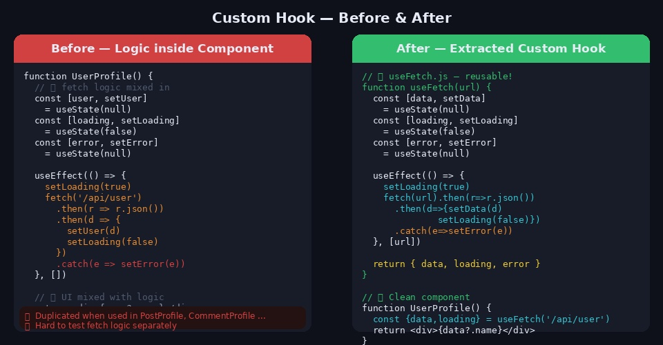
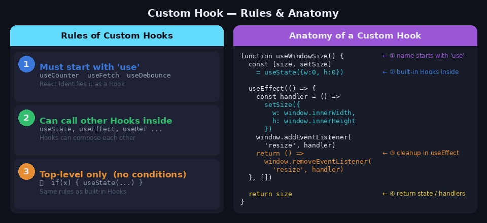
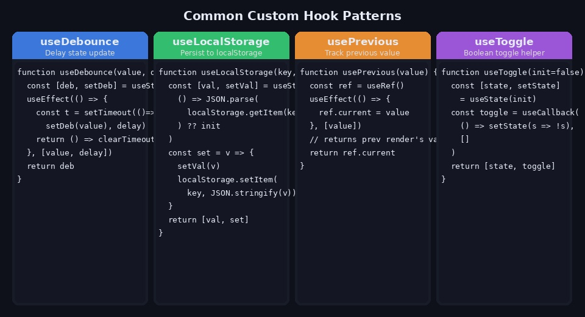
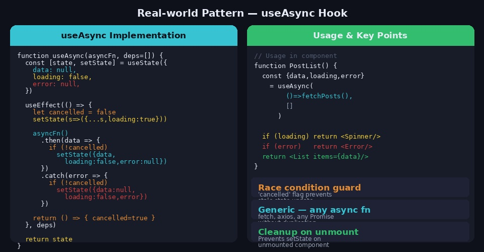
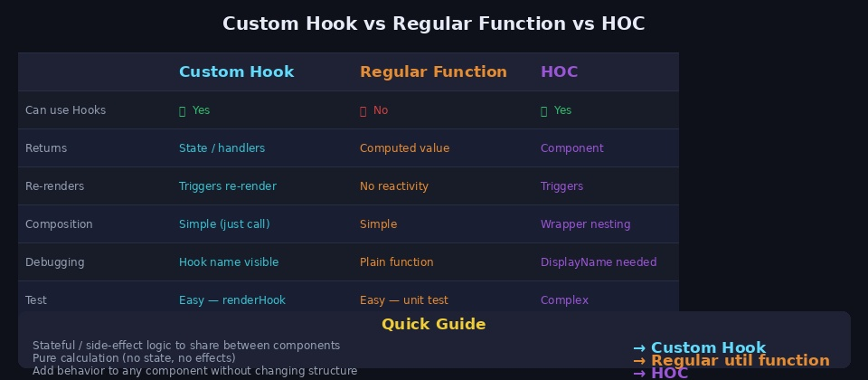

컴포넌트가 점점 커지면서 `useState`, `useEffect`가 뒤섞인 100줄짜리 컴포넌트를 마주친 적이 있을 겁니다. 같은 fetching 로직이 여러 컴포넌트에 복붙되어 있거나, 하나의 컴포넌트가 UI와 데이터 처리를 동시에 담당하고 있을 때 **Custom Hook**이 해답이 됩니다.

---

## 1. Custom Hook이란?

**Custom Hook**은 React 내장 Hook(`useState`, `useEffect` 등)을 조합해 만든 **재사용 가능한 로직의 묶음**입니다. 이름이 반드시 `use`로 시작하는 함수입니다.

```
Custom Hook의 역할:
  컴포넌트에서 "UI 그리는 것"과 "로직 처리하는 것"을 분리
  → 컴포넌트는 UI에만 집중
  → 훅은 로직에만 집중
```



### 어떤 문제를 해결하는가?

Custom Hook이 없을 때 발생하는 문제들입니다.

**1. 로직 중복**
`UserProfile`, `PostList`, `CommentSection` 세 곳에서 모두 같은 fetch 로직을 갖고 있다면, 버그를 수정할 때 세 군데를 모두 고쳐야 합니다.

**2. 관심사 미분리**
하나의 컴포넌트가 API 호출, 에러 처리, 로딩 상태 관리, UI 렌더링을 모두 담당하면 코드가 비대해지고 테스트가 어려워집니다.

**3. 공유 불가**
클래스 컴포넌트 시절에는 로직 공유를 위해 HOC나 render props를 써야 했지만, Custom Hook으로 훨씬 단순하게 해결됩니다.

---

## 2. Custom Hook의 규칙



Custom Hook은 일반 함수와 달리 React Hook의 규칙을 따라야 합니다.

### 규칙 1: 이름은 반드시 `use`로 시작

```javascript
// ✅ 올바른 이름
function useCounter() { ... }
function useFetch(url) { ... }
function useDebounce(value, delay) { ... }

// ❌ 잘못된 이름 — React가 Hook으로 인식하지 못함
function counter() { ... }
function fetchData(url) { ... }
```

`use` 접두어는 단순한 관례가 아닙니다. React와 ESLint 플러그인이 이 이름을 보고 Hook 규칙을 적용합니다.

### 규칙 2: 최상위에서만 Hook 호출

```javascript
// ✅ 최상위에서 호출
function useExample() {
    const [count, setCount] = useState(0)   // OK
    useEffect(() => { ... }, [])            // OK
    ...
}

// ❌ 조건문, 반복문 안에서 호출 금지
function useWrong() {
    if (someCondition) {
        const [count, setCount] = useState(0)  // 에러!
    }
}
```

Hook은 호출 순서에 의존하기 때문에 렌더링마다 순서가 달라지면 안 됩니다.

### 규칙 3: 내부에서 다른 Hook 호출 가능

```javascript
function useUserData(userId) {
    const [user, setUser] = useState(null)         // ✅ useState 사용
    const prevId = usePrevious(userId)             // ✅ Custom Hook 사용
    const { data } = useFetch(`/api/users/${userId}`) // ✅ 또 다른 Custom Hook

    useEffect(() => {
        if (prevId !== userId) setUser(null)
    }, [userId, prevId])

    return user
}
```

Custom Hook은 다른 Custom Hook을 자유롭게 조합할 수 있습니다.

---

## 3. 기본 구현 — useFetch

가장 대표적인 Custom Hook 패턴입니다.

```javascript
// hooks/useFetch.js
import { useState, useEffect } from 'react'

function useFetch(url) {
    const [data, setData]       = useState(null)
    const [loading, setLoading] = useState(false)
    const [error, setError]     = useState(null)

    useEffect(() => {
        if (!url) return

        let cancelled = false    // race condition 방지
        setLoading(true)
        setError(null)

        fetch(url)
            .then(res => {
                if (!res.ok) throw new Error(`HTTP ${res.status}`)
                return res.json()
            })
            .then(data => {
                if (!cancelled) {
                    setData(data)
                    setLoading(false)
                }
            })
            .catch(err => {
                if (!cancelled) {
                    setError(err.message)
                    setLoading(false)
                }
            })

        // cleanup: 컴포넌트 언마운트 시 stale update 방지
        return () => { cancelled = true }
    }, [url])

    return { data, loading, error }
}

export default useFetch
```

```javascript
// 사용
function UserProfile({ userId }) {
    const { data: user, loading, error } = useFetch(`/api/users/${userId}`)

    if (loading) return <Spinner />
    if (error)   return <ErrorMessage message={error} />
    return <div>{user?.name}</div>
}
```

---

## 4. 자주 쓰는 Custom Hook 패턴



### useDebounce — 입력 지연 처리

검색어 입력 시 타이핑이 멈추고 일정 시간이 지난 후 API를 호출할 때 사용합니다.

```javascript
import { useState, useEffect } from 'react'

function useDebounce(value, delay = 300) {
    const [debounced, setDebounced] = useState(value)

    useEffect(() => {
        const timer = setTimeout(() => setDebounced(value), delay)
        return () => clearTimeout(timer)   // 다음 타이핑 시 이전 타이머 취소
    }, [value, delay])

    return debounced
}


// 사용
function SearchBox() {
    const [query, setQuery] = useState('')
    const debouncedQuery = useDebounce(query, 500)

    // debouncedQuery가 바뀔 때만 API 호출
    const { data } = useFetch(`/api/search?q=${debouncedQuery}`)

    return <input value={query} onChange={e => setQuery(e.target.value)} />
}
```

### useLocalStorage — 로컬스토리지 동기화

```javascript
import { useState } from 'react'

function useLocalStorage(key, initialValue) {
    const [storedValue, setStoredValue] = useState(() => {
        try {
            const item = window.localStorage.getItem(key)
            return item ? JSON.parse(item) : initialValue
        } catch {
            return initialValue
        }
    })

    const setValue = value => {
        try {
            setStoredValue(value)
            window.localStorage.setItem(key, JSON.stringify(value))
        } catch (error) {
            console.error(error)
        }
    }

    return [storedValue, setValue]
}


// 사용 — useState와 완전히 동일한 인터페이스
function Settings() {
    const [theme, setTheme] = useLocalStorage('theme', 'light')
    return (
        <button onClick={() => setTheme(t => t === 'light' ? 'dark' : 'light')}>
            현재 테마: {theme}
        </button>
    )
}
```

### usePrevious — 이전 값 추적

```javascript
import { useRef, useEffect } from 'react'

function usePrevious(value) {
    const ref = useRef()

    useEffect(() => {
        ref.current = value    // 렌더링 이후 업데이트
    }, [value])

    return ref.current         // 이전 렌더링의 값 반환
}


// 사용
function Counter() {
    const [count, setCount] = useState(0)
    const prevCount = usePrevious(count)

    return (
        <p>현재: {count}, 이전: {prevCount}</p>
    )
}
```

### useToggle — 불리언 토글

```javascript
import { useState, useCallback } from 'react'

function useToggle(initialState = false) {
    const [state, setState] = useState(initialState)

    const toggle = useCallback(() => setState(s => !s), [])
    const setOn   = useCallback(() => setState(true), [])
    const setOff  = useCallback(() => setState(false), [])

    return [state, toggle, setOn, setOff]
}


// 사용
function Modal() {
    const [isOpen, toggle, open, close] = useToggle(false)

    return (
        <>
            <button onClick={open}>열기</button>
            {isOpen && (
                <dialog>
                    <button onClick={close}>닫기</button>
                </dialog>
            )}
        </>
    )
}
```

### useWindowSize — 화면 크기 추적

```javascript
import { useState, useEffect } from 'react'

function useWindowSize() {
    const [size, setSize] = useState({
        width:  window.innerWidth,
        height: window.innerHeight,
    })

    useEffect(() => {
        const handler = () => setSize({
            width:  window.innerWidth,
            height: window.innerHeight,
        })

        window.addEventListener('resize', handler)
        return () => window.removeEventListener('resize', handler)
    }, [])

    return size
}


// 사용
function ResponsiveLayout() {
    const { width } = useWindowSize()
    return width > 768 ? <DesktopLayout /> : <MobileLayout />
}
```

### useIntersectionObserver — 화면 진입 감지 (무한스크롤)

```javascript
import { useState, useEffect, useRef } from 'react'

function useIntersectionObserver(options = {}) {
    const [isIntersecting, setIsIntersecting] = useState(false)
    const ref = useRef(null)

    useEffect(() => {
        const observer = new IntersectionObserver(([entry]) => {
            setIsIntersecting(entry.isIntersecting)
        }, options)

        if (ref.current) observer.observe(ref.current)
        return () => observer.disconnect()
    }, [])

    return [ref, isIntersecting]
}


// 사용 — 무한스크롤 트리거
function InfiniteList() {
    const [ref, isVisible] = useIntersectionObserver()
    const { data, loadMore } = usePostList()

    useEffect(() => {
        if (isVisible) loadMore()
    }, [isVisible])

    return (
        <>
            {data.map(item => <PostCard key={item.id} {...item} />)}
            <div ref={ref} />  {/* 이 요소가 보이면 loadMore 호출 */}
        </>
    )
}
```

---

## 5. 실전 패턴 — useAsync



```javascript
import { useState, useEffect } from 'react'

function useAsync(asyncFn, deps = []) {
    const [state, setState] = useState({
        data:    null,
        loading: false,
        error:   null,
    })

    useEffect(() => {
        let cancelled = false

        setState(prev => ({ ...prev, loading: true, error: null }))

        asyncFn()
            .then(data => {
                if (!cancelled)
                    setState({ data, loading: false, error: null })
            })
            .catch(error => {
                if (!cancelled)
                    setState({ data: null, loading: false, error })
            })

        return () => { cancelled = true }
    }, deps)   // eslint-disable-line react-hooks/exhaustive-deps

    return state
}


// 사용 — 어떤 비동기 함수든 전달 가능
function PostList() {
    const { data, loading, error } = useAsync(
        () => fetch('/api/posts').then(r => r.json()),
        []
    )

    if (loading) return <Spinner />
    if (error)   return <ErrorMessage error={error} />
    return <List items={data} />
}
```

---

## 6. Custom Hook vs 일반 함수 vs HOC



언제 무엇을 써야 하는지 판단하는 기준입니다.

| | Custom Hook | 일반 함수 | HOC |
|--|------------|----------|-----|
| Hook 사용 가능 | ✅ | ❌ | ✅ |
| 반환 | 상태 / 핸들러 | 계산 결과 | 컴포넌트 |
| 리렌더 트리거 | ✅ | ❌ | ✅ |
| 조합 방식 | 단순 호출 | 단순 호출 | 컴포넌트 래핑 |
| 테스트 난이도 | 보통 | 쉬움 | 복잡 |

```
상태나 사이드 이펙트가 포함된 로직을 여러 컴포넌트에서 공유
→ Custom Hook

순수한 계산 (상태 없음, 이펙트 없음)
→ 일반 유틸 함수 (utils/format.js 등)

어떤 컴포넌트에든 투명하게 기능을 추가
→ HOC (withAuth, withLogging 등)
```

---

## 7. 테스트 방법 — @testing-library/react

Custom Hook은 UI 없이 독립적으로 테스트할 수 있습니다.

```bash
npm install --save-dev @testing-library/react
```

```javascript
// useCounter.test.js
import { renderHook, act } from '@testing-library/react'
import useCounter from './useCounter'

test('초기값이 0이어야 한다', () => {
    const { result } = renderHook(() => useCounter())
    expect(result.current.count).toBe(0)
})

test('increment 호출 시 1 증가해야 한다', () => {
    const { result } = renderHook(() => useCounter())

    act(() => result.current.increment())

    expect(result.current.count).toBe(1)
})

test('초기값을 설정할 수 있어야 한다', () => {
    const { result } = renderHook(() => useCounter(10))
    expect(result.current.count).toBe(10)
})
```

```javascript
// useFetch.test.js — API 모킹
import { renderHook, waitFor } from '@testing-library/react'
import useFetch from './useFetch'

global.fetch = jest.fn()

test('데이터를 성공적으로 가져온다', async () => {
    fetch.mockResolvedValueOnce({
        ok: true,
        json: async () => ({ name: 'Mingyu' }),
    })

    const { result } = renderHook(() => useFetch('/api/user'))

    // 로딩 시작
    expect(result.current.loading).toBe(true)

    // 데이터 로드 완료 대기
    await waitFor(() => expect(result.current.loading).toBe(false))

    expect(result.current.data).toEqual({ name: 'Mingyu' })
    expect(result.current.error).toBeNull()
})
```

---

## 8. 자주 하는 실수

**1. 이름을 `use`로 시작하지 않음**

```javascript
// ❌ React가 Hook으로 인식 못 해 규칙 검사 안 됨
function fetchUser() {
    const [user, setUser] = useState(null)   // 규칙 위반이어도 경고 없음
    ...
}

// ✅ 항상 use 접두어
function useFetchUser() { ... }
```

**2. 불필요한 useCallback / useMemo 남발**

```javascript
// ❌ 단순한 상태 업데이트에 useCallback 불필요
const increment = useCallback(() => setCount(c => c + 1), [])

// ✅ useCallback은 자식에게 함수를 prop으로 넘길 때만
```

**3. deps 배열 누락**

```javascript
// ❌ url 바뀌어도 재실행 안 됨
useEffect(() => {
    fetch(url).then(...)
}, [])   // url을 의존성에 추가해야 함

// ✅ 모든 사용하는 외부 값을 deps에 포함
useEffect(() => {
    fetch(url).then(...)
}, [url])
```

**4. cleanup 함수 누락으로 메모리 누수**

```javascript
// ❌ 언마운트 시 이벤트 리스너 남음
useEffect(() => {
    window.addEventListener('resize', handler)
}, [])

// ✅ cleanup으로 반드시 제거
useEffect(() => {
    window.addEventListener('resize', handler)
    return () => window.removeEventListener('resize', handler)
}, [])
```

**5. Hook을 조건부로 호출**

```javascript
// ❌ Hook 규칙 위반
function useData(enabled) {
    if (!enabled) return null
    const [data] = useState(null)   // 조건 이후 Hook 호출
    ...
}

// ✅ Hook은 먼저, 조건은 내부에서
function useData(enabled) {
    const [data, setData] = useState(null)
    useEffect(() => {
        if (!enabled) return   // 조건은 useEffect 안에서
        fetch(...)
    }, [enabled])
    return data
}
```

---

## 참고 자료

- [React 공식 문서 — Custom Hooks](https://react.dev/learn/reusing-logic-with-custom-hooks)
- [React 공식 문서 — Rules of Hooks](https://react.dev/reference/rules/rules-of-hooks)
- [usehooks.com — Custom Hook 모음](https://usehooks.com/)
- [Testing Library — renderHook](https://testing-library.com/docs/react-testing-library/api/#renderhook)