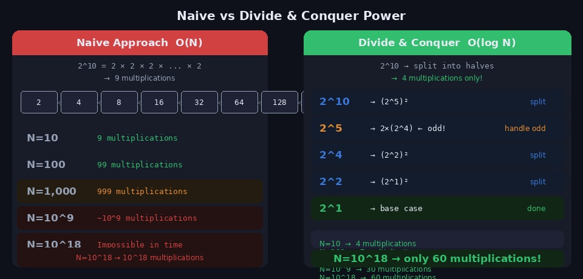
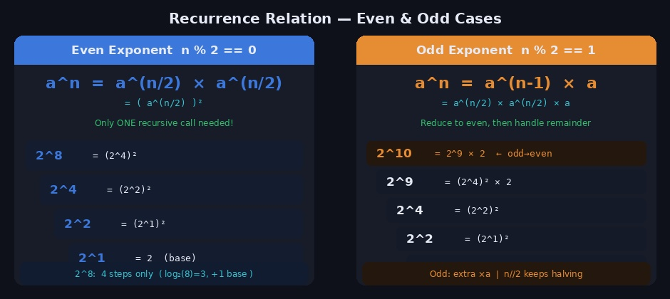
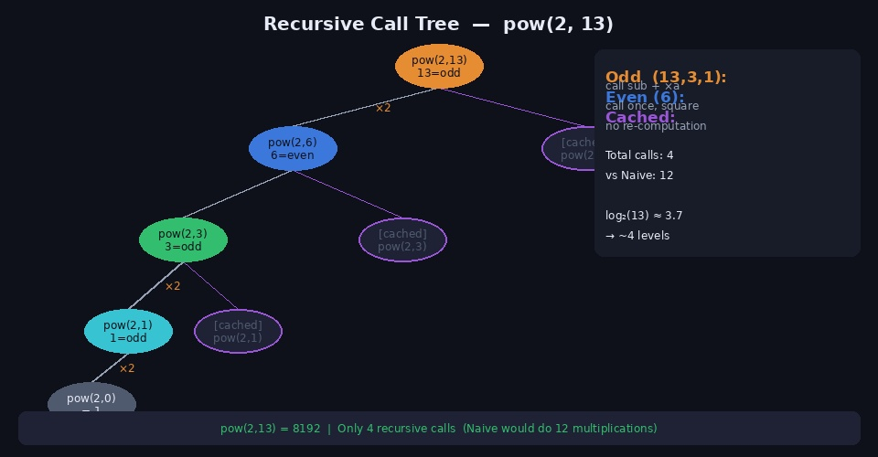
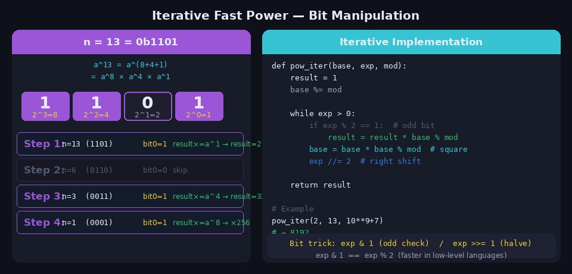
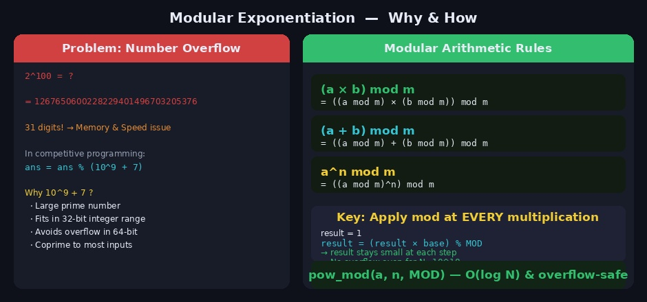

`2^10`을 구하려면 2를 10번 곱하면 됩니다. 하지만 `2^(10^18)`은요? 단순하게 10^18번 곱하면 우주가 끝나도 계산이 끝나지 않습니다. **분할정복 거듭제곱**은 이 문제를 **O(log N)** 으로 해결합니다. N=10^18이라도 단 60번의 곱셈으로 끝납니다.

---

## 1. 핵심 아이디어



### 왜 분할이 가능한가?

거듭제곱에는 다음 성질이 있습니다.

```
a^n = a^(n/2) × a^(n/2)   (n이 짝수)
a^n = a^(n-1) × a          (n이 홀수)
    = a^(n/2) × a^(n/2) × a
```

`a^n`을 구하기 위해 `a^n`을 N번 곱하는 것이 아니라, **절반 크기의 문제** `a^(n/2)` 를 먼저 구한 뒤 제곱하면 됩니다. 이 아이디어가 반복되면서 지수가 절반씩 줄어들어 O(log N) 단계만에 끝납니다.

```
N번 곱셈  →  log₂(N)번 분할로 해결

N=10^9   : 1,000,000,000번  →  30번
N=10^18  : 10^18번          →  60번
```

---

## 2. 점화식



분할정복 거듭제곱의 점화식은 다음과 같습니다.

```
         ┌  1                              (n == 0, base case)
pow(a,n) =├  pow(a, n/2)²                  (n이 짝수)
         └  pow(a, n/2)² × a              (n이 홀수)
```

### 짝수 케이스

`a^8`을 구하려면 `a^4` 하나만 계산하면 됩니다.

```
a^8 = a^4 × a^4 = (a^4)²
         ↓
a^4 = a^2 × a^2 = (a^2)²
         ↓
a^2 = a^1 × a^1 = (a^1)²
         ↓
a^1 = a  (base case)
```

4번의 계산으로 `a^8` 완성 (N=8일 때 단순 반복은 7번).

### 홀수 케이스

홀수 지수는 1을 빼서 짝수로 만든 뒤 나머지 `a`를 하나 더 곱합니다.

```
a^13 = a^12 × a = (a^6)² × a
             ↓
a^6  = (a^3)²
             ↓
a^3  = a^2 × a = (a^1)² × a
             ↓
a^1  = a  (base case)
```

---

## 3. 재귀 구현 (Python)

```python
def pow_recursive(base, exp):
    """분할정복 거듭제곱 — 재귀 버전 O(log N)"""

    # base case
    if exp == 0:
        return 1
    if exp == 1:
        return base

    # 절반 계산
    half = pow_recursive(base, exp // 2)

    if exp % 2 == 0:        # 짝수: 절반의 제곱
        return half * half
    else:                   # 홀수: 절반의 제곱 × base
        return half * half * base


print(pow_recursive(2, 10))   # 1024
print(pow_recursive(3, 5))    # 243
print(pow_recursive(2, 0))    # 1
```

### 재귀 호출 트리



`pow(2, 13)` 을 계산하면 재귀 호출은 4번만 발생합니다.

```
pow(2, 13)        ← 홀수: half² × 2
└── pow(2, 6)     ← 짝수: half²
    └── pow(2, 3) ← 홀수: half² × 2
        └── pow(2, 1) ← base case, return 2

pow(2, 1) = 2
pow(2, 3) = 2² × 2 = 8
pow(2, 6) = 8² = 64
pow(2,13) = 64² × 2 = 8192  ✅
```

`half = pow(base, exp//2)` 를 변수에 저장하고 재사용하는 것이 핵심입니다. 같은 값을 두 번 계산하지 않도록 반드시 변수에 담아야 합니다.

```python
# ❌ 동일한 재귀 호출을 두 번 — O(N)으로 돌아감
if exp % 2 == 0:
    return pow_recursive(base, exp//2) * pow_recursive(base, exp//2)

# ✅ 한 번만 계산해서 재사용
half = pow_recursive(base, exp // 2)
return half * half
```

---

## 4. 반복문 구현 (Iterative)



재귀 방식은 직관적이지만, Python에서 지수가 클 때 재귀 깊이 제한에 걸릴 수 있습니다. 반복문 방식은 스택 오버플로 걱정 없이 동일한 O(log N) 성능을 냅니다.

### 비트를 활용한 반복문

지수를 이진수로 표현하면 어떤 자릿수의 비트가 1인지에 따라 어떤 거듭제곱을 곱해야 하는지 결정됩니다.

```
13 = 1101₂ = 2³ + 2² + 2⁰ = 8 + 4 + 1

a^13 = a^8 × a^4 × a^1
```

```python
def pow_iterative(base, exp):
    """분할정복 거듭제곱 — 반복문 버전 O(log N)"""
    result = 1

    while exp > 0:
        if exp % 2 == 1:            # 현재 비트가 1이면
            result *= base           # 현재 base를 결과에 곱함
        base *= base                 # base를 제곱 (다음 비트로 이동)
        exp //= 2                    # 지수를 오른쪽으로 1비트 이동

    return result


print(pow_iterative(2, 13))   # 8192
print(pow_iterative(3, 0))    # 1
print(pow_iterative(5, 1))    # 5
```

### 단계별 추적 (base=2, exp=13)

```
초기: result=1, base=2, exp=13 (1101₂)

Step 1: exp=13 (홀수) → result=1×2=2,   base=4,  exp=6
Step 2: exp=6  (짝수) → result=2 (유지), base=16, exp=3
Step 3: exp=3  (홀수) → result=2×16=32, base=256, exp=1
Step 4: exp=1  (홀수) → result=32×256=8192, base=..., exp=0

→ 결과: 8192 = 2^13  ✅
```

### 비트 연산으로 최적화

```python
def pow_bit(base, exp):
    result = 1
    while exp > 0:
        if exp & 1:            # exp % 2 == 1 과 동일 (더 빠름)
            result *= base
        base *= base
        exp >>= 1              # exp //= 2 와 동일 (더 빠름)
    return result
```

---

## 5. 모듈러 거듭제곱 (Modular Exponentiation)



코딩테스트에서 거듭제곱 문제는 거의 항상 **"결과를 MOD로 나눈 나머지를 출력하라"** 는 조건이 붙습니다.

### 왜 MOD가 필요한가?

```
2^100 = 1267650600228229401496703205376

→ 31자리 숫자 → 메모리, 연산 속도 문제
→ Python은 자동으로 큰 정수 처리하지만 매우 느려짐
→ 다른 언어(C++, Java)는 오버플로 발생
```

대부분의 문제에서 `MOD = 10^9 + 7 (= 1,000,000,007)` 을 사용합니다.

```
10^9 + 7을 사용하는 이유:
1. 소수(Prime) → 나눗셈의 역원(modular inverse) 계산 가능
2. 32비트 정수 범위 이내
3. (10^9+7)² < 2^63 → 64비트 내에서 곱셈 오버플로 없음
```

### 모듈러 연산의 핵심 성질

```
(a × b) mod m = ((a mod m) × (b mod m)) mod m
```

이 성질 덕분에 **매 곱셈마다 mod를 적용**해도 최종 결과가 동일합니다.

```python
def pow_mod(base, exp, mod):
    """모듈러 거듭제곱 O(log N)"""
    result = 1
    base %= mod   # 초기 base도 mod 적용

    while exp > 0:
        if exp & 1:
            result = result * base % mod   # 매 곱셈마다 mod
        base = base * base % mod           # base 제곱 시에도 mod
        exp >>= 1

    return result


MOD = 10**9 + 7

print(pow_mod(2, 10, MOD))      # 1024
print(pow_mod(2, 100, MOD))     # 976371285  (2^100 mod 10^9+7)
print(pow_mod(3, 10**18, MOD))  # 순식간에 계산!
```

> Python에는 `pow(base, exp, mod)` 내장 함수가 있습니다. 세 번째 인자로 mod를 전달하면 내부적으로 분할정복 모듈러 거듭제곱을 수행합니다. 직접 구현한 것보다 훨씬 빠릅니다.

```python
print(pow(2, 10**18, 10**9+7))  # 파이썬 내장 함수 활용 (권장)
```

---

## 6. 응용 — 행렬 거듭제곱

분할정복 거듭제곱은 정수뿐 아니라 **행렬**에도 적용할 수 있습니다. 이를 이용하면 피보나치 수열의 N번째 항을 O(log N)에 구할 수 있습니다.

### 피보나치와 행렬

```
[F(n+1)]   [1 1]^n   [1]
[F(n)  ] = [1 0]   × [0]

→ 행렬을 N번 곱하는 대신 분할정복으로 O(log N)에 계산
```

```python
def mat_mul(A, B, mod):
    """2×2 행렬 곱셈"""
    n = len(A)
    C = [[0]*n for _ in range(n)]
    for i in range(n):
        for j in range(n):
            for k in range(n):
                C[i][j] = (C[i][j] + A[i][k] * B[k][j]) % mod
    return C


def mat_pow(M, exp, mod):
    """행렬 거듭제곱 — 분할정복 O(log N)"""
    n = len(M)
    # 단위행렬 (Identity matrix)
    result = [[1 if i==j else 0 for j in range(n)] for i in range(n)]

    while exp > 0:
        if exp & 1:
            result = mat_mul(result, M, mod)
        M = mat_mul(M, M, mod)
        exp >>= 1

    return result


def fibonacci(n, mod=10**9+7):
    """피보나치 N번째 항을 O(log N)에 계산"""
    if n <= 1:
        return n
    M = [[1,1],[1,0]]
    result = mat_pow(M, n-1, mod)
    return result[0][0]


print(fibonacci(10))    # 55
print(fibonacci(50))    # 12586269025
print(fibonacci(10**6)) # 매우 빠르게 계산!
```

---

## 7. 자주 하는 실수

**1. half를 두 번 재계산**

```python
# ❌ 동일한 재귀가 두 번 → O(N)으로 되돌아감
return pow_recursive(a, n//2) * pow_recursive(a, n//2)

# ✅ 한 번만 계산
half = pow_recursive(a, n//2)
return half * half
```

**2. 모듈러 연산 위치 실수**

```python
# ❌ 마지막에 한 번만 mod → 중간에 오버플로 발생 가능 (C++/Java)
result = base ** exp % mod

# ✅ 매 곱셈마다 mod 적용
result = result * base % mod
base   = base * base % mod
```

**3. exp=0 base case 누락**

```python
# ❌ base case 없으면 무한 재귀
def pow_rec(a, n):
    half = pow_rec(a, n//2)
    ...

# ✅ 반드시 base case 처리
def pow_rec(a, n):
    if n == 0: return 1
    half = pow_rec(a, n//2)
    ...
```

**4. 음수 지수 처리 누락**

```python
# 음수 지수가 들어올 수 있는 문제라면
# a^(-n) = 1 / a^n  →  모듈러에서는 모듈러 역원 사용
# 페르마 소정리: a^(p-1) ≡ 1 (mod p)  →  a^(-1) ≡ a^(p-2) (mod p)
def mod_inverse(a, p):
    return pow_mod(a, p-2, p)
```

---

## 8. 시간복잡도 정리

| 방식 | 시간복잡도 | 공간복잡도 | 특징 |
|------|-----------|-----------|------|
| 단순 반복 | O(N) | O(1) | N이 크면 사용 불가 |
| 분할정복 재귀 | O(log N) | O(log N) | 직관적, 재귀 스택 |
| 분할정복 반복 | O(log N) | O(1) | 실전 권장 |
| 행렬 거듭제곱 | O(k³ log N) | O(k²) | k×k 행렬 |

---

## 9. 관련 백준 문제

| 문제 | 난이도 | 핵심 |
|------|--------|------|
| [1629 곱셈](https://www.acmicpc.net/problem/1629) | Silver I | 모듈러 거듭제곱 기본 |
| [10830 행렬 제곱](https://www.acmicpc.net/problem/10830) | Gold IV | 행렬 거듭제곱 |
| [11444 피보나치 수 6](https://www.acmicpc.net/problem/11444) | Gold II | 행렬 거듭제곱 + 피보나치 |
| [13171 A](https://www.acmicpc.net/problem/13171) | Gold V | 분할정복 거듭제곱 응용 |
| [15718 돌아온 떡파이](https://www.acmicpc.net/problem/15718) | Gold II | 모듈러 역원 + 거듭제곱 |