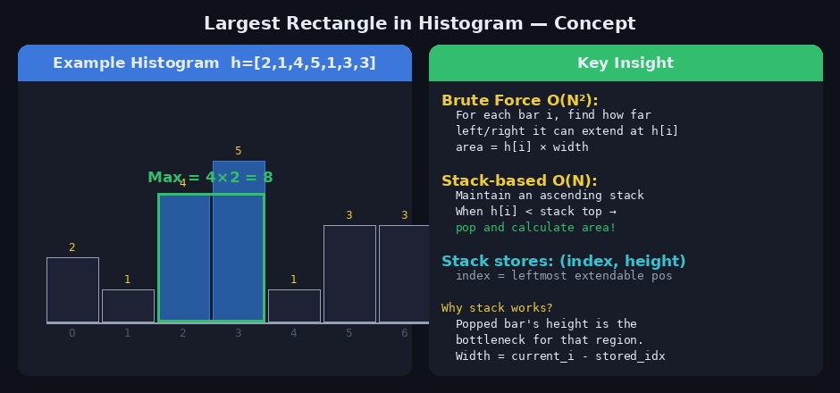
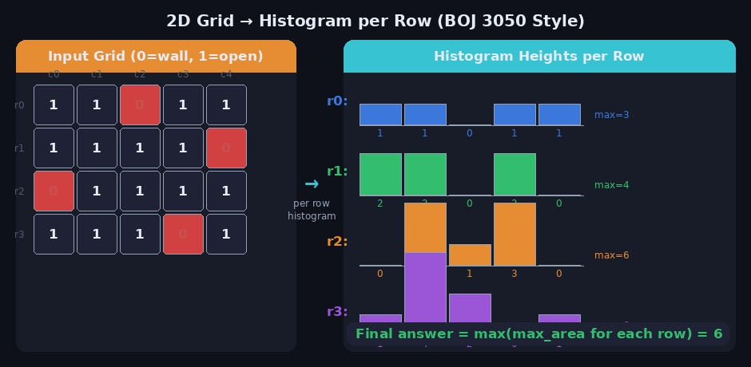
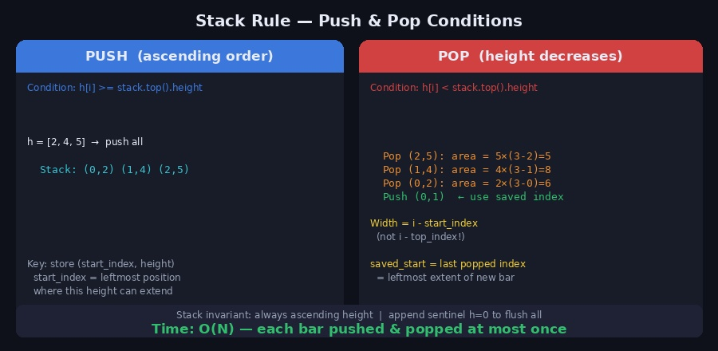
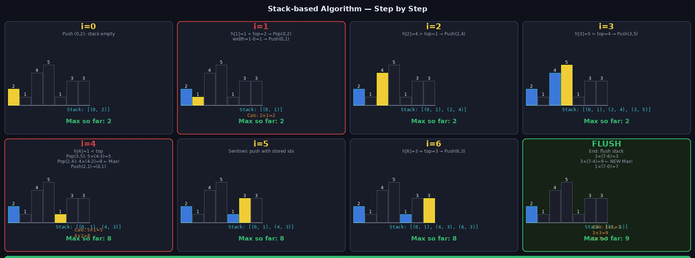

**백준 3050 집들이** 문제는 2D 격자에서 벽이 없는 가장 큰 직사각형 방을 찾는 문제입니다. 핵심은 이 문제를 **"히스토그램에서 가장 큰 직사각형 찾기"** 로 변환한 뒤, 스택을 이용해 O(N)에 풀어내는 것입니다. 처음 보면 접근 방법이 전혀 안 보이지만, 핵심 아이디어를 이해하면 같은 패턴의 문제를 반복적으로 적용할 수 있습니다.

---

## 1. 문제 구조 이해

### 히스토그램에서 최대 직사각형 (기본 문제)

히스토그램이 주어질 때, 막대 안에 포함되는 가장 넓은 직사각형의 넓이를 구합니다.



```
h = [2, 1, 4, 5, 1, 3, 3]

직사각형 후보 예시:
- 인덱스 2~3, 높이 4 → 넓이 8  ← 최대
- 인덱스 5~6, 높이 3 → 넓이 6
- 인덱스 0~6, 높이 1 → 넓이 7
```

### 2D 격자 → 히스토그램 변환 (3050 집들이)



2D 격자에서 **각 행마다** 히스토그램을 만들어 적용합니다.

```
격자 (0=벽, 1=빈칸):
row0: [1,1,0,1,1]
row1: [1,1,1,1,0]
row2: [0,1,1,1,1]
row3: [1,1,1,0,1]

r번째 행에서의 히스토그램 높이 h[c]:
  grid[r][c] == 0이면 → h[c] = 0  (벽)
  grid[r][c] == 1이면 → h[c] += 1 (위에서 연속된 빈칸 수)

row0의 h: [1, 1, 0, 1, 1]
row1의 h: [2, 2, 0, 2, 0]   ← row0에서 이어짐
row2의 h: [0, 3, 1, 3, 0]
row3의 h: [1, 4, 2, 0, 1]

각 행의 히스토그램에서 최대 직사각형을 구하고 전체 최대를 갱신
```

---

## 2. 브루트포스 O(N²) 접근

먼저 직관적인 방법을 이해합니다.

```python
def largest_rect_brute(heights):
    n = len(heights)
    ans = 0

    for i in range(n):           # 각 막대를 높이 기준으로
        min_h = heights[i]
        for j in range(i, n):   # 오른쪽으로 확장
            min_h = min(min_h, heights[j])   # 확장 구간의 최솟값이 높이
            ans = max(ans, min_h * (j - i + 1))

    return ans
```

모든 구간 쌍을 확인하므로 O(N²)입니다. N이 크면 시간 초과가 납니다.

---

## 3. 스택 기반 O(N) 알고리즘

### 핵심 아이디어



> **각 막대 h[i]를 "이 높이로 만들 수 있는 직사각형의 높이"로 사용한다.**
> 막대가 감소하는 순간(h[i] < 스택 top), 더 높은 막대들의 직사각형을 확정 지을 수 있다.

스택에는 **(시작 인덱스, 높이)** 쌍을 저장하며, 항상 **오름차순** 을 유지합니다.

### Push / Pop 규칙

```
PUSH 조건: h[i] >= 스택 top의 높이
  → 아직 더 오른쪽으로 확장 가능, 스택에 저장

POP 조건: h[i] < 스택 top의 높이
  → top보다 낮은 막대를 만났으므로, top 높이의 직사각형은 여기서 끝
  → 넓이 = top.height × (i - top.start_index)
  → 더 낮아질 때까지 반복 팝

pop 시 start_index 저장 → 새 막대의 시작 인덱스로 사용
  (이전에 팝된 막대들은 h[i] 높이로 왼쪽으로 확장 가능)
```

### 단계별 시각화



```
h = [2, 1, 4, 5, 1, 3, 3]

i=0: stack=[] → push (0,2)    stack: [(0,2)]
i=1: h=1 < top=2
     pop(0,2): area=2×(1-0)=2, save start=0
     push (0,1)               stack: [(0,1)]
i=2: h=4 > top=1 → push(2,4) stack: [(0,1),(2,4)]
i=3: h=5 > top=4 → push(3,5) stack: [(0,1),(2,4),(3,5)]
i=4: h=1 < top=5
     pop(3,5): area=5×(4-3)=5,  save start=3
     pop(2,4): area=4×(4-2)=8 ← MAX!, save start=2
     top(0,1) <= 1이므로 stop
     push (2,1)               stack: [(0,1),(2,1)]
     ※ 실제로는 (0,1)과 (2,1)을 합칠 수 있어 start=0 사용
i=5: h=3 > top=1 → push(4,3) stack: [(0,1),(4,3)]
     ※ saved_start=4 사용
i=6: h=3 = top=3 → push(6,3) stack: [(0,1),(4,3),(6,3)]

END (sentinel h=0):
     pop(6,3): area=3×(7-6)=3
     pop(4,3): area=3×(7-4)=9 ← NEW MAX!
     pop(0,1): area=1×(7-0)=7

Final Answer = 9
```

---

## 4. Python 구현 — 히스토그램 최대 직사각형

```python
def largest_rect_in_histogram(heights: list) -> int:
    """
    스택 기반 O(N) 히스토그램 최대 직사각형
    heights: 각 막대의 높이 리스트
    """
    stack = []   # (start_index, height) 오름차순 유지
    ans = 0

    # 마지막에 h=0 센티넬 추가 → 스택을 완전히 비워냄
    for i, h in enumerate(heights + [0]):
        start = i   # 현재 막대의 시작 인덱스

        while stack and stack[-1][1] > h:
            idx, height = stack.pop()
            # 팝된 막대의 직사각형: 이 높이로 확장 가능한 너비
            area = height * (i - idx)
            ans = max(ans, area)
            start = idx   # 더 왼쪽까지 확장 가능

        # 현재 높이보다 작거나 같으면 push (start는 갱신된 값 사용)
        if not stack or stack[-1][1] < h:
            stack.append((start, h))

    return ans


# 테스트
print(largest_rect_in_histogram([2, 1, 4, 5, 1, 3, 3]))  # 9
print(largest_rect_in_histogram([6, 2, 5, 4, 5, 1, 6]))  # 12
print(largest_rect_in_histogram([1]))                      # 1
print(largest_rect_in_histogram([5, 5, 5, 5]))             # 20
```

### 구현 포인트 정리

```python
# 1. 센티넬(sentinel) 0을 마지막에 추가
for i, h in enumerate(heights + [0]):
    # → 스택에 남은 모든 원소를 마지막에 처리

# 2. start 인덱스 갱신
start = i   # 초기값
while stack and stack[-1][1] > h:
    idx, height = stack.pop()
    area = height * (i - idx)   # 너비: i - 저장된 인덱스
    ans = max(ans, area)
    start = idx   # 팝할수록 왼쪽으로 확장

# 3. push 시 갱신된 start 사용
stack.append((start, h))
# start = 현재 높이 h가 왼쪽으로 확장 가능한 가장 왼쪽 인덱스
```

---

## 5. 백준 3050 집들이 — 전체 풀이

2D 격자에서 각 행을 히스토그램으로 변환 후 적용합니다.

```python
import sys
input = sys.stdin.readline

def largest_rect(heights):
    stack = []
    ans = 0
    for i, h in enumerate(heights + [0]):
        start = i
        while stack and stack[-1][1] > h:
            idx, height = stack.pop()
            ans = max(ans, height * (i - idx))
            start = idx
        if not stack or stack[-1][1] < h:
            stack.append((start, h))
    return ans


def solve():
    R, C = map(int, input().split())
    grid = []
    for _ in range(R):
        row = list(map(int, input().split()))
        grid.append(row)

    # 히스토그램 높이 초기화
    hist = [0] * C
    ans = 0

    for r in range(R):
        for c in range(C):
            if grid[r][c] == 1:     # 빈칸: 높이 누적
                hist[c] += 1
            else:                    # 벽: 높이 초기화
                hist[c] = 0

        # 현재 행의 히스토그램으로 최대 직사각형 계산
        ans = max(ans, largest_rect(hist[:]))

    print(ans)


solve()
```

### 입력/출력 예시

```
입력:
4 5
1 1 0 1 1
1 1 1 1 0
0 1 1 1 1
1 1 1 0 1

출력:
6

히스토그램 변환 과정:
row0 hist: [1,1,0,1,1]  → max=2
row1 hist: [2,2,0,2,0]  → max=4
row2 hist: [0,3,1,3,0]  → max=6 ← 최대 (높이3, 너비2)
row3 hist: [1,4,2,0,1]  → max=6
```

---

## 6. 왜 O(N)인가?

각 막대는 스택에 **최대 한 번 push** 되고 **최대 한 번 pop** 됩니다.

```
총 push 횟수: N번 이하
총 pop  횟수: N번 이하
→ 전체: O(N)

2D 격자 (R행 × C열):
  각 행마다 O(C) → 전체 O(R × C)
```

---

## 7. 자주 하는 실수

### 1. 너비 계산 실수

```python
# ❌ 틀린 방법 — pop 직전 인덱스를 기준으로 계산
area = height * (i - i_prev)   # i_prev = 이전 인덱스?

# ✅ 올바른 방법 — 스택에 저장된 start_index를 기준으로
area = height * (i - stored_start_index)
```

### 2. start 인덱스 갱신 누락

```python
# ❌ start를 갱신하지 않으면 왼쪽 확장이 반영 안 됨
while stack and stack[-1][1] > h:
    idx, height = stack.pop()
    area = height * (i - idx)
    ans = max(ans, area)
    # start 갱신 안 함 → push할 때 i 사용 → 틀림

# ✅ 팝할 때마다 start 갱신
start = i
while stack and stack[-1][1] > h:
    idx, height = stack.pop()
    area = height * (i - idx)
    ans = max(ans, area)
    start = idx   # ← 반드시 갱신
stack.append((start, h))
```

### 3. 센티넬 없이 스택 미처리

```python
# ❌ 센티넬 없이 루프 종료 → 스택에 남은 원소 처리 안 됨
for i, h in enumerate(heights):
    ...

# ✅ 센티넬 0 추가로 스택 완전히 비움
for i, h in enumerate(heights + [0]):
    ...
```

### 4. 2D 문제에서 hist 초기화 실수

```python
# ❌ 벽(0)을 만났을 때 초기화 안 함
if grid[r][c] == 1:
    hist[c] += 1
# else: 아무것도 안 함 → 이전 높이가 유지됨

# ✅ 반드시 0으로 초기화
if grid[r][c] == 1:
    hist[c] += 1
else:
    hist[c] = 0   # 벽이면 연속성 끊김
```

---

## 8. 유사 문제 패턴

이 알고리즘이 적용되는 문제 유형들입니다.

```
기본형
  → 히스토그램에서 최대 직사각형 (백준 6549)

2D 응용
  → 격자에서 1로만 이루어진 최대 직사각형 (LeetCode 85)
  → 집들이 문제 (백준 3050)
  → N×M 격자 최대 직사각형

변형
  → 히스토그램 최대 직사각형 (0-indexed, 가중치)
  → 건물 스카이라인 문제
```

### LeetCode 85 — 2D 이진 행렬 최대 직사각형

```python
def maximalRectangle(matrix):
    if not matrix: return 0
    R, C = len(matrix), len(matrix[0])
    hist = [0] * C
    ans = 0

    for r in range(R):
        for c in range(C):
            hist[c] = hist[c]+1 if matrix[r][c]=='1' else 0
        ans = max(ans, largest_rect(hist[:]))

    return ans
```

---

## 9. 관련 백준 문제

| 문제 | 난이도 | 핵심 |
|------|--------|------|
| [3050 집들이](https://www.acmicpc.net/problem/3050) | Gold V | 2D → 히스토그램 + 스택 |
| [6549 히스토그램에서 가장 큰 직사각형](https://www.acmicpc.net/problem/6549) | Platinum V | 스택 기본 |
| [2741 히스토그램](https://www.acmicpc.net/problem/2741) | Gold IV | 히스토그램 기본 |
| [1725 히스토그램](https://www.acmicpc.net/problem/1725) | Gold IV | 스택 / 분할정복 |

---

## 참고 자료

- [Sungho's Blog — Largest Rectangle in Histogram](https://sgc109.github.io/2021/03/18/largest-rectangle-in-histogram/)
- [백준 6549 스택 풀이](https://greeksharifa.github.io/ps/2018/07/07/PS-06549/)
- Claude AI