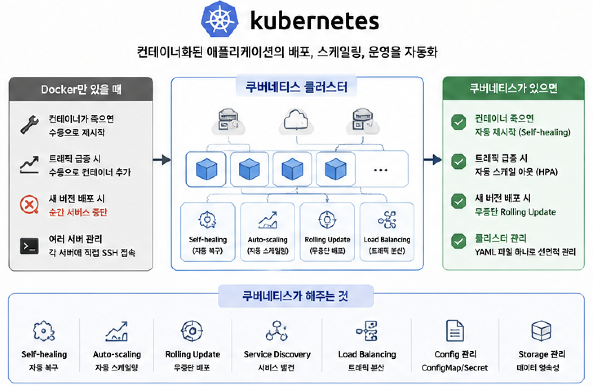
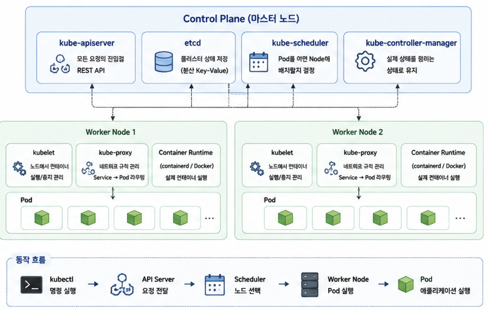
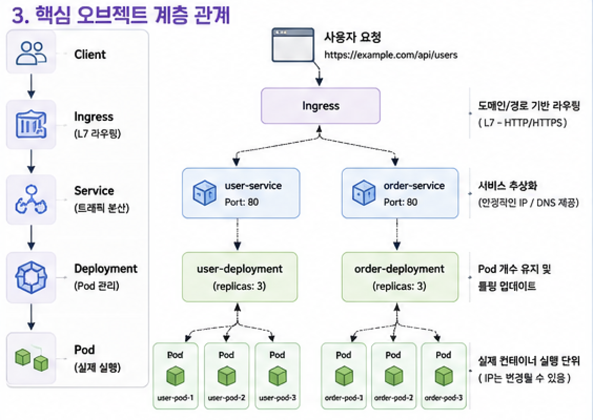
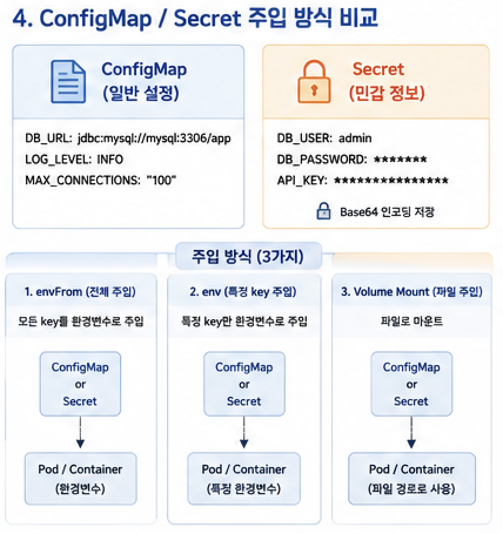
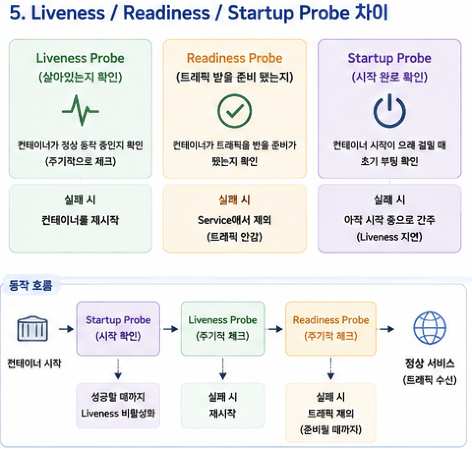

Docker로 컨테이너를 만들 수 있게 됐다면, 그 다음 질문은 "수십~수백 개의 컨테이너를 어떻게 관리하는가?"입니다. 서버가 죽으면 자동으로 재시작하고, 트래픽이 몰리면 자동으로 컨테이너 수를 늘리고, 무중단으로 새 버전을 배포하는 것. 이 모든 것을 담당하는 것이 **쿠버네티스(Kubernetes, K8s)** 입니다.

---

## 1. 쿠버네티스란?

쿠버네티스는 컨테이너화된 애플리케이션의 **배포, 스케일링, 운영을 자동화**하는 오픈소스 플랫폼입니다. Google이 내부 시스템(Borg)을 기반으로 만들어 2014년 오픈소스로 공개했습니다.



### Docker만으로 부족한 이유

```
Docker만 있을 때:
  - 컨테이너가 죽으면 → 수동으로 재시작
  - 트래픽 급증 시   → 수동으로 컨테이너 추가
  - 새 버전 배포 시  → 순간 서비스 중단
  - 여러 서버 관리   → 각 서버에 직접 SSH 접속

쿠버네티스가 있으면:
  - 컨테이너 죽으면  → 자동 재시작 (Self-healing)
  - 트래픽 급증 시  → 자동 스케일 아웃 (HPA)
  - 새 버전 배포    → 무중단 Rolling Update
  - 클러스터 관리   → 선언적 설정 파일(YAML) 하나로
```

### 쿠버네티스가 해주는 것

```
Self-healing     : 컨테이너 장애 시 자동 재시작 / 교체
Auto-scaling     : 부하에 따라 Pod 수 자동 조절
Rolling Update   : 무중단 배포 + 실패 시 자동 롤백
Service Discovery: 서비스들이 서로를 이름으로 찾음
Load Balancing   : 여러 Pod에 트래픽 자동 분산
Config 관리      : ConfigMap / Secret으로 설정 분리
Storage 관리     : PersistentVolume으로 데이터 영속성
```

---

## 2. 쿠버네티스 아키텍처



쿠버네티스 클러스터는 **Control Plane(마스터)**과 **Worker Node**로 구성됩니다.

### Control Plane (마스터 노드)

클러스터를 관리하고 의사결정을 담당합니다.

```
kube-apiserver
  - 모든 요청의 진입점
  - kubectl 명령을 받아 처리
  - REST API로 동작

etcd
  - 클러스터의 모든 상태를 저장하는 분산 Key-Value 저장소
  - "진실의 원천 (Source of Truth)"

kube-scheduler
  - 새 Pod를 어떤 Node에 배치할지 결정
  - CPU, 메모리, 어피니티 규칙 등 고려

kube-controller-manager
  - 실제 상태(Actual)를 원하는 상태(Desired)로 맞추는 컨트롤러 모음
  - ReplicaSet Controller, Node Controller 등
```

### Worker Node

실제 애플리케이션(Pod)이 실행되는 노드입니다.

```
kubelet
  - 각 노드에서 실행되는 에이전트
  - Control Plane의 지시를 받아 컨테이너 실행/중지

kube-proxy
  - 네트워크 규칙 관리
  - Service → Pod로의 트래픽 라우팅

Container Runtime
  - 실제 컨테이너 실행 엔진 (containerd, Docker 등)
```

### 선언적 관리 (Declarative)

쿠버네티스의 핵심 철학입니다.

```yaml
# "이 상태를 만들어줘" 라고 선언
# 어떻게 만드는지는 쿠버네티스가 알아서 처리

apiVersion: apps/v1
kind: Deployment
spec:
  replicas: 3          # Pod 3개를 항상 유지해줘
  ...
```

```
kubectl apply -f deployment.yaml
→ Control Plane이 현재 상태 확인
→ 목표 상태(replicas: 3)와 비교
→ 차이를 자동으로 조정
```

---

## 3. 핵심 오브젝트



### Pod — 가장 작은 배포 단위

Pod는 하나 이상의 컨테이너를 묶은 쿠버네티스의 최소 실행 단위입니다. 같은 Pod 안의 컨테이너들은 네트워크와 스토리지를 공유합니다.

```yaml
# pod.yaml
apiVersion: v1
kind: Pod
metadata:
  name: my-app-pod
  labels:
    app: my-app
spec:
  containers:
    - name: my-app
      image: my-app:1.0.0
      ports:
        - containerPort: 8080
      resources:
        requests:
          cpu: "250m" # 0.25 CPU core
          memory: "256Mi"
        limits:
          cpu: "500m"
          memory: "512Mi"
```

> Pod는 직접 생성하지 않고 Deployment를 통해 관리합니다. Pod는 일시적(Ephemeral)이기 때문입니다.

### Deployment — Pod 관리자

원하는 수의 Pod를 유지하고, 롤링 업데이트를 담당합니다. 실무에서 가장 많이 사용하는 오브젝트입니다.

```yaml
# deployment.yaml
apiVersion: apps/v1
kind: Deployment
metadata:
  name: my-app-deployment
spec:
  replicas: 3 # Pod 3개 유지
  selector:
    matchLabels:
      app: my-app # 이 레이블을 가진 Pod를 관리
  template: # 생성할 Pod의 템플릿
    metadata:
      labels:
        app: my-app
    spec:
      containers:
        - name: my-app
          image: my-app:1.0.0
          ports:
            - containerPort: 8080
  strategy:
    type: RollingUpdate
    rollingUpdate:
      maxSurge: 1 # 동시에 최대 1개 추가 생성
      maxUnavailable: 0 # 배포 중 사용 불가 Pod = 0 (무중단)
```

### ReplicaSet — Pod 복제본 관리

Deployment가 내부적으로 사용하는 오브젝트입니다. 직접 사용할 일은 거의 없습니다.

```
Deployment → ReplicaSet → Pod × N
```

### Service — 안정적인 네트워크 엔드포인트

Pod는 재시작될 때마다 IP가 바뀝니다. Service는 변하지 않는 고정 주소로 Pod 집합에 접근하게 해줍니다.

```yaml
# service.yaml
apiVersion: v1
kind: Service
metadata:
  name: my-app-service
spec:
  selector:
    app: my-app # app=my-app 레이블을 가진 Pod에 연결
  ports:
    - protocol: TCP
      port: 80 # Service 포트
      targetPort: 8080 # Pod 포트
  type: ClusterIP # 기본값: 클러스터 내부에서만 접근 가능
```

#### Service 타입

```
ClusterIP (기본값)
  - 클러스터 내부에서만 접근 가능
  - 서비스 간 통신에 사용

NodePort
  - 각 노드의 특정 포트로 외부 접근 허용
  - 개발/테스트 환경에 주로 사용

LoadBalancer
  - 클라우드 로드 밸런서를 자동 생성
  - 외부 트래픽을 Pod로 전달
  - AWS ELB, GCP Load Balancer 등

ExternalName
  - 외부 DNS 이름으로 매핑
  - 외부 서비스에 클러스터 내부 이름으로 접근
```

### Ingress — L7 라우팅

HTTP/HTTPS 레벨에서 URL 경로나 도메인 기반으로 트래픽을 여러 Service로 라우팅합니다.

```yaml
# ingress.yaml
apiVersion: networking.k8s.io/v1
kind: Ingress
metadata:
  name: my-app-ingress
  annotations:
    nginx.ingress.kubernetes.io/rewrite-target: /
spec:
  ingressClassName: nginx
  rules:
    - host: myapp.example.com
      http:
        paths:
          - path: /api/orders
            pathType: Prefix
            backend:
              service:
                name: order-service
                port:
                  number: 80
          - path: /api/users
            pathType: Prefix
            backend:
              service:
                name: user-service
                port:
                  number: 80
  tls:
    - hosts:
        - myapp.example.com
      secretName: tls-secret # TLS 인증서
```

```
외부 트래픽 흐름:
  Client → Ingress (도메인/경로 기반 라우팅)
         → Service A (order-service)
         → Service B (user-service)
```

---

## 4. 설정 관리 — ConfigMap & Secret



### ConfigMap — 일반 설정 값

환경에 따라 달라지는 설정 값(DB URL, 로그 레벨 등)을 코드와 분리합니다.

```yaml
# configmap.yaml
apiVersion: v1
kind: ConfigMap
metadata:
  name: app-config
data:
  DB_URL: "jdbc:mysql://mysql-service:3306/mydb"
  LOG_LEVEL: "INFO"
  MAX_CONNECTIONS: "100"
  app.properties: |
    server.port=8080
    spring.jpa.show-sql=false
```

```yaml
# Deployment에서 ConfigMap 참조
spec:
  containers:
    - name: my-app
      image: my-app:1.0.0
      # 방법 1: 환경변수로 주입
      envFrom:
        - configMapRef:
            name: app-config
      # 방법 2: 특정 키만 주입
      env:
        - name: DB_URL
          valueFrom:
            configMapKeyRef:
              name: app-config
              key: DB_URL
      # 방법 3: 파일로 마운트
      volumeMounts:
        - name: config-volume
          mountPath: /app/config
  volumes:
    - name: config-volume
      configMap:
        name: app-config
```

### Secret — 민감한 정보

비밀번호, API 키, 인증서 등 민감한 정보를 Base64 인코딩해서 저장합니다.

```yaml
# secret.yaml
apiVersion: v1
kind: Secret
metadata:
  name: app-secret
type: Opaque
data:
  # echo -n "mypassword" | base64
  DB_PASSWORD: bXlwYXNzd29yZA==
  JWT_SECRET: c2VjcmV0a2V5MTIz
```

```bash
# CLI로 Secret 생성 (Base64 직접 인코딩 없이)
kubectl create secret generic app-secret \
  --from-literal=DB_PASSWORD=mypassword \
  --from-literal=JWT_SECRET=secretkey123
```

```yaml
# Deployment에서 Secret 참조
env:
  - name: DB_PASSWORD
    valueFrom:
      secretKeyRef:
        name: app-secret
        key: DB_PASSWORD
```

> Secret은 기본적으로 Base64 인코딩이므로 암호화가 아닙니다. 실무에서는 **AWS Secrets Manager**, **Vault** 같은 외부 시크릿 관리 도구와 연동합니다.

---

## 5. 헬스체크 — Probe



쿠버네티스는 3가지 Probe로 컨테이너의 상태를 체크합니다.

### Liveness Probe — 살아있는가?

실패하면 컨테이너를 **재시작**합니다. 데드락 등 회복 불가 상태 감지에 사용합니다.

```yaml
livenessProbe:
  httpGet:
    path: /actuator/health/liveness
    port: 8080
  initialDelaySeconds: 30 # 시작 후 30초 대기 (앱 부팅 시간)
  periodSeconds: 10 # 10초마다 체크
  failureThreshold: 3 # 3번 연속 실패 시 재시작
```

### Readiness Probe — 트래픽 받을 준비가 됐는가?

실패하면 Service에서 해당 Pod를 **제외**합니다 (재시작 아님). DB 연결 완료 등 준비 상태 확인에 사용합니다.

```yaml
readinessProbe:
  httpGet:
    path: /actuator/health/readiness
    port: 8080
  initialDelaySeconds: 10
  periodSeconds: 5
  failureThreshold: 3
```

### Startup Probe — 초기 시작이 완료됐는가?

앱이 느리게 시작될 때 Liveness Probe가 너무 빨리 실패하는 것을 방지합니다.

```yaml
startupProbe:
  httpGet:
    path: /actuator/health
    port: 8080
  failureThreshold: 30 # 최대 30 × 10초 = 5분 대기
  periodSeconds: 10
```

### Spring Boot Actuator 연동

```yaml
# application.yml
management:
  health:
    livenessState:
      enabled: true
    readinessState:
      enabled: true
  endpoint:
    health:
      probes:
        enabled: true
```

---

## 6. 오토스케일링 — HPA

**HPA(Horizontal Pod Autoscaler)** 는 CPU / 메모리 사용률에 따라 Pod 수를 자동으로 조절합니다.

```yaml
# hpa.yaml
apiVersion: autoscaling/v2
kind: HorizontalPodAutoscaler
metadata:
  name: my-app-hpa
spec:
  scaleTargetRef:
    apiVersion: apps/v1
    kind: Deployment
    name: my-app-deployment
  minReplicas: 2 # 최소 2개
  maxReplicas: 10 # 최대 10개
  metrics:
    - type: Resource
      resource:
        name: cpu
        target:
          type: Utilization
          averageUtilization: 70 # CPU 70% 초과 시 스케일 아웃
    - type: Resource
      resource:
        name: memory
        target:
          type: Utilization
          averageUtilization: 80
```

```bash
# HPA 상태 확인
kubectl get hpa
# NAME           REFERENCE              TARGETS   MINPODS   MAXPODS   REPLICAS
# my-app-hpa     Deployment/my-app      45%/70%   2         10        3
```

> HPA가 동작하려면 반드시 Pod에 **resources.requests** 가 설정되어 있어야 합니다.

---

## 7. 스토리지 — PV / PVC

컨테이너는 재시작되면 데이터가 사라집니다. **PersistentVolume(PV)** 와 **PersistentVolumeClaim(PVC)** 으로 데이터를 영속적으로 저장합니다.

```yaml
# pvc.yaml — 스토리지 요청
apiVersion: v1
kind: PersistentVolumeClaim
metadata:
  name: mysql-pvc
spec:
  accessModes:
    - ReadWriteOnce # 하나의 노드에서 읽기/쓰기
  resources:
    requests:
      storage: 10Gi
  storageClassName: gp2 # AWS EBS gp2 타입
```

```yaml
# Deployment에서 PVC 사용
volumes:
  - name: mysql-storage
    persistentVolumeClaim:
      claimName: mysql-pvc
containers:
  - name: mysql
    volumeMounts:
      - mountPath: /var/lib/mysql
        name: mysql-storage
```

---

## 8. 네임스페이스 — 논리적 분리

하나의 클러스터를 **네임스페이스**로 논리적으로 분리합니다.

```bash
# 네임스페이스 생성
kubectl create namespace production
kubectl create namespace staging
kubectl create namespace monitoring

# 특정 네임스페이스에 리소스 배포
kubectl apply -f deployment.yaml -n production

# 네임스페이스 내 리소스 조회
kubectl get pods -n production
kubectl get all -n production
```

```yaml
# YAML에서 네임스페이스 지정
metadata:
  name: my-app
  namespace: production
```

---

## 9. 주요 kubectl 명령어

```bash
# ── 리소스 조회 ─────────────────────────────────
kubectl get pods                         # Pod 목록
kubectl get pods -o wide                 # 노드 정보 포함
kubectl get deployments
kubectl get services
kubectl get all                          # 모든 리소스

# ── 리소스 상세 ─────────────────────────────────
kubectl describe pod <pod-name>          # Pod 상세 정보 (이벤트 포함)
kubectl describe deployment <name>

# ── 로그 확인 ────────────────────────────────────
kubectl logs <pod-name>                  # 로그 출력
kubectl logs <pod-name> -f               # 실시간 로그 팔로우
kubectl logs <pod-name> --previous       # 이전 컨테이너 로그

# ── 배포 관련 ────────────────────────────────────
kubectl apply -f deployment.yaml         # 리소스 생성/업데이트
kubectl delete -f deployment.yaml        # 리소스 삭제
kubectl rollout status deployment/<name> # 롤아웃 진행 상태
kubectl rollout history deployment/<name>
kubectl rollout undo deployment/<name>   # 이전 버전으로 롤백

# ── 스케일링 ─────────────────────────────────────
kubectl scale deployment <name> --replicas=5

# ── 컨테이너 접속 ────────────────────────────────
kubectl exec -it <pod-name> -- /bin/bash

# ── 포트 포워딩 (로컬 테스트용) ─────────────────
kubectl port-forward pod/<pod-name> 8080:8080
kubectl port-forward svc/<service-name> 8080:80

# ── 리소스 사용량 ────────────────────────────────
kubectl top pods
kubectl top nodes
```

---

## 10. 실전 배포 예시 — Spring Boot 앱

```yaml
# k8s/namespace.yaml
apiVersion: v1
kind: Namespace
metadata:
  name: my-app
---
# k8s/configmap.yaml
apiVersion: v1
kind: ConfigMap
metadata:
  name: app-config
  namespace: my-app
data:
  SPRING_PROFILES_ACTIVE: "prod"
  SERVER_PORT: "8080"
---
# k8s/secret.yaml
apiVersion: v1
kind: Secret
metadata:
  name: app-secret
  namespace: my-app
type: Opaque
data:
  DB_PASSWORD: <base64-encoded>
  JWT_SECRET: <base64-encoded>
---
# k8s/deployment.yaml
apiVersion: apps/v1
kind: Deployment
metadata:
  name: my-app
  namespace: my-app
spec:
  replicas: 2
  selector:
    matchLabels:
      app: my-app
  template:
    metadata:
      labels:
        app: my-app
    spec:
      containers:
        - name: my-app
          image: my-registry/my-app:1.0.0
          ports:
            - containerPort: 8080
          envFrom:
            - configMapRef:
                name: app-config
            - secretRef:
                name: app-secret
          resources:
            requests:
              cpu: "250m"
              memory: "512Mi"
            limits:
              cpu: "500m"
              memory: "1Gi"
          livenessProbe:
            httpGet:
              path: /actuator/health/liveness
              port: 8080
            initialDelaySeconds: 60
            periodSeconds: 10
          readinessProbe:
            httpGet:
              path: /actuator/health/readiness
              port: 8080
            initialDelaySeconds: 20
            periodSeconds: 5
  strategy:
    type: RollingUpdate
    rollingUpdate:
      maxSurge: 1
      maxUnavailable: 0
---
# k8s/service.yaml
apiVersion: v1
kind: Service
metadata:
  name: my-app-service
  namespace: my-app
spec:
  selector:
    app: my-app
  ports:
    - port: 80
      targetPort: 8080
  type: ClusterIP
---
# k8s/hpa.yaml
apiVersion: autoscaling/v2
kind: HorizontalPodAutoscaler
metadata:
  name: my-app-hpa
  namespace: my-app
spec:
  scaleTargetRef:
    apiVersion: apps/v1
    kind: Deployment
    name: my-app
  minReplicas: 2
  maxReplicas: 8
  metrics:
    - type: Resource
      resource:
        name: cpu
        target:
          type: Utilization
          averageUtilization: 70
```

```bash
# 한 번에 배포
kubectl apply -f k8s/

# 배포 상태 확인
kubectl get all -n my-app
```

---

## 11. 자주 하는 실수

**1. Resources 미설정 → HPA 동작 안 함**

```yaml
# ❌ resources 없으면 HPA가 메트릭을 수집 못 함
containers:
  - name: my-app
    image: my-app:1.0.0

# ✅ 반드시 requests 설정
containers:
  - name: my-app
    resources:
      requests:
        cpu: "250m"
        memory: "256Mi"
```

**2. Liveness와 Readiness 혼동**

```yaml
# ❌ Liveness에 DB 연결 체크 → DB 장애 시 Pod 무한 재시작
livenessProbe:
  httpGet:
    path: /health/db   # DB 연결 확인

# ✅ Liveness는 앱 자체, Readiness는 의존성 포함
livenessProbe:
  httpGet:
    path: /actuator/health/liveness   # 앱만 체크

readinessProbe:
  httpGet:
    path: /actuator/health/readiness  # DB 포함 체크
```

**3. ImagePullPolicy 미설정으로 이전 이미지 사용**

```yaml
# ❌ latest 태그 + 기본 정책 → 이미 받은 이미지 재사용
image: my-app:latest

# ✅ Always로 항상 최신 이미지 pull
image: my-app:latest
imagePullPolicy: Always

# 또는 명시적 태그 사용 (권장)
image: my-app:1.2.3
```

**4. Secret을 YAML 파일에 평문으로 커밋**

```yaml
# ❌ 절대 하면 안 됨 — Git에 비밀번호가 남음
data:
  DB_PASSWORD: mypassword # 평문


# ✅ kubectl create secret 또는 외부 시크릿 관리 도구 사용
# kubectl create secret generic app-secret \
#   --from-literal=DB_PASSWORD=$DB_PASS
```

---

## 12. 면접 핵심 정리

**Q. Pod와 Deployment의 차이는?**
Pod는 컨테이너를 실행하는 최소 단위이지만 직접 생성하면 장애 시 자동 복구가 없습니다. Deployment는 원하는 수의 Pod를 항상 유지하고 롤링 업데이트와 롤백을 관리합니다. 실무에서 Pod를 직접 생성하는 경우는 거의 없습니다.

**Q. Service가 필요한 이유는?**
Pod는 재시작될 때마다 IP가 바뀝니다. Service는 고정된 DNS 이름과 IP를 제공해 Pod가 교체되어도 항상 같은 주소로 접근할 수 있게 합니다. 또한 여러 Pod에 대한 로드 밸런싱을 담당합니다.

**Q. Liveness와 Readiness Probe의 차이는?**
Liveness는 "살아있는가?"를 체크하고 실패 시 컨테이너를 재시작합니다. Readiness는 "트래픽 받을 준비가 됐는가?"를 체크하고 실패 시 Service 로드밸런서에서 해당 Pod를 제외합니다(재시작 아님).

**Q. ConfigMap과 Secret의 차이는?**
ConfigMap은 일반 설정 값을 저장하고, Secret은 민감한 정보를 Base64 인코딩해 저장합니다. 단, Base64는 암호화가 아니므로 실무에서는 Vault, AWS Secrets Manager 등 외부 시크릿 관리 도구와 연동합니다.

**Q. HPA가 동작하는 원리는?**
Metrics Server가 각 Pod의 CPU/메모리 사용량을 수집하고, HPA Controller가 주기적으로 메트릭을 확인해 목표 사용률과 비교합니다. 사용률이 높으면 replica 수를 늘리고 낮으면 줄입니다. 동작하려면 Pod에 resources.requests가 반드시 설정되어 있어야 합니다.

---

## 참고 자료

- [Kubernetes 공식 문서](https://kubernetes.io/docs/home/)
- [kubectl 치트시트](https://kubernetes.io/docs/reference/kubectl/cheatsheet/)
- [Play with Kubernetes (브라우저 실습)](https://labs.play-with-k8s.com/)
- [쿠버네티스 패턴 (O'Reilly)](https://www.oreilly.com/library/view/kubernetes-patterns/9781492050278/)
