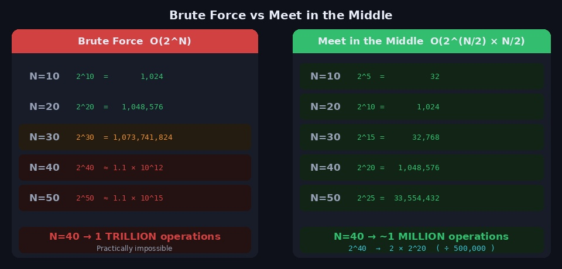
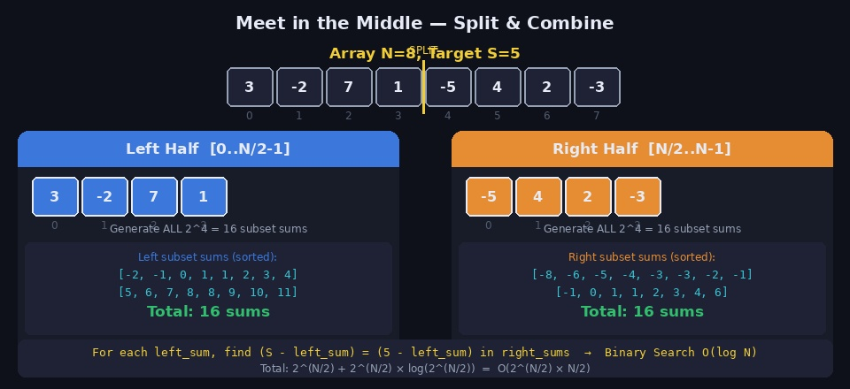
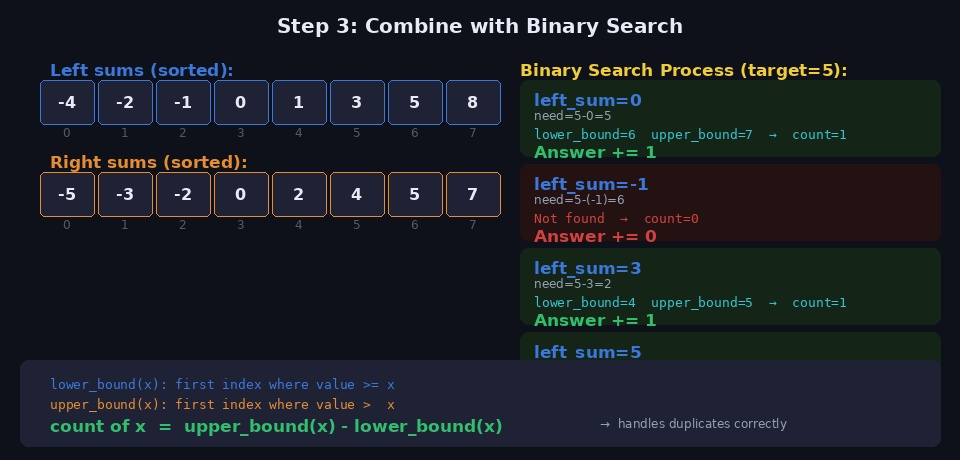
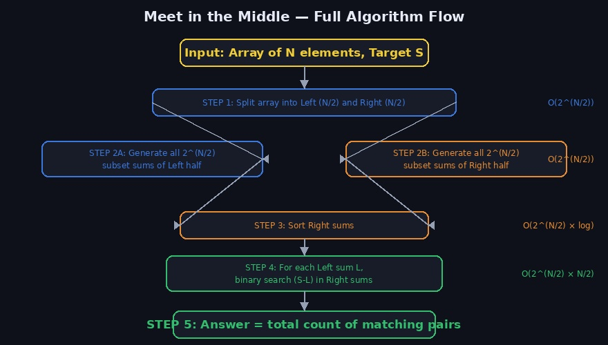
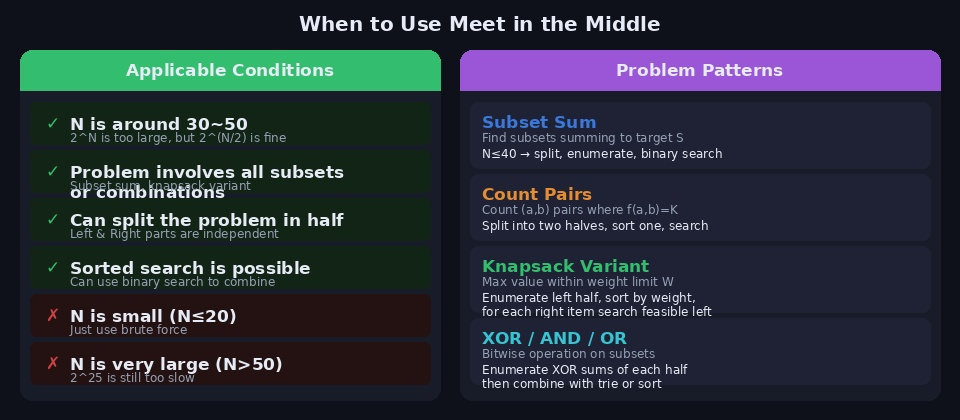

N=40인 부분 수열의 합을 완전 탐색으로 풀면 2^40 ≈ 1조 번의 연산이 필요합니다. 현실적으로 불가능한 수치입니다. **Meet in the Middle(MITM)** 은 이 문제를 배열을 절반으로 나눠 각각 2^20번씩만 탐색하고, 결과를 이진탐색으로 결합해 약 100만 번의 연산으로 해결하는 기법입니다.

---

## 1. 핵심 아이디어



브루트포스는 N개의 원소 각각에 대해 [포함 / 미포함] 을 결정하므로 **2^N** 개의 경우를 탐색합니다.

MITM은 이 탐색 공간을 반으로 가릅니다.

```
전체 N개 배열
    ↓  절반으로 분할
Left N/2개  +  Right N/2개

각각 2^(N/2)번 탐색 후 결합

2^N  →  2 × 2^(N/2) = 2^(N/2 + 1)

N=40 기준:
  브루트포스  2^40 ≈ 1,099,511,627,776  (약 1조)
  MITM       2^20 ≈         1,048,576  (약 100만)
```

이분 탐색과 결합하면 최종 시간복잡도는 **O(2^(N/2) × N/2)** 입니다.

---

## 2. 동작 원리 — 4단계



### 전체 흐름

```
배열 arr, 정수 target S가 주어질 때
부분 수열의 합이 S인 경우의 수 구하기
```

### Step 1. 배열을 절반으로 분할

```python
arr = [3, -2, 7, 1, -5, 4, 2, -3]   # N=8, S=5
mid = len(arr) // 2

left  = arr[:mid]    # [3, -2, 7, 1]
right = arr[mid:]    # [-5, 4, 2, -3]
```

### Step 2. 각 절반의 모든 부분합 생성

왼쪽과 오른쪽 각각 모든 부분 집합(공집합 포함)의 합을 열거합니다.

```python
def get_all_sums(arr):
    """모든 부분 집합의 합을 반환"""
    n = len(arr)
    sums = []
    for mask in range(1 << n):    # 0 ~ 2^n - 1
        total = 0
        for i in range(n):
            if mask >> i & 1:     # i번째 비트가 켜져 있으면 포함
                total += arr[i]
        sums.append(total)
    return sums

left_sums  = get_all_sums(left)   # 2^4 = 16개
right_sums = get_all_sums(right)  # 2^4 = 16개
```

```
left_sums  = [0, 3, -2, 1, 7, 10, 5, 8, 1, 4, -1, 2, 8, 11, 6, 9]
right_sums = [0, -5, 4, -1, 2, -3, 6, 1, -3, -8, 1, -4, -1, -6, 3, -2]
```

### Step 3. 오른쪽 합 정렬

이진탐색을 위해 right_sums를 정렬합니다.

```python
right_sums.sort()
```

### Step 4. 이진탐색으로 결합

각 left_sum `L`에 대해 `S - L`이 right_sums 안에 몇 개 있는지 셉니다.

```python
from bisect import bisect_left, bisect_right

answer = 0
for L in left_sums:
    need = S - L
    lo = bisect_left(right_sums, need)
    hi = bisect_right(right_sums, need)
    answer += hi - lo   # need와 같은 값의 개수
```

---

## 3. 이진탐색 조합 이해



### lower_bound / upper_bound

정렬된 배열에서 특정 값의 개수를 세는 데 두 함수를 사용합니다.

```
lower_bound(x): x 이상인 값이 처음 등장하는 인덱스
upper_bound(x): x 초과인 값이 처음 등장하는 인덱스

x의 개수 = upper_bound(x) - lower_bound(x)
```

```python
# Python의 bisect 모듈이 lower/upper bound를 제공
from bisect import bisect_left, bisect_right

arr = [-3, -1, 0, 2, 2, 5, 7]
x = 2

lo = bisect_left(arr, x)    # 3  (인덱스 3부터 2 이상)
hi = bisect_right(arr, x)   # 5  (인덱스 5부터 2 초과)
count = hi - lo              # 2  (2가 2개)
```

중복된 값을 정확히 처리하기 때문에, 합이 동일한 여러 부분집합이 있어도 올바른 개수를 셀 수 있습니다.

---

## 4. 전체 알고리즘 흐름



---

## 5. Python 완전 구현 — 백준 1208 (부분수열의 합 2)

```python
import sys
from bisect import bisect_left, bisect_right
input = sys.stdin.readline

def get_all_sums(arr):
    """비트마스크로 모든 부분합 열거"""
    n = len(arr)
    sums = []
    for mask in range(1 << n):
        total = 0
        for i in range(n):
            if mask >> i & 1:
                total += arr[i]
        sums.append(total)
    return sums


def solve():
    N, S = map(int, input().split())
    arr = list(map(int, input().split()))
    mid = N // 2

    left  = arr[:mid]
    right = arr[mid:]

    # 각 절반의 모든 부분합 생성
    left_sums  = get_all_sums(left)
    right_sums = get_all_sums(right)
    right_sums.sort()

    answer = 0
    for L in left_sums:
        need = S - L
        lo = bisect_left(right_sums, need)
        hi = bisect_right(right_sums, need)
        answer += hi - lo

    # S=0이면 공집합 쌍(둘 다 0) 1개 제거
    if S == 0:
        answer -= 1

    print(answer)


solve()
```

### S=0 처리 이유

`left_sums`와 `right_sums` 모두 공집합(합=0)을 포함합니다. S=0이면 `(공집합, 공집합)` 쌍이 답에 1개 포함되는데, 이는 아무 원소도 선택하지 않은 경우이므로 제외해야 합니다.

---

## 6. 최적화 — 비트마스크 없이 DFS로 생성

N이 최대 40일 때 비트마스크 방식(`for mask in range(1 << 20)`)은 약 100만 번 루프로 충분히 빠릅니다. 하지만 각 mask에서 내부 루프를 N/2번 도는 것을 DFS로 줄이면 더 빠릅니다.

```python
def get_sums_dfs(arr):
    """DFS로 모든 부분합 생성 — O(2^n)"""
    n = len(arr)
    sums = []

    def dfs(idx, total):
        if idx == n:
            sums.append(total)
            return
        dfs(idx + 1, total)           # 현재 원소 미포함
        dfs(idx + 1, total + arr[idx]) # 현재 원소 포함

    dfs(0, 0)
    return sums
```

---

## 7. 활용 조건과 문제 유형



### 언제 쓰는가?

```
N의 범위가 30~50 사이일 때

2^N → 시간 초과
2^(N/2) → 통과 가능 (약 100만 ~ 3300만)

핵심 조건:
  1. 문제가 "모든 부분집합" 또는 "모든 조합"을 요구
  2. 배열을 독립적으로 두 부분으로 나눌 수 있음
  3. 두 부분의 결과를 정렬 + 이진탐색으로 결합 가능
```

### 대표 유형

**① 부분합 = Target**

```python
# 전형적인 MITM 적용
# 왼쪽 부분합 L, 오른쪽에서 (S-L) 탐색
```

**② 쌍의 개수 (Count Pairs)**

```python
# f(a) + f(b) = K 형태 문제
# 왼쪽 값들 열거 → 정렬
# 오른쪽 값들 열거 → 각각 이진탐색
```

**③ 배낭 변형 (Knapsack)**

```python
# 무게 제한 W, 가치 최대화
# 왼쪽 절반: (무게, 가치) 쌍 생성
# 무게로 정렬 후 같은 무게 중 가치가 낮은 것 제거 (monotone)
# 오른쪽 절반: 각 조합에서 W-weight 이하 최대 가치 이진탐색
```

**④ XOR / 비트 연산**

```python
# 부분집합 XOR 합이 K인 경우
# 왼쪽 XOR 합 열거 → 정렬
# 오른쪽 XOR 합 열거 → K XOR right_val 탐색
```

---

## 8. 배낭 변형 예제 (Knapsack MITM)

```python
def knapsack_mitm(weights, values, W):
    """무게 제한 W 안에서 최대 가치 — O(2^(N/2) × N/2)"""
    n = len(weights)
    mid = n // 2

    def get_pairs(arr_w, arr_v):
        """(무게, 가치) 쌍 전체 열거"""
        m = len(arr_w)
        pairs = []
        for mask in range(1 << m):
            tw, tv = 0, 0
            for i in range(m):
                if mask >> i & 1:
                    tw += arr_w[i]
                    tv += arr_v[i]
            if tw <= W:
                pairs.append((tw, tv))
        return pairs

    left_pairs  = get_pairs(weights[:mid], values[:mid])
    right_pairs = get_pairs(weights[mid:], values[mid:])

    # 오른쪽: 무게로 정렬 후, 같은 무게에서 가치가 낮은 것 제거
    right_pairs.sort()
    filtered = []
    max_val = -1
    for w, v in right_pairs:
        if v > max_val:       # 가치가 증가할 때만 추가 (monotone stack)
            filtered.append((w, v))
            max_val = v
    right_pairs = filtered

    # 왼쪽 각 쌍에 대해 오른쪽에서 W-lw 이하 최대 가치 이진탐색
    from bisect import bisect_right
    ans = 0
    for lw, lv in left_pairs:
        remain = W - lw
        # remain 이하 무게 중 최대 가치 → upper_bound - 1
        idx = bisect_right(right_pairs, (remain, float('inf'))) - 1
        if idx >= 0:
            ans = max(ans, lv + right_pairs[idx][1])

    return ans
```

---

## 9. 주의할 점

### 1. 공집합 처리

```python
# S=0 문제: 공집합 합 = 0이 양쪽 모두 포함됨
# → (공집합, 공집합) 쌍이 1개 추가 계산됨
# → S==0 이면 최종 answer에서 1 빼기

if S == 0:
    answer -= 1
```

### 2. N이 홀수일 때 분할

```python
mid = N // 2
left  = arr[:mid]       # N//2 개
right = arr[mid:]       # N - N//2 개 (더 많을 수 있음)

# 어느 쪽이 더 많아도 동작은 같지만
# 보통 right_sums를 정렬하므로 크기가 비슷한 게 효율적
```

### 3. 메모리 주의

```python
# N=40일 때 각 절반에서 2^20 = 1,048,576개의 합 생성
# 정수 리스트 100만 개 × 8byte = 약 8MB
# 메모리 제한 확인 필요 (보통 256MB ~ 512MB라 문제없음)
```

### 4. 브루트포스와 혼동 주의

```python
# MITM은 두 절반의 결합이 핵심
# 왼쪽 완탐 → 오른쪽 이진탐색 (O)
# 왼쪽 완탐 + 오른쪽 완탐 중첩 (X) → O(4^(N/2)) = O(2^N)으로 동일
```

---

## 10. 시간복잡도 정리

| 단계 | 복잡도 | 설명 |
|------|--------|------|
| 왼쪽 부분합 생성 | O(2^(N/2)) | 모든 부분 집합 열거 |
| 오른쪽 부분합 생성 | O(2^(N/2)) | 모든 부분 집합 열거 |
| 오른쪽 정렬 | O(2^(N/2) × N/2) | 정렬 |
| 이진탐색 결합 | O(2^(N/2) × log(2^(N/2))) | = O(2^(N/2) × N/2) |
| **전체** | **O(2^(N/2) × N/2)** | N=40이면 약 1000만 |

---

## 11. 관련 백준 문제

| 문제 | 난이도 | 핵심 |
|------|--------|------|
| [1208 부분수열의 합 2](https://www.acmicpc.net/problem/1208) | Gold I | MITM 기본 |
| [2185 직사각형의 합](https://www.acmicpc.net/problem/2185) | Platinum III | MITM 응용 |
| [1450 냅색문제](https://www.acmicpc.net/problem/1450) | Gold I | MITM + 배낭 |
| [16493 최대 페이지 수](https://www.acmicpc.net/problem/16493) | Gold I | MITM + 배낭 변형 |

---

## 참고 자료

- [killerwhale0917 블로그 — Meet in the middle](https://killerwhale0917.tistory.com/5)
- [kks227 블로그 — 밋 인 더 미들](https://blog.naver.com/kks227/221382873753)