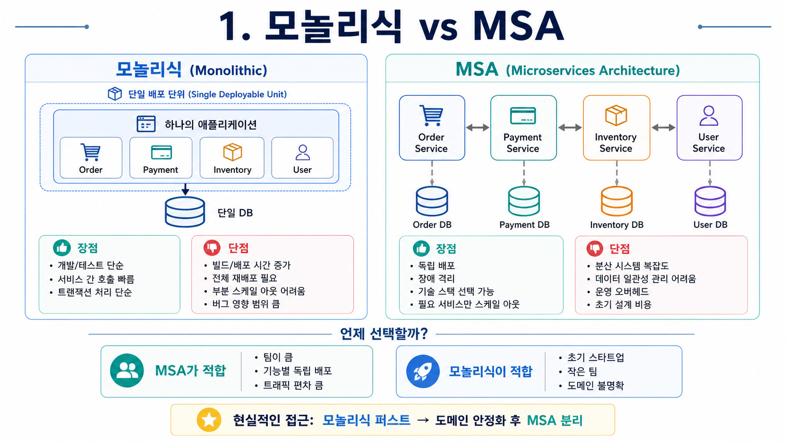
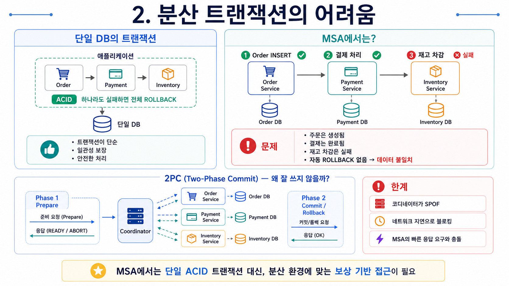
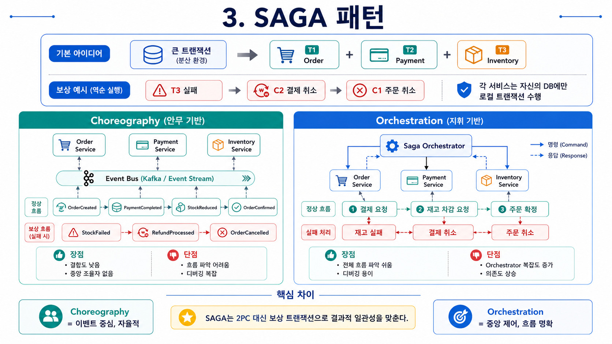
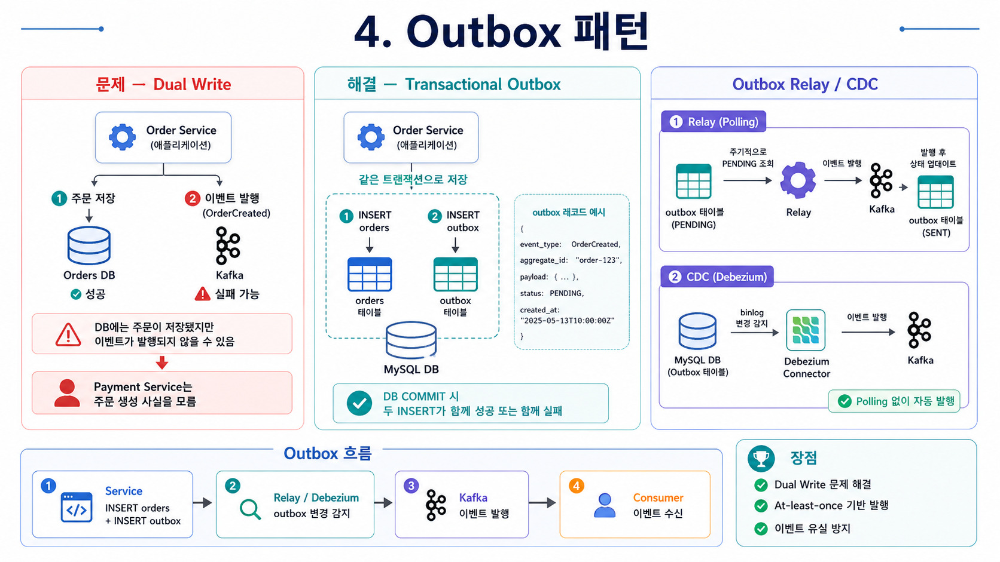
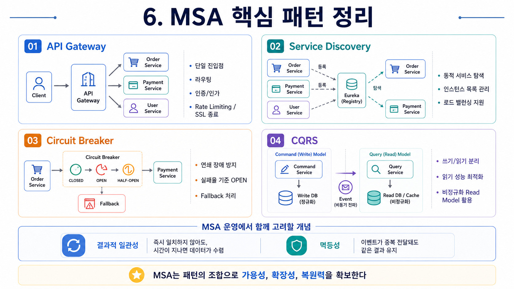

하나의 큰 애플리케이션을 여러 작은 서비스로 나누는 MSA는 독립 배포와 장애 격리라는 명확한 장점이 있습니다. 하지만 서비스가 분리되는 순간 가장 크게 부딪히는 문제가 바로 **"여러 서비스에 걸친 데이터의 일관성"** 입니다. 이 글에서는 MSA의 개념과 분산 트랜잭션 문제를 해결하는 패턴들을 정리합니다.

---

## 1. 모놀리식 vs MSA



### 모놀리식 (Monolithic)

모든 기능이 하나의 배포 단위 안에 있습니다.

```
장점:
  - 개발/테스트가 단순
  - 서비스 간 호출이 메서드 호출 (빠름)
  - 트랜잭션 처리가 단순 (단일 DB)

단점:
  - 코드베이스가 커질수록 빌드/배포 시간 증가
  - 일부 기능만 수정해도 전체 재배포
  - 특정 기능만 스케일 아웃 불가
  - 하나의 버그가 전체 서비스에 영향
```

### MSA (Microservices Architecture)

비즈니스 기능 단위로 서비스를 분리하고 각각 독립적으로 배포합니다.

```
장점:
  - 서비스별 독립 배포 (배포 위험 감소)
  - 장애 격리 (Payment 서비스 장애가 Order에 영향 없음)
  - 서비스별 최적 기술 스택 선택 가능
  - 필요한 서비스만 스케일 아웃

단점:
  - 분산 시스템 복잡도 (네트워크 실패, 타임아웃)
  - 데이터 일관성 관리 어려움 (분산 트랜잭션)
  - 운영 오버헤드 (서비스 수만큼 모니터링, 로깅)
  - 초기 설계 비용
```

### 언제 MSA를 선택하는가?

```
MSA가 적합한 경우:
  - 팀이 크고 서비스별로 독립적으로 개발/배포
  - 특정 기능의 트래픽 편차가 큼 (결제만 스케일 아웃)
  - 서비스별로 다른 기술 스택이 필요

모놀리식이 나은 경우:
  - 초기 스타트업 (빠른 개발 속도가 우선)
  - 팀 규모가 작음
  - 도메인이 아직 불분명
```

> **"모놀리식 퍼스트"** 전략: 처음에는 모놀리식으로 빠르게 개발하고, 도메인이 안정화되면 MSA로 분리하는 것이 현실적인 접근입니다.

---

## 2. 분산 트랜잭션의 어려움



### 단일 DB의 트랜잭션

단일 DB에서는 트랜잭션이 ACID를 보장합니다.

```java
// 단일 DB — 간단하고 안전
@Transactional
public void placeOrder(OrderDto dto) {
    orderRepository.save(new Order(dto));
    paymentRepository.save(new Payment(dto));
    inventoryRepository.reduceStock(dto.itemId());
    // 하나라도 실패하면 전체 ROLLBACK
}
```

### MSA에서는?

서비스별로 **독립된 DB**를 가집니다(Database per Service 패턴). 이 경우 하나의 트랜잭션으로 묶을 수 없습니다.

```
주문 생성 시나리오:
  1. Order Service → Order DB에 INSERT ✅
  2. Payment Service → 결제 처리 ✅
  3. Inventory Service → 재고 차감 ❌ (실패!)

문제:
  - 주문은 생성됐고, 결제도 완료됐는데 재고 차감만 실패
  - 단일 DB처럼 자동 ROLLBACK 없음
  - → 데이터 불일치 (Inconsistency)
```

### 2PC (Two-Phase Commit) — 한계

분산 환경의 트랜잭션을 위해 **2PC(2단계 커밋)** 가 있지만 MSA에서는 잘 쓰지 않습니다.

```
Phase 1 — Prepare:
  코디네이터 → 모든 참여자에게 "커밋 가능?" 질의
  각 참여자 → READY 또는 ABORT 응답

Phase 2 — Commit:
  모두 READY → 코디네이터 "COMMIT"
  하나라도 ABORT → 코디네이터 "ROLLBACK"

한계:
  - 코디네이터가 단일 장애점 (SPOF)
  - 네트워크 지연으로 블로킹 발생
  - MSA 환경의 빠른 응답 요구에 맞지 않음
```

---

## 3. SAGA 패턴

SAGA 패턴은 분산 트랜잭션을 **일련의 로컬 트랜잭션**으로 분해합니다. 각 서비스는 자신의 DB에만 트랜잭션을 수행하고, 다음 단계를 이벤트나 메시지로 트리거합니다.



```
기본 아이디어:
  큰 트랜잭션 T = T1(Order) + T2(Payment) + T3(Inventory)

  각 Ti가 성공 → 다음 Ti+1 트리거
  실패 시 → 이미 완료된 단계에 보상 트랜잭션(Ci) 실행

보상 트랜잭션 (Compensating Transaction):
  T3 실패 → C2(결제 취소) → C1(주문 취소)
```

### 방식 1 — Choreography (안무 기반)

각 서비스가 이벤트를 발행하고, 다음 서비스가 이벤트를 구독해 자율적으로 처리합니다. 중앙 조율자가 없습니다.

```java
// Order Service
@Service
public class OrderService {

    private final KafkaTemplate<String, OrderEvent> kafka;

    @Transactional
    public void createOrder(OrderRequest request) {
        Order order = orderRepository.save(new Order(request));

        // 이벤트 발행 → Payment Service가 구독
        kafka.send("order-events",
            new OrderCreatedEvent(order.getId(), order.getAmount()));
    }
}
```

```java
// Payment Service — OrderCreated 이벤트 구독
@KafkaListener(topics = "order-events")
public void handleOrderCreated(OrderCreatedEvent event) {
    try {
        paymentService.processPayment(event.getOrderId(), event.getAmount());
        // 성공 → PaymentCompleted 이벤트 발행
        kafka.send("payment-events", new PaymentCompletedEvent(event.getOrderId()));
    } catch (Exception e) {
        // 실패 → PaymentFailed 이벤트 발행 → Order Service가 주문 취소
        kafka.send("payment-events", new PaymentFailedEvent(event.getOrderId()));
    }
}
```

```
Choreography 흐름:
  OrderCreated → [Payment Service] → PaymentCompleted
               → [Inventory Service] → StockReduced
               → [Order Service] → OrderConfirmed

보상 흐름 (재고 부족):
  StockFailed → [Payment Service] → RefundProcessed
             → [Order Service] → OrderCancelled
```

**장점**: 서비스 간 결합도 낮음, 중앙 조율자 없음
**단점**: 전체 흐름 파악이 어려움, 디버깅 복잡

### 방식 2 — Orchestration (지휘 기반)

중앙 **Saga Orchestrator**가 각 서비스에 명령을 보내고 응답을 받아 흐름을 제어합니다.

```java
@Component
public class OrderSagaOrchestrator {

    // 상태 머신으로 전체 흐름 관리
    public void startSaga(OrderCreatedEvent event) {
        SagaState state = new SagaState(event.getOrderId());

        try {
            // Step 1: 결제 요청
            state.setStatus(PAYMENT_REQUESTED);
            paymentClient.requestPayment(event.getOrderId(), event.getAmount());

            // Step 2: 재고 차감 요청
            state.setStatus(STOCK_REQUESTED);
            inventoryClient.reduceStock(event.getItemId(), event.getQuantity());

            // 완료
            state.setStatus(COMPLETED);
            orderService.confirmOrder(event.getOrderId());

        } catch (PaymentException e) {
            // 결제 실패 → 주문 취소만
            compensateOrder(event.getOrderId());

        } catch (StockException e) {
            // 재고 실패 → 결제 취소 + 주문 취소
            compensatePayment(event.getOrderId());
            compensateOrder(event.getOrderId());
        }
    }

    // 보상 트랜잭션
    private void compensatePayment(Long orderId) {
        paymentClient.cancelPayment(orderId);
    }
    private void compensateOrder(Long orderId) {
        orderService.cancelOrder(orderId);
    }
}
```

**장점**: 전체 흐름이 한 곳에 있어 파악/디버깅 쉬움
**단점**: Orchestrator가 복잡해지면 병목, 서비스 간 의존도 높아짐

---

## 4. Outbox 패턴

SAGA를 구현할 때 또 다른 문제가 생깁니다. DB에 저장하고 이벤트를 발행하는 **두 가지 작업을 원자적으로 수행하는 것**입니다.



### 문제 — Dual Write

```java
// ❌ 두 작업 중 하나가 실패할 수 있음
@Transactional
public void createOrder(OrderRequest request) {
    orderRepository.save(new Order(request));  // DB 저장
    kafka.send("order-events", new OrderCreatedEvent(...));  // 이벤트 발행

    // 만약 Kafka 발행이 실패하면?
    // DB에는 주문이 생겼지만 이벤트가 없음 → Payment Service 모름
}
```

### 해결 — Transactional Outbox

DB 저장과 이벤트 저장을 **하나의 트랜잭션**으로 묶습니다. 이벤트 발행은 별도 프로세스(Relay)가 담당합니다.

```java
// ✅ Outbox 패턴 적용
@Transactional
public void createOrder(OrderRequest request) {
    // 1. 주문 저장
    Order order = orderRepository.save(new Order(request));

    // 2. 같은 트랜잭션에서 Outbox 테이블에도 이벤트 저장
    outboxRepository.save(OutboxEvent.builder()
        .eventType("OrderCreated")
        .aggregateId(order.getId())
        .payload(toJson(new OrderCreatedEvent(order)))
        .status(EventStatus.PENDING)
        .build());

    // DB COMMIT → 두 INSERT가 동시에 성공 또는 실패
}
```

```sql
-- Outbox 테이블
CREATE TABLE outbox (
    id          BIGINT AUTO_INCREMENT PRIMARY KEY,
    event_type  VARCHAR(100) NOT NULL,
    aggregate_id BIGINT NOT NULL,
    payload     TEXT NOT NULL,
    status      ENUM('PENDING', 'SENT') DEFAULT 'PENDING',
    created_at  DATETIME DEFAULT CURRENT_TIMESTAMP
);
```

### Outbox Relay — 이벤트 발행 담당

```java
// 주기적으로 PENDING 이벤트를 Kafka에 발행
@Scheduled(fixedDelay = 1000)  // 1초마다
public void relayOutboxEvents() {
    List<OutboxEvent> pending = outboxRepository
        .findByStatus(EventStatus.PENDING);

    for (OutboxEvent event : pending) {
        try {
            kafka.send(event.getEventType(), event.getPayload());
            event.setStatus(EventStatus.SENT);
            outboxRepository.save(event);
        } catch (Exception e) {
            log.error("Failed to send event: {}", event.getId(), e);
            // 재시도 → 멱등성(Idempotency) 처리 필요
        }
    }
}
```

### CDC (Change Data Capture) — 더 나은 방법

Polling 방식 대신 **Debezium** 같은 CDC 도구를 사용하면 DB 변경 로그(binlog)를 읽어 자동으로 Kafka에 발행합니다.

```yaml
# Debezium 커넥터 설정 (Docker)
connector.class: io.debezium.connector.mysql.MySqlConnector
database.hostname: mysql
database.port: 3306
table.include.list: mydb.outbox
# outbox 테이블 변경 감지 → Kafka 자동 발행
```

```
Outbox 흐름:
  ① Service: INSERT orders + INSERT outbox (single TX)
  ② Debezium: reads MySQL binlog changes
  ③ Debezium: publishes to Kafka
  ④ Consumer: receives event

장점: 완전한 At-least-once 보장, Polling 없음
```

---

## 5. 멱등성 (Idempotency)

분산 시스템에서 이벤트는 **중복 전달될 수 있습니다** (At-least-once). 같은 이벤트를 두 번 처리해도 결과가 같아야 합니다.

```java
// ❌ 멱등성 없음 — 중복 처리 시 결제 두 번 발생
public void handlePaymentRequest(PaymentRequestEvent event) {
    Payment payment = new Payment(event.getOrderId(), event.getAmount());
    paymentRepository.save(payment);
}

// ✅ 멱등성 보장 — 이미 처리된 이벤트 무시
public void handlePaymentRequest(PaymentRequestEvent event) {
    // 이미 처리된 이벤트인지 확인
    if (paymentRepository.existsByOrderId(event.getOrderId())) {
        log.warn("Duplicate event for orderId: {}", event.getOrderId());
        return;  // 중복 무시
    }

    Payment payment = new Payment(event.getOrderId(), event.getAmount());
    paymentRepository.save(payment);
}
```

---

## 6. MSA 핵심 패턴 정리



### API Gateway

클라이언트의 모든 요청을 받는 단일 진입점입니다.

```
클라이언트 → API Gateway → Order Service
                         → Payment Service
                         → User Service

역할:
  - 라우팅 (URL → 서비스 매핑)
  - 인증/인가 (JWT 검증)
  - Rate Limiting (초당 요청 수 제한)
  - 로드 밸런싱
  - SSL 종료
```

```yaml
# Spring Cloud Gateway 설정
spring:
  cloud:
    gateway:
      routes:
        - id: order-service
          uri: lb://order-service    # Eureka 서비스명
          predicates:
            - Path=/api/orders/**
          filters:
            - AuthFilter             # JWT 검증 필터
```

### Service Discovery (Eureka)

서비스들이 동적으로 서로를 찾는 메커니즘입니다.

```java
// Order Service — Eureka에 등록
@SpringBootApplication
@EnableEurekaClient
public class OrderServiceApplication { ... }

// Payment Service를 호출할 때
@LoadBalanced  // Eureka에서 인스턴스 목록 가져와 로드밸런싱
@Bean
public RestTemplate restTemplate() {
    return new RestTemplate();
}

// lb://payment-service → Eureka에서 실제 IP:PORT로 변환
restTemplate.getForObject("lb://payment-service/api/payments/{id}", Payment.class, id);
```

### Circuit Breaker (Resilience4j)

서비스 장애가 연쇄적으로 퍼지는 것을 막습니다.

```java
@Service
public class OrderService {

    @CircuitBreaker(name = "payment", fallbackMethod = "paymentFallback")
    @TimeLimiter(name = "payment")
    public CompletableFuture<PaymentResult> requestPayment(Long orderId) {
        return CompletableFuture.supplyAsync(() ->
            paymentClient.requestPayment(orderId)
        );
    }

    // Circuit OPEN 시 실행되는 폴백
    public CompletableFuture<PaymentResult> paymentFallback(
            Long orderId, Throwable t) {
        log.error("Payment service unavailable: {}", t.getMessage());
        // 임시 대기열에 넣거나 에러 응답
        return CompletableFuture.completedFuture(
            PaymentResult.pending(orderId)
        );
    }
}
```

```yaml
# Circuit Breaker 설정
resilience4j:
  circuitbreaker:
    instances:
      payment:
        slidingWindowSize: 10          # 최근 10번 요청 기준
        failureRateThreshold: 50       # 50% 실패 시 OPEN
        waitDurationInOpenState: 10s   # 10초 후 HALF-OPEN
```

### CQRS (Command Query Responsibility Segregation)

쓰기(Command)와 읽기(Query) 모델을 분리합니다.

```java
// Command — 쓰기 (정규화된 DB)
@Service
public class OrderCommandService {

    @Transactional
    public Long createOrder(CreateOrderCommand command) {
        Order order = orderRepository.save(new Order(command));
        // 이벤트 발행 → Read Model 업데이트
        eventPublisher.publish(new OrderCreatedEvent(order));
        return order.getId();
    }
}

// Query — 읽기 (비정규화된 Read DB / Cache)
@Service
public class OrderQueryService {

    public OrderDetailDto getOrderDetail(Long orderId) {
        // Redis 캐시 → 없으면 Read DB에서 조회
        return orderReadRepository.findDetailById(orderId);
    }
}
```

---

## 7. 결과적 일관성 (Eventual Consistency)

MSA에서는 ACID 대신 **BASE**를 수용합니다.

| ACID (단일 DB) | BASE (분산 시스템) |
|----------------|-------------------|
| Atomicity | **B**asically Available |
| Consistency | **S**oft State |
| Isolation | **E**ventual Consistency |
| Durability | |

```
결과적 일관성의 의미:
  "지금 당장은 데이터가 불일치할 수 있지만,
   충분한 시간이 지나면 모든 서비스의 데이터가 일치한다."

예시:
  주문 완료 → Order DB에 즉시 반영 ✅
            → Analytics DB 반영 (수 초 후) ⏳
  → 사용자 입장에서 주문은 됐지만
    매출 통계에 즉시 반영 안 될 수 있음
```

---

## 8. 면접 핵심 정리

**Q. MSA에서 분산 트랜잭션을 어떻게 처리하는가?**
2PC는 MSA 환경에서 성능/가용성 문제로 잘 쓰이지 않습니다. 대신 SAGA 패턴을 사용합니다. 각 서비스는 자신의 로컬 트랜잭션만 수행하고, 실패 시 이미 완료된 단계를 되돌리는 보상 트랜잭션을 실행합니다.

**Q. Choreography vs Orchestration의 차이는?**
Choreography는 서비스들이 이벤트를 발행/구독하며 자율적으로 동작합니다. 결합도가 낮지만 전체 흐름 파악이 어렵습니다. Orchestration은 중앙 조율자가 흐름을 제어합니다. 파악과 디버깅이 쉽지만 조율자가 복잡해질 수 있습니다.

**Q. Outbox 패턴은 왜 필요한가?**
DB 저장과 이벤트 발행을 별개의 작업으로 수행하면 둘 중 하나가 실패할 수 있습니다(Dual Write 문제). Outbox 패턴은 이벤트를 DB에 같은 트랜잭션으로 저장하고, 별도 프로세스(Relay/CDC)가 발행을 담당해 원자성을 보장합니다.

**Q. MSA의 단점은?**
분산 시스템 복잡도(네트워크 실패, 타임아웃 처리), 데이터 일관성 관리(SAGA, Outbox), 운영 오버헤드(서비스별 모니터링/로깅/배포)가 주요 단점입니다. 소규모 팀에서는 오히려 모놀리식이 나을 수 있습니다.

---

## 참고 자료

- [마이크로서비스 패턴 (Chris Richardson 저)](https://www.yes24.com/Product/Goods/86542732)
- [microservices.io — Saga Pattern](https://microservices.io/patterns/data/saga.html)
- [microservices.io — Outbox Pattern](https://microservices.io/patterns/data/transactional-outbox.html)
- [Debezium 공식 문서](https://debezium.io/documentation/)
- [Resilience4j 공식 문서](https://resilience4j.readme.io/)