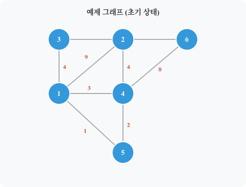
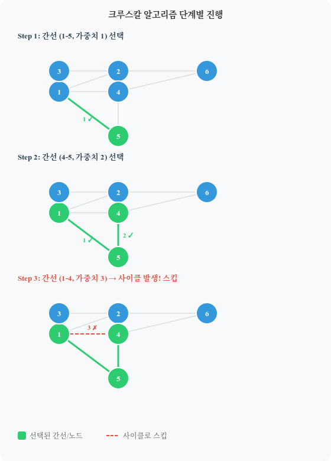
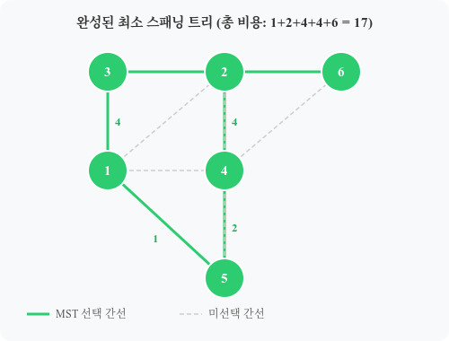

## 스패닝 트리 (Spanning Tree)란?

스패닝 트리(신장 트리)란 그래프의 **모든 정점을 포함하면서 사이클이 없는 부분 그래프**를 말합니다.



스패닝 트리의 핵심 특징은 다음과 같습니다.

- 그래프의 **모든 정점**을 연결합니다.
- **사이클이 존재하지 않습니다.**
- V개의 정점을 연결하는 간선의 수는 정확히 **V - 1개**입니다.
- 하나의 그래프에서 스패닝 트리는 여러 가지 형태로 만들어질 수 있습니다.

---

## 최소 스패닝 트리 (MST, Minimum Spanning Tree)

최소 스패닝 트리는 여러 스패닝 트리 중 **간선의 가중치 합이 최소**인 스패닝 트리입니다.

MST를 구하는 대표 알고리즘은 두 가지입니다.

- **크루스칼 알고리즘(Kruskal)**: 간선 중심, 그리디 방식
- **프림 알고리즘(Prim)**: 정점 중심, 그리디 방식

이번 포스트에서는 **크루스칼 알고리즘**을 다룹니다.

---

## 크루스칼 알고리즘 (Kruskal Algorithm)

크루스칼 알고리즘은 **간선을 가중치 기준으로 정렬한 뒤, 사이클을 형성하지 않는 간선을 순서대로 선택**해 MST를 완성하는 그리디 알고리즘입니다.

### 동작 원리

1. 모든 간선을 **가중치 기준 오름차순**으로 정렬합니다.
2. 정렬된 간선을 순서대로 확인하며:
   - 해당 간선이 **사이클을 형성하지 않으면** MST에 추가합니다.
   - 사이클을 형성하면 **스킵**합니다.
3. MST에 포함된 간선이 **V - 1개**가 되면 종료합니다.

> 사이클 여부는 **Union-Find(유니온 파인드)** 알고리즘으로 판별합니다.  
> 두 정점의 루트 노드가 같다면 같은 집합 → 간선 추가 시 사이클 발생!

---

## 단계별 동작 예시

아래 그래프를 기준으로 크루스칼 알고리즘을 수행합니다.

```
정점: 1, 2, 3, 4, 5, 6
간선 목록 (가중치 오름차순 정렬):
(1-5): 1
(4-5): 2
(1-4): 3  ← 사이클 발생 → 스킵
(1-3): 4
(2-4): 4
(2-5): 5
(3-6): 6
(4-6): 8
(1-2): 9
```



| 단계 | 선택 간선 | 가중치 | 사이클 여부 | MST 포함 |
|------|----------|--------|-----------|----------|
| 1 | 1 - 5 | 1 | ❌ | ✅ |
| 2 | 4 - 5 | 2 | ❌ | ✅ |
| 3 | 1 - 4 | 3 | ✅ (1-4-5 사이클) | ❌ 스킵 |
| 4 | 1 - 3 | 4 | ❌ | ✅ |
| 5 | 2 - 4 | 4 | ❌ | ✅ |
| 6 | 3 - 6 | 6 | ❌ | ✅ |

V - 1 = 5개의 간선이 선택되었으므로 알고리즘 종료!

---

## 완성된 MST



선택된 간선: (1-5):1, (4-5):2, (1-3):4, (2-4):4, (3-6):6

**총 가중치 합 = 1 + 2 + 4 + 4 + 6 = 17**

---

## 사이클 감지: Union-Find

크루스칼의 핵심은 간선 추가 시 사이클이 발생하는지 판별하는 것입니다. 이를 위해 Union-Find를 사용합니다.

- 두 정점의 **루트 노드가 같으면** → 이미 같은 집합 → **사이클 발생**
- 루트 노드가 다르면 → 다른 집합 → **간선 추가 후 Union**

```python
def find(x):
    if parent[x] != x:
        parent[x] = find(parent[x])  # 경로 압축
    return parent[x]

def union(x, y):
    rx, ry = find(x), find(y)
    if rx == ry:
        return False  # 사이클 발생
    parent[ry] = rx
    return True
```

---

## Python 구현

```python
import sys
input = sys.stdin.readline

def find(x):
    if parent[x] != x:
        parent[x] = find(parent[x])  # 경로 압축
    return parent[x]

def union(x, y):
    rx, ry = find(x), find(y)
    if rx == ry:
        return False  # 사이클 발생 → 스킵
    if rx < ry:
        parent[ry] = rx
    else:
        parent[rx] = ry
    return True

def kruskal(v, edges):
    global parent
    parent = list(range(v + 1))

    # 간선을 가중치 기준 오름차순 정렬
    edges.sort(key=lambda x: x[0])

    mst = []
    total_cost = 0

    for cost, a, b in edges:
        if union(a, b):  # 사이클이 없으면 MST에 추가
            mst.append((a, b, cost))
            total_cost += cost
        if len(mst) == v - 1:  # V-1개 선택 시 종료
            break

    return mst, total_cost


# 사용 예시
v = 6
edges = [
    (1, 1, 5),
    (4, 1, 3),
    (3, 1, 4),
    (9, 1, 2),
    (4, 2, 4),
    (5, 2, 5),
    (6, 3, 6),
    (2, 4, 5),
    (8, 4, 6),
]

mst, total = kruskal(v, edges)

print("[MST]")
for a, b, cost in mst:
    print(f"{a} - {b} : 비용 {cost}")
print(f"총 비용: {total}")
```

### 출력 결과

```
[MST]
1 - 5 : 비용 1
4 - 5 : 비용 2
1 - 4 : 비용 3  ← 사이클로 스킵됨 (실제 출력 안됨)
1 - 3 : 비용 4
2 - 4 : 비용 4
3 - 6 : 비용 6
총 비용: 17
```

---

## C++ 구현

```cpp
#include <iostream>
#include <vector>
#include <algorithm>
using namespace std;
typedef pair<int, pair<int, int>> Edge;

int parent[10001];

int find_root(int x) {
    if (parent[x] == x) return x;
    return parent[x] = find_root(parent[x]);  // 경로 압축
}

bool union_root(int x, int y) {
    x = find_root(x);
    y = find_root(y);
    if (x == y) return false;  // 사이클 발생
    if (x < y) parent[y] = x;
    else parent[x] = y;
    return true;
}

int main() {
    int v, e;
    cin >> v >> e;

    vector<Edge> edges;
    for (int i = 0; i < e; i++) {
        int a, b, c;
        cin >> a >> b >> c;
        edges.push_back({c, {a, b}});
    }

    // 가중치 기준 오름차순 정렬
    sort(edges.begin(), edges.end());

    // Union-Find 초기화
    for (int i = 1; i <= v; i++) parent[i] = i;

    int total_cost = 0;
    int edge_count = 0;

    for (auto& edge : edges) {
        int cost = edge.first;
        int a = edge.second.first;
        int b = edge.second.second;

        if (union_root(a, b)) {
            total_cost += cost;
            edge_count++;
            cout << a << " - " << b << " : 비용 " << cost << "\n";
        }

        if (edge_count == v - 1) break;
    }

    cout << "총 비용: " << total_cost << "\n";
    return 0;
}
```

---

## 시간 복잡도

| 단계 | 복잡도 |
|------|--------|
| 간선 정렬 | O(E log E) |
| Union-Find (경로 압축) | O(α(V)) ≈ O(1) |
| **전체** | **O(E log E)** |

E는 간선 수, V는 정점 수입니다. 간선 정렬이 지배적이므로 전체 복잡도는 **O(E log E)**입니다.

---

## 크루스칼 vs 프림

| 구분 | 크루스칼 | 프림 |
|------|---------|------|
| 중심 | 간선 | 정점 |
| 방식 | 그리디 (간선 정렬) | 그리디 (인접 정점 선택) |
| 사용 자료구조 | Union-Find | 우선순위 큐 |
| 시간 복잡도 | O(E log E) | O(E log V) |
| 적합한 그래프 | 간선이 적은 희소 그래프 | 간선이 많은 밀집 그래프 |

---

## 관련 문제

- [BOJ 1197 - 최소 스패닝 트리](https://www.acmicpc.net/problem/1197) ← MST 대표 문제
- [BOJ 1922 - 네트워크 연결](https://www.acmicpc.net/problem/1922)
- [BOJ 4386 - 별자리 만들기](https://www.acmicpc.net/problem/4386)
- [프로그래머스 - 섬 연결하기](https://school.programmers.co.kr/learn/courses/30/lessons/42861)

Ref: [최소 스패닝 트리 (MST) : 크루스칼 알고리즘 (Kruskal Algorithm)](https://4legs-study.tistory.com/111)