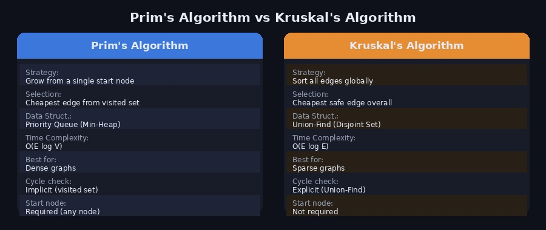
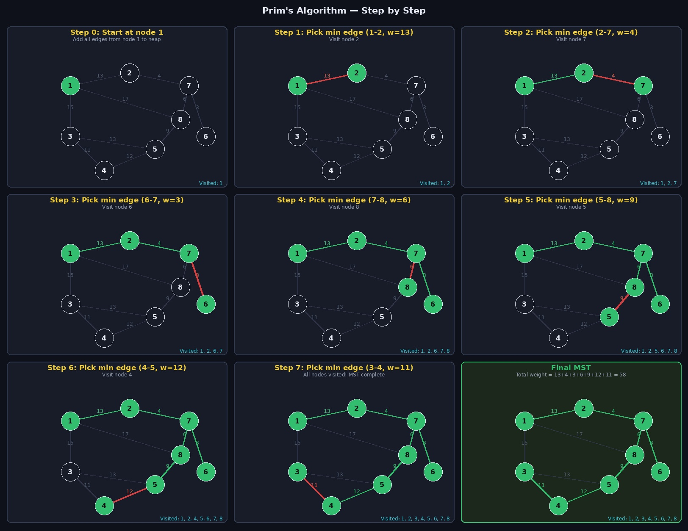
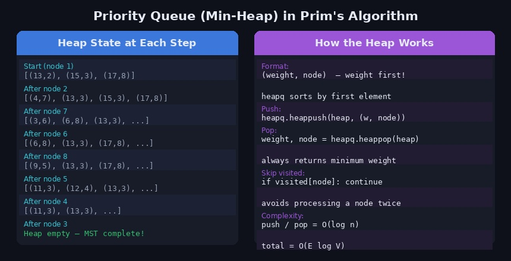

[이전 포스트](/mst-kruskal)에서 크루스칼 알고리즘으로 최소 신장 트리(MST)를 구하는 방법을 정리했습니다. 이번에는 같은 MST 문제를 다른 방식으로 접근하는 **프림 알고리즘(Prim's Algorithm)** 을 정리합니다.

---

## 최소 신장 트리(MST) 복습

**신장 트리(Spanning Tree)** 란 그래프의 모든 노드를 포함하면서 사이클이 없는 트리입니다. 이 중에서 간선 가중치의 합이 가장 작은 것을 **최소 신장 트리(Minimum Spanning Tree, MST)** 라고 합니다.

MST의 조건:
- 그래프의 **모든 노드**를 포함한다
- **사이클**이 존재하지 않는다
- 간선의 수는 정확히 **노드 수 - 1**개이다

---

## 프림 알고리즘이란?

프림 알고리즘은 **임의의 노드에서 시작**해서, 현재까지 방문한 노드 집합에서 연결된 간선 중 **가중치가 가장 작은 간선**을 반복적으로 선택해 MST를 확장해 나가는 알고리즘입니다.

> 핵심 아이디어: "지금 닿을 수 있는 곳 중 가장 가까운 곳으로 한 발씩 나아간다"

**그리디(Greedy) 알고리즘**의 일종으로, 매 단계에서 최선의 선택(최소 가중치 간선)을 반복합니다.

---

## 프림 vs 크루스칼



두 알고리즘 모두 MST를 구하지만 접근 방식이 다릅니다.

| | 프림 | 크루스칼 |
|---|---|---|
| 전략 | 노드 중심 — 방문 집합을 확장 | 간선 중심 — 전체 간선을 정렬 후 선택 |
| 자료구조 | 우선순위 큐 (최소 힙) | 유니온 파인드 |
| 시간복잡도 | O(E log V) | O(E log E) |
| 유리한 경우 | 밀집 그래프 (간선이 많을 때) | 희소 그래프 (간선이 적을 때) |
| 사이클 처리 | 방문 배열로 묵시적 처리 | 유니온 파인드로 명시적 처리 |

---

## 동작 원리 — 단계별 시각화

아래 그래프를 예시로 사용합니다. (노드 8개, 간선 10개)

```
입력:
8 10
1 2 13
1 3 15
1 8 17
2 7 4
3 4 11
3 5 13
4 5 12
5 8 9
6 7 3
7 8 6
```



각 단계를 정리하면 다음과 같습니다.

| 단계 | 선택 간선 | 가중치 | 방문 노드 추가 |
|------|-----------|--------|---------------|
| 0 | 시작 | — | 1 |
| 1 | 1 — 2 | 13 | 2 |
| 2 | 2 — 7 | 4 | 7 |
| 3 | 6 — 7 | 3 | 6 |
| 4 | 7 — 8 | 6 | 8 |
| 5 | 5 — 8 | 9 | 5 |
| 6 | 4 — 5 | 12 | 4 |
| 7 | 3 — 4 | 11 | 3 |

**최종 MST 총 가중치: 13 + 4 + 3 + 6 + 9 + 12 + 11 = 58**

> 시작 노드가 달라져도 결과 MST는 항상 동일합니다.

---

## 우선순위 큐(최소 힙) 활용

프림 알고리즘의 핵심은 "현재 닿을 수 있는 간선 중 가장 가중치가 작은 것"을 빠르게 뽑는 것입니다. 이를 위해 **최소 힙(Min-Heap)** 을 사용합니다.



힙에는 `(가중치, 노드)` 형태로 저장합니다. 가중치를 첫 번째 원소로 넣어야 `heapq`가 가중치 기준으로 정렬합니다.

```python
import heapq

heap = []
heapq.heappush(heap, (13, 2))  # 가중치 13, 노드 2
heapq.heappush(heap, (4,  7))  # 가중치 4,  노드 7
heapq.heappush(heap, (15, 3))  # 가중치 15, 노드 3

weight, node = heapq.heappop(heap)
# → weight=4, node=7  (최솟값 먼저 꺼냄)
```

---

## Python 구현

### 기본 구현

```python
import sys
import heapq

input = sys.stdin.readline

def prim(start):
    visited[start] = True
    route = [start]
    heap = graph[start][:]     # 시작 노드의 인접 간선을 힙에 삽입
    heapq.heapify(heap)        # 리스트를 힙으로 변환
    total_weight = 0

    while heap:
        weight, node = heapq.heappop(heap)

        if visited[node]:      # 이미 방문한 노드는 건너뜀
            continue

        visited[node] = True
        route.append(node)
        total_weight += weight

        for edge in graph[node]:
            if not visited[edge[1]]:
                heapq.heappush(heap, edge)

    return route, total_weight


v, e = map(int, input().split())
graph   = [[] for _ in range(v + 1)]
visited = [False] * (v + 1)

for _ in range(e):
    u, w, weight = map(int, input().split())
    # 무방향 그래프 — 양방향 모두 저장
    graph[u].append([weight, w])
    graph[w].append([weight, u])

route, total = prim(1)
print(f"방문 순서: {route}")
print(f"MST 총 가중치: {total}")

# 출력:
# 방문 순서: [1, 2, 7, 6, 8, 5, 4, 3]
# MST 총 가중치: 58
```

### 코드 흐름 정리

```
1. 시작 노드를 visited 처리하고, 인접 간선을 모두 힙에 넣는다
2. 힙에서 (최소 가중치, 노드)를 꺼낸다
3. 이미 방문한 노드면 skip
4. 방문하지 않은 노드면:
   a. visited 처리
   b. 가중치를 누적
   c. 해당 노드의 인접 간선 중 미방문 노드만 힙에 추가
5. 힙이 빌 때까지 2~4를 반복
```

---

## 시간복잡도 분석

| 연산 | 횟수 | 비용 |
|------|------|------|
| 힙 삽입 (heappush) | 최대 E번 | O(log E) |
| 힙 추출 (heappop) | 최대 E번 | O(log E) |
| **전체** | | **O(E log E) ≈ O(E log V)** |

E ≤ V² 이므로 log E ≤ 2 log V, 따라서 O(E log E) = O(E log V)로 표기합니다.

---

## 주의할 점

**1. 간선 저장 형식 — 가중치를 반드시 첫 번째로**

```python
# ✅ 올바른 형태 — heapq가 가중치 기준으로 정렬
graph[u].append([weight, v])

# ❌ 잘못된 형태 — 노드 번호 기준으로 정렬됨
graph[u].append([v, weight])
```

**2. 방문 체크로 사이클 방지**

```python
# heappop 후 반드시 visited 확인
weight, node = heapq.heappop(heap)
if visited[node]:
    continue  # 이미 MST에 포함된 노드 — 건너뜀
```

**3. 무방향 그래프 처리**

```python
# 양쪽 방향 모두 저장
graph[u].append([weight, v])
graph[v].append([weight, u])
```

---

## 백준 관련 문제

프림 알고리즘을 연습할 수 있는 문제들입니다.

| 문제 | 난이도 | 설명 |
|------|--------|------|
| [1197 최소 스패닝 트리](https://www.acmicpc.net/problem/1197) | Gold IV | MST 기본 문제 — 프림 또는 크루스칼 |
| [1922 네트워크 연결](https://www.acmicpc.net/problem/1922) | Gold IV | 1197과 동일한 유형 |
| [4386 별자리 만들기](https://www.acmicpc.net/problem/4386) | Gold III | 좌표 기반 MST |

Ref: [프림 알고리즘(Prim's Algorithm)](https://koosco.tistory.com/entry/Python-%ED%94%84%EB%A6%BC-%EC%95%8C%EA%B3%A0%EB%A6%AC%EC%A6%98Prims-Algorithm)