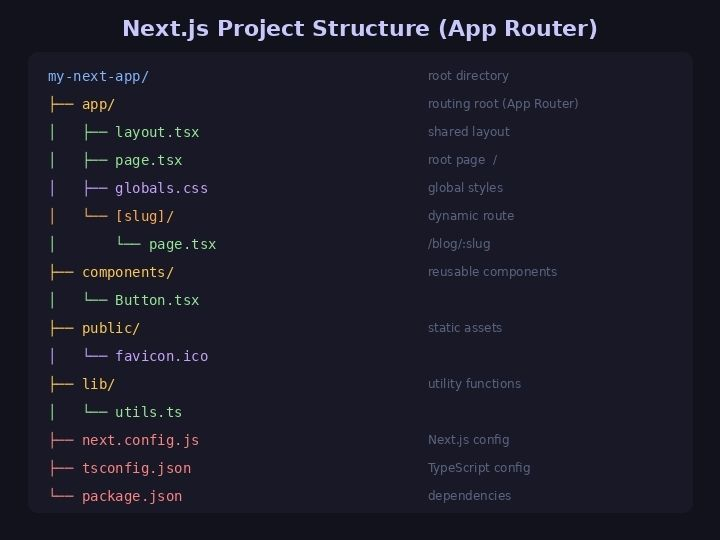
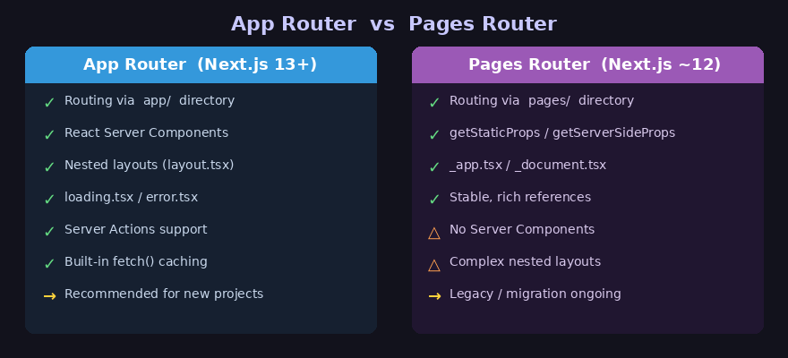
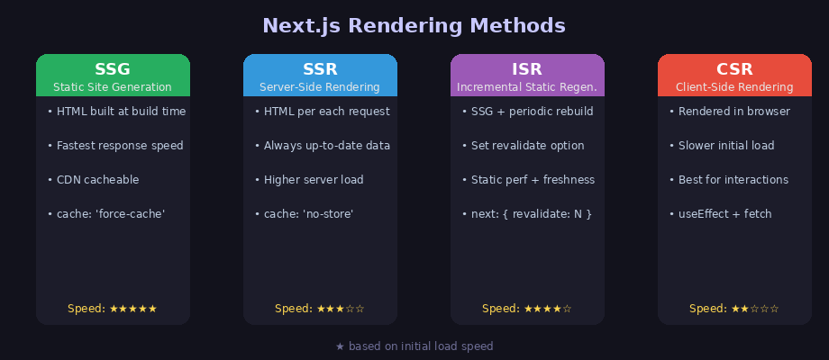

Next.js는 React 기반의 풀스택 웹 프레임워크로, **SSR(서버사이드 렌더링), SSG(정적 사이트 생성), API Routes** 등을 기본적으로 지원합니다. Vercel이 개발하고 있으며, 현재 가장 많이 사용되는 React 프레임워크 중 하나입니다.

---

## 왜 Next.js를 사용하는가?

순수 React(CRA)는 클라이언트에서만 렌더링되는 SPA 방식이라 아래와 같은 문제가 있습니다.

- **SEO 취약**: 초기 HTML이 비어 있어 검색 엔진이 콘텐츠를 읽기 어려움
- **느린 초기 로딩**: JS 번들을 모두 내려받은 후에야 화면이 그려짐
- **API 서버 별도 필요**: 백엔드 기능을 위해 Express 등 별도 서버 구성 필요

Next.js는 이 문제를 서버에서 HTML을 미리 생성하는 방식으로 해결합니다.

---

## 초기 세팅

```bash
# 프로젝트 생성 (App Router, TypeScript 기준)
npx create-next-app@latest my-app
cd my-app
npm run dev
```

설치 시 대화형 옵션이 나타납니다:

```
Would you like to use TypeScript?  → Yes
Would you like to use ESLint?      → Yes
Would you like to use Tailwind CSS? → 선택
Would you like to use App Router?  → Yes (권장)
```

---

## 프로젝트 구조



```
my-next-app/
├── app/                  ← App Router 루트
│   ├── layout.tsx        ← 전체 공통 레이아웃
│   ├── page.tsx          ← 루트 페이지 (/)
│   ├── globals.css
│   └── [slug]/           ← 동적 라우트
│       └── page.tsx
├── components/           ← 재사용 컴포넌트
├── public/               ← 정적 파일 (이미지, favicon 등)
├── lib/                  ← 유틸 함수, API 호출
├── next.config.js        ← Next.js 설정
├── tsconfig.json
└── package.json
```

---

## App Router vs Pages Router



Next.js 13부터 도입된 **App Router**가 현재 공식 권장 방식입니다.

| 구분 | App Router | Pages Router |
|------|-----------|-------------|
| 디렉토리 | `app/` | `pages/` |
| 기본 컴포넌트 | Server Component | Client Component |
| 레이아웃 | `layout.tsx` 중첩 | `_app.tsx` 단일 |
| 데이터 패칭 | `fetch()` 직접 사용 | `getStaticProps` 등 |
| 로딩/에러 처리 | `loading.tsx`, `error.tsx` | 직접 구현 |

---

## 라우팅 (App Router 기준)

Next.js는 **파일 시스템 기반 라우팅**을 사용합니다. 폴더 구조가 곧 URL 구조입니다.

### 기본 라우팅

```
app/
├── page.tsx          →  /
├── about/
│   └── page.tsx      →  /about
└── blog/
    └── page.tsx      →  /blog
```

### 동적 라우팅

```
app/
└── blog/
    └── [slug]/
        └── page.tsx  →  /blog/:slug
```

```tsx
// app/blog/[slug]/page.tsx
interface Props {
  params: { slug: string }
}

export default function BlogPost({ params }: Props) {
  return <h1>포스트: {params.slug}</h1>
}
```

### 중첩 레이아웃

```tsx
// app/layout.tsx — 모든 페이지에 적용되는 루트 레이아웃
export default function RootLayout({ children }: { children: React.ReactNode }) {
  return (
    <html lang="ko">
      <body>
        <header>공통 헤더</header>
        <main>{children}</main>
        <footer>공통 푸터</footer>
      </body>
    </html>
  )
}
```

### 특수 파일

| 파일명 | 역할 |
|--------|------|
| `page.tsx` | 해당 경로의 UI |
| `layout.tsx` | 공통 레이아웃 (children 포함) |
| `loading.tsx` | 로딩 중 표시할 UI |
| `error.tsx` | 에러 발생 시 표시할 UI |
| `not-found.tsx` | 404 페이지 |

---

## 렌더링 방식



### SSG (Static Site Generation)

빌드 시 HTML을 미리 생성합니다. 가장 빠르고 CDN 캐싱이 가능합니다.

```tsx
// App Router에서의 SSG (기본값)
// fetch 시 cache: 'force-cache'가 기본
async function getData() {
  const res = await fetch('https://api.example.com/posts', {
    cache: 'force-cache'  // SSG: 빌드 시 한 번만 fetch
  })
  return res.json()
}

export default async function Page() {
  const data = await getData()
  return <div>{data.title}</div>
}
```

### SSR (Server-Side Rendering)

요청마다 서버에서 HTML을 생성합니다. 항상 최신 데이터를 보여줄 수 있습니다.

```tsx
// App Router에서의 SSR
async function getData() {
  const res = await fetch('https://api.example.com/posts', {
    cache: 'no-store'  // SSR: 매 요청마다 새로 fetch
  })
  return res.json()
}

export default async function Page() {
  const data = await getData()
  return <div>{data.title}</div>
}
```

### ISR (Incremental Static Regeneration)

SSG로 생성된 페이지를 주기적으로 재생성합니다. 정적 성능 + 데이터 최신성을 모두 잡을 수 있습니다.

```tsx
// App Router에서의 ISR
async function getData() {
  const res = await fetch('https://api.example.com/posts', {
    next: { revalidate: 60 }  // 60초마다 재생성
  })
  return res.json()
}

export default async function Page() {
  const data = await getData()
  return <div>{data.title}</div>
}
```

### CSR (Client-Side Rendering)

브라우저에서 데이터를 직접 fetch합니다. 자주 변경되는 인터랙티브한 UI에 적합합니다.

```tsx
'use client'  // Client Component 선언 필수

import { useState, useEffect } from 'react'

export default function Page() {
  const [data, setData] = useState(null)

  useEffect(() => {
    fetch('/api/posts')
      .then(res => res.json())
      .then(setData)
  }, [])

  if (!data) return <p>로딩 중...</p>
  return <div>{data.title}</div>
}
```

---

## Server Component vs Client Component

App Router의 가장 큰 특징은 기본적으로 모든 컴포넌트가 **Server Component**라는 점입니다.

| 구분 | Server Component | Client Component |
|------|-----------------|-----------------|
| 선언 | 기본값 (별도 선언 없음) | `'use client'` 선언 필요 |
| 실행 환경 | 서버 | 브라우저 |
| DB/파일 접근 | ✅ 가능 | ❌ 불가 |
| useState/useEffect | ❌ 불가 | ✅ 가능 |
| 이벤트 핸들러 | ❌ 불가 | ✅ 가능 |
| 번들 크기 | JS 번들에 미포함 | JS 번들에 포함 |

```tsx
// Server Component (기본값) — DB 직접 접근 가능
async function UserProfile() {
  const user = await db.user.findUnique({ where: { id: 1 } })
  return <p>{user.name}</p>
}

// Client Component — 인터랙션 처리 가능
'use client'
import { useState } from 'react'

function Counter() {
  const [count, setCount] = useState(0)
  return <button onClick={() => setCount(c => c + 1)}>{count}</button>
}
```

---

## API Routes

Next.js는 백엔드 API도 같은 프로젝트에서 작성할 수 있습니다.

```tsx
// app/api/posts/route.ts
import { NextRequest, NextResponse } from 'next/server'

// GET /api/posts
export async function GET(request: NextRequest) {
  const posts = [
    { id: 1, title: '첫 번째 포스트' },
    { id: 2, title: '두 번째 포스트' },
  ]
  return NextResponse.json(posts)
}

// POST /api/posts
export async function POST(request: NextRequest) {
  const body = await request.json()
  // DB 저장 로직
  return NextResponse.json({ message: '생성 완료', data: body }, { status: 201 })
}
```

---

## 이미지 최적화

Next.js의 `<Image>` 컴포넌트는 자동으로 이미지를 최적화합니다.

```tsx
import Image from 'next/image'

export default function Page() {
  return (
    <Image
      src="/profile.jpg"      // public/ 폴더 기준
      alt="프로필 이미지"
      width={500}
      height={300}
      priority                // LCP 이미지에 사용
    />
  )
}
```

- 자동 WebP/AVIF 변환
- 뷰포트 기반 lazy loading
- CLS(레이아웃 이동) 방지를 위한 사전 크기 지정

---

## 링크와 내비게이션

```tsx
import Link from 'next/link'
import { useRouter } from 'next/navigation'  // App Router

export default function Nav() {
  const router = useRouter()

  return (
    <nav>
      {/* 정적 링크 */}
      <Link href="/about">소개</Link>
      <Link href="/blog">블로그</Link>

      {/* 프로그래매틱 이동 */}
      <button onClick={() => router.push('/dashboard')}>
        대시보드로
      </button>
    </nav>
  )
}
```

---

## 환경 변수

```bash
# .env.local
DATABASE_URL=postgres://...
NEXT_PUBLIC_API_URL=https://api.example.com  # 클라이언트에서도 접근 가능
SECRET_KEY=my-secret                          # 서버에서만 접근 가능
```

```tsx
// 서버에서만 사용
const db = process.env.DATABASE_URL

// 클라이언트에서 사용 (NEXT_PUBLIC_ 접두사 필수)
const apiUrl = process.env.NEXT_PUBLIC_API_URL
```

---

## 미들웨어

요청이 처리되기 전에 실행되는 코드로, 인증 체크나 리다이렉션에 활용합니다.

```tsx
// middleware.ts (루트에 위치)
import { NextResponse } from 'next/server'
import type { NextRequest } from 'next/server'

export function middleware(request: NextRequest) {
  const token = request.cookies.get('token')

  // 로그인 안 된 경우 로그인 페이지로 리다이렉트
  if (!token && request.nextUrl.pathname.startsWith('/dashboard')) {
    return NextResponse.redirect(new URL('/login', request.url))
  }

  return NextResponse.next()
}

export const config = {
  matcher: ['/dashboard/:path*'],  // 적용할 경로
}
```

---

## next.config.js 주요 설정

```js
/** @type {import('next').NextConfig} */
const nextConfig = {
  // 외부 이미지 도메인 허용
  images: {
    remotePatterns: [
      {
        protocol: 'https',
        hostname: 'example.com',
      },
    ],
  },

  // 리다이렉트 설정
  async redirects() {
    return [
      {
        source: '/old-path',
        destination: '/new-path',
        permanent: true,
      },
    ]
  },

  // 환경 변수 노출
  env: {
    APP_VERSION: '1.0.0',
  },
}

module.exports = nextConfig
```

---

## 배포

Next.js 프로젝트는 여러 환경에 배포할 수 있습니다.

**Vercel (권장, 무료)**
```bash
npm install -g vercel
vercel
```

**직접 서버 배포**
```bash
npm run build   # 프로덕션 빌드
npm run start   # 서버 실행
```

**Docker**
```dockerfile
FROM node:18-alpine
WORKDIR /app
COPY package*.json ./
RUN npm install
COPY . .
RUN npm run build
EXPOSE 3000
CMD ["npm", "start"]
```

---

## 관련 공식 문서

- [Next.js 공식 문서](https://nextjs.org/docs)
- [Next.js App Router 가이드](https://nextjs.org/docs/app)
- [Vercel 배포 가이드](https://vercel.com/docs)

Ref: Claude AI