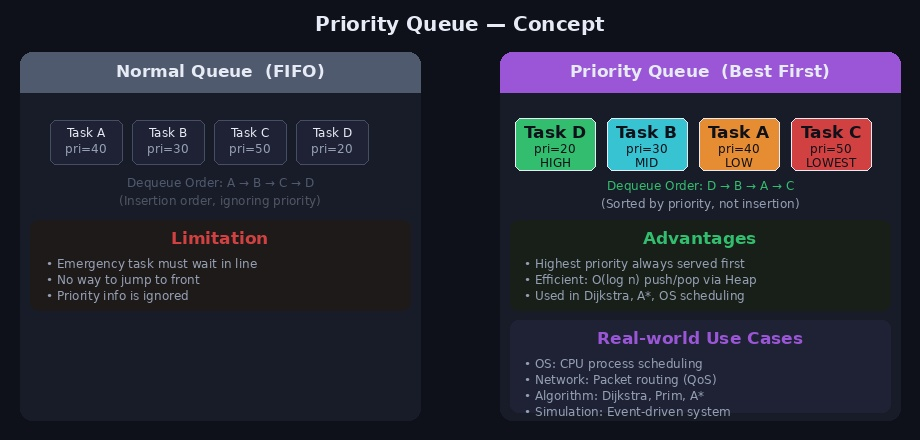
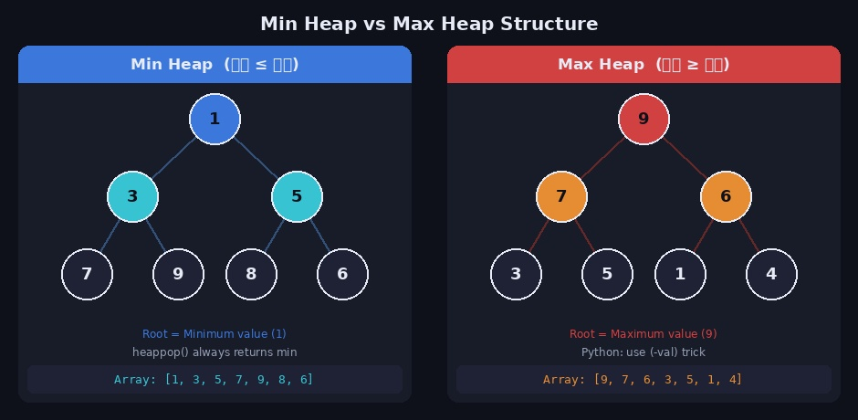
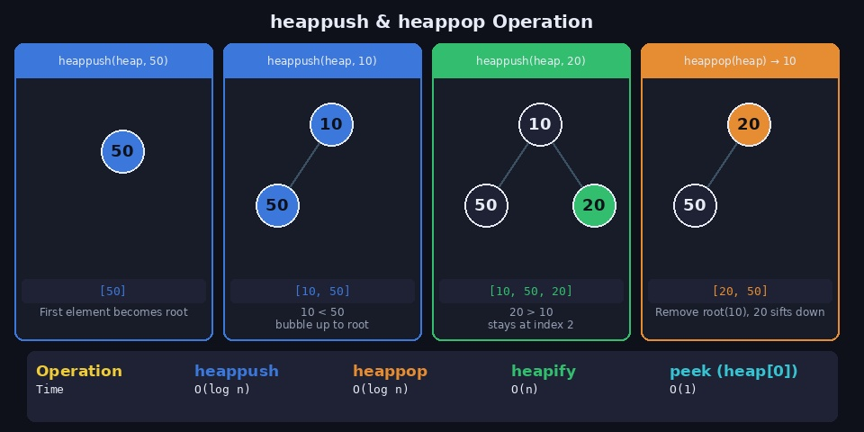
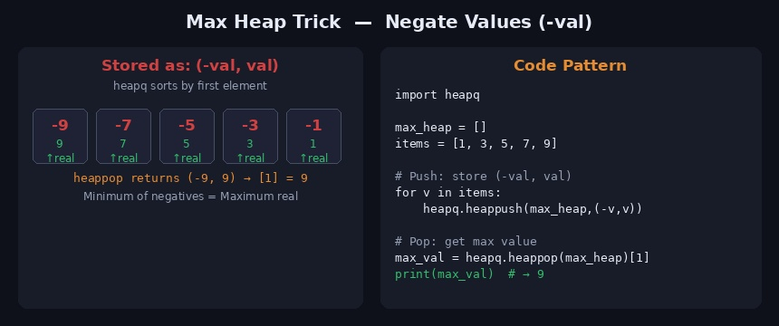

일반 큐(Queue)는 먼저 들어온 것이 먼저 나가는 FIFO 구조입니다. 하지만 응급실에서 환자를 접수 순서가 아닌 **증상의 심각도** 기준으로 처리하듯이, 현실에서는 우선순위가 높은 것을 먼저 처리해야 하는 상황이 많습니다. 이런 요구를 해결하는 자료구조가 **우선순위 큐**이고, 이를 효율적으로 구현하는 것이 **힙(Heap)** 입니다.

---

## 1. 우선순위 큐 (Priority Queue)



**우선순위 큐**는 들어온 순서와 관계없이 **우선순위가 높은 원소가 먼저 나오는** 자료구조입니다.

### 일반 큐와의 차이

| | 일반 큐 (Queue) | 우선순위 큐 (Priority Queue) |
|--|----------------|------------------------------|
| 출력 순서 | 삽입 순서 (FIFO) | 우선순위 순서 |
| 구현 방식 | 배열, 연결리스트 | **힙(Heap)** |
| 삽입 시간 | O(1) | O(log n) |
| 삭제 시간 | O(1) | O(log n) |

### 실생활 활용 예

우선순위 큐는 다양한 분야에서 활용됩니다.

```
OS 스케줄링  : CPU가 우선순위 높은 프로세스를 먼저 처리
네트워크 QoS : 중요한 패킷을 먼저 라우팅
알고리즘     : 다익스트라, 프림, A* 경로 탐색
시뮬레이션   : 이벤트 기반 시스템 (가장 빠른 이벤트 먼저 처리)
```

### 구현 방법 비교

| 구현 방식 | 삽입 | 삭제(최솟값) | 비고 |
|-----------|------|------------|------|
| 정렬된 배열 | O(n) | O(1) | 삽입 시 정렬 비용 큼 |
| 정렬 안 된 배열 | O(1) | O(n) | 삭제 시 전체 탐색 |
| **힙(Heap)** | **O(log n)** | **O(log n)** | **실무 표준** |
| BST | O(log n) | O(log n) | 구현 복잡 |

힙이 우선순위 큐 구현의 표준입니다.

---

## 2. 힙 (Heap) 자료구조



**힙(Heap)** 은 다음 조건을 만족하는 **완전 이진 트리**입니다.

> **힙 속성(Heap Property)**: 부모 노드의 키값과 자식 노드의 키값 사이에 항상 대소 관계가 성립한다.

### 최소 힙 (Min Heap)

부모 노드의 값 ≤ 자식 노드의 값이 항상 성립합니다. 루트에 항상 **최솟값**이 위치합니다.

```
        1          ← 루트 = 최솟값
      /   \
     3     5
    / \   / \
   7   9 8   6
```

### 최대 힙 (Max Heap)

부모 노드의 값 ≥ 자식 노드의 값이 항상 성립합니다. 루트에 항상 **최댓값**이 위치합니다.

```
        9          ← 루트 = 최댓값
      /   \
     7     6
    / \   / \
   3   5 1   4
```

### 힙의 핵심 특징

```
완전 이진 트리 : 마지막 레벨을 제외하고 모든 레벨이 꽉 차 있음
배열로 표현    : 인덱스 k의 자식 → 2k+1 (왼쪽), 2k+2 (오른쪽)
                인덱스 k의 부모 → (k-1) // 2
형제 간 무관   : 형제 노드끼리는 대소 관계가 정해지지 않음
```

---

## 3. heapq 모듈

Python의 `heapq`는 **최소 힙(Min Heap)** 으로 구현된 내장 라이브러리입니다. 별도 설치 없이 바로 사용할 수 있습니다.



### 주요 함수

| 함수 | 설명 | 시간복잡도 |
|------|------|-----------|
| `heapq.heappush(heap, item)` | 원소 추가 | O(log n) |
| `heapq.heappop(heap)` | 최솟값 제거 & 반환 | O(log n) |
| `heapq.heapify(x)` | 리스트를 힙으로 변환 | O(n) |
| `heap[0]` | 최솟값 조회 (제거 없음) | O(1) |
| `heapq.heappushpop(heap, item)` | push 후 pop | O(log n) |
| `heapq.heapreplace(heap, item)` | pop 후 push | O(log n) |

### 힙 생성과 원소 추가

```python
import heapq

# 방법 1: 빈 리스트에 heappush
heap = []
heapq.heappush(heap, 50)
heapq.heappush(heap, 10)
heapq.heappush(heap, 20)
print(heap)  # [10, 50, 20]

# 방법 2: 기존 리스트를 heapify로 즉시 변환 — O(n)
heap2 = [50, 10, 20]
heapq.heapify(heap2)
print(heap2)  # [10, 50, 20]
```

> `heapify`는 O(n)으로 힙을 구성합니다. n번 `heappush`하는 O(n log n)보다 빠르므로, 이미 리스트가 있다면 `heapify`를 사용하세요.

### 원소 삭제 (heappop)

```python
import heapq

heap = [10, 50, 20]

# 최솟값 제거 & 반환
result = heapq.heappop(heap)
print(result)  # 10
print(heap)    # [20, 50]

# 최솟값만 조회 (제거하지 않음)
min_val = heap[0]
print(min_val)  # 20
print(heap)     # [20, 50]  ← 변화 없음
```

### 전체 정렬 (힙 정렬)

```python
import heapq

data = [3, 1, 4, 1, 5, 9, 2, 6]
heapq.heapify(data)

sorted_data = []
while data:
    sorted_data.append(heapq.heappop(data))

print(sorted_data)  # [1, 1, 2, 3, 4, 5, 6, 9]
```

---

## 4. 최대 힙 구현 (Max Heap)

Python의 `heapq`는 **최소 힙만** 지원합니다. 최대 힙이 필요할 때는 값을 **음수로 변환**하는 트릭을 사용합니다.



### 음수 변환 트릭

```python
import heapq

heap_items = [1, 3, 5, 7, 9]
max_heap = []

# 삽입: (-val, val) 튜플로 저장
for item in heap_items:
    heapq.heappush(max_heap, (-item, item))

print(max_heap)
# [(-9, 9), (-7, 7), (-3, 3), (-1, 1), (-5, 5)]

# 추출: [1]로 실제 값 접근
max_val = heapq.heappop(max_heap)[1]
print(max_val)  # 9
```

음수로 저장하면 값이 가장 큰 원소가 가장 작은 음수가 되어 최소 힙의 루트에 위치합니다.

### 단순 최대 힙 (값만 저장)

```python
import heapq

max_heap = []
for v in [1, 3, 5, 7, 9]:
    heapq.heappush(max_heap, -v)

# 최댓값 추출
max_val = -heapq.heappop(max_heap)
print(max_val)  # 9
```

---

## 5. 커스텀 정렬 기준

여러 값을 갖는 원소(튜플, 객체)를 우선순위 기준에 따라 힙에 넣는 방법입니다.

### 튜플로 우선순위 설정

```python
import heapq

# (우선순위, 작업명) 형태로 삽입
tasks = []
heapq.heappush(tasks, (3, "task_low"))
heapq.heappush(tasks, (1, "task_urgent"))
heapq.heappush(tasks, (2, "task_normal"))

while tasks:
    priority, name = heapq.heappop(tasks)
    print(f"[{priority}] {name}")

# 출력:
# [1] task_urgent
# [2] task_normal
# [3] task_low
```

### 다중 정렬 기준

```python
import heapq

# (1차 기준, 2차 기준, 값) — 동일 우선순위면 2차 기준으로 정렬
heap = []
heapq.heappush(heap, (1, 0, "A"))  # 우선순위 1, 순서 0
heapq.heappush(heap, (1, 1, "B"))  # 우선순위 1, 순서 1
heapq.heappush(heap, (2, 0, "C"))  # 우선순위 2

while heap:
    p, order, name = heapq.heappop(heap)
    print(name)

# 출력: A → B → C
```

### 객체 정렬 — `__lt__` 정의

```python
import heapq

class Task:
    def __init__(self, priority, name):
        self.priority = priority
        self.name = name

    def __lt__(self, other):
        return self.priority < other.priority  # 비교 기준 정의

    def __repr__(self):
        return f"Task({self.priority}, {self.name})"

heap = []
heapq.heappush(heap, Task(3, "low"))
heapq.heappush(heap, Task(1, "urgent"))
heapq.heappush(heap, Task(2, "normal"))

print(heapq.heappop(heap))  # Task(1, urgent)
```

---

## 6. 실전 활용 패턴

### 다익스트라 알고리즘 (최단 경로)

```python
import heapq

def dijkstra(graph, start):
    dist = {node: float('inf') for node in graph}
    dist[start] = 0
    pq = [(0, start)]  # (거리, 노드)

    while pq:
        cost, node = heapq.heappop(pq)

        if cost > dist[node]:
            continue  # 이미 더 짧은 경로가 있으면 skip

        for neighbor, weight in graph[node]:
            new_cost = cost + weight
            if new_cost < dist[neighbor]:
                dist[neighbor] = new_cost
                heapq.heappush(pq, (new_cost, neighbor))

    return dist

graph = {
    'A': [('B', 1), ('C', 4)],
    'B': [('C', 2), ('D', 5)],
    'C': [('D', 1)],
    'D': []
}
print(dijkstra(graph, 'A'))
# {'A': 0, 'B': 1, 'C': 3, 'D': 4}
```

### K번째 최솟값 찾기

```python
import heapq

def kth_smallest(nums, k):
    heapq.heapify(nums)
    result = None
    for _ in range(k):
        result = heapq.heappop(nums)
    return result

nums = [7, 10, 4, 3, 20, 15]
print(kth_smallest(nums[:], 3))  # 7  (3번째로 작은 값)
```

### K개 최솟값 유지 (실시간 스트림)

```python
import heapq

def top_k_largest(stream, k):
    """스트림에서 항상 최대 k개의 가장 큰 값 유지 (최소 힙 활용)"""
    heap = []
    for val in stream:
        heapq.heappush(heap, val)
        if len(heap) > k:
            heapq.heappop(heap)  # k+1번째 이상이면 최솟값 제거
    return sorted(heap, reverse=True)

stream = [3, 1, 4, 1, 5, 9, 2, 6, 5, 3, 5]
print(top_k_largest(stream, 3))  # [9, 6, 5]
```

---

## 7. 자주 하는 실수

**1. 빈 힙에서 heappop 호출**

```python
heap = []
# ❌ IndexError 발생
heapq.heappop(heap)

# ✅ 비어있는지 확인 후 사용
if heap:
    heapq.heappop(heap)
```

**2. heapify 없이 리스트 직접 사용**

```python
data = [5, 3, 1, 4, 2]

# ❌ 힙 구조가 아니어서 heappop이 올바르지 않을 수 있음
heapq.heappop(data)

# ✅ heapify로 힙 구조로 먼저 변환
heapq.heapify(data)
heapq.heappop(data)
```

**3. 최대 힙에서 실제 값 접근 방법 혼동**

```python
max_heap = []
heapq.heappush(max_heap, (-5, 5))

# ❌ 음수 값을 그대로 사용
val = heapq.heappop(max_heap)   # (-5, 5)
print(val)   # (-5, 5) — 의도한 값이 아님

# ✅ [1]로 실제 값 접근
val = heapq.heappop(max_heap)[1]
print(val)   # 5
```

---

## 8. 관련 백준 문제

| 문제 | 난이도 | 핵심 기법 |
|------|--------|-----------|
| [11279 최대 힙](https://www.acmicpc.net/problem/11279) | Silver II | 최대 힙 기본 |
| [1927 최소 힙](https://www.acmicpc.net/problem/1927) | Silver II | 최소 힙 기본 |
| [11286 절댓값 힙](https://www.acmicpc.net/problem/11286) | Silver I | 커스텀 정렬 기준 |
| [1715 카드 정렬하기](https://www.acmicpc.net/problem/1715) | Gold IV | 최소 힙 그리디 |
| [1916 최소비용 구하기](https://www.acmicpc.net/problem/1916) | Gold V | 다익스트라 + 힙 |
| [23290 마법사 상어와 복제](https://www.acmicpc.net/problem/23290) | Gold I | 우선순위 큐 응용 |

---

## 참고 자료

- [[Python] 힙 자료구조 / 힙큐(heapq) / 파이썬에서 heapq 모듈 사용하기](https://littlefoxdiary.tistory.com/3)
- [Python 공식 문서 — heapq](https://docs.python.org/3/library/heapq.html)
- Claude AI