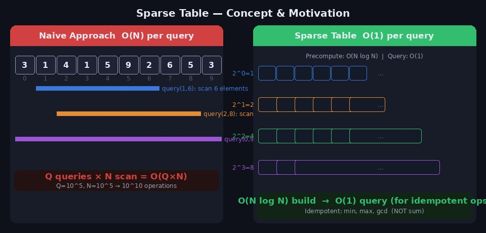
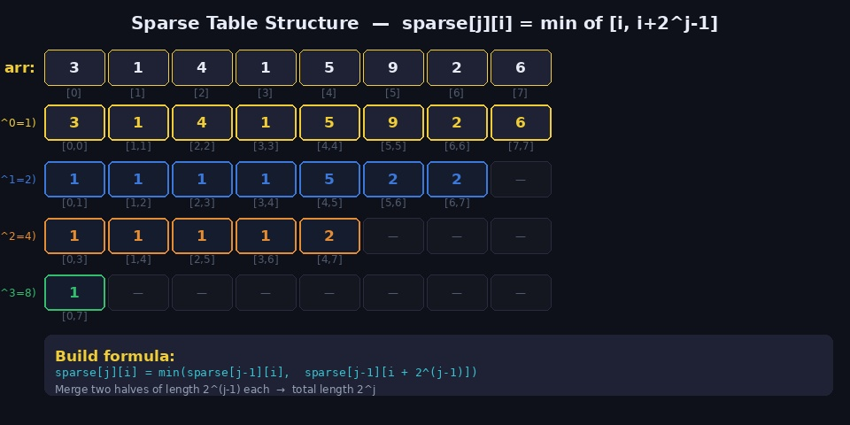
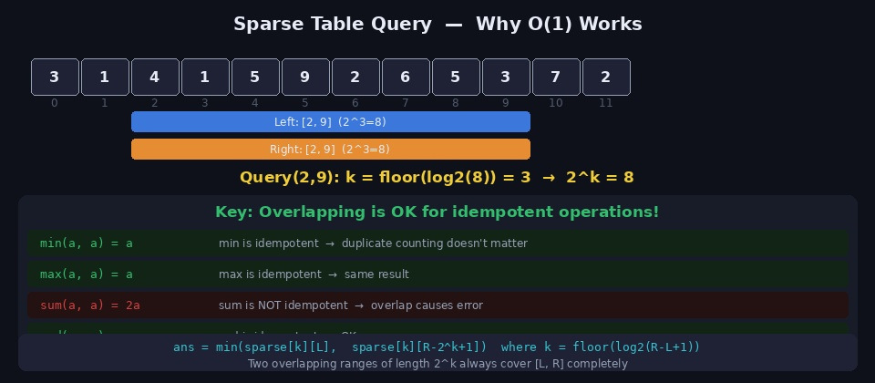
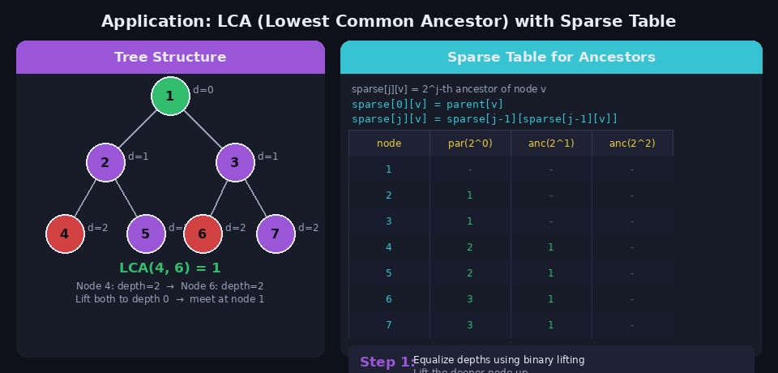
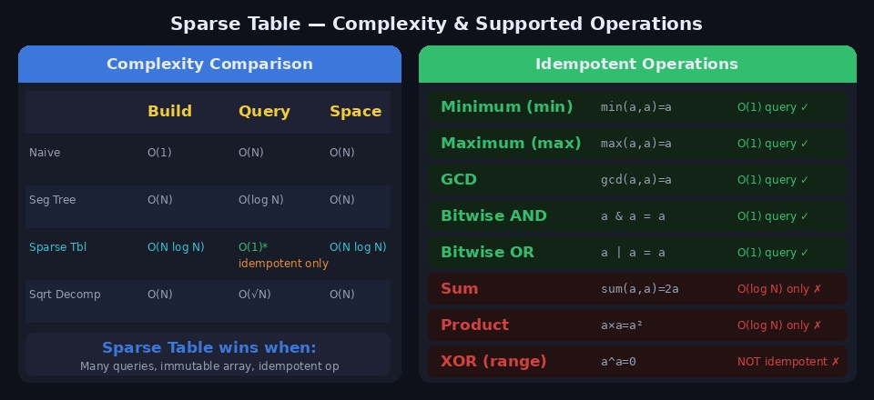

구간 최솟값을 Q번 물어보는 문제. 단순히 매번 구간을 스캔하면 O(Q×N)이라 Q=N=10^5이면 10^10번 연산이 필요합니다. 세그먼트 트리는 O(Q log N)으로 줄여주지만, 배열이 불변이고 연산이 멱등성을 만족한다면 **희소 배열(Sparse Table)** 로 쿼리를 **O(1)** 에 처리할 수 있습니다.

---

## 1. 핵심 아이디어



### 멱등성 (Idempotent Property)

희소 배열의 핵심 조건입니다.

> **f(a, a) = a** — 같은 원소를 두 번 적용해도 결과가 바뀌지 않는 연산

```
min(a, a) = a  → 멱등성 O  → O(1) 쿼리 가능
max(a, a) = a  → 멱등성 O  → O(1) 쿼리 가능
gcd(a, a) = a  → 멱등성 O  → O(1) 쿼리 가능
sum(a, a) = 2a → 멱등성 X  → O(1) 쿼리 불가 (겹치면 중복 계산)
```

멱등성이 있으면 두 구간이 겹쳐도 결과가 올바르게 유지됩니다. 이 성질을 이용해 임의 구간을 **두 개의 2의 거듭제곱 길이 구간**으로 덮을 수 있습니다.

### 핵심 전략

```
임의 구간 [L, R] (길이 = R-L+1)
k = floor(log2(R-L+1))

구간 A: [L, L+2^k-1]         (왼쪽에서 시작)
구간 B: [R-2^k+1, R]         (오른쪽에서 끝)

두 구간이 겹쳐도 OK → min(A, B) = 정답
```

---

## 2. 희소 배열 구조



`sparse[j][i]` 는 **인덱스 i에서 시작하는 길이 2^j인 구간의 최솟값(or 최댓값)** 을 저장합니다.

```
arr = [3, 1, 4, 1, 5, 9, 2, 6]

sparse[0][i] = arr[i]                    (길이 1)
sparse[1][i] = min(arr[i], arr[i+1])     (길이 2)
sparse[2][i] = min(arr[i..i+3])          (길이 4)
sparse[3][i] = min(arr[i..i+7])          (길이 8)
```

### 점화식

```
sparse[j][i] = min(sparse[j-1][i], sparse[j-1][i + 2^(j-1)])
```

이전 레벨(길이 2^(j-1))인 두 구간을 합쳐 길이 2^j 구간의 최솟값을 구합니다.

---

## 3. 전처리 (Build) — O(N log N)

```python
import math

def build(arr):
    n = len(arr)
    LOG = max(1, int(math.log2(n)) + 1)

    # sparse[j][i]: arr[i..i+2^j-1] 의 최솟값
    sparse = [[float('inf')] * n for _ in range(LOG)]

    # j=0: 자기 자신
    for i in range(n):
        sparse[0][i] = arr[i]

    # j=1 이상: 점화식으로 채우기
    for j in range(1, LOG):
        for i in range(n - (1 << j) + 1):
            left  = sparse[j-1][i]
            right = sparse[j-1][i + (1 << (j-1))]
            sparse[j][i] = min(left, right)

    return sparse, LOG
```

---

## 4. 쿼리 (Query) — O(1)



```python
def query(sparse, L, R):
    length = R - L + 1
    k = int(math.log2(length))    # 2^k ≤ length

    left_min  = sparse[k][L]
    right_min = sparse[k][R - (1 << k) + 1]

    return min(left_min, right_min)
```

### 왜 O(1)인가?

```
구간 [L, R], 길이 len = R-L+1
k = floor(log2(len))  →  2^k ≤ len < 2^(k+1)

구간 A = [L, L+2^k-1]          길이 2^k
구간 B = [R-2^k+1, R]          길이 2^k

두 구간의 합집합 ⊇ [L, R]  (∵ 2^k ≥ len/2 이므로 반드시 전체를 덮음)
겹치는 부분 있어도 min은 OK  (멱등성)

→ 미리 계산된 두 값의 min만 보면 됨  →  O(1)
```

### log2 값 미리 계산

Q번 쿼리마다 `math.log2`를 호출하면 느립니다. 전처리로 log2 테이블을 만들면 더 빠릅니다.

```python
def build_log(n):
    """log2[i] = floor(log2(i)) 전처리"""
    log2 = [0] * (n + 1)
    for i in range(2, n + 1):
        log2[i] = log2[i // 2] + 1
    return log2
```

---

## 5. 전체 구현 — RMQ (Range Minimum Query)

```python
import sys
import math
input = sys.stdin.readline

def solve():
    n, q = map(int, input().split())
    arr = list(map(int, input().split()))

    # ── 전처리 ──────────────────────────────
    LOG = max(1, int(math.log2(n)) + 1) if n > 1 else 1
    sparse = [[float('inf')] * n for _ in range(LOG)]

    for i in range(n):
        sparse[0][i] = arr[i]

    for j in range(1, LOG):
        for i in range(n - (1 << j) + 1):
            sparse[j][i] = min(sparse[j-1][i],
                               sparse[j-1][i + (1 << (j-1))])

    # log2 테이블
    log2 = [0] * (n + 1)
    for i in range(2, n + 1):
        log2[i] = log2[i // 2] + 1

    # ── 쿼리 ──────────────────────────────
    def rmq(L, R):
        k = log2[R - L + 1]
        return min(sparse[k][L], sparse[k][R - (1 << k) + 1])

    for _ in range(q):
        L, R = map(int, input().split())
        print(rmq(L, R))


solve()
```

---

## 6. 최댓값 / GCD 버전

연산만 바꾸면 됩니다.

```python
# 최댓값 버전
sparse[j][i] = max(sparse[j-1][i], sparse[j-1][i + (1 << (j-1))])

def rmax(L, R):
    k = log2[R - L + 1]
    return max(sparse[k][L], sparse[k][R - (1 << k) + 1])


# GCD 버전
from math import gcd

sparse[j][i] = gcd(sparse[j-1][i], sparse[j-1][i + (1 << (j-1))])

def rgcd(L, R):
    k = log2[R - L + 1]
    return gcd(sparse[k][L], sparse[k][R - (1 << k) + 1])
```

---

## 7. 응용 — LCA (최소 공통 조상)



트리에서 두 노드의 최소 공통 조상(LCA)을 구할 때도 희소 배열을 사용합니다.

`sparse[j][v]` 를 **노드 v의 2^j번째 조상**으로 정의합니다.

### 점화식

```
sparse[0][v] = parent[v]                        (직접 부모)
sparse[j][v] = sparse[j-1][sparse[j-1][v]]      (2^(j-1)번째 조상의 2^(j-1)번째 조상)
```

### 전처리

```python
def build_lca(n, parent, LOG):
    """parent[v] = v의 직접 부모 (루트는 자기 자신)"""
    sparse = [[0] * (n + 1) for _ in range(LOG)]

    for v in range(1, n + 1):
        sparse[0][v] = parent[v]

    for j in range(1, LOG):
        for v in range(1, n + 1):
            sparse[j][v] = sparse[j-1][sparse[j-1][v]]

    return sparse
```

### LCA 쿼리

```python
def lca(u, v, depth, sparse, LOG):
    # 1. u를 더 깊은 쪽으로 맞추기
    if depth[u] < depth[v]:
        u, v = v, u

    diff = depth[u] - depth[v]

    # 2. 깊이 차이만큼 u를 위로 올리기 (이진 표현 활용)
    for j in range(LOG):
        if (diff >> j) & 1:
            u = sparse[j][u]

    # 3. 이미 같은 노드면 LCA
    if u == v:
        return u

    # 4. 두 노드를 동시에 위로 올리기
    for j in range(LOG - 1, -1, -1):
        if sparse[j][u] != sparse[j][v]:
            u = sparse[j][u]
            v = sparse[j][v]

    return sparse[0][u]   # 직접 부모가 LCA
```

### LCA 전체 코드

```python
import sys
from collections import defaultdict
sys.setrecursionlimit(10**6)
input = sys.stdin.readline

def solve():
    n = int(input())
    graph = defaultdict(list)
    for _ in range(n - 1):
        u, v = map(int, input().split())
        graph[u].append(v)
        graph[v].append(u)

    LOG = max(1, n.bit_length())
    depth  = [0] * (n + 1)
    parent = [0] * (n + 1)

    # BFS로 깊이와 부모 계산
    from collections import deque
    visited = [False] * (n + 1)
    q = deque([1])
    visited[1] = True
    order = []
    while q:
        v = q.popleft()
        order.append(v)
        for u in graph[v]:
            if not visited[u]:
                visited[u] = True
                depth[u]  = depth[v] + 1
                parent[u] = v
                q.append(u)

    # 희소 배열 구축
    sparse = [[0] * (n + 1) for _ in range(LOG)]
    for v in range(1, n + 1):
        sparse[0][v] = parent[v]
    for j in range(1, LOG):
        for v in range(1, n + 1):
            sparse[j][v] = sparse[j-1][sparse[j-1][v]]

    def lca(u, v):
        if depth[u] < depth[v]:
            u, v = v, u
        diff = depth[u] - depth[v]
        for j in range(LOG):
            if (diff >> j) & 1:
                u = sparse[j][u]
        if u == v:
            return u
        for j in range(LOG - 1, -1, -1):
            if sparse[j][u] != sparse[j][v]:
                u = sparse[j][u]
                v = sparse[j][v]
        return sparse[0][u]

    q_count = int(input())
    for _ in range(q_count):
        u, v = map(int, input().split())
        print(lca(u, v))


solve()
```

---

## 8. 희소 배열 vs 다른 자료구조



| | 구축 | 쿼리 | 공간 | 업데이트 |
|--|------|------|------|---------|
| 완전 탐색 | O(1) | O(N) | O(N) | O(1) |
| 세그먼트 트리 | O(N) | O(log N) | O(N) | O(log N) |
| **희소 배열** | **O(N log N)** | **O(1)*** | O(N log N) | **불가** |
| 제곱근 분할 | O(N) | O(√N) | O(N) | O(√N) |

> *O(1) 쿼리는 멱등성을 만족하는 연산에만 적용됩니다. 합(sum)은 O(log N).

### 희소 배열이 유리한 상황

```
1. 배열이 변하지 않는다 (정적 배열)
2. 쿼리 수 Q가 매우 많다
3. 연산이 멱등성을 만족한다 (min, max, gcd ...)

→ 이 세 가지가 모두 해당되면 희소 배열이 최선
```

### 지원 연산 정리

```
O(1) 쿼리 가능:   min, max, gcd, bitwise AND, bitwise OR
O(log N) 쿼리:    sum, product (세그먼트 트리 사용 권장)
```

---

## 9. 주의할 점

**1. 배열 크기에 맞는 LOG 설정**

```python
import math
LOG = max(1, int(math.log2(n)) + 1)

# 또는 bit_length 활용 (더 안전)
LOG = max(1, n.bit_length())
```

**2. 인덱스 범위 초과 방지**

```python
# j레벨에서 i+2^(j-1)이 n을 초과하면 안 됨
for j in range(1, LOG):
    for i in range(n - (1 << j) + 1):   # ← 상한 주의
        ...
```

**3. 쿼리에서 k 계산 오류**

```python
# ❌ R-L 이 아닌 R-L+1 (길이)에 log2 적용
k = int(math.log2(R - L))      # 틀림

# ✅ 길이 = R-L+1
k = int(math.log2(R - L + 1))  # 올바름
```

**4. sum에는 희소 배열 사용 금지**

```python
# ❌ sum은 멱등성이 없어 구간 겹침 시 중복 계산
# sum(sparse[k][L], sparse[k][R-2^k+1]) → 겹친 부분이 두 번 더해짐
# → 펜윅 트리 또는 세그먼트 트리 사용
```

---

## 10. 관련 백준 문제

| 문제 | 난이도 | 핵심 |
|------|--------|------|
| [10868 최솟값](https://www.acmicpc.net/problem/10868) | Gold I | 희소 배열 RMQ 기본 |
| [17435 합성함수와 쿼리](https://www.acmicpc.net/problem/17435) | Gold III | 희소 배열 함수 합성 |
| [11438 LCA 2](https://www.acmicpc.net/problem/11438) | Platinum V | 희소 배열 LCA |
| [3176 도로 네트워크](https://www.acmicpc.net/problem/3176) | Platinum V | LCA + 경로 최솟값/최댓값 |
| [1761 정점들의 거리](https://www.acmicpc.net/problem/1761) | Gold II | LCA + 거리 계산 |