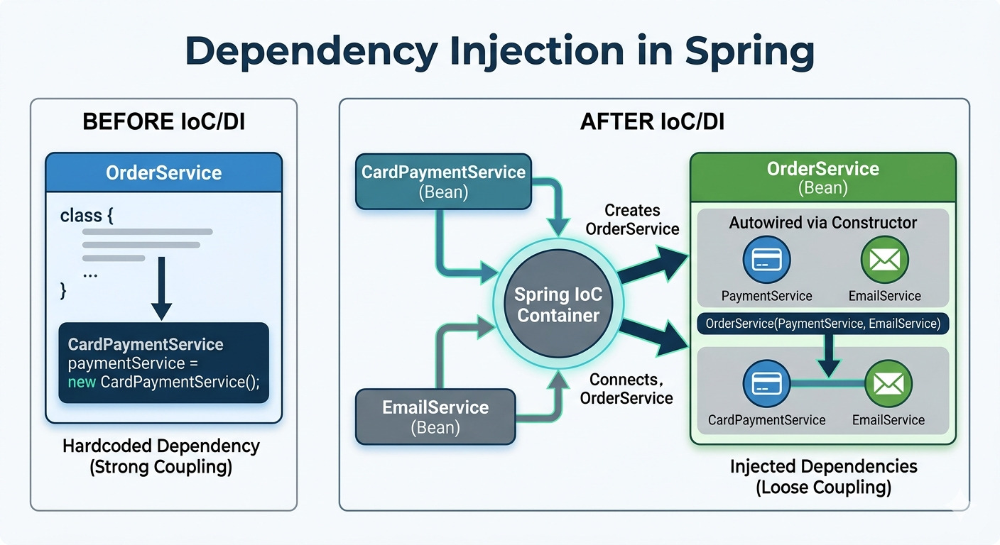
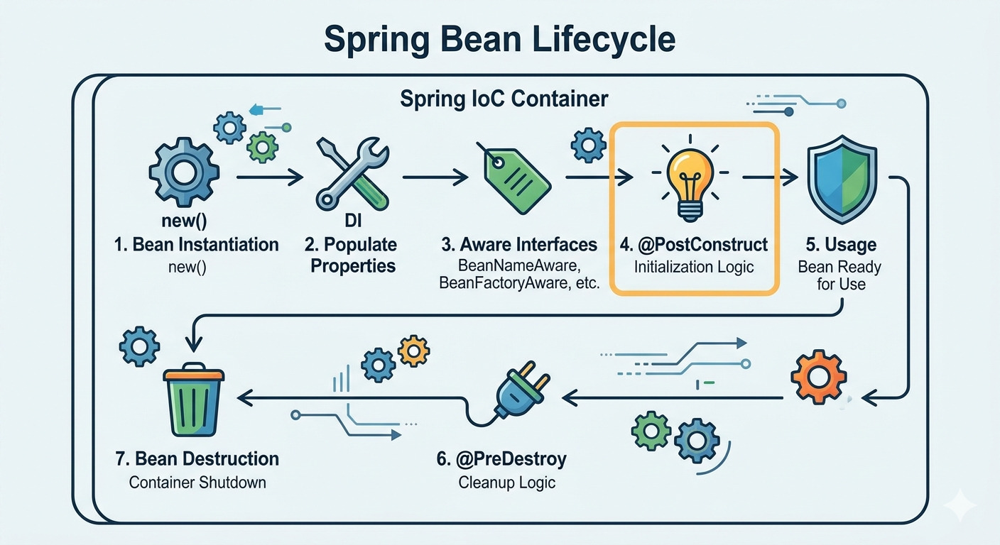
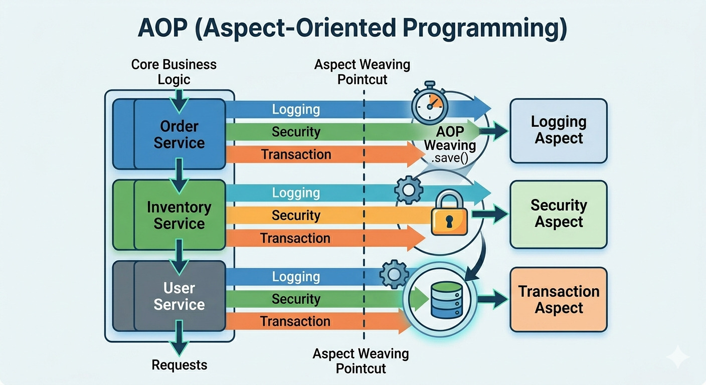
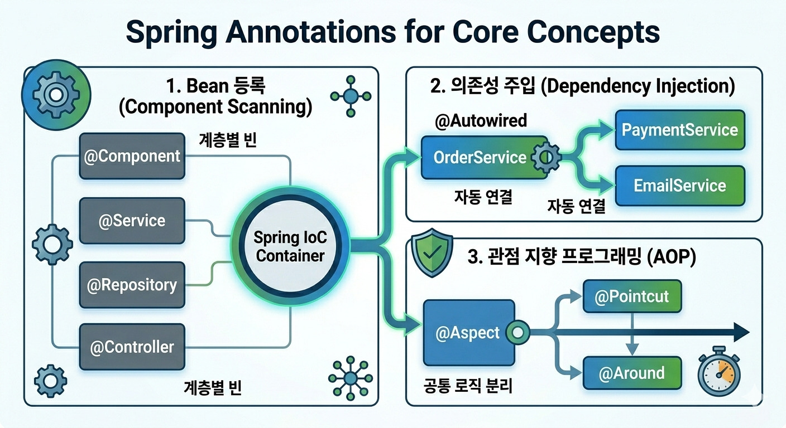
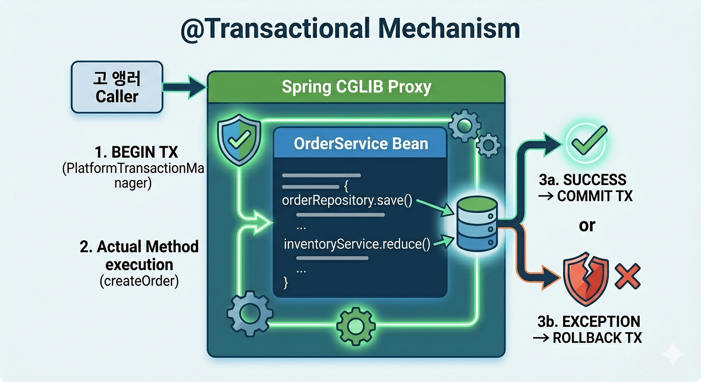

Spring을 쓴다는 것은 단순히 어노테이션을 붙이는 것이 아닙니다. Spring이 어떻게 객체를 만들고 관리하는지, 왜 이런 구조를 택했는지를 이해해야 면접에서도 막히지 않고 실무에서도 올바르게 활용할 수 있습니다. 이 글에서는 Spring의 근본이 되는 IoC, DI, AOP, Bean 개념을 정리합니다.

---

## 1. IoC (Inversion of Control) — 제어의 역전

### 전통적인 방식

전통적인 객체지향 프로그래밍에서는 **객체가 필요한 의존성을 스스로 생성**합니다.

```java
public class OrderService {
    // 직접 생성 → 강한 결합
    private PaymentService payment = new CardPaymentService();
}
```

이 방식의 문제는 `OrderService`가 `CardPaymentService`에 강하게 결합된다는 것입니다. 나중에 `KakaoPayService`로 바꾸려면 `OrderService` 코드를 수정해야 합니다.

### IoC가 뒤집는 것

> **"객체를 생성하고 관리하는 주체를 개발자에서 Spring Container(프레임워크)로 넘긴다."**

```
Before IoC:  개발자 코드 → 객체 생성 & 의존성 연결
After  IoC:  Spring Container → 객체 생성 & 의존성 연결 → 개발자 코드에 주입
```

Spring은 `ApplicationContext`라는 **IoC 컨테이너**가 이 역할을 담당합니다.

---

## 2. DI (Dependency Injection) — 의존성 주입

IoC를 구현하는 구체적인 방법이 **DI**입니다. 의존하는 객체를 외부(컨테이너)에서 주입받습니다.



### 주입 방식 3가지

#### 1) 생성자 주입 (권장 ✅)

```java
@Service
public class OrderService {

    private final PaymentService paymentService;
    private final EmailService   emailService;

    // @Autowired 생략 가능 (Spring 4.3+, 단일 생성자)
    public OrderService(PaymentService paymentService,
                        EmailService emailService) {
        this.paymentService = paymentService;
        this.emailService   = emailService;
    }
}
```

생성자 주입을 권장하는 이유는 세 가지입니다.

```
1. 불변성 보장: final 선언 가능 → 주입 후 변경 불가
2. 순환 참조 감지: 컴파일/시작 시점에 순환 참조 감지
3. 테스트 용이: new로 직접 객체 생성해 테스트 가능
```

#### 2) 필드 주입 (지양 ❌)

```java
@Service
public class OrderService {

    @Autowired
    private PaymentService paymentService;  // 테스트 시 주입 어려움
}
```

#### 3) 세터 주입 (선택적 의존성에만)

```java
@Service
public class OrderService {

    private EmailService emailService;

    @Autowired(required = false)  // 선택적 의존성
    public void setEmailService(EmailService emailService) {
        this.emailService = emailService;
    }
}
```

### 같은 타입 빈이 여러 개일 때

```java
// 구현체 두 개
@Component public class CardPaymentService  implements PaymentService { ... }
@Component public class KakaoPaymentService implements PaymentService { ... }

// 주입 시 명시
@Service
public class OrderService {

    // 방법 1: @Qualifier로 이름 지정
    @Autowired
    @Qualifier("cardPaymentService")
    private PaymentService paymentService;

    // 방법 2: @Primary — 기본으로 사용할 빈에 지정
    // @Primary가 붙은 빈이 기본 선택됨
}
```

---

## 3. Spring Bean — 컨테이너가 관리하는 객체



Spring이 생성하고 관리하는 객체를 **Bean**이라고 합니다.

### Bean 등록 방법

#### 어노테이션 기반 (실무 표준)

```java
@Component    // 일반 컴포넌트
@Service      // 서비스 레이어 (비즈니스 로직)
@Repository   // 데이터 접근 레이어 (+ DB 예외 변환)
@Controller   // Spring MVC 컨트롤러
@RestController // @Controller + @ResponseBody
```

#### Java Config 기반

```java
@Configuration
public class AppConfig {

    @Bean
    public PaymentService paymentService() {
        return new CardPaymentService();
    }

    @Bean
    public OrderService orderService() {
        return new OrderService(paymentService()); // 의존성 직접 연결
    }
}
```

### Bean 스코프

| 스코프 | 설명 | 사용 예 |
|--------|------|---------|
| **singleton** | 컨테이너당 1개 인스턴스 (기본값) | Service, Repository |
| **prototype** | 요청할 때마다 새 인스턴스 | 상태를 갖는 객체 |
| **request** | HTTP 요청당 1개 (웹) | 요청 컨텍스트 정보 |
| **session** | HTTP 세션당 1개 (웹) | 사용자 세션 정보 |

```java
@Component
@Scope("prototype")  // 기본은 singleton
public class EmailMessage { ... }
```

### Bean 생명주기

```
컨테이너 시작
    → ① 인스턴스화 (new)
    → ② 프로퍼티 주입 (DI)
    → ③ Aware 인터페이스 처리
    → ④ @PostConstruct  ← 초기화 로직
    → ⑤ 사용 (서비스 처리)
    → ⑥ @PreDestroy     ← 정리 로직
    → ⑦ 소멸
컨테이너 종료
```

```java
@Component
public class DatabaseConnector {

    @PostConstruct
    public void init() {
        // 빈 초기화 후 실행 — DB 연결, 캐시 로딩 등
        System.out.println("DB 연결 초기화");
    }

    @PreDestroy
    public void cleanup() {
        // 컨테이너 종료 전 실행 — 연결 해제, 리소스 정리
        System.out.println("DB 연결 해제");
    }
}
```

---

## 4. AOP (Aspect-Oriented Programming) — 관점 지향 프로그래밍



### 왜 필요한가?

로깅, 트랜잭션, 보안 체크 같은 **공통 관심사(Cross-cutting Concern)** 가 모든 서비스 메서드에 반복됩니다. AOP는 이 공통 로직을 **별도 모듈(Aspect)** 로 분리해 핵심 비즈니스 로직만 남깁니다.

### 핵심 용어

| 용어 | 설명 |
|------|------|
| **Aspect** | 공통 관심사를 모듈화한 클래스 |
| **Advice** | Aspect가 실행하는 동작 (`@Before`, `@After`, `@Around`) |
| **Pointcut** | Advice를 적용할 대상을 정의하는 표현식 |
| **JoinPoint** | Advice가 적용되는 실제 메서드 실행 지점 |
| **Weaving** | Aspect를 대상 객체에 적용하는 과정 |

### 구현 예시 — 실행 시간 측정

```java
@Aspect
@Component
public class PerformanceAspect {

    // Pointcut: com.example.service 패키지의 모든 메서드
    @Pointcut("execution(* com.example.service.*.*(..))")
    public void serviceLayer() {}

    @Around("serviceLayer()")
    public Object measureTime(ProceedingJoinPoint pjp) throws Throwable {
        long start = System.currentTimeMillis();

        Object result = pjp.proceed(); // 실제 메서드 실행

        long end = System.currentTimeMillis();
        log.info("[{}] 실행시간: {}ms",
            pjp.getSignature().getName(), end - start);

        return result;
    }
}
```

### Advice 종류

```java
@Before("serviceLayer()")
public void before(JoinPoint jp) {
    // 메서드 실행 전
}

@AfterReturning(pointcut="serviceLayer()", returning="result")
public void afterReturn(Object result) {
    // 정상 반환 후 (반환값 접근 가능)
}

@AfterThrowing(pointcut="serviceLayer()", throwing="ex")
public void afterThrow(Exception ex) {
    // 예외 발생 후
}

@After("serviceLayer()")
public void after() {
    // 정상/예외 관계없이 항상 실행 (finally와 유사)
}

@Around("serviceLayer()")
public Object around(ProceedingJoinPoint pjp) throws Throwable {
    // 전/후 모두 제어 가능 (가장 강력)
    return pjp.proceed();
}
```

### Pointcut 표현식

```java
// execution: 메서드 실행 기준
"execution(* com.example.service.*.*(..))"
//           ↑반환타입  ↑패키지.클래스.메서드(파라미터)

// @annotation: 특정 어노테이션이 붙은 메서드
"@annotation(org.springframework.transaction.annotation.Transactional)"

// within: 특정 패키지/클래스 안의 모든 메서드
"within(com.example.service.*)"

// @within: 특정 어노테이션이 붙은 클래스의 모든 메서드
"@within(org.springframework.stereotype.Service)"
```

---

## 5. 주요 어노테이션 정리



### 계층별 컴포넌트

```java
@Controller     // MVC 컨트롤러 — 뷰 반환
@RestController // REST API — JSON 반환 (@Controller + @ResponseBody)
@Service        // 비즈니스 로직
@Repository     // 데이터 접근 + DB 예외를 Spring 예외로 변환
@Component      // 위 셋에 해당하지 않는 일반 컴포넌트
```

### 설정 관련

```java
@Configuration      // 설정 클래스 (내부 @Bean 메서드를 Bean으로 등록)
@Bean               // 메서드가 반환하는 객체를 Bean으로 등록
@ComponentScan      // 지정 패키지에서 컴포넌트 자동 탐색
@PropertySource("classpath:app.properties")  // 프로퍼티 파일 로드
@Value("${server.port}")  // 프로퍼티 값 주입
@Profile("prod")    // 특정 프로파일에서만 활성화
```

### 조건부 Bean 등록 (Spring Boot)

```java
@ConditionalOnProperty(name = "feature.email", havingValue = "true")
@Bean
public EmailService emailService() { ... }

@ConditionalOnMissingBean(EmailService.class)
@Bean
public DefaultEmailService defaultEmailService() { ... }
```

---

## 6. @Transactional — 트랜잭션 관리



### 동작 원리 — AOP 프록시

`@Transactional`은 AOP를 이용해 동작합니다. Spring이 실제 Bean 대신 **프록시 객체**를 만들어 트랜잭션 처리를 감쌉니다.

```
호출자 → [TX 프록시] → 실제 Bean
              ↓
         BEGIN TX
         실제 메서드 실행
         성공 → COMMIT
         예외 → ROLLBACK
```

### 기본 사용법

```java
@Service
public class OrderService {

    @Transactional  // 기본: propagation=REQUIRED, isolation=DEFAULT
    public void createOrder(OrderDto dto) {
        orderRepository.save(new Order(dto));
        inventoryService.reduce(dto.itemId());  // 같은 트랜잭션
    }

    @Transactional(readOnly = true)  // 읽기 전용 최적화
    public Order findOrder(Long id) {
        return orderRepository.findById(id)
            .orElseThrow(() -> new OrderNotFoundException(id));
    }
}
```

### 전파 속성 (Propagation)

```java
@Transactional(propagation = Propagation.REQUIRED)
// 기존 TX가 있으면 참여, 없으면 새로 시작 (기본값)

@Transactional(propagation = Propagation.REQUIRES_NEW)
// 항상 새 TX 시작, 기존 TX는 일시 중단
// → 외부 TX 롤백과 무관하게 독립적으로 커밋 가능 (감사 로그 등)

@Transactional(propagation = Propagation.SUPPORTS)
// TX 있으면 참여, 없으면 트랜잭션 없이 실행

@Transactional(propagation = Propagation.NOT_SUPPORTED)
// TX 없이 실행, 기존 TX는 일시 중단

@Transactional(propagation = Propagation.MANDATORY)
// 반드시 기존 TX 안에서 실행 (없으면 예외)

@Transactional(propagation = Propagation.NEVER)
// TX 안에서 실행되면 예외
```

### 격리 수준 (Isolation)

```java
@Transactional(isolation = Isolation.READ_COMMITTED)
// 커밋된 데이터만 읽음 (Oracle/PostgreSQL 기본값)
// → Dirty Read 방지

@Transactional(isolation = Isolation.REPEATABLE_READ)
// 트랜잭션 내에서 같은 데이터를 읽으면 항상 같은 결과
// → Dirty Read, Non-Repeatable Read 방지 (MySQL 기본값)

@Transactional(isolation = Isolation.SERIALIZABLE)
// 완전한 직렬화, 가장 강력하지만 성능 저하
```

### 자주 하는 실수 ⚠️

**1. 자기 호출 (Self-invocation) 문제**

```java
@Service
public class OrderService {

    public void process() {
        this.createOrder();  // ❌ 프록시를 거치지 않음 → @Transactional 무시
    }

    @Transactional
    public void createOrder() { ... }
}

// ✅ 해결 1: 별도 클래스로 분리
// ✅ 해결 2: ApplicationContext에서 self 주입 (지양)
```

**2. `private` 메서드에는 적용 안 됨**

```java
// ❌ 프록시는 public 메서드만 가로챔
@Transactional
private void saveOrder() { ... }

// ✅ public으로 선언
@Transactional
public void saveOrder() { ... }
```

**3. 체크 예외는 기본적으로 롤백 안 됨**

```java
// ❌ IOException은 체크 예외 → 기본적으로 롤백 안 됨
@Transactional
public void save() throws IOException {
    repository.save(data);
    throw new IOException("파일 오류");  // 롤백 안 됨!
}

// ✅ rollbackFor 명시
@Transactional(rollbackFor = Exception.class)
public void save() throws IOException { ... }
```

---

## 7. Spring 전체 구조 이해

```
[Client Request]
       ↓
[DispatcherServlet]        ← Front Controller
       ↓
[HandlerMapping]           ← URL → Controller 매핑
       ↓
[Controller]               ← @RestController (@Component)
       ↓
[Service]                  ← @Service + @Transactional (AOP)
       ↓
[Repository]               ← @Repository (+ JPA)
       ↓
[Database]
```

모든 계층의 객체가 Spring Container에서 Bean으로 관리되고, DI로 연결됩니다. `@Transactional`은 AOP 프록시로 동작하며 Service 계층을 감쌉니다.

---

## 8. 면접 단골 질문 정리

**Q. IoC와 DI의 차이는?**
IoC는 제어권을 프레임워크에 넘기는 설계 원칙이고, DI는 IoC를 구현하는 구체적인 방법 중 하나입니다. Spring은 DI를 통해 IoC를 실현합니다.

**Q. 생성자 주입을 권장하는 이유는?**
final 필드로 불변성을 보장하고, 순환 참조를 컨테이너 시작 시점에 감지할 수 있으며, 테스트 시 new로 직접 객체를 생성해 주입할 수 있어 테스트가 용이합니다.

**Q. @Transactional의 동작 원리는?**
AOP 기반 프록시 패턴으로 동작합니다. Spring이 실제 Bean 대신 프록시 객체를 생성해 메서드 전후에 트랜잭션 시작/커밋/롤백 처리를 삽입합니다.

**Q. @Transactional이 동작하지 않는 경우는?**
같은 클래스 내의 자기 호출(self-invocation), private 메서드, 체크 예외에서 rollbackFor 미설정이 주요 원인입니다.

**Q. 싱글톤 빈에 상태를 가지면 안 되는 이유는?**
싱글톤 빈은 모든 요청이 공유하므로, 인스턴스 변수에 상태를 저장하면 멀티스레드 환경에서 경쟁 조건(Race Condition)이 발생합니다. 빈은 항상 무상태(Stateless)로 설계해야 합니다.

---

## 참고 자료

- [Spring 공식 문서 — Core](https://docs.spring.io/spring-framework/docs/current/reference/html/core.html)
- [Spring 공식 문서 — AOP](https://docs.spring.io/spring-framework/docs/current/reference/html/core.html#aop)
- [토비의 스프링 3.1](http://www.yes24.com/Product/Goods/7516911)