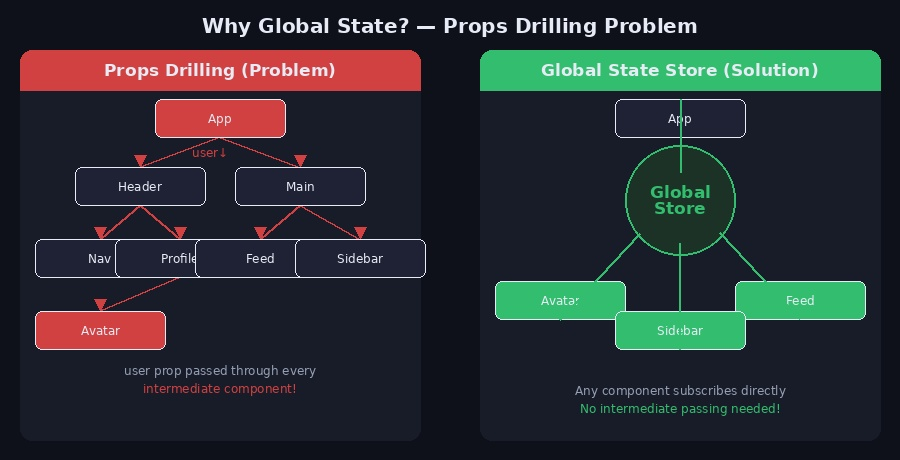
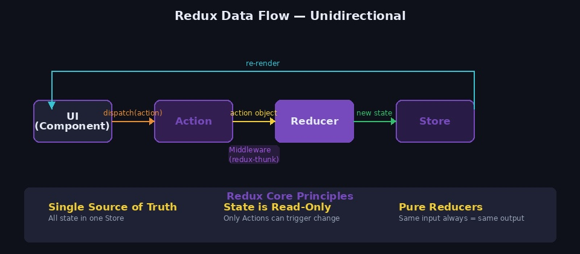
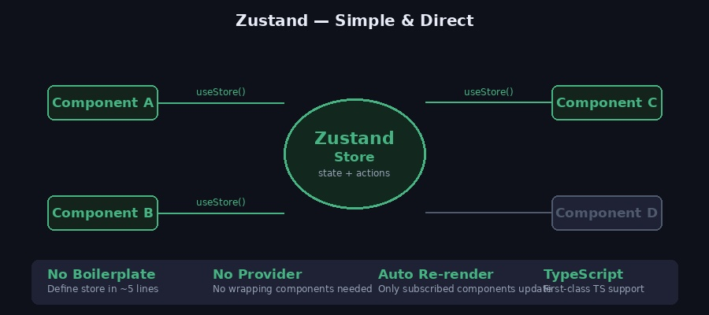
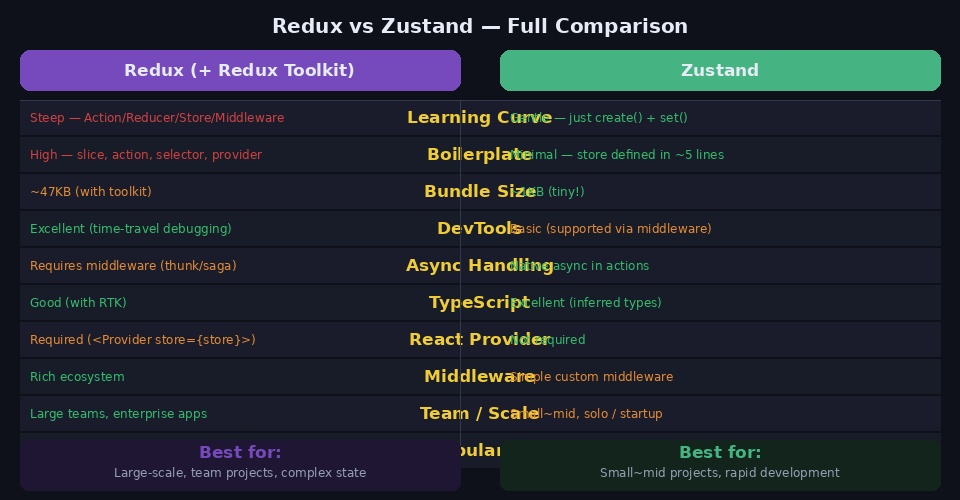
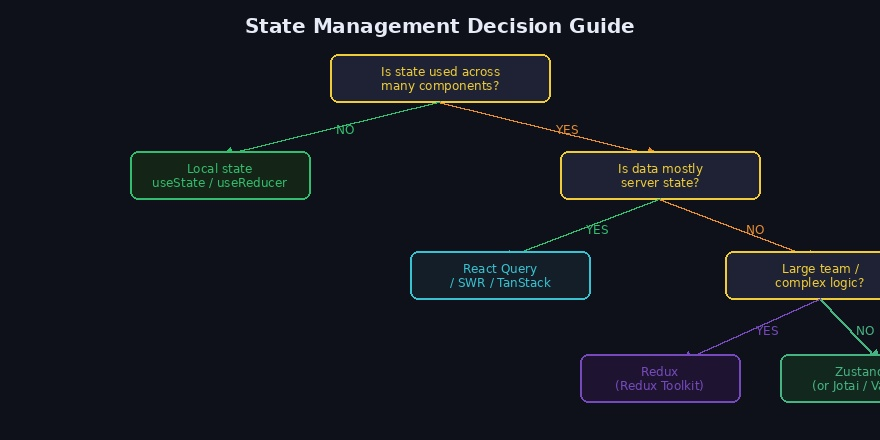

React에서 상태(state)는 컴포넌트 단위로 관리됩니다. 하지만 컴포넌트 수가 많아지고 서로 다른 위치에 있는 컴포넌트가 같은 데이터를 필요로 할 때, 단순한 `useState`만으로는 한계가 생깁니다. 이 문제를 해결하기 위한 **전역 상태관리** 라이브러리인 Redux와 Zustand를 정리합니다.

---

## 1. 왜 전역 상태관리가 필요한가?



### Props Drilling 문제

컴포넌트 트리가 깊어질수록 부모에서 자식으로 props를 계속 내려줘야 하는 **Props Drilling** 문제가 발생합니다.

```
App (user 데이터 보유)
└── Header
    └── Nav
        └── Profile
            └── Avatar  ← user가 실제로 필요한 곳
```

Avatar 컴포넌트가 `user` 데이터가 필요할 때, 실제로 사용하지 않는 Header, Nav, Profile까지 모두 props를 받아서 전달해야 합니다. 이렇게 되면:

- 중간 컴포넌트가 불필요한 props를 가짐
- 코드 수정 시 연쇄적으로 변경이 필요
- 어디서 데이터가 내려오는지 추적하기 어려움

### 전역 상태관리의 해결 방식

전역 Store에 상태를 두고 필요한 컴포넌트가 **직접 구독**합니다. 중간 컴포넌트를 거칠 필요가 없습니다.

---

## 2. Redux

### 개념

**Redux**는 JavaScript 앱을 위한 예측 가능한 상태 컨테이너입니다. React에 종속되지 않고 어떤 UI 라이브러리와도 함께 사용할 수 있습니다.

현재는 **Redux Toolkit(RTK)** 을 공식적으로 권장하며, RTK는 Redux의 복잡한 보일러플레이트를 크게 줄여줍니다.

### 데이터 흐름



Redux는 **단방향 데이터 흐름**을 따릅니다.

```
UI → dispatch(action) → Reducer → Store → UI 리렌더링
```

- **Action**: 상태 변경을 설명하는 객체 `{ type: 'counter/increment', payload: 1 }`
- **Reducer**: 현재 상태와 Action을 받아 새 상태를 반환하는 순수 함수
- **Store**: 앱 전체의 상태를 담는 단일 객체
- **Dispatch**: Action을 Store에 전달하는 함수

### 3가지 핵심 원칙

```
1. Single Source of Truth  : 모든 상태는 하나의 Store에
2. State is Read-Only      : Action을 통해서만 상태 변경
3. Pure Reducers           : 같은 입력 → 항상 같은 출력
```

### 설치

```bash
npm install @reduxjs/toolkit react-redux
```

### Redux Toolkit으로 구현하기

#### Store 설정

```javascript
// store/index.js
import { configureStore } from '@reduxjs/toolkit'
import counterReducer from './counterSlice'
import userReducer from './userSlice'

export const store = configureStore({
  reducer: {
    counter: counterReducer,
    user: userReducer,
  },
})

export type RootState = ReturnType<typeof store.getState>
export type AppDispatch = typeof store.dispatch
```

#### Slice 생성 (Action + Reducer 통합)

```javascript
// store/counterSlice.js
import { createSlice } from '@reduxjs/toolkit'

const counterSlice = createSlice({
  name: 'counter',
  initialState: { value: 0 },
  reducers: {
    increment: (state) => {
      state.value += 1          // Immer 덕분에 직접 변경처럼 작성 가능
    },
    decrement: (state) => {
      state.value -= 1
    },
    incrementByAmount: (state, action) => {
      state.value += action.payload
    },
  },
})

export const { increment, decrement, incrementByAmount } = counterSlice.actions
export default counterSlice.reducer
```

#### Provider로 앱 감싸기

```jsx
// main.jsx
import { Provider } from 'react-redux'
import { store } from './store'

ReactDOM.createRoot(document.getElementById('root')).render(
  <Provider store={store}>
    <App />
  </Provider>
)
```

#### 컴포넌트에서 사용

```jsx
import { useSelector, useDispatch } from 'react-redux'
import { increment, decrement, incrementByAmount } from './store/counterSlice'

function Counter() {
  // 상태 읽기
  const count = useSelector((state) => state.counter.value)
  const dispatch = useDispatch()

  return (
    <div>
      <p>Count: {count}</p>
      <button onClick={() => dispatch(increment())}>+</button>
      <button onClick={() => dispatch(decrement())}>-</button>
      <button onClick={() => dispatch(incrementByAmount(5))}>+5</button>
    </div>
  )
}
```

### 비동기 처리 — createAsyncThunk

```javascript
// store/userSlice.js
import { createSlice, createAsyncThunk } from '@reduxjs/toolkit'

// 비동기 액션 생성
export const fetchUser = createAsyncThunk(
  'user/fetchUser',
  async (userId, { rejectWithValue }) => {
    try {
      const response = await fetch(`/api/users/${userId}`)
      return await response.json()
    } catch (error) {
      return rejectWithValue(error.message)
    }
  }
)

const userSlice = createSlice({
  name: 'user',
  initialState: { data: null, status: 'idle', error: null },
  reducers: {},
  extraReducers: (builder) => {
    builder
      .addCase(fetchUser.pending, (state) => {
        state.status = 'loading'
      })
      .addCase(fetchUser.fulfilled, (state, action) => {
        state.status = 'succeeded'
        state.data = action.payload
      })
      .addCase(fetchUser.rejected, (state, action) => {
        state.status = 'failed'
        state.error = action.payload
      })
  },
})

export default userSlice.reducer
```

```jsx
// 사용
function UserProfile({ userId }) {
  const dispatch = useDispatch()
  const { data, status, error } = useSelector((state) => state.user)

  useEffect(() => {
    dispatch(fetchUser(userId))
  }, [userId])

  if (status === 'loading') return <p>Loading...</p>
  if (status === 'failed') return <p>Error: {error}</p>
  return <p>{data?.name}</p>
}
```

### Selector로 성능 최적화

```javascript
import { createSelector } from '@reduxjs/toolkit'

// 메모이제이션된 selector — 입력이 바뀔 때만 재계산
const selectTotalPrice = createSelector(
  (state) => state.cart.items,
  (items) => items.reduce((sum, item) => sum + item.price * item.quantity, 0)
)

// 사용
const totalPrice = useSelector(selectTotalPrice)
```

---

## 3. Zustand

### 개념

**Zustand**는 독일어로 "상태"를 뜻하며, React 팀의 Jotai 개발자가 만든 가볍고 직관적인 상태관리 라이브러리입니다. Redux의 복잡한 보일러플레이트 없이 전역 상태를 간단하게 관리할 수 있습니다.



### Zustand의 핵심 특징

- `Provider` 없이 사용 가능
- Store 정의가 5줄 내외
- 구독한 컴포넌트만 리렌더링
- TypeScript 타입 자동 추론

### 설치

```bash
npm install zustand
```

### 기본 Store 생성

```javascript
// store/useCounterStore.js
import { create } from 'zustand'

const useCounterStore = create((set) => ({
  // State
  count: 0,

  // Actions (state와 같은 곳에 정의)
  increment: () => set((state) => ({ count: state.count + 1 })),
  decrement: () => set((state) => ({ count: state.count - 1 })),
  incrementByAmount: (amount) => set((state) => ({ count: state.count + amount })),
  reset: () => set({ count: 0 }),
}))

export default useCounterStore
```

### 컴포넌트에서 사용

```jsx
// Provider 불필요 — 바로 import해서 사용
import useCounterStore from './store/useCounterStore'

function Counter() {
  const { count, increment, decrement } = useCounterStore()

  return (
    <div>
      <p>Count: {count}</p>
      <button onClick={increment}>+</button>
      <button onClick={decrement}>-</button>
    </div>
  )
}
```

### 선택적 구독으로 리렌더링 최적화

```jsx
// count만 구독 → count가 바뀔 때만 리렌더링
const count = useCounterStore((state) => state.count)

// increment만 구독 → 절대 리렌더링 안 됨 (함수는 불변)
const increment = useCounterStore((state) => state.increment)
```

### 비동기 처리

Zustand는 미들웨어 없이 액션 안에서 바로 async/await를 사용할 수 있습니다.

```javascript
import { create } from 'zustand'

const useUserStore = create((set) => ({
  user: null,
  status: 'idle',
  error: null,

  fetchUser: async (userId) => {
    set({ status: 'loading' })
    try {
      const response = await fetch(`/api/users/${userId}`)
      const data = await response.json()
      set({ user: data, status: 'succeeded' })
    } catch (error) {
      set({ error: error.message, status: 'failed' })
    }
  },
}))

export default useUserStore
```

```jsx
function UserProfile({ userId }) {
  const { user, status, fetchUser } = useUserStore()

  useEffect(() => {
    fetchUser(userId)
  }, [userId])

  if (status === 'loading') return <p>Loading...</p>
  return <p>{user?.name}</p>
}
```

### TypeScript 적용

```typescript
import { create } from 'zustand'

interface CounterState {
  count: number
  increment: () => void
  decrement: () => void
  reset: () => void
}

const useCounterStore = create<CounterState>((set) => ({
  count: 0,
  increment: () => set((state) => ({ count: state.count + 1 })),
  decrement: () => set((state) => ({ count: state.count - 1 })),
  reset: () => set({ count: 0 }),
}))
```

### devtools, persist 미들웨어

```javascript
import { create } from 'zustand'
import { devtools, persist } from 'zustand/middleware'

const useCounterStore = create(
  devtools(                          // Redux DevTools 연동
    persist(                         // localStorage에 상태 저장
      (set) => ({
        count: 0,
        increment: () => set((state) => ({ count: state.count + 1 })),
      }),
      { name: 'counter-storage' }    // localStorage key
    )
  )
)
```

### 여러 Store 슬라이스 패턴

```javascript
// 큰 앱에서는 slice를 나눠서 조합
const createCounterSlice = (set) => ({
  count: 0,
  increment: () => set((state) => ({ count: state.count + 1 })),
})

const createUserSlice = (set) => ({
  user: null,
  setUser: (user) => set({ user }),
})

// 하나의 Store로 합치기
const useStore = create((set) => ({
  ...createCounterSlice(set),
  ...createUserSlice(set),
}))
```

---

## 4. Redux vs Zustand 비교



### 코드량 비교 — 같은 카운터 기능

**Redux (RTK)**

```
파일 구성:
├── store/index.js          (store 설정)
├── store/counterSlice.js   (slice 정의)
└── main.jsx                (Provider 설정)

총 ~40줄
```

**Zustand**

```
파일 구성:
└── store/useCounterStore.js  (store + action 전부)

총 ~10줄
```

### 주요 차이점 요약

| 항목 | Redux (RTK) | Zustand |
|------|-------------|---------|
| 학습 난이도 | 높음 (Action/Reducer/Selector 개념 필요) | 낮음 (create + set만 알면 됨) |
| 보일러플레이트 | 많음 | 거의 없음 |
| 번들 크기 | ~47KB | ~1KB |
| Provider 필요 | 필요 | 불필요 |
| DevTools | 매우 강력 (시간여행 디버깅) | 기본 지원 |
| 비동기 처리 | 미들웨어 필요 (thunk/saga) | 액션 안에서 바로 async/await |
| 미들웨어 생태계 | 풍부 | 제한적 |
| 적합한 규모 | 대규모, 팀 프로젝트 | 소~중규모, 빠른 개발 |

---

## 5. 언제 무엇을 선택할까?



### 상황별 선택 가이드

```
상태가 한 컴포넌트 안에서만 쓰인다
└── useState / useReducer

서버 데이터 페칭이 주된 문제다
└── TanStack Query (React Query) / SWR

진짜 클라이언트 전역 상태가 필요하다
├── 대규모 팀, 복잡한 비즈니스 로직, 강력한 디버깅 필요
│   └── Redux (Redux Toolkit)
└── 소~중규모, 빠른 개발, 단순한 상태
    └── Zustand
```

### Redux를 선택하면 좋은 경우

- 10명 이상의 팀이 협업하는 대규모 프로젝트
- 상태 변화 이력 추적(시간여행 디버깅)이 중요할 때
- 복잡한 비동기 흐름(saga, 복잡한 thunk)이 필요할 때
- 이미 Redux를 사용 중인 기존 프로젝트

### Zustand를 선택하면 좋은 경우

- 소규모 팀 또는 개인 프로젝트
- 빠른 프로토타이핑이 필요할 때
- Redux의 보일러플레이트가 부담스러울 때
- 단순하고 직관적인 코드를 선호할 때

> Context API는 전역 상태관리 도구보다는 테마, 언어 설정처럼 변경이 드문 정적 데이터에 적합합니다. 자주 바뀌는 상태에 사용하면 불필요한 전체 리렌더링이 발생합니다.

---

## 6. 자주 하는 실수

### Redux

**1. `useSelector`에서 객체 반환**

```jsx
// ❌ 매 렌더마다 새 객체 생성 → 불필요한 리렌더링
const { count, user } = useSelector((state) => ({
  count: state.counter.value,
  user: state.user.data,
}))

// ✅ 각각 따로 구독
const count = useSelector((state) => state.counter.value)
const user  = useSelector((state) => state.user.data)
```

**2. Reducer에서 직접 상태 변경 (RTK 미사용 시)**

```javascript
// ❌ 직접 변경 — 상태가 불변이어야 함
const reducer = (state, action) => {
  state.count += 1  // 원본 변경
  return state
}

// ✅ 새 객체 반환
const reducer = (state, action) => ({
  ...state,
  count: state.count + 1,
})
```

### Zustand

**1. Store 전체 구독**

```jsx
// ❌ store 전체를 구독 → 아무 상태 변경에나 리렌더링
const store = useCounterStore()

// ✅ 필요한 상태만 선택적 구독
const count = useCounterStore((state) => state.count)
```

**2. 컴포넌트 안에서 Store 생성**

```jsx
// ❌ 렌더마다 새 Store 생성
function Component() {
  const store = create(...)  // 컴포넌트 안에서 생성 금지
}

// ✅ 모듈 최상위에서 한 번만 생성
const useStore = create(...)
function Component() {
  const value = useStore((state) => state.value)
}
```

---

## 참고 자료

- [Redux Toolkit 공식 문서](https://redux-toolkit.js.org/)
- [Zustand 공식 문서](https://docs.pmnd.rs/zustand/getting-started/introduction)
- [React 상태관리 비교 (Zustand/Jotai/Valtio)](https://docs.pmnd.rs/zustand/getting-started/comparison)
- Claude AI