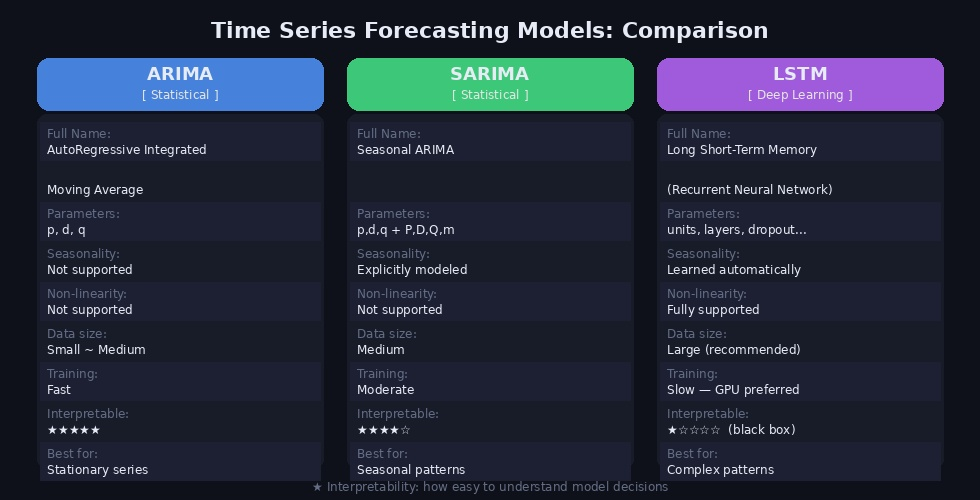
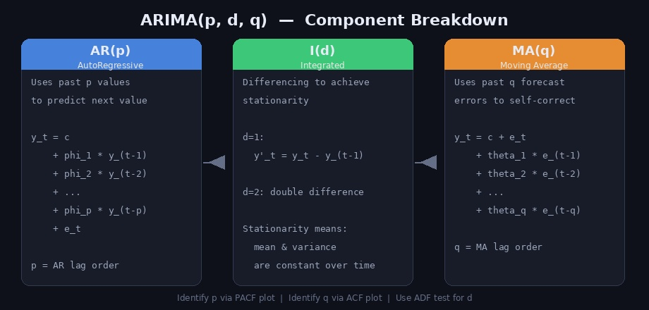
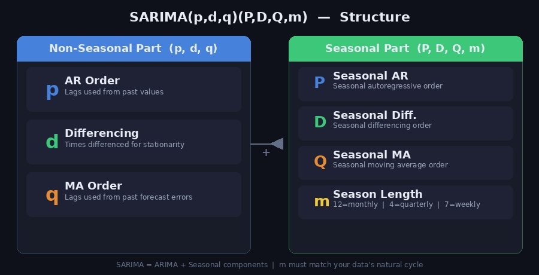
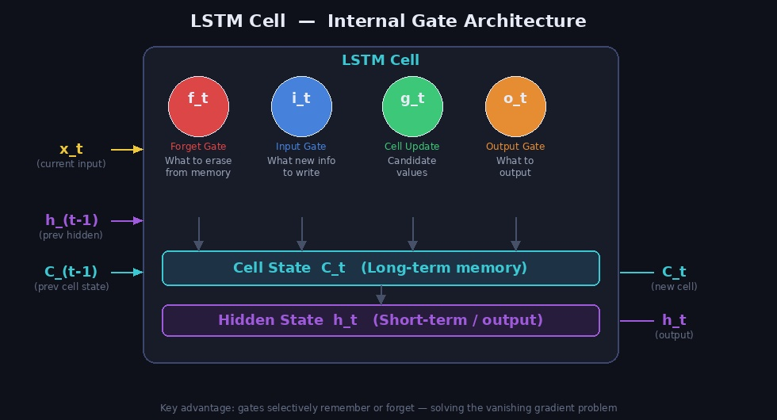

환율 예측 프로젝트를 진행하면서 다양한 시계열 분석 모델을 조사하고 논문도 읽어봤습니다. 그 과정에서 공부한 내용을 ARIMA, SARIMA, LSTM 세 가지 모델을 중심으로 정리합니다.

---

## 시계열 데이터란?

**시계열(Time Series)** 데이터는 시간 순서대로 기록된 데이터입니다. 환율, 주가, 기온, 판매량 등이 대표적인 예입니다.

시계열 분석의 핵심 개념:

- **추세(Trend)**: 장기적인 증가/감소 방향
- **계절성(Seasonality)**: 일정 주기로 반복되는 패턴 (월별, 분기별 등)
- **잔차(Residual)**: 추세와 계절성을 제거한 나머지 불규칙 성분
- **정상성(Stationarity)**: 평균과 분산이 시간에 따라 일정한 성질 → 대부분의 통계 모델이 전제로 요구

---

## 세 가지 모델 한눈에 비교



| | ARIMA | SARIMA | LSTM |
|---|---|---|---|
| 유형 | 통계 모델 | 통계 모델 | 딥러닝 |
| 계절성 처리 | ❌ | ✅ | ✅ (자동 학습) |
| 비선형 관계 | ❌ | ❌ | ✅ |
| 필요 데이터 양 | 소~중 | 중 | 대 |
| 해석 가능성 | 높음 | 높음 | 낮음 (블랙박스) |

---

## ARIMA

### 개념

**ARIMA(AutoRegressive Integrated Moving Average)** 는 시계열 분석에서 가장 널리 쓰이는 통계 모델입니다. 세 가지 구성 요소의 조합입니다.



- **AR(p)**: 과거 p개의 값으로 현재 값을 예측 (자기회귀)
- **I(d)**: d번 차분하여 정상성을 확보 (누적/적분)
- **MA(q)**: 과거 q개의 예측 오차를 이용해 보정 (이동평균)

### 수식

$$y_t = c + \phi_1 y_{t-1} + \cdots + \phi_p y_{t-p} + \theta_1 e_{t-1} + \cdots + \theta_q e_{t-q} + e_t$$

### 파라미터 선택 방법

| 파라미터 | 도구 | 기준 |
|---|---|---|
| d | ADF 검정 (단위근 검정) | p-value < 0.05이면 정상 → d 결정 |
| p | PACF 그래프 | 절단점(cut-off) 위치 |
| q | ACF 그래프 | 절단점(cut-off) 위치 |

### Python 구현

```python
import pandas as pd
from statsmodels.tsa.arima.model import ARIMA
from statsmodels.tsa.stattools import adfuller
import matplotlib.pyplot as plt

# 1. 정상성 검정 (ADF Test)
def check_stationarity(series):
    result = adfuller(series)
    print(f"ADF Statistic : {result[0]:.4f}")
    print(f"p-value       : {result[1]:.4f}")
    print("정상 시계열" if result[1] < 0.05 else "비정상 시계열 → 차분 필요")

# 2. ARIMA 모델 학습
df = pd.read_csv("exchange_rate.csv", index_col="date", parse_dates=True)
series = df["USD_KRW"]

check_stationarity(series)

model = ARIMA(series, order=(2, 1, 2))  # p=2, d=1, q=2
result = model.fit()
print(result.summary())

# 3. 예측
forecast = result.forecast(steps=30)
plt.plot(series[-60:], label="Actual")
plt.plot(forecast, label="Forecast")
plt.legend()
plt.show()
```

### 자동 파라미터 탐색 (auto_arima)

직접 ACF/PACF를 보지 않고 자동으로 최적 파라미터를 찾을 수도 있습니다.

```python
from pmdarima import auto_arima

model = auto_arima(
    series,
    start_p=0, max_p=5,
    start_q=0, max_q=5,
    d=None,           # 자동 차분 횟수 결정
    information_criterion="aic",
    seasonal=False,
    trace=True
)
print(model.summary())
```

---

## SARIMA

### 개념

**SARIMA(Seasonal ARIMA)** 는 ARIMA에 계절성 성분을 추가한 모델입니다. 환율처럼 연말/연초, 분기 마감 등 계절적 패턴이 있는 데이터에 더 적합합니다.



표기: **SARIMA(p, d, q)(P, D, Q, m)**

- 소문자 p, d, q: 비계절 ARIMA 파라미터 (위와 동일)
- 대문자 P, D, Q: 계절 AR, 차분, MA 차수
- **m**: 계절 주기 (월별=12, 분기별=4, 주별=7)

### Python 구현

```python
from statsmodels.tsa.statespace.sarimax import SARIMAX

model = SARIMAX(
    series,
    order=(1, 1, 1),            # (p, d, q)
    seasonal_order=(1, 1, 1, 12)  # (P, D, Q, m) — 월별 계절성
)
result = model.fit(disp=False)
print(result.summary())

# 예측
forecast = result.forecast(steps=12)  # 12개월 예측
```

### auto_arima로 SARIMA 탐색

```python
model = auto_arima(
    series,
    seasonal=True,
    m=12,               # 월별 계절성
    start_p=0, max_p=3,
    start_q=0, max_q=3,
    start_P=0, max_P=2,
    start_Q=0, max_Q=2,
    information_criterion="aic",
    trace=True
)
```

### 모델 평가 지표

```python
from sklearn.metrics import mean_squared_error, mean_absolute_error
import numpy as np

# Train/Test split
train = series[:-30]
test  = series[-30:]

# 예측
model = SARIMAX(train, order=(1,1,1), seasonal_order=(1,1,1,12)).fit(disp=False)
pred  = model.forecast(steps=30)

rmse = np.sqrt(mean_squared_error(test, pred))
mae  = mean_absolute_error(test, pred)
mape = np.mean(np.abs((test - pred) / test)) * 100

print(f"RMSE : {rmse:.4f}")
print(f"MAE  : {mae:.4f}")
print(f"MAPE : {mape:.2f}%")
```

---

## LSTM

### 개념

**LSTM(Long Short-Term Memory)** 은 순환 신경망(RNN)의 한 종류로, 장기 의존성(long-term dependency) 문제를 해결하기 위해 설계되었습니다. 기존 RNN은 시퀀스가 길어질수록 기울기 소실(Vanishing Gradient) 문제로 앞부분 정보를 잊어버리는데, LSTM은 게이트(Gate) 구조로 이를 해결합니다.



### LSTM의 4가지 핵심 구성요소

| 게이트 | 수식 | 역할 |
|---|---|---|
| **Forget Gate** | $f_t = \sigma(W_f \cdot [h_{t-1}, x_t] + b_f)$ | 이전 Cell State에서 무엇을 지울지 결정 |
| **Input Gate** | $i_t = \sigma(W_i \cdot [h_{t-1}, x_t] + b_i)$ | 새 정보를 얼마나 저장할지 결정 |
| **Cell Update** | $\tilde{C}_t = \tanh(W_C \cdot [h_{t-1}, x_t] + b_C)$ | 새로 추가될 후보 값 생성 |
| **Output Gate** | $o_t = \sigma(W_o \cdot [h_{t-1}, x_t] + b_o)$ | Cell State에서 무엇을 출력할지 결정 |

- **Cell State ($C_t$)**: 장기 기억 — 컨베이어 벨트처럼 정보가 흐름
- **Hidden State ($h_t$)**: 단기 기억 + 출력값

### Python 구현 (TensorFlow/Keras)

#### 데이터 전처리

```python
import numpy as np
import pandas as pd
from sklearn.preprocessing import MinMaxScaler

df = pd.read_csv("exchange_rate.csv", index_col="date", parse_dates=True)
series = df["USD_KRW"].values.reshape(-1, 1)

# 정규화 (LSTM은 0~1 스케일 권장)
scaler = MinMaxScaler()
scaled = scaler.fit_transform(series)

# 시퀀스 생성 함수
def create_sequences(data, window_size):
    X, y = [], []
    for i in range(len(data) - window_size):
        X.append(data[i:i+window_size])
        y.append(data[i+window_size])
    return np.array(X), np.array(y)

WINDOW = 60  # 60일 데이터로 다음날 예측
X, y = create_sequences(scaled, WINDOW)

# Train/Test split (80:20)
split = int(len(X) * 0.8)
X_train, X_test = X[:split], X[split:]
y_train, y_test = y[:split], y[split:]
```

#### 모델 구성 및 학습

```python
from tensorflow.keras.models import Sequential
from tensorflow.keras.layers import LSTM, Dense, Dropout
from tensorflow.keras.callbacks import EarlyStopping

model = Sequential([
    LSTM(64, return_sequences=True, input_shape=(WINDOW, 1)),
    Dropout(0.2),
    LSTM(32, return_sequences=False),
    Dropout(0.2),
    Dense(1)
])

model.compile(optimizer="adam", loss="mse")
model.summary()

early_stop = EarlyStopping(monitor="val_loss", patience=10, restore_best_weights=True)

history = model.fit(
    X_train, y_train,
    epochs=100,
    batch_size=32,
    validation_split=0.1,
    callbacks=[early_stop],
    verbose=1
)
```

#### 예측 및 역정규화

```python
pred_scaled = model.predict(X_test)
pred = scaler.inverse_transform(pred_scaled)
actual = scaler.inverse_transform(y_test)

import matplotlib.pyplot as plt

plt.figure(figsize=(14, 5))
plt.plot(actual, label="Actual", color="steelblue")
plt.plot(pred,   label="LSTM Forecast", color="tomato")
plt.title("Exchange Rate Prediction — LSTM")
plt.legend()
plt.tight_layout()
plt.show()
```

### 하이퍼파라미터 튜닝 포인트

| 파라미터 | 설명 | 권장 범위 |
|---|---|---|
| `window_size` | 입력 시퀀스 길이 | 30 ~ 120 |
| `units` | LSTM 유닛 수 | 32 ~ 256 |
| `layers` | LSTM 레이어 수 | 1 ~ 3 |
| `dropout` | 과적합 방지 | 0.1 ~ 0.3 |
| `batch_size` | 배치 크기 | 16 ~ 64 |
| `learning_rate` | Adam 학습률 | 0.001 ~ 0.0001 |

---

## 모델 선택 가이드

실제 프로젝트에서 어떤 모델을 선택해야 할지 판단 기준입니다.

```
데이터에 계절성이 있는가?
├── YES → SARIMA (통계) 또는 LSTM (딥러닝)
└── NO  → ARIMA (통계) 또는 LSTM (딥러닝)

데이터 양이 충분한가? (수천 개 이상)
├── YES → LSTM 시도 가능
└── NO  → ARIMA / SARIMA 권장

모델 해석이 중요한가?
├── YES → ARIMA / SARIMA
└── NO  → LSTM (예측 정확도 우선)

빠른 프로토타이핑이 필요한가?
└── YES → auto_arima → SARIMA 순서 권장
```

---

## 환율 예측에서 느낀 점

실제로 USD/KRW 환율 데이터로 세 모델을 비교해보면서 느낀 점입니다.

- **ARIMA/SARIMA**: 단기(1~5일) 예측에서 안정적이었고, 파라미터 해석이 직관적이었습니다. 하지만 환율의 급격한 변동(뉴스, 정책 이벤트)을 전혀 반영하지 못합니다.
- **LSTM**: 패턴 학습 능력은 뛰어나지만, 데이터 양과 하이퍼파라미터에 매우 민감합니다. 과적합에 주의가 필요하고, 학습/검증 곡선을 꼼꼼히 모니터링해야 합니다.
- **공통 한계**: 세 모델 모두 외부 변수(금리, 유가, 지정학적 이슈)를 반영하지 못합니다. 외부 변수를 포함하려면 SARIMAX(외생 변수 포함 SARIMA)나 멀티변량 LSTM을 고려해야 합니다.

---

## 참고 자료

- Box, G.E.P. & Jenkins, G.M. (1976). *Time Series Analysis: Forecasting and Control*
- Hochreiter, S. & Schmidhuber, J. (1997). [Long Short-Term Memory](https://www.bioinf.jku.at/publications/older/2604.pdf). *Neural Computation, 9(8)*
- [statsmodels ARIMA 공식 문서](https://www.statsmodels.org/stable/generated/statsmodels.tsa.arima.model.ARIMA.html)
- [Keras LSTM 공식 문서](https://keras.io/api/layers/recurrent_layers/lstm/)
- Claude AI