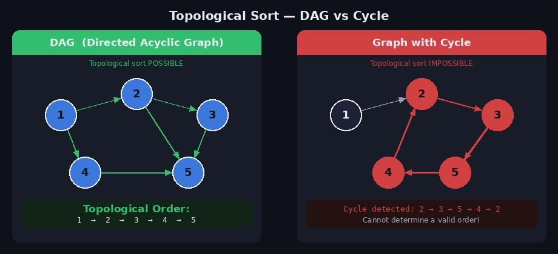
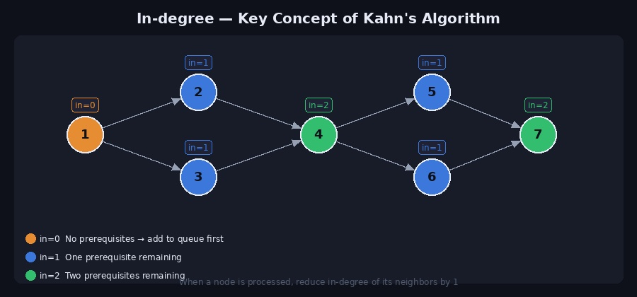
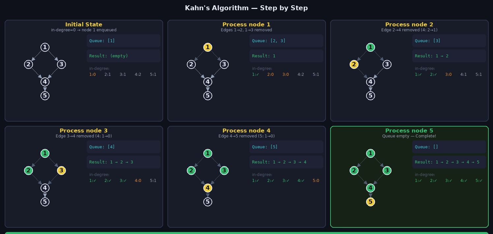
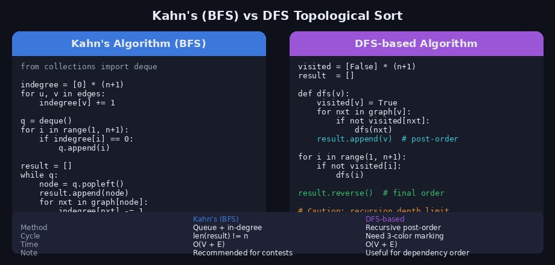

수강신청을 할 때 선수과목을 먼저 들어야 하는 것처럼, 작업들 사이에 **선후 관계**가 있을 때 올바른 실행 순서를 결정하는 알고리즘이 **위상 정렬(Topological Sort)** 입니다.

---

## 1. 위상 정렬이란?

**위상 정렬**은 **방향 비순환 그래프(DAG, Directed Acyclic Graph)** 에서 간선의 방향을 거스르지 않도록 모든 노드를 선형으로 나열하는 알고리즘입니다.

> `u → v` 간선이 있다면, 결과 순서에서 u는 반드시 v보다 앞에 위치합니다.

### 조건

위상 정렬이 가능하려면 반드시 **DAG** 여야 합니다.

- **방향 그래프(Directed)**: 간선에 방향이 있어야 함
- **비순환(Acyclic)**: 사이클이 없어야 함 → 사이클이 있으면 위상 정렬 불가능



### 위상 정렬 결과는 유일하지 않다

같은 그래프에서도 여러 가지 올바른 위상 순서가 존재할 수 있습니다.

```
그래프: 1→3, 2→3, 3→4

가능한 위상 순서:
1 → 2 → 3 → 4
2 → 1 → 3 → 4
```

### 실생활 예시

```
수강신청  : 선수과목 → 본과목
빌드 시스템: 의존 모듈 → 메인 모듈
작업 스케줄: 선행 작업 → 후행 작업
패키지 설치: 의존 패키지 → 대상 패키지
```

---

## 2. 핵심 개념 — 진입차수 (In-degree)



**진입차수(In-degree)** 는 특정 노드로 들어오는 간선의 수입니다.

```
A → C
B → C     →  C의 진입차수 = 2
D → C
```

위상 정렬의 핵심 아이디어는 다음과 같습니다.

> **진입차수가 0인 노드 = 선수 조건이 없는 노드 = 지금 당장 처리 가능한 노드**

노드를 처리할 때마다 해당 노드와 연결된 다음 노드들의 진입차수를 1씩 줄입니다. 그 결과 진입차수가 0이 된 노드를 다시 처리 대상에 추가하면, 자연스럽게 올바른 순서가 만들어집니다.

---

## 3. Kahn's Algorithm (BFS 기반)

진입차수와 큐를 이용한 BFS 방식으로, 코딩테스트에서 가장 많이 사용되는 구현법입니다.



### 동작 순서

```
1. 모든 노드의 진입차수를 계산한다
2. 진입차수가 0인 노드를 모두 큐에 삽입한다
3. 큐에서 노드를 꺼내 결과에 추가한다
4. 꺼낸 노드와 연결된 모든 이웃 노드의 진입차수를 1 줄인다
5. 진입차수가 0이 된 이웃 노드를 큐에 삽입한다
6. 큐가 빌 때까지 3~5를 반복한다
```

### Python 구현

```python
from collections import deque

def topological_sort(n, edges):
    """
    n: 노드 수 (1번 ~ n번)
    edges: [(u, v), ...] — u → v 방향
    """
    graph   = [[] for _ in range(n + 1)]
    indegree = [0] * (n + 1)

    for u, v in edges:
        graph[u].append(v)
        indegree[v] += 1

    # 진입차수 0인 노드를 큐에 삽입
    queue = deque()
    for i in range(1, n + 1):
        if indegree[i] == 0:
            queue.append(i)

    result = []
    while queue:
        node = queue.popleft()
        result.append(node)

        for nxt in graph[node]:
            indegree[nxt] -= 1
            if indegree[nxt] == 0:
                queue.append(nxt)

    return result


# 예시 입력
n = 5
edges = [(1,2),(1,3),(2,4),(3,4),(4,5)]
print(topological_sort(n, edges))
# [1, 2, 3, 4, 5]  또는  [1, 3, 2, 4, 5]
```

### 사이클 감지

Kahn's Algorithm에서는 결과 리스트의 길이가 전체 노드 수보다 적으면 사이클이 존재한다고 판단합니다.

```python
def topological_sort_with_cycle_check(n, edges):
    graph    = [[] for _ in range(n + 1)]
    indegree = [0] * (n + 1)

    for u, v in edges:
        graph[u].append(v)
        indegree[v] += 1

    queue = deque(i for i in range(1, n+1) if indegree[i] == 0)
    result = []

    while queue:
        node = queue.popleft()
        result.append(node)
        for nxt in graph[node]:
            indegree[nxt] -= 1
            if indegree[nxt] == 0:
                queue.append(nxt)

    if len(result) != n:
        return None   # 사이클 존재 → 위상 정렬 불가능
    return result
```

---

## 4. DFS 기반 위상 정렬

DFS로 모든 노드를 탐색하면서, **탐색이 완전히 끝난 노드를 스택에 쌓고** 마지막에 뒤집으면 위상 순서가 됩니다.



### 핵심 아이디어

DFS에서 노드의 모든 후손을 탐색한 뒤 해당 노드를 결과에 추가합니다. 이를 **후위 순회(post-order)** 라고 합니다. 마지막에 결과를 뒤집으면 위상 순서가 됩니다.

```python
import sys
sys.setrecursionlimit(10**6)

def topological_sort_dfs(n, edges):
    graph   = [[] for _ in range(n + 1)]
    visited = [False] * (n + 1)
    result  = []

    for u, v in edges:
        graph[u].append(v)

    def dfs(v):
        visited[v] = True
        for nxt in graph[v]:
            if not visited[nxt]:
                dfs(nxt)
        result.append(v)   # 후위 삽입 — 모든 후손 처리 후 추가

    for i in range(1, n + 1):
        if not visited[i]:
            dfs(i)

    result.reverse()   # 뒤집으면 위상 순서
    return result
```

### 왜 뒤집는가?

```
그래프: 1→2→3

DFS(1) 호출 → DFS(2) 호출 → DFS(3) 호출
DFS(3) 종료 → result.append(3)  → [3]
DFS(2) 종료 → result.append(2)  → [3, 2]
DFS(1) 종료 → result.append(1)  → [3, 2, 1]

reverse() → [1, 2, 3]  ← 올바른 위상 순서
```

### 스택 기반 반복 구현 (재귀 깊이 제한 회피)

```python
def topological_sort_iterative(n, edges):
    graph   = [[] for _ in range(n + 1)]
    visited = [False] * (n + 1)
    result  = []

    for u, v in edges:
        graph[u].append(v)

    for start in range(1, n + 1):
        if visited[start]:
            continue

        stack = [(start, False)]

        while stack:
            node, processed = stack.pop()

            if processed:
                result.append(node)   # 후위 삽입
                continue

            if visited[node]:
                continue

            visited[node] = True
            stack.append((node, True))   # 나중에 후위 처리

            for nxt in graph[node]:
                if not visited[nxt]:
                    stack.append((nxt, False))

    result.reverse()
    return result
```

---

## 5. Kahn's vs DFS 비교

| | Kahn's Algorithm | DFS 기반 |
|--|-----------------|----------|
| 방식 | BFS + 진입차수 | 재귀 DFS + 후위 삽입 |
| 사이클 감지 | `len(result) != n` | 3-색 방문 처리 필요 |
| 시간복잡도 | O(V + E) | O(V + E) |
| 공간복잡도 | O(V + E) | O(V + E) |
| 구현 난이도 | 쉬움 | 보통 |
| 재귀 깊이 제한 | 없음 | 주의 필요 |
| 코딩테스트 | **권장** | 가능 |

---

## 6. 실전 예제 — 선수과목 순서 결정

```python
from collections import deque

def solve():
    # 과목 수, 선수 관계 수
    n, m = map(int, input().split())

    graph    = [[] for _ in range(n + 1)]
    indegree = [0] * (n + 1)

    for _ in range(m):
        u, v = map(int, input().split())   # u 수강 후 v 수강 가능
        graph[u].append(v)
        indegree[v] += 1

    queue = deque(i for i in range(1, n+1) if indegree[i] == 0)
    order = []

    while queue:
        cur = queue.popleft()
        order.append(cur)
        for nxt in graph[cur]:
            indegree[nxt] -= 1
            if indegree[nxt] == 0:
                queue.append(nxt)

    if len(order) == n:
        print(*order)
    else:
        print("순환 선수 조건이 있습니다.")

'''
입력 예시:
6 6
1 2
1 3
2 4
3 4
4 5
4 6

출력: 1 2 3 4 5 6
  또는 1 3 2 4 5 6 (둘 다 정답)
'''
```

### 각 노드의 최소 수행 시간 계산

각 과목의 수강 시간이 주어질 때, 가장 늦게 끝나는 시간을 계산합니다.

```python
from collections import deque

def earliest_completion(n, times, edges):
    """
    times: 각 노드(과목)의 처리 시간 리스트 (1-indexed)
    반환: 각 노드의 가장 빠른 완료 시간
    """
    graph    = [[] for _ in range(n + 1)]
    indegree = [0] * (n + 1)
    dist     = [0] * (n + 1)   # 각 노드까지의 최소 완료 시간

    for u, v in edges:
        graph[u].append(v)
        indegree[v] += 1

    queue = deque()
    for i in range(1, n + 1):
        if indegree[i] == 0:
            queue.append(i)
            dist[i] = times[i]

    while queue:
        node = queue.popleft()
        for nxt in graph[node]:
            # 이전 노드의 완료 시간 + 현재 노드의 처리 시간
            dist[nxt] = max(dist[nxt], dist[node] + times[nxt])
            indegree[nxt] -= 1
            if indegree[nxt] == 0:
                queue.append(nxt)

    return dist
```

---

## 7. 주의할 점

**1. 위상 정렬 결과는 유일하지 않을 수 있다**

```python
# 1→3, 2→3 인 경우
# [1, 2, 3] 도 맞고 [2, 1, 3] 도 맞습니다.
# 문제에서 "사전순"이나 "특정 순서"를 요구하면 우선순위 큐 사용
from heapq import heappush, heappop

queue = []
for i in range(1, n+1):
    if indegree[i] == 0:
        heappush(queue, i)   # 최소 힙으로 사전순 보장

while queue:
    node = heappop(queue)
    ...
```

**2. 사이클 확인 필수**

```python
# 결과 길이가 n이 아니면 사이클 존재
result = topological_sort(n, edges)
if len(result) != n:
    print("위상 정렬 불가 — 사이클 존재")
```

**3. DFS 재귀 깊이 제한**

```python
import sys
sys.setrecursionlimit(10**6)  # DFS 기반 구현 시 반드시 설정
```

---

## 8. 관련 백준 문제

| 문제 | 난이도 | 설명 |
|------|--------|------|
| [2252 줄 세우기](https://www.acmicpc.net/problem/2252) | Gold III | 위상 정렬 기본 문제 |
| [1005 ACM Craft](https://www.acmicpc.net/problem/1005) | Gold III | 위상 정렬 + 최장 경로 |
| [1516 게임 개발](https://www.acmicpc.net/problem/1516) | Gold III | 위상 정렬 + DP |
| [3665 최종 순위](https://www.acmicpc.net/problem/3665) | Gold I | 위상 정렬 + 사이클 감지 |
| [2623 음악 프로그램](https://www.acmicpc.net/problem/2623) | Gold III | 위상 정렬 활용 |

---

## 참고 자료

- [Wikipedia — Topological sorting](https://en.wikipedia.org/wiki/Topological_sorting)
- Claude AI