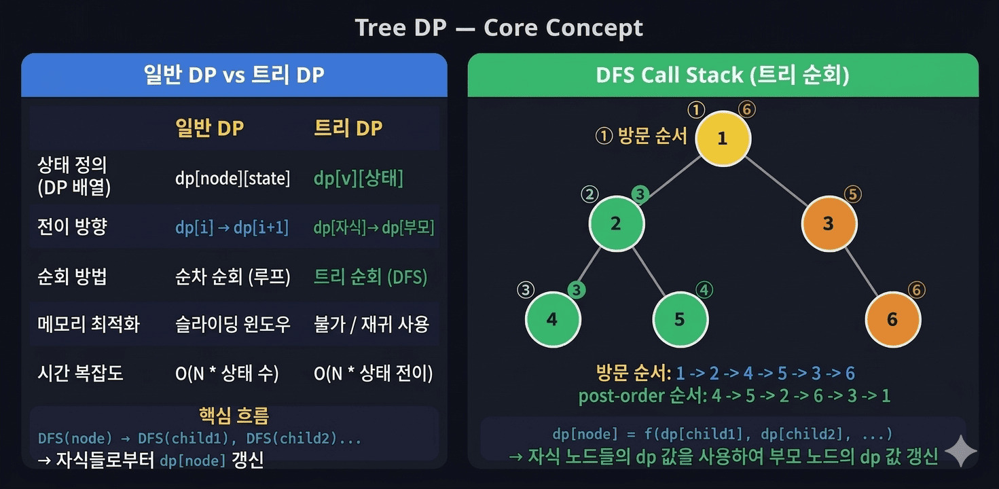
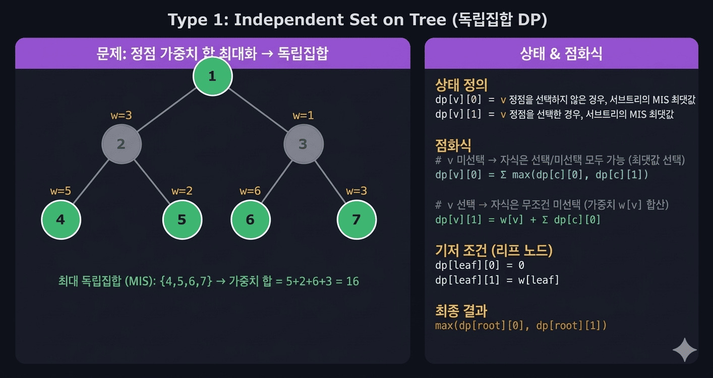
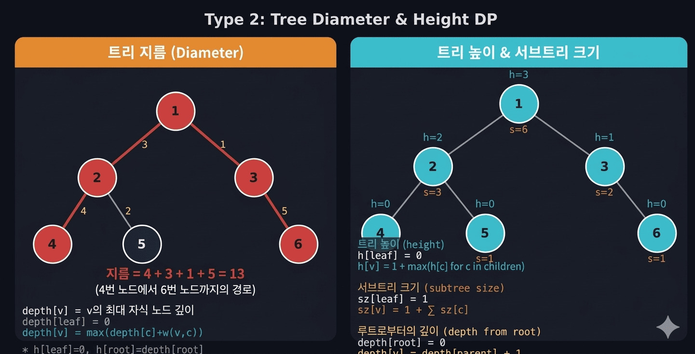
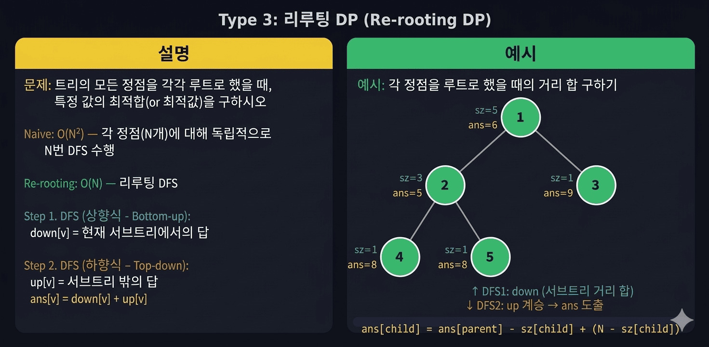

트리 DP는 일반 DP와 다르게 **계층 구조의 트리** 위에서 상태를 전이합니다. 핵심은 DFS로 트리를 탐색하면서 **자식 노드의 결과를 먼저 계산한 뒤 부모 노드로 전달**하는 것입니다. 처음에는 낯설지만 패턴을 익히면 비슷한 문제를 일관되게 풀 수 있습니다.

---

## 1. 트리 DP란?



### 일반 DP vs 트리 DP

| | 일반 DP | 트리 DP |
|--|---------|---------|
| 자료 구조 | 배열, 수열 (선형) | 트리 (계층) |
| 상태 전이 | dp[i] → dp[i+1] | 부모 ← 자식 |
| 탐색 방식 | 반복문 | **DFS 재귀** |
| 처리 순서 | 왼쪽 → 오른쪽 | **자식 → 부모** |
| dp 테이블 | 1D / 2D 배열 | dp[node][state] |

### 핵심 흐름

```
DFS(node)
    for child in children[node]:
        DFS(child)   ← 자식 먼저 계산
    dp[node] = f(dp[child1], dp[child2], ...)  ← 자식 결과로 부모 계산
```

트리 DP는 본질적으로 **후위 순회(post-order DFS)** 입니다. 리프 노드에서 시작해 루트 방향으로 값이 쌓여 올라갑니다.

---

## 2. 기본 템플릿

트리 DP 문제를 풀 때 항상 이 구조에서 출발합니다.

```python
import sys
from collections import defaultdict
sys.setrecursionlimit(10**6)
input = sys.stdin.readline

def dfs(v, parent):
    for child in graph[v]:
        if child == parent:    # 부모 방향으로 올라가지 않도록
            continue
        dfs(child, v)          # 자식 먼저 계산 (후위 순회)
        # dp[v] 갱신: 자식의 결과를 활용
        dp[v] = update(dp[v], dp[child])

n = int(input())
graph = defaultdict(list)
for _ in range(n - 1):
    u, v = map(int, input().split())
    graph[u].append(v)
    graph[v].append(u)    # 무방향 그래프

dp = [초기값] * (n + 1)
dfs(1, 0)                 # 루트 1, 부모 없음(0)
print(dp[1])
```

> **방향 없는 트리(무방향 그래프)** 에서는 `parent` 변수로 부모 방향 역행을 막아야 합니다. 방문 배열 대신 `parent` 인자를 사용하는 것이 트리 DP의 표준 패턴입니다.

---

## 3. 유형 1 — 선택/미선택 DP



### 문제 유형

> "인접한 두 노드를 동시에 선택할 수 없다. 각 노드에 가중치가 있을 때 선택한 노드의 가중치 합의 최대를 구하라."

대표 문제: **백준 2533 (SNS)**, **백준 1949 (우수 마을)**

### 상태 설계

```
dp[v][0] = 노드 v를 선택하지 않았을 때, v의 서브트리에서 얻을 수 있는 최대 가중치
dp[v][1] = 노드 v를 선택했을 때, v의 서브트리에서 얻을 수 있는 최대 가중치
```

### 점화식

```
v를 선택 안 함 → 자식은 선택/미선택 모두 가능
dp[v][0] = Σ max(dp[c][0], dp[c][1])   (c: v의 자식)

v를 선택    → 자식은 반드시 미선택
dp[v][1] = w[v] + Σ dp[c][0]

초기값 (리프 노드):
dp[leaf][0] = 0
dp[leaf][1] = w[leaf]

최종 답: max(dp[root][0], dp[root][1])
```

### Python 구현

```python
import sys
from collections import defaultdict
sys.setrecursionlimit(10**6)
input = sys.stdin.readline

def dfs(v, parent):
    dp[v][0] = 0
    dp[v][1] = weight[v]    # v를 선택하는 경우 기본값 = 자신의 가중치

    for child in graph[v]:
        if child == parent:
            continue
        dfs(child, v)

        # v 미선택: 자식은 선택/미선택 중 최대
        dp[v][0] += max(dp[child][0], dp[child][1])
        # v 선택: 자식은 반드시 미선택
        dp[v][1] += dp[child][0]


n = int(input())
weight = [0] + list(map(int, input().split()))   # 1-indexed
graph = defaultdict(list)
for _ in range(n - 1):
    u, v = map(int, input().split())
    graph[u].append(v)
    graph[v].append(u)

dp = [[0, 0] for _ in range(n + 1)]
dfs(1, 0)
print(max(dp[1][0], dp[1][1]))
```

### 응용: 최소 정점 커버 (백준 2533)

```python
# SNS에서 얼리어답터 최솟값
# dp[v][0] = v가 얼리어답터 아님 (자식은 모두 얼리어답터여야 함)
# dp[v][1] = v가 얼리어답터

def dfs(v, parent):
    dp[v][0] = 0
    dp[v][1] = 1    # 자신 포함

    for child in graph[v]:
        if child == parent:
            continue
        dfs(child, v)

        dp[v][0] += dp[child][1]              # 자식은 반드시 얼리어답터
        dp[v][1] += min(dp[child][0], dp[child][1])  # 자식은 둘 중 최솟값

print(min(dp[1][0], dp[1][1]))
```

---

## 4. 유형 2 — 트리의 높이 / 서브트리 크기 / 깊이



### 서브트리 크기 (subtree size)

```python
sz = [1] * (n + 1)   # 자기 자신 포함

def dfs(v, parent):
    for child in graph[v]:
        if child == parent:
            continue
        dfs(child, v)
        sz[v] += sz[child]   # 자식 크기를 부모에 누적
```

### 트리의 높이 (height)

```python
h = [0] * (n + 1)    # 리프의 높이 = 0

def dfs(v, parent):
    for child in graph[v]:
        if child == parent:
            continue
        dfs(child, v)
        h[v] = max(h[v], h[child] + 1)  # 자식 높이 + 1
```

### 깊이 (depth) — 루트에서 내려오며 계산

```python
depth = [0] * (n + 1)   # 루트의 깊이 = 0

def dfs(v, parent):
    for child in graph[v]:
        if child == parent:
            continue
        depth[child] = depth[v] + 1    # 부모 깊이 + 1 (top-down)
        dfs(child, v)
```

---

## 5. 유형 3 — 트리의 지름 (Tree Diameter)

트리에서 임의의 두 노드 사이의 거리 중 **가장 긴 것**을 트리의 지름이라고 합니다.

### 핵심 아이디어

지름은 특정 노드를 "꺾이는 점"으로 하는 두 서브트리 방향의 깊이 합이 최대인 경우입니다.

```
지름 후보 = depth_max1[v] + depth_max2[v]
(v에서 뻗어 나가는 두 가장 긴 경로의 합)
```

### Python 구현

```python
import sys
from collections import defaultdict
sys.setrecursionlimit(10**6)
input = sys.stdin.readline

n = int(input())
graph = defaultdict(list)
for _ in range(n - 1):
    u, v, w = map(int, input().split())
    graph[u].append((v, w))
    graph[v].append((u, w))

ans = 0
depth = [0] * (n + 1)   # depth[v]: v에서 자식 방향 최대 거리

def dfs(v, parent):
    global ans
    depths = []   # 이 노드에서 각 자식 방향 깊이

    for child, w in graph[v]:
        if child == parent:
            continue
        dfs(child, v)
        depths.append(depth[child] + w)

    depths.sort(reverse=True)

    # 가장 긴 두 경로의 합이 지름 후보
    if len(depths) >= 2:
        ans = max(ans, depths[0] + depths[1])
    if len(depths) >= 1:
        ans = max(ans, depths[0])   # 자식이 하나인 경우도 고려

    depth[v] = depths[0] if depths else 0

dfs(1, 0)
print(ans)
```

### 가중치 없는 트리의 지름 (BFS 두 번)

```python
from collections import deque

def bfs(start, graph, n):
    dist = [-1] * (n + 1)
    dist[start] = 0
    q = deque([start])
    far_node = start

    while q:
        v = q.popleft()
        for u in graph[v]:
            if dist[u] == -1:
                dist[u] = dist[v] + 1
                q.append(u)
                if dist[u] > dist[far_node]:
                    far_node = u
    return far_node, dist[far_node]

# 임의의 노드에서 가장 먼 노드 A 찾기
A, _ = bfs(1, graph, n)
# A에서 가장 먼 노드 B까지의 거리 = 지름
B, diameter = bfs(A, graph, n)
print(diameter)
```

---

## 6. 유형 4 — 재루팅 DP (Re-rooting)



### 언제 필요한가?

> "모든 노드를 루트로 설정했을 때의 값을 각각 구하라."

예: "각 노드에서 다른 모든 노드까지의 거리 합" → 모든 노드에 대해 O(N)씩 구하면 O(N²). 재루팅으로 O(N)에 해결합니다.

### 핵심 아이디어

```
DFS 1번 (아래 → 위): down[v] 계산
    서브트리 안에서의 값 (루트 기준 부분 정보)

DFS 2번 (위 → 아래): up[v] 전파
    부모가 자신의 up 정보를 자식에게 내려줌
    ans[v] = down[v] + up[v]
```

### 예제: 각 노드에서 모든 노드까지의 거리 합

```python
import sys
from collections import defaultdict
sys.setrecursionlimit(10**6)
input = sys.stdin.readline

n = int(input())
graph = defaultdict(list)
for _ in range(n - 1):
    u, v = map(int, input().split())
    graph[u].append(v)
    graph[v].append(u)

sz   = [1] * (n + 1)   # 서브트리 크기
down = [0] * (n + 1)   # 서브트리 내 거리 합
ans  = [0] * (n + 1)   # 최종 답 (각 노드에서 전체 거리 합)

# DFS 1: down 계산 (아래 → 위)
def dfs1(v, parent):
    for child in graph[v]:
        if child == parent:
            continue
        dfs1(child, v)
        sz[v]   += sz[child]
        down[v] += down[child] + sz[child]  # 자식 서브트리까지 거리 += 크기

# DFS 2: ans 계산 (위 → 아래)
def dfs2(v, parent):
    for child in graph[v]:
        if child == parent:
            continue
        # child를 루트로 바꿀 때:
        # child 서브트리 바깥 노드 수 = n - sz[child]
        # ans[child] = ans[v] - sz[child] + (n - sz[child])
        ans[child] = ans[v] - sz[child] + (n - sz[child])
        dfs2(child, v)

dfs1(1, 0)
ans[1] = down[1]   # 루트의 답 = down값
dfs2(1, 0)

for i in range(1, n + 1):
    print(ans[i])
```

### 왜 `ans[child] = ans[v] - sz[child] + (n - sz[child])` 인가?

```
루트를 v에서 child로 바꾸면:
- child 서브트리의 모든 노드(sz[child]개)는 child에 1씩 가까워짐
  → ans[v]에서 sz[child] 빼기
- 나머지 노드(n - sz[child]개)는 child에 1씩 멀어짐
  → ans[v]에 (n - sz[child]) 더하기
```

---

## 7. 유형 5 — 트리 DP + 배낭 (Knapsack on Tree)

각 서브트리에서 k개를 선택하는 문제 등에 활용합니다.

```python
# dp[v][k] = v의 서브트리에서 정확히 k개를 선택할 때의 최대 가중치
# 각 자식 서브트리를 하나씩 합쳐나가며 배낭처럼 처리

def dfs(v, parent):
    dp[v] = [0] * (sz[v] + 1)   # 0개~sz[v]개 선택
    dp[v][0] = 0
    dp[v][1] = weight[v]
    cur_size = 1

    for child in graph[v]:
        if child == parent:
            continue
        dfs(child, v)

        # 두 dp 배열 합치기 (배낭 DP 방식)
        new_dp = [0] * (cur_size + sz[child] + 1)
        for j in range(cur_size + 1):
            for k in range(sz[child] + 1):
                new_dp[j + k] = max(new_dp[j + k], dp[v][j] + dp[child][k])

        dp[v] = new_dp
        cur_size += sz[child]
```

---

## 8. 실수 포인트 & 주의사항

### 1. 방문 처리 방법

```python
# ❌ 방법 1: visited 배열 사용 (불필요)
visited = [False] * (n + 1)
def dfs(v):
    visited[v] = True
    for u in graph[v]:
        if not visited[u]:
            dfs(u)

# ✅ 방법 2: parent 인자 전달 (트리 DP 표준)
def dfs(v, parent):
    for u in graph[v]:
        if u == parent:   # 부모 방향 역행 방지
            continue
        dfs(u, v)
```

### 2. 루트 설정

```python
# 트리 DP는 루트가 어디든 결과가 같아야 함 (re-rooting 아닌 경우)
# 루트를 1로 고정하고 풀면 됨

dfs(1, 0)   # 루트=1, 부모없음=0 (존재하지 않는 노드 번호)
```

### 3. 재귀 깊이 제한

```python
# 노드가 최대 N=10^6일 때 재귀가 N만큼 깊어질 수 있음
import sys
sys.setrecursionlimit(10**6)

# 또는 반복적 DFS (스택 사용)로 변환
```

### 4. 1-indexed vs 0-indexed

```python
# 트리 노드 번호는 보통 1부터 시작
n = int(input())
dp  = [0] * (n + 1)   # 인덱스 0은 더미
sz  = [1] * (n + 1)
```

### 5. 초기값 설정

```python
# 리프 노드에서 자동으로 초기화되려면
# 자식 루프가 실행되지 않을 때도 올바른 값이 나와야 함
dp[v][0] = 0      # 미선택: 리프에서는 기여 0
dp[v][1] = w[v]   # 선택: 리프에서는 자신의 가중치
```

---

## 9. 접근 전략 — 문제 보고 유형 파악하기

```
트리 + DP 냄새가 나면?
│
├── "인접한 노드 제약이 있다"
│   └── → 선택/미선택 DP  (dp[v][0/1])
│
├── "가장 긴 경로/지름을 구하라"
│   └── → 트리의 지름 DP  (depth + 전역 ans)
│
├── "서브트리의 크기/합/최대를 구하라"
│   └── → 기본 트리 DP  (dp[v] = f(dp[child]))
│
├── "모든 노드를 루트로 했을 때를 구하라"
│   └── → 재루팅 DP  (DFS 두 번)
│
└── "서브트리에서 k개를 선택하라"
    └── → 트리 배낭 DP  (dp[v][k])
```

---

## 10. 관련 백준 문제

| 문제 | 난이도 | 유형 |
|------|--------|------|
| [1967 트리의 지름](https://www.acmicpc.net/problem/1967) | Gold IV | 트리 지름 DP |
| [1167 트리의 지름](https://www.acmicpc.net/problem/1167) | Gold II | 트리 지름 BFS×2 |
| [2533 사회망 서비스](https://www.acmicpc.net/problem/2533) | Gold III | 선택/미선택 DP |
| [1949 우수 마을](https://www.acmicpc.net/problem/1949) | Gold II | 선택/미선택 DP |
| [1240 노드사이의 거리](https://www.acmicpc.net/problem/1240) | Gold V | 트리 거리 |
| [15681 트리와 쿼리](https://www.acmicpc.net/problem/15681) | Gold V | 서브트리 크기 |
| [2213 트리의 독립집합](https://www.acmicpc.net/problem/2213) | Gold I | 선택/미선택 + 경로 복원 |
| [1303 전쟁 - 전투](https://www.acmicpc.net/problem/1303) | Silver I | 서브트리 크기 응용 |