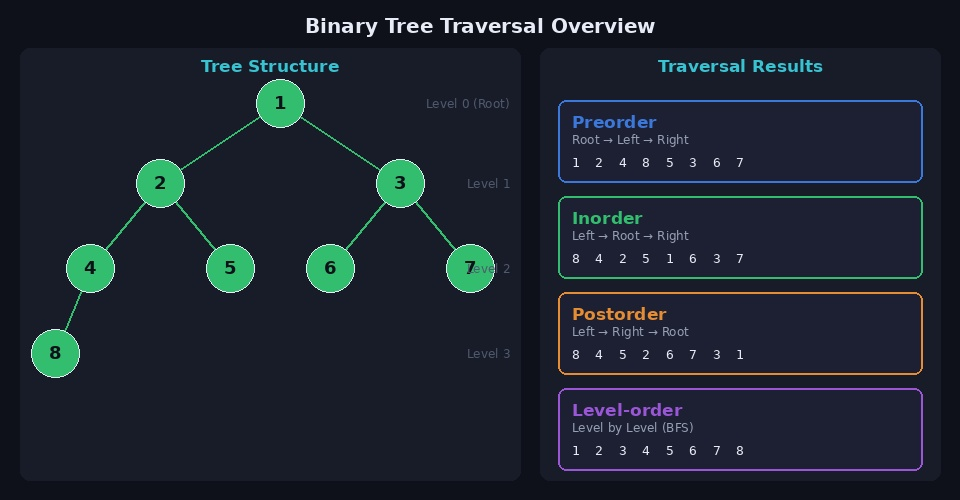
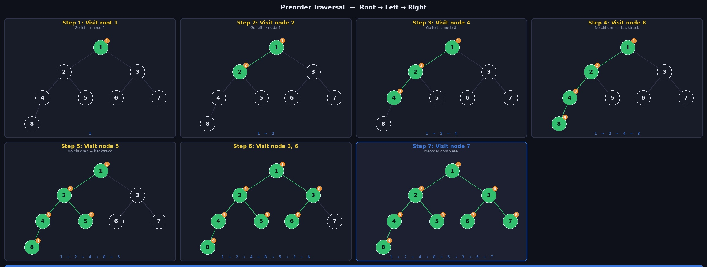
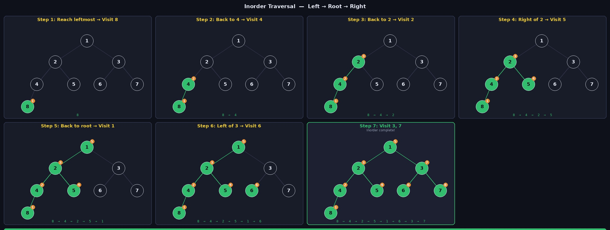
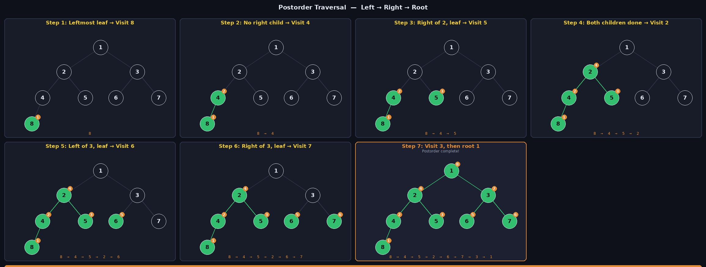
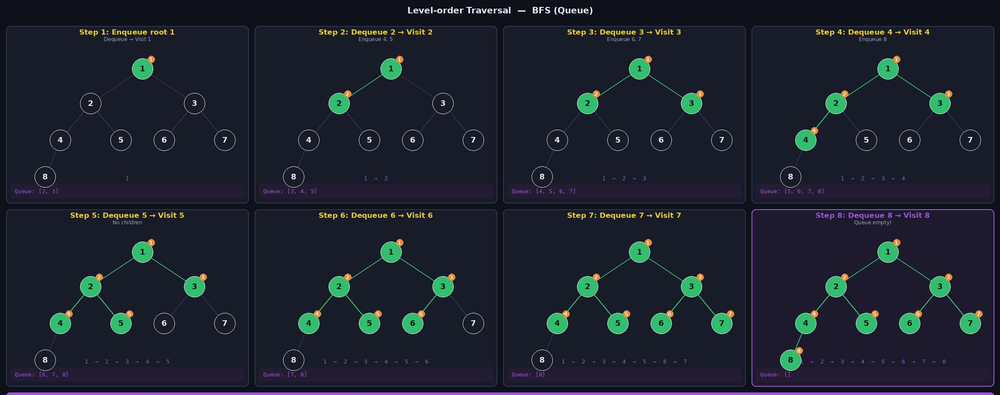

**순회(Traversal)** 란 트리의 모든 노드를 방문하면서 값을 확인하는 작업입니다. 어떤 노드를 먼저 방문하느냐에 따라 순회 방법이 달라지며, 이진 트리에서는 크게 네 가지로 나뉩니다. 전위, 중위, 후위 순회는 **재귀**로, 레벨 순회는 **큐(BFS)** 로 구현합니다.

---

## 트리 구조 및 예제

아래 트리를 기준으로 네 가지 순회를 설명합니다.

```
        1
      /   \
     2     3
    / \   / \
   4   5 6   7
  /
 8
```



| 순회 방법 | 방문 순서 | 결과 |
|-----------|-----------|------|
| 전위 순회 | Root → Left → Right | 1 2 4 8 5 3 6 7 |
| 중위 순회 | Left → Root → Right | 8 4 2 5 1 6 3 7 |
| 후위 순회 | Left → Right → Root | 8 4 5 2 6 7 3 1 |
| 레벨 순회 | 레벨 순서 (BFS) | 1 2 3 4 5 6 7 8 |

---

## 트리 구현 (Python)

```python
class Node:
    def __init__(self, item):
        self.item  = item
        self.left  = None
        self.right = None

class BinaryTree:
    def __init__(self):
        self.root = None
```

- `item`: 노드가 저장하는 값
- `left` / `right`: 왼쪽/오른쪽 자식 노드를 가리키는 포인터
- `BinaryTree`는 `root` 하나만 갖고, 노드를 연결해 트리를 구성

예제 트리 구성:

```python
BT = BinaryTree()
N1, N2, N3 = Node(1), Node(2), Node(3)
N4, N5, N6 = Node(4), Node(5), Node(6)
N7, N8     = Node(7), Node(8)

BT.root = N1
N1.left  = N2;  N1.right = N3
N2.left  = N4;  N2.right = N5
N3.left  = N6;  N3.right = N7
N4.left  = N8
```

---

## 전위 순회 (Preorder)

### 방문 순서

> **Root → Left → Right**

현재 노드를 먼저 방문한 뒤 왼쪽 서브트리, 오른쪽 서브트리 순으로 재귀 탐색합니다.



### 동작 흐름

```
1 방문 → 왼쪽(2)으로
2 방문 → 왼쪽(4)으로
4 방문 → 왼쪽(8)으로
8 방문 → 자식 없음 → 백트래킹
4의 오른쪽 없음 → 백트래킹
2의 오른쪽(5)으로
5 방문 → 자식 없음 → 백트래킹
1의 오른쪽(3)으로
3 방문 → 왼쪽(6)으로
6 방문 → 자식 없음 → 백트래킹
3의 오른쪽(7)으로
7 방문 → 자식 없음 → 완료

결과: 1 → 2 → 4 → 8 → 5 → 3 → 6 → 7
```

### Python 구현

```python
def preorder(self):
    def _preorder(node):
        print(node.item, end=' ')  # 1. 현재 노드 방문
        if node.left:
            _preorder(node.left)   # 2. 왼쪽 서브트리
        if node.right:
            _preorder(node.right)  # 3. 오른쪽 서브트리
    _preorder(self.root)
```

> 출력: `1 2 4 8 5 3 6 7`

---

## 중위 순회 (Inorder)

### 방문 순서

> **Left → Root → Right**

왼쪽 서브트리를 끝까지 내려간 후 현재 노드를 방문하고, 오른쪽 서브트리로 이동합니다. **이진 탐색 트리(BST)에 적용하면 오름차순 정렬 결과가 나오는 특성**이 있습니다.



### 동작 흐름

```
1의 왼쪽(2) → 2의 왼쪽(4) → 4의 왼쪽(8)
8 방문 (자식 없음)
4 방문 → 4의 오른쪽 없음
2 방문 → 2의 오른쪽(5)
5 방문 (자식 없음)
1 방문 → 1의 오른쪽(3)
3의 왼쪽(6) → 6 방문 (자식 없음)
3 방문 → 3의 오른쪽(7)
7 방문 (자식 없음) → 완료

결과: 8 → 4 → 2 → 5 → 1 → 6 → 3 → 7
```

### Python 구현

```python
def inorder(self):
    def _inorder(node):
        if node.left:
            _inorder(node.left)    # 1. 왼쪽 서브트리
        print(node.item, end=' ')  # 2. 현재 노드 방문
        if node.right:
            _inorder(node.right)   # 3. 오른쪽 서브트리
    _inorder(self.root)
```

> 출력: `8 4 2 5 1 6 3 7`

---

## 후위 순회 (Postorder)

### 방문 순서

> **Left → Right → Root**

왼쪽과 오른쪽 자식을 모두 방문한 후에야 현재 노드를 방문합니다. **디렉토리 삭제처럼 자식을 먼저 처리해야 하는 작업**에 적합합니다.



### 동작 흐름

```
1의 왼쪽(2) → 2의 왼쪽(4) → 4의 왼쪽(8)
8 방문 (자식 없음, 리프)
4의 오른쪽 없음 → 4 방문
2의 오른쪽(5) → 5 방문 (리프)
2의 자식 모두 완료 → 2 방문
1의 오른쪽(3) → 3의 왼쪽(6)
6 방문 (리프) → 3의 오른쪽(7)
7 방문 (리프) → 3 방문
1의 자식 모두 완료 → 1 방문 → 완료

결과: 8 → 4 → 5 → 2 → 6 → 7 → 3 → 1
```

### Python 구현

```python
def postorder(self):
    def _postorder(node):
        if node.left:
            _postorder(node.left)   # 1. 왼쪽 서브트리
        if node.right:
            _postorder(node.right)  # 2. 오른쪽 서브트리
        print(node.item, end=' ')   # 3. 현재 노드 방문
    _postorder(self.root)
```

> 출력: `8 4 5 2 6 7 3 1`

---

## 레벨 순회 (Level-order)

### 방문 순서

> **레벨(깊이) 순서 — BFS**

루트부터 시작해 같은 레벨의 노드를 왼쪽에서 오른쪽으로 모두 방문한 뒤 다음 레벨로 내려갑니다. **큐(Queue)** 를 사용해 구현합니다.



### 동작 흐름

```
Queue: [1]
1 방문 → 자식 2, 3 enqueue       Queue: [2, 3]
2 방문 → 자식 4, 5 enqueue       Queue: [3, 4, 5]
3 방문 → 자식 6, 7 enqueue       Queue: [4, 5, 6, 7]
4 방문 → 자식 8 enqueue          Queue: [5, 6, 7, 8]
5 방문 → 자식 없음               Queue: [6, 7, 8]
6 방문 → 자식 없음               Queue: [7, 8]
7 방문 → 자식 없음               Queue: [8]
8 방문 → 자식 없음 → Queue 비어 완료

결과: 1 → 2 → 3 → 4 → 5 → 6 → 7 → 8
```

### Python 구현

```python
from collections import deque

def levelorder(self):
    q = deque([self.root])
    while q:
        node = q.popleft()
        print(node.item, end=' ')  # 방문
        if node.left:
            q.append(node.left)    # 왼쪽 자식 enqueue
        if node.right:
            q.append(node.right)   # 오른쪽 자식 enqueue
```

> 출력: `1 2 3 4 5 6 7 8`

---

## 전체 코드

```python
from collections import deque

class Node:
    def __init__(self, item):
        self.item  = item
        self.left  = None
        self.right = None

class BinaryTree:
    def __init__(self):
        self.root = None

    def preorder(self):
        def _preorder(node):
            print(node.item, end=' ')
            if node.left:  _preorder(node.left)
            if node.right: _preorder(node.right)
        _preorder(self.root)

    def inorder(self):
        def _inorder(node):
            if node.left:  _inorder(node.left)
            print(node.item, end=' ')
            if node.right: _inorder(node.right)
        _inorder(self.root)

    def postorder(self):
        def _postorder(node):
            if node.left:  _postorder(node.left)
            if node.right: _postorder(node.right)
            print(node.item, end=' ')
        _postorder(self.root)

    def levelorder(self):
        q = deque([self.root])
        while q:
            node = q.popleft()
            print(node.item, end=' ')
            if node.left:  q.append(node.left)
            if node.right: q.append(node.right)


# 트리 구성
BT = BinaryTree()
N1,N2,N3 = Node(1), Node(2), Node(3)
N4,N5,N6 = Node(4), Node(5), Node(6)
N7,N8    = Node(7), Node(8)

BT.root  = N1
N1.left  = N2;  N1.right = N3
N2.left  = N4;  N2.right = N5
N3.left  = N6;  N3.right = N7
N4.left  = N8

print('preorder   :', end=' ');   BT.preorder()    # 1 2 4 8 5 3 6 7
print('\ninorder    :', end=' '); BT.inorder()     # 8 4 2 5 1 6 3 7
print('\npostorder  :', end=' '); BT.postorder()   # 8 4 5 2 6 7 3 1
print('\nlevelorder :', end=' '); BT.levelorder()  # 1 2 3 4 5 6 7 8
```

---

## 순회 방법 선택 기준

| 상황 | 적합한 순회 |
|------|-------------|
| 트리를 복사하거나 직렬화할 때 | 전위 순회 |
| BST에서 정렬된 순서로 값을 뽑을 때 | 중위 순회 |
| 파일/디렉토리 삭제, 수식 트리 계산 | 후위 순회 |
| 레벨별 탐색, 최단 경로 (BFS) | 레벨 순회 |

---

## 참고 자료

- [[Python] 트리 구현 / 순회(전위 순회, 중위 순회, 후위 순회, 레벨 순회)](https://koosco.tistory.com/entry/Python-%ED%8A%B8%EB%A6%AC-%EA%B5%AC%ED%98%84-%EC%88%9C%ED%9A%8C%EC%A0%84%EC%9C%84-%EC%88%9C%ED%9A%8C-%EC%A4%91%EC%9C%84-%EC%88%9C%ED%9A%8C-%ED%9B%84%EC%9C%84-%EC%88%9C%ED%9A%8C-%EB%A0%88%EB%B2%A8-%EC%88%9C%ED%9A%8C)