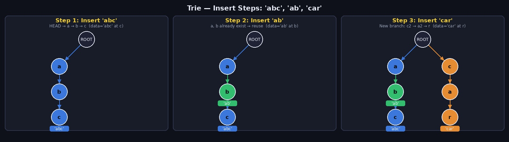
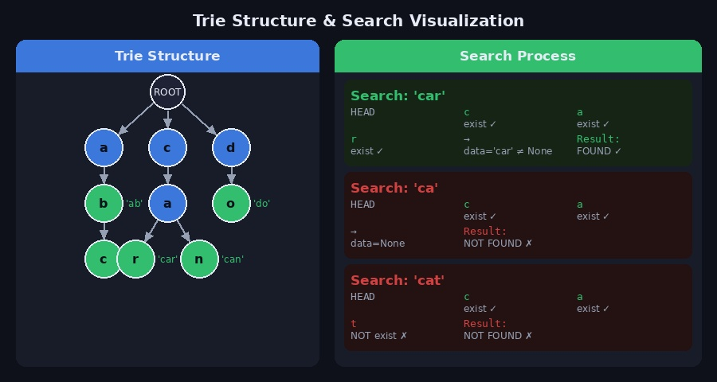
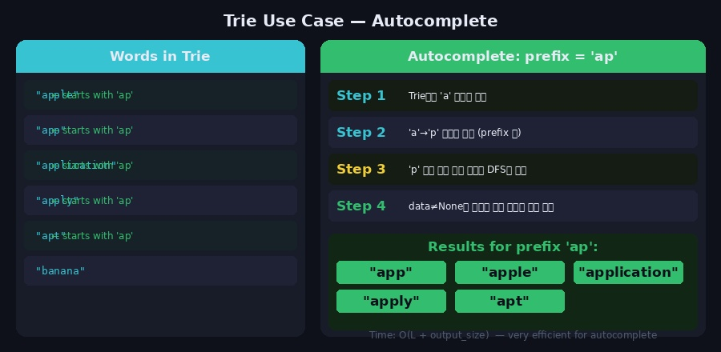
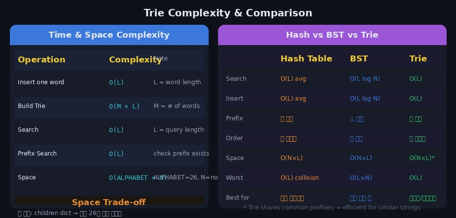

검색창에 'ap'를 입력하는 순간 'apple', 'application', 'apply' 같은 단어가 뜨는 자동완성 기능. 이 기능의 핵심에 **트라이(Trie)** 가 있습니다. 트라이는 문자열을 저장하고 빠르게 탐색하기 위해 설계된 트리 형태의 자료구조입니다.

---

## 1. 트라이(Trie)란?

**트라이(Trie)** 는 문자열을 문자 단위로 분해해서 트리 구조로 저장하는 자료구조입니다. **래딕스 트리(Radix Tree)**, **접두사 트리(Prefix Tree)** 라고도 불리며, 이름 자체는 **re_trie_val tree** 에서 유래했습니다.

### 핵심 아이디어

```
"app", "apple", "apt" 를 저장한다면?

        ROOT
         │
         a
         │
         p ← 여기까지가 공통 접두사 'ap'
        / \
       p   t
       │   │
      (app)(apt)
       │
       l
       │
       e
       │
      (apple)
```

같은 접두사를 공유하는 문자열들은 **노드를 공유** 합니다. 덕분에 저장 공간을 절약하고, 접두사 탐색을 매우 빠르게 수행할 수 있습니다.

### 장단점

| | 내용 |
|--|------|
| **장점** | 문자열 탐색이 O(L)로 매우 빠름 (L = 문자열 길이) |
| **장점** | 접두사(prefix) 기반 탐색·자동완성에 최적 |
| **장점** | 사전 순서 정렬이 자연스럽게 유지됨 |
| **단점** | 각 노드가 자식 배열(최대 26개)을 가져 메모리 사용량이 큼 |
| **단점** | 문자열이 길거나 종류가 많을수록 공간 비효율 가능 |

---

## 2. 노드 구조

트라이의 각 노드는 다음 세 가지 정보를 가집니다.

```python
class Node:
    def __init__(self, key, data=None):
        self.key      = key        # 이 노드가 나타내는 문자
        self.data     = data       # 단어가 끝나는 노드에만 값 저장 (None이면 끝 아님)
        self.children = {}         # 자식 노드 딕셔너리 {문자: Node}
```

```
Node 구조 예시:
┌────────────────────────────┐
│ key      = 'b'             │
│ data     = 'ab'  ← 'ab' 끝│
│ children = {'c': Node('c')}│
└────────────────────────────┘
```

> `data` 필드가 `None`이면 해당 위치에서 끝나는 단어가 없다는 의미입니다. 예를 들어 'abc'만 저장했을 때 'a', 'b' 노드의 `data`는 `None`이고, 'c' 노드의 `data`만 `'abc'`가 됩니다.

---

## 3. 삽입 (Insert) 동작



'abc', 'ab', 'car' 를 순서대로 삽입하는 과정입니다.

**'abc' 삽입**

```
ROOT → a(신규) → b(신규) → c(신규, data='abc')
```

**'ab' 삽입**

```
ROOT → a(기존) → b(기존, data='ab') → c(기존)
        ↑ 이미 있으므로 그대로 이동
```

**'car' 삽입**

```
ROOT → a(기존)
     → c(신규) → a(신규) → r(신규, data='car')
```

### 삽입 규칙

```
1. 루트부터 시작
2. 문자 하나씩 순회
   - 해당 문자의 자식 노드가 있으면 → 그 노드로 이동
   - 없으면 → 새 노드 생성 후 이동
3. 마지막 문자 노드에 data 값 저장
```

---

## 4. 탐색 (Search) 동작



### 'car' 탐색

```
ROOT → 'c' 있음 → 'a' 있음 → 'r' 있음
→ 'r' 노드의 data = 'car' (≠ None)
→ 탐색 성공 ✅
```

### 'ca' 탐색

```
ROOT → 'c' 있음 → 'a' 있음
→ 'a' 노드의 data = None
→ 탐색 실패 ❌ ('ca'는 접두사로만 존재, 단어 아님)
```

### 'cat' 탐색

```
ROOT → 'c' 있음 → 'a' 있음 → 't' 없음
→ 탐색 실패 ❌
```

---

## 5. Python 구현

### 기본 구현 (삽입 + 탐색)

```python
class Node:
    def __init__(self, key, data=None):
        self.key      = key
        self.data     = data
        self.children = {}


class Trie:
    def __init__(self):
        self.head = Node(None)   # 루트 노드 (빈 노드)

    def insert(self, string: str) -> None:
        """문자열 삽입"""
        curr = self.head

        for char in string:
            if char not in curr.children:
                curr.children[char] = Node(char)   # 새 노드 생성
            curr = curr.children[char]              # 이동

        curr.data = string   # 마지막 노드에 단어 표시

    def search(self, string: str) -> bool:
        """문자열이 정확히 존재하는지 탐색"""
        curr = self.head

        for char in string:
            if char not in curr.children:
                return False   # 경로가 없으면 False
            curr = curr.children[char]

        return curr.data is not None   # data 있으면 단어, 없으면 접두사만 존재


# 사용 예시
trie = Trie()
words = ['abc', 'ab', 'car']
for w in words:
    trie.insert(w)

print(trie.search('abc'))   # True
print(trie.search('ab'))    # True
print(trie.search('a'))     # False  (접두사만 존재)
print(trie.search('ca'))    # False  (접두사만 존재)
print(trie.search('car'))   # True
print(trie.search('cat'))   # False  (존재하지 않음)
```

### 접두사 존재 여부 확인 (starts_with)

```python
def starts_with(self, prefix: str) -> bool:
    """해당 접두사로 시작하는 단어가 하나라도 있는지 확인"""
    curr = self.head

    for char in prefix:
        if char not in curr.children:
            return False
        curr = curr.children[char]

    return True   # 노드가 존재하면 접두사는 있음 (data 여부 관계없음)


# search vs starts_with 차이
trie.search('ab')        # True   — 'ab'라는 단어가 정확히 존재
trie.starts_with('ab')   # True   — 'ab'로 시작하는 단어 존재
trie.search('a')         # False  — 'a'라는 단어는 없음
trie.starts_with('a')    # True   — 'a'로 시작하는 단어는 있음
```

---

## 6. 자동완성 구현



특정 접두사로 시작하는 모든 단어를 수집합니다.

```python
def autocomplete(self, prefix: str) -> list:
    """주어진 접두사로 시작하는 모든 단어 반환"""
    curr = self.head

    # 1. 접두사 끝 노드까지 이동
    for char in prefix:
        if char not in curr.children:
            return []   # 해당 접두사가 없으면 빈 리스트
        curr = curr.children[char]

    # 2. 그 노드 아래를 DFS로 탐색해 단어 수집
    result = []
    self._dfs(curr, result)
    return result

def _dfs(self, node: Node, result: list) -> None:
    """재귀 DFS로 data가 있는 노드를 모두 수집"""
    if node.data is not None:
        result.append(node.data)

    for child in node.children.values():
        self._dfs(child, result)


# 사용 예시
trie = Trie()
words = ['apple', 'app', 'application', 'apply', 'apt', 'banana']
for w in words:
    trie.insert(w)

print(trie.autocomplete('ap'))
# ['app', 'apple', 'application', 'apply', 'apt']

print(trie.autocomplete('app'))
# ['app', 'apple', 'application', 'apply']

print(trie.autocomplete('ban'))
# ['banana']

print(trie.autocomplete('xyz'))
# []
```

---

## 7. 삭제 (Delete) 구현

삭제는 삽입보다 까다롭습니다. 다른 단어의 접두사로 사용 중인 노드는 삭제하면 안 됩니다.

```python
def delete(self, string: str) -> bool:
    """문자열 삭제 (True: 성공, False: 존재하지 않음)"""

    def _delete(node: Node, string: str, depth: int) -> bool:
        if depth == len(string):
            if node.data is None:
                return False       # 단어가 없음
            node.data = None       # 단어 끝 표시 제거
            return len(node.children) == 0   # 자식 없으면 노드 삭제 가능

        char = string[depth]
        if char not in node.children:
            return False           # 경로 없음

        should_delete = _delete(node.children[char], string, depth + 1)

        if should_delete:
            del node.children[char]   # 자식 노드 삭제
            # 현재 노드도 삭제 가능한지 확인
            return node.data is None and len(node.children) == 0

        return False

    _delete(self.head, string, 0)
```

---

## 8. 시간/공간 복잡도



### 시간복잡도

| 연산 | 복잡도 | 설명 |
|------|--------|------|
| 삽입 (단어 하나) | **O(L)** | L = 단어 길이 |
| 전체 구축 | **O(M × L)** | M = 단어 수, L = 최장 단어 길이 |
| 탐색 | **O(L)** | L = 검색 단어 길이 |
| 접두사 탐색 | **O(L + output)** | 접두사 이동 + 결과 수집 |

### 공간복잡도

```
O(ALPHABET_SIZE × N)
ALPHABET_SIZE = 26 (영소문자 기준)
N = 전체 노드 수

최악: 공통 접두사가 전혀 없는 경우
최선: 모든 단어가 같은 접두사를 공유하는 경우
```

### Hash Table vs BST vs Trie 비교

| | Hash Table | BST | Trie |
|--|-----------|-----|------|
| 탐색 | O(L) avg | O(L log N) | **O(L)** |
| 접두사 탐색 | ❌ 불가 | △ 가능 | **✅ 최적** |
| 사전순 정렬 | ❌ | ✅ | ✅ |
| 공간 | O(N×L) | O(N×L) | O(N×L)* |
| 적합한 상황 | 단순 검색 | 정렬 필요 | **접두사·자동완성** |

> Trie는 공통 접두사를 공유하므로 유사한 문자열이 많을수록 공간 효율이 좋아집니다.

---

## 9. 실전 활용 패턴

### 문자열 집합에서 검색 (백준 5052 스타일)

```python
def solve():
    n = int(input())
    words = [input() for _ in range(n)]

    trie = Trie()
    for w in words:
        trie.insert(w)

    # 각 단어가 다른 단어의 접두사인지 확인
    for w in words:
        curr = trie.head
        for i, char in enumerate(w):
            curr = curr.children[char]
            # 중간 노드에서 단어가 끝나면 → 다른 단어의 접두사
            if curr.data is not None and i < len(w) - 1:
                print("NO")
                return
    print("YES")
```

### 최장 공통 접두사 찾기

```python
def longest_common_prefix(words: list) -> str:
    trie = Trie()
    for w in words:
        trie.insert(w)

    prefix = ""
    curr = trie.head

    while True:
        # 자식이 딱 하나이고, 현재 노드에서 단어가 끝나지 않으면 계속 내려감
        if len(curr.children) == 1 and curr.data is None:
            char = next(iter(curr.children))
            prefix += char
            curr = curr.children[char]
        else:
            break

    return prefix


words = ["flower", "flow", "flight"]
print(longest_common_prefix(words))   # "fl"
```

---

## 10. 주의할 점

**1. search vs starts_with 구분**

```python
# 정확한 단어 탐색 (data 있어야 True)
trie.search('ap')        # False  — 'ap'라는 단어가 없으면

# 접두사 존재 여부 (노드만 있으면 True)
trie.starts_with('ap')   # True   — 'ap'로 시작하는 단어가 있으면
```

**2. 대소문자 처리**

```python
# 대소문자 구분 없이 처리하려면 소문자로 통일
def insert(self, string: str) -> None:
    string = string.lower()   # 소문자 변환
    ...
```

**3. 메모리 효율을 위한 배열 vs 딕셔너리**

```python
# 딕셔너리 방식 — 실제 사용하는 문자만 저장 (메모리 효율적)
self.children = {}

# 배열 방식 — 항상 26개 슬롯 (빠른 접근, 메모리 비효율)
self.children = [None] * 26
# 접근: self.children[ord(char) - ord('a')]
```

**4. 재귀 깊이 제한**

DFS 기반 자동완성에서 단어가 매우 길면 재귀 깊이 제한에 걸릴 수 있습니다.

```python
import sys
sys.setrecursionlimit(10**6)
```

---

## 11. 관련 백준 문제

| 문제 | 난이도 | 핵심 기법 |
|------|--------|-----------|
| [5052 전화번호 목록](https://www.acmicpc.net/problem/5052) | Gold IV | 트라이 + 접두사 판별 |
| [14425 문자열 집합](https://www.acmicpc.net/problem/14425) | Silver III | 트라이 기본 탐색 |
| [9202 Boggle](https://www.acmicpc.net/problem/9202) | Platinum V | 트라이 + DFS |
| [1786 찾기](https://www.acmicpc.net/problem/1786) | Platinum V | KMP or 트라이 응용 |

---

## 참고 자료

- [[자료구조] 트라이 (Trie)](https://velog.io/@kimdukbae/%EC%9E%90%EB%A3%8C%EA%B5%AC%EC%A1%B0-%ED%8A%B8%EB%9D%BC%EC%9D%B4-Trie)
- Claude AI