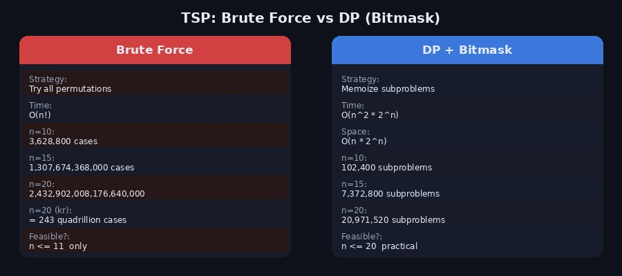
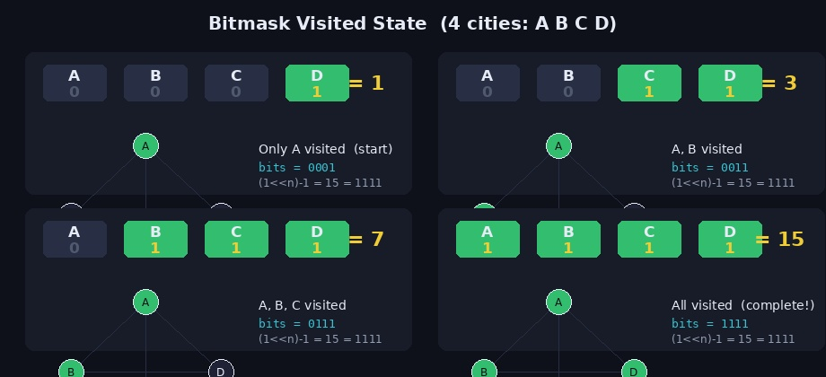
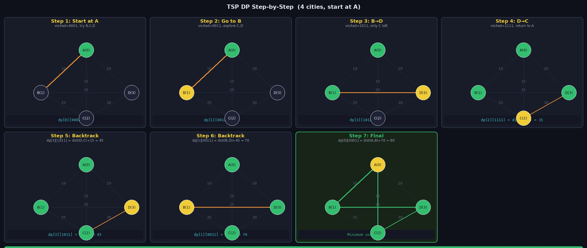

**외판원 순회 문제(Traveling Salesman Problem, TSP)** 는 조합 최적화 분야에서 가장 유명한 문제 중 하나입니다.

> 여러 도시를 방문하며 물건을 팔아야 하는 외판원이, 모든 도시를 정확히 한 번씩 방문하고 출발점으로 돌아올 때 **이동 거리의 합이 최소인 경로** 를 구하라.

단순해 보이지만 도시 수가 늘어날수록 경우의 수가 폭발적으로 증가하는 NP-Hard 문제입니다.

---

## 1. 브루트포스의 한계

가장 직관적인 방법은 모든 방문 순서(순열)를 시도해보는 것입니다. 하지만 n개 도시의 순열 개수는 n!이므로, n이 조금만 커져도 현실적으로 계산이 불가능합니다.



| n | 브루트포스 (n!) | DP + 비트마스킹 (n²·2ⁿ) |
|---|----------------|--------------------------|
| 5 | 120 | 800 |
| 10 | 3,628,800 | 102,400 |
| 15 | 1조 3천억 | 7,372,800 |
| 20 | 243경 | 20,971,520 |

브루트포스는 n ≤ 11 수준에서만 현실적입니다. 반면 비트마스킹 DP는 **n ≤ 20** 정도까지 충분히 풀 수 있습니다.

---

## 2. 핵심 아이디어 — 비트마스킹 DP

### 상태 정의

`dp[i][visited]`를 다음과 같이 정의합니다.

> 현재 위치가 도시 `i`이고, 지금까지 방문한 도시 집합이 `visited`일 때,
> **남은 도시를 모두 방문하고 출발점으로 돌아오는 최소 거리**

### visited를 비트마스크로 표현

`visited`는 정수(integer)로 표현하며, 각 비트가 해당 도시의 방문 여부를 나타냅니다.



```
도시 4개: A(0번), B(1번), C(2번), D(3번)

visited = 0001 (2진수) = 1  → A만 방문
visited = 0011 (2진수) = 3  → A, B 방문
visited = 0111 (2진수) = 7  → A, B, C 방문
visited = 1111 (2진수) = 15 → 모두 방문 = (1<<n) - 1
```

특정 도시 j를 방문했다고 표시하려면 `visited | (1 << j)` 로 해당 비트를 1로 설정합니다. 도시 j를 이미 방문했는지 확인하려면 `visited & (1 << j)` 로 확인합니다.

### 점화식

```
dp[i][visited] = min(
    dp[j][visited | (1 << j)] + dist(i, j)
)
단, j는 아직 방문하지 않은 도시
```

"현재 i에서 미방문 도시 j로 이동한다고 가정했을 때, j에서 나머지를 최적으로 돌아오는 거리 + i~j 사이의 거리" 중 최솟값을 선택합니다.

### 종료 조건

모든 도시를 방문한 상태(`visited == (1 << n) - 1`)에서는 출발점(0번)으로 돌아가는 거리를 반환합니다.

```python
if visited == (1 << n) - 1:
    return dist(current, 0)  # 출발점으로 복귀
```

---

## 3. 단계별 동작 시각화 (4도시 예제)

4개 도시 A, B, C, D가 있고 거리가 다음과 같을 때 A를 출발점으로 TSP를 풉니다.

```
A ↔ B : 10    A ↔ C : 15    A ↔ D : 20
B ↔ C : 35    B ↔ D : 25    C ↔ D : 30
```



각 단계를 재귀 트리로 정리하면 다음과 같습니다.

```
dfs(A, 0001)
├── A→B : dfs(B, 0011)
│   ├── B→C : dfs(C, 0111) → C→D→A = 30+20 = 50 → 35+50 = 85
│   └── B→D : dfs(D, 1011) → D→C→A = 30+15 = 45 → 25+45 = 70  ← 최솟값
├── A→C : dfs(C, 0101)
│   ├── C→B : dfs(B, 0111) → B→D→A = 25+20 = 45 → 35+45 = 80
│   └── C→D : dfs(D, 1101) → D→B→A = 25+10 = 35 → 30+35 = 65  ← 최솟값
└── A→D : dfs(D, 1001)
    ├── D→B : dfs(B, 1011) → B→C→A = 35+15 = 50 → 25+50 = 75
    └── D→C : dfs(C, 1101) → C→B→A = 35+10 = 45 → 30+45 = 75

최적: A→B→D→C→A = 10+25+30+15 = 80
```

---

## 4. Python 구현

### 전체 코드 (최솟값)

```python
import sys
import math
from functools import lru_cache

input = sys.stdin.readline

def solve():
    n = int(input())
    graph = [list(map(int, input().split())) for _ in range(n)]

    INF = float('inf')
    dp = [[INF] * (1 << n) for _ in range(n)]

    def dfs(current, visited):
        # 모든 도시 방문 완료 → 출발점(0)으로 귀환
        if visited == (1 << n) - 1:
            return graph[current][0] if graph[current][0] else INF

        # 이미 계산된 상태면 재사용 (메모이제이션)
        if dp[current][visited] != INF:
            return dp[current][visited]

        for next_city in range(n):
            # 이미 방문했거나 경로가 없으면 skip
            if visited & (1 << next_city):
                continue
            if graph[current][next_city] == 0:
                continue

            cost = dfs(next_city, visited | (1 << next_city)) + graph[current][next_city]
            dp[current][visited] = min(dp[current][visited], cost)

        return dp[current][visited]

    # 0번 도시에서 출발 (visited = 0001)
    print(dfs(0, 1))

solve()
```

### 핵심 로직 흐름

```
1. dfs(현재 도시, 방문 상태) 호출
2. 종료 조건: visited == (1<<n)-1 이면 출발점까지 거리 반환
3. 이미 계산된 dp[현재][visited] 가 있으면 바로 반환
4. 미방문 도시 j마다:
   - dfs(j, visited | (1<<j)) 재귀 호출
   - 반환값 + dist(현재→j) 를 dp에 업데이트
5. dp[현재][visited] 반환
```

---

## 5. 경로 복원

최솟값뿐 아니라 **어떤 순서로 방문해야 하는지** 경로도 출력하려면 dp 테이블을 역추적합니다.

```python
def print_path(current, visited, path):
    path.append(current)

    # 모두 방문했으면 종료
    if visited == (1 << n) - 1:
        path.append(0)  # 출발점으로 귀환
        return

    next_city = -1
    min_cost = float('inf')

    for j in range(n):
        if visited & (1 << j):
            continue
        if graph[current][j] == 0:
            continue

        # dp[j][next_visited] + dist(current→j) 가 최소인 도시를 다음 목적지로 선택
        next_visited = visited | (1 << j)
        cost = dp[j][next_visited] + graph[current][j]
        if cost < min_cost:
            min_cost = cost
            next_city = j

    if next_city != -1:
        print_path(next_city, visited | (1 << next_city), path)

# 사용 예
path = []
print_path(0, 1, path)
print(" → ".join(str(p) for p in path))
# 출력 예: 0 → 1 → 3 → 2 → 0
```

---

## 6. 시간 복잡도 분석

| 항목 | 내용 |
|------|------|
| 부분 문제 수 | 현재 위치 n가지 × visited 상태 2ⁿ가지 = **n·2ⁿ** |
| 각 부분 문제 해결 비용 | 미방문 도시 탐색 **O(n)** |
| **총 시간복잡도** | **O(n²·2ⁿ)** |
| **공간복잡도** | **O(n·2ⁿ)** — dp 테이블 크기 |

브루트포스 O(n!)에 비해 압도적으로 빠르지만, 여전히 지수 시간이므로 **n ≤ 20** 이 실용적인 한계입니다.

---

## 7. 자주 하는 실수

**1. 방문 체크 방향 혼동**

```python
# ❌ 잘못됨 — 이미 방문한 도시를 skip하는 게 아니라 반대로 처리
if not (visited & (1 << j)):
    continue

# ✅ 올바름 — 이미 방문한 도시면 skip
if visited & (1 << j):
    continue
```

**2. 점화식에서 인덱스 혼동**

```python
# ❌ 잘못됨 — dp[i]에서 갱신해야 하는데 dp[j]로 작성
dp[j][visited] = min(dp[j][visited], dp[j][visited|(1<<j)] + graph[i][j])

# ✅ 올바름
dp[i][visited] = min(dp[i][visited], dp[j][visited|(1<<j)] + graph[i][j])
```

**3. 출발점 복귀 조건에서 0 거리 처리**

```python
# 도시 간 경로가 없을 때 0으로 표현하는 문제의 경우
if visited == (1 << n) - 1:
    if graph[current][0] == 0:  # 출발점으로 돌아오는 길이 없으면
        return INF
    return graph[current][0]
```

---

## 8. 관련 백준 문제

| 문제 | 난이도 | 설명 |
|------|--------|------|
| [2098 외판원 순회](https://www.acmicpc.net/problem/2098) | Gold I | TSP 기본 문제 — 비트마스킹 DP |
| [1102 발전소](https://www.acmicpc.net/problem/1102) | Gold I | 비트마스킹 DP 응용 |
| [1562 계단 수](https://www.acmicpc.net/problem/1562) | Gold I | 비트마스킹 + DP 조합 연습 |

---

## 참고 자료

- [[알고리즘] 외판원 순회(TSP) 알고리즘](https://velog.io/@dltmdrl1244/%EC%95%8C%EA%B3%A0%EB%A6%AC%EC%A6%98-%EC%99%B8%ED%8C%90%EC%9B%90-%EC%88%9C%ED%9A%8CTSP-%EC%95%8C%EA%B3%A0%EB%A6%AC%EC%A6%98)