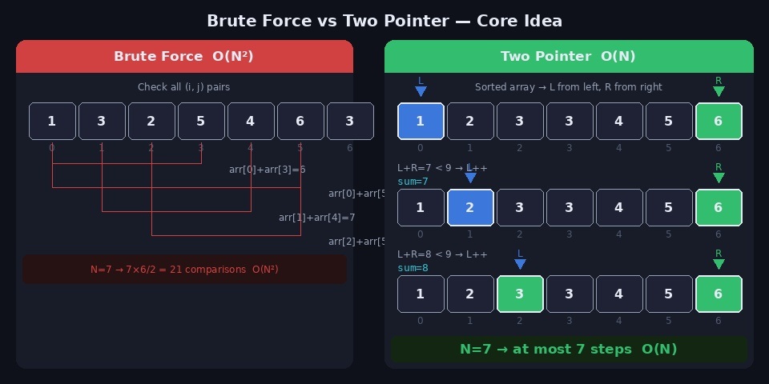
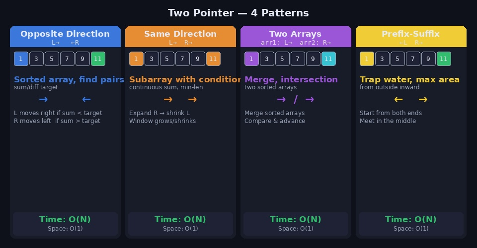
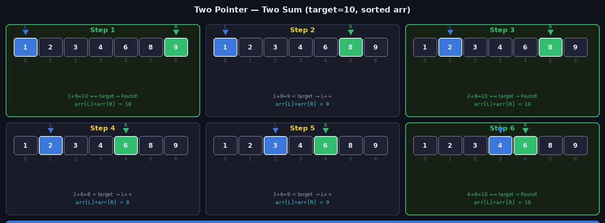
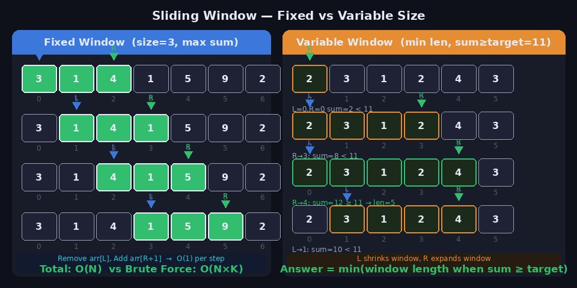
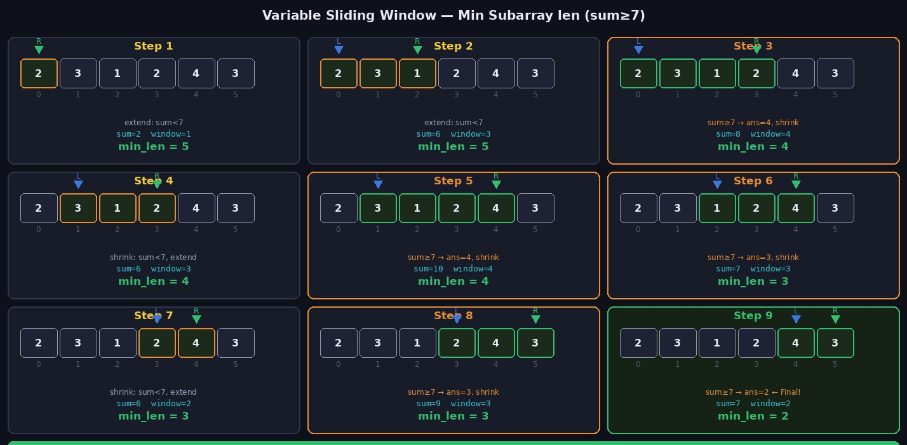

배열에서 특정 합을 가지는 부분 구간, 조건을 만족하는 최소/최대 길이의 부분 배열을 구하는 문제들. 이런 문제들을 이중 for문으로 풀면 O(N²)이 나옵니다. **투 포인터**와 **슬라이딩 윈도우**를 사용하면 이를 **O(N)으로 해결**할 수 있습니다.

---

## 1. 핵심 아이디어



### 왜 O(N)이 가능한가?

브루트포스는 모든 (i, j) 쌍을 검사합니다. 하지만 배열이 정렬되어 있거나 특정 단조성(monotone property)이 있다면, 한쪽 포인터를 움직일 때 다른 포인터가 **역방향으로 돌아갈 필요가 없습니다**.

```
정렬된 배열: [1, 2, 3, 4, 5, 6, 7]
target = 8

L=0, R=6: 1+7=8  → 찾음
L=0, R=5: 1+6=7 < 8 → L 증가
L=1, R=5: 2+6=8  → 찾음
...

L과 R이 각각 최대 N번 이동 → O(N)
```

### 두 기법의 차이

| | 투 포인터 | 슬라이딩 윈도우 |
|--|----------|----------------|
| 포인터 역할 | 두 개의 독립적인 위치 | 구간의 왼쪽(L)·오른쪽(R) 경계 |
| 이동 방향 | 양방향 or 같은 방향 | 주로 오른쪽 방향 |
| 핵심 조건 | 단조성 (증가/감소 관계) | 연속 구간 |
| 주요 문제 | 합이 target인 쌍 찾기 | 조건 만족하는 부분 배열 |

---

## 2. 투 포인터 4가지 패턴



### 패턴 1 — 반대 방향 (Opposite Direction)

정렬된 배열에서 L은 왼쪽, R은 오른쪽에서 시작해 안쪽으로 이동합니다.

```
사용 상황: 정렬된 배열에서 합/차가 target인 쌍 찾기
이동 규칙:
  sum < target → L++  (합을 키움)
  sum > target → R--  (합을 줄임)
  sum == target → 정답 처리
```

### 패턴 2 — 같은 방향 (Same Direction)

L, R 모두 왼쪽에서 출발해 오른쪽으로 이동합니다. (슬라이딩 윈도우와 유사)

```
사용 상황: 연속 부분 배열에서 조건 만족하는 구간 찾기
이동 규칙:
  조건 미충족 → R++ (구간 확장)
  조건 충족   → L++ (구간 축소 & 답 갱신)
```

### 패턴 3 — 두 배열

서로 다른 배열에 각각 포인터를 두고 이동합니다.

```
사용 상황: 정렬된 두 배열의 병합, 교집합
이동 규칙:
  arr1[i] < arr2[j] → i++
  arr1[i] > arr2[j] → j++
  arr1[i] == arr2[j] → 정답 처리, 둘 다 이동
```

### 패턴 4 — 양 끝에서 안쪽으로

0번 인덱스와 N-1번 인덱스에서 시작해 만날 때까지 이동합니다.

```
사용 상황: 트랩 워터, 컨테이너 최대 물 담기
이동 규칙:
  height[L] < height[R] → L++
  height[L] >= height[R] → R--
```

---

## 3. 투 포인터 구현

### 기본 템플릿

```python
def two_pointer(arr, target):
    left, right = 0, len(arr) - 1

    while left < right:
        current = arr[left] + arr[right]

        if current == target:
            # 정답 처리
            left += 1
            right -= 1
        elif current < target:
            left += 1    # 합을 키워야 함
        else:
            right -= 1   # 합을 줄여야 함
```

### 예제 1 — 두 수의 합 (Two Sum, 정렬된 배열)



```python
def two_sum(arr, target):
    """정렬된 배열에서 합이 target인 모든 쌍 찾기"""
    arr.sort()
    L, R = 0, len(arr) - 1
    result = []

    while L < R:
        s = arr[L] + arr[R]
        if s == target:
            result.append((arr[L], arr[R]))
            L += 1
            R -= 1
        elif s < target:
            L += 1
        else:
            R -= 1

    return result


print(two_sum([3,1,4,1,5,9,2,6], 10))
# → [(1, 9), (4, 6)]
```

### 예제 2 — 세 수의 합 (3Sum)

```python
def three_sum(arr, target):
    """합이 target인 세 수 조합 (중복 제외)"""
    arr.sort()
    result = []

    for i in range(len(arr) - 2):
        if i > 0 and arr[i] == arr[i-1]:
            continue   # 중복 스킵

        L, R = i + 1, len(arr) - 1
        while L < R:
            s = arr[i] + arr[L] + arr[R]
            if s == target:
                result.append((arr[i], arr[L], arr[R]))
                while L < R and arr[L] == arr[L+1]: L += 1
                while L < R and arr[R] == arr[R-1]: R -= 1
                L += 1; R -= 1
            elif s < target:
                L += 1
            else:
                R -= 1

    return result
```

### 예제 3 — 연속된 자연수의 합

```python
def consecutive_sum(target):
    """target을 연속된 자연수의 합으로 나타내는 경우의 수"""
    count = 0
    L, R = 1, 1
    current_sum = 1

    while L <= target // 2:
        if current_sum == target:
            count += 1
            current_sum -= L
            L += 1
        elif current_sum < target:
            R += 1
            current_sum += R
        else:
            current_sum -= L
            L += 1

    return count


print(consecutive_sum(15))   # 3  (1~5, 4~6, 7~8)
```

### 예제 4 — 정렬된 두 배열 병합 (Merge)

```python
def merge_sorted(arr1, arr2):
    """두 정렬 배열을 합쳐 정렬된 배열 반환  O(N+M)"""
    result = []
    i, j = 0, 0

    while i < len(arr1) and j < len(arr2):
        if arr1[i] <= arr2[j]:
            result.append(arr1[i]); i += 1
        else:
            result.append(arr2[j]); j += 1

    result.extend(arr1[i:])
    result.extend(arr2[j:])
    return result
```

---

## 4. 슬라이딩 윈도우 구현

슬라이딩 윈도우는 배열의 **연속된 구간(window)** 을 유지하며 이동합니다. 구간이 고정 크기면 **Fixed Window**, 조건에 따라 크기가 변하면 **Variable Window** 입니다.



### 고정 크기 윈도우 (Fixed Window)

```python
def fixed_window_max_sum(arr, k):
    """크기 k인 윈도우의 최대 합  O(N)"""
    n = len(arr)
    if n < k:
        return -1

    # 첫 윈도우 합
    window_sum = sum(arr[:k])
    max_sum = window_sum

    # 윈도우 슬라이드 (한 칸씩)
    for i in range(k, n):
        window_sum += arr[i]       # 오른쪽 원소 추가
        window_sum -= arr[i - k]   # 왼쪽 원소 제거
        max_sum = max(max_sum, window_sum)

    return max_sum


print(fixed_window_max_sum([3,1,4,1,5,9,2,6], 3))  # 16 (5+9+2 or 1+5+9)
```

> **핵심**: 매번 구간 합을 처음부터 계산하면 O(N×K). 이전 합에서 왼쪽 원소를 빼고 오른쪽 원소를 더하면 O(1)로 갱신 → 전체 O(N).

### 가변 크기 윈도우 (Variable Window)

```python
def min_subarray_len(arr, target):
    """합이 target 이상인 가장 짧은 부분 배열의 길이  O(N)"""
    n = len(arr)
    L = 0
    cur_sum = 0
    min_len = float('inf')

    for R in range(n):
        cur_sum += arr[R]   # R 확장

        # 조건 충족 시 L을 오른쪽으로 당겨 최소화
        while cur_sum >= target:
            min_len = min(min_len, R - L + 1)
            cur_sum -= arr[L]
            L += 1

    return min_len if min_len != float('inf') else 0


print(min_subarray_len([2,3,1,2,4,3], 7))   # 2  ([4,3])
print(min_subarray_len([1,1,1,1,1], 11))     # 0  (불가능)
```

### 단계별 시각화



```
arr=[2,3,1,2,4,3], target=7

R=0: sum=2 → R 확장
R=1: sum=5 → R 확장
R=2: sum=6 → R 확장
R=3: sum=8 ≥ 7 → min_len=4, L++ (sum=6)
R=4: sum=10≥ 7 → min_len=4, L++ (sum=7)
         sum=7 ≥ 7 → min_len=3, L++ (sum=6)
R=5: sum=9 ≥ 7 → min_len=3, L++ (sum=7)
         sum=7 ≥ 7 → min_len=2, L++ (sum=3)  ← 최종

Answer = 2
```

---

## 5. 슬라이딩 윈도우 — 문자열 응용

### 예제 — 중복 없는 최장 부분 문자열

```python
def length_of_longest_substring(s):
    """중복 문자 없는 가장 긴 부분 문자열 길이  O(N)"""
    char_set = set()
    L = 0
    max_len = 0

    for R in range(len(s)):
        # 중복 문자가 있으면 L을 당김
        while s[R] in char_set:
            char_set.remove(s[L])
            L += 1

        char_set.add(s[R])
        max_len = max(max_len, R - L + 1)

    return max_len


print(length_of_longest_substring("abcabcbb"))   # 3 ("abc")
print(length_of_longest_substring("pwwkew"))     # 3 ("wke")
```

### 예제 — 최대 k번 교체로 만들 수 있는 최장 같은 문자 부분 문자열

```python
def character_replacement(s, k):
    """최대 k번 문자 교체로 만들 수 있는 같은 문자 부분 문자열 최대 길이"""
    from collections import defaultdict
    count = defaultdict(int)
    L = 0
    max_count = 0   # 윈도우 내 최빈 문자 수
    max_len = 0

    for R in range(len(s)):
        count[s[R]] += 1
        max_count = max(max_count, count[s[R]])

        # 교체 횟수 초과 시 축소
        # (윈도우 크기 - 최빈 문자 수) = 교체해야 할 문자 수
        while (R - L + 1) - max_count > k:
            count[s[L]] -= 1
            L += 1

        max_len = max(max_len, R - L + 1)

    return max_len


print(character_replacement("AABABBA", 1))   # 4
```

### 예제 — 아나그램 찾기

```python
from collections import Counter

def find_anagrams(s, p):
    """s에서 p의 아나그램이 시작하는 인덱스 목록"""
    if len(s) < len(p):
        return []

    k = len(p)
    p_count = Counter(p)
    window = Counter(s[:k])
    result = []

    if window == p_count:
        result.append(0)

    for i in range(k, len(s)):
        # 슬라이드: 오른쪽 추가, 왼쪽 제거
        window[s[i]] += 1
        window[s[i-k]] -= 1
        if window[s[i-k]] == 0:
            del window[s[i-k]]

        if window == p_count:
            result.append(i - k + 1)

    return result


print(find_anagrams("cbaebabacd", "abc"))   # [0, 6]
```

---

## 6. 고급 응용 — 트랩 워터 (Trapping Rain Water)

```python
def trap(height):
    """
    높이 배열이 주어질 때 고일 수 있는 물의 양
    투 포인터 O(N), O(1)
    """
    L, R = 0, len(height) - 1
    left_max = right_max = 0
    water = 0

    while L < R:
        if height[L] < height[R]:
            if height[L] >= left_max:
                left_max = height[L]
            else:
                water += left_max - height[L]
            L += 1
        else:
            if height[R] >= right_max:
                right_max = height[R]
            else:
                water += right_max - height[R]
            R -= 1

    return water


print(trap([0,1,0,2,1,0,1,3,2,1,2,1]))   # 6
```

```
핵심 아이디어:
  height[L] < height[R]이면 → 왼쪽이 병목
  L에서 고이는 물 = left_max - height[L]
  (오른쪽은 항상 left_max보다 높음이 보장)
```

---

## 7. 문제 보고 패턴 파악하기

```
"연속 부분 배열에서 ~한 것을 찾아라"
      ↓
연속 구간인가?  YES → 슬라이딩 윈도우
      ↓
고정 크기인가?  YES → Fixed Window (sum/max 갱신)
      ↓
가변 크기인가?  YES → Variable Window
                     (R 확장 → 조건 충족 → L 축소)

"정렬된 배열에서 합이 K인 쌍"
      ↓
정렬 + 단조성 → 반대 방향 투 포인터

"두 배열을 비교/병합"
      ↓
각 배열에 포인터 하나씩 → 두 배열 투 포인터

"가장 많은 물 / 넓이"
      ↓
양 끝 → 안쪽 패턴
```

---

## 8. 자주 하는 실수

**1. 정렬되지 않은 배열에 반대 방향 투 포인터 적용**

```python
# ❌ 정렬 없이 반대 방향 투 포인터 → 잘못된 결과
arr = [3, 1, 5, 2, 4]
# 정렬되지 않으면 L++ 또는 R--의 단조성 보장 안 됨

# ✅ 반드시 정렬 후 적용
arr.sort()
```

**2. 가변 윈도우에서 while vs if 선택**

```python
# ❌ if 사용 → 한 번만 축소, 조건 미충족 상태 남을 수 있음
if cur_sum >= target:
    min_len = min(min_len, R - L + 1)
    L += 1

# ✅ while 사용 → 조건 벗어날 때까지 반복 축소
while cur_sum >= target:
    min_len = min(min_len, R - L + 1)
    cur_sum -= arr[L]
    L += 1
```

**3. 윈도우 크기 계산**

```python
# 윈도우 크기 = R - L + 1  (L, R 모두 포함)
window_size = R - L + 1

# ❌ R - L 만 하면 1 작게 나옴
window_size = R - L   # 틀림!
```

**4. 고정 윈도우에서 초기값 설정 누락**

```python
# ❌ 초기 윈도우 합 없이 시작
for i in range(k, n):
    window_sum += arr[i] - arr[i-k]   # 초기 window_sum이 없음

# ✅ 첫 k개로 초기 합 설정
window_sum = sum(arr[:k])
for i in range(k, n):
    window_sum += arr[i] - arr[i-k]
```

---

## 9. 관련 백준 문제

| 문제 | 난이도 | 패턴 |
|------|--------|------|
| [2003 수들의 합 2](https://www.acmicpc.net/problem/2003) | Silver IV | 같은 방향 투 포인터 |
| [1940 주몽](https://www.acmicpc.net/problem/1940) | Silver IV | 반대 방향 투 포인터 |
| [1253 좋다](https://www.acmicpc.net/problem/1253) | Gold IV | 반대 방향 투 포인터 |
| [13144 List of Unique Numbers](https://www.acmicpc.net/problem/13144) | Gold IV | 슬라이딩 윈도우 |
| [12891 DNA 비밀번호](https://www.acmicpc.net/problem/12891) | Silver II | 고정 슬라이딩 윈도우 |
| [2531 회전 초밥](https://www.acmicpc.net/problem/2531) | Silver I | 고정 슬라이딩 윈도우 |
| [15961 회전 초밥](https://www.acmicpc.net/problem/15961) | Gold V | 고정 슬라이딩 윈도우 |
| [1208 부분수열의 합 2](https://www.acmicpc.net/problem/1208) | Gold I | 투 포인터 + meet in middle |

Ref: Claude AI