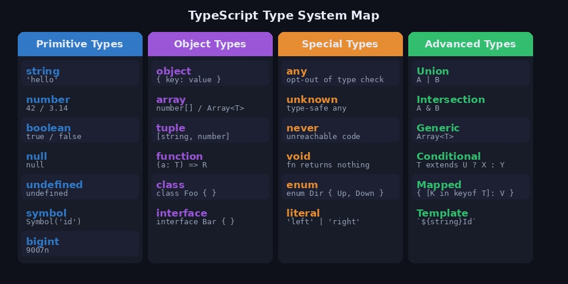
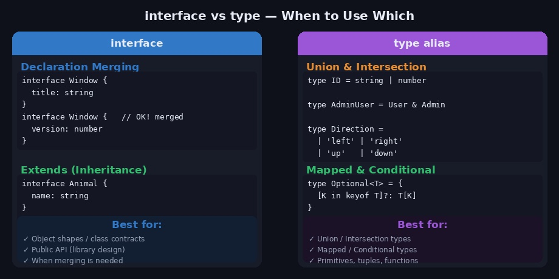
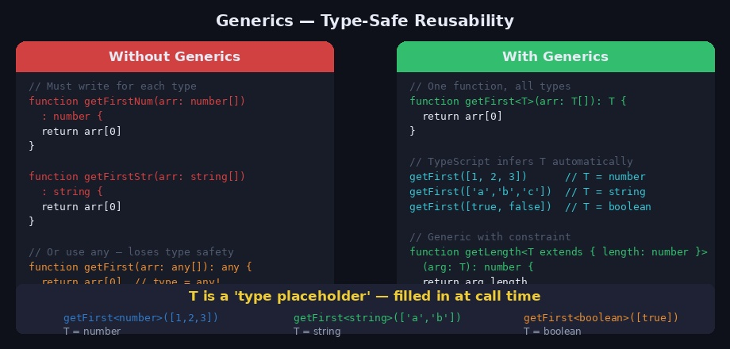
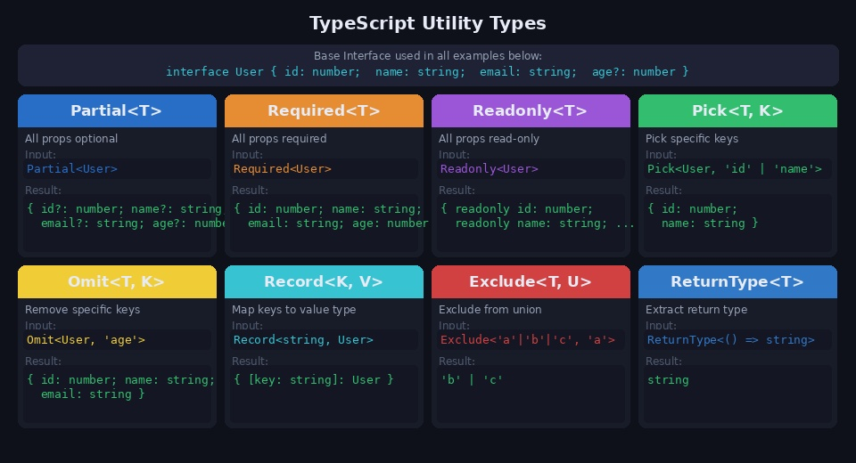
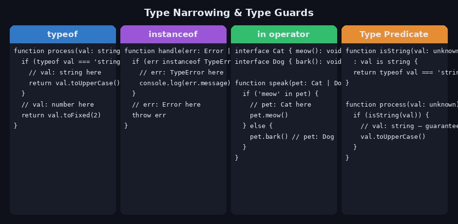

JavaScript에 타입을 추가한 TypeScript는 이제 프론트엔드 개발의 사실상 표준이 됐습니다. 단순히 타입 에러를 잡는 것 이상으로, 코드의 의도를 명확히 하고 리팩토링을 안전하게 해주는 도구입니다. 이 포스트에서는 기본 타입부터 제네릭, 유틸리티 타입, 고급 타입까지 실무에서 바로 써먹을 수 있는 내용을 정리합니다.

---

## 1. TypeScript 타입 시스템 전체 맵



TypeScript의 타입은 크게 4가지 영역으로 나눌 수 있습니다.

### Primitive Types (원시 타입)

```typescript
const name: string   = "mingyu"
const age: number    = 25
const isActive: boolean = true
const nothing: null  = null
const undef: undefined = undefined
const sym: symbol    = Symbol("id")
const big: bigint    = 9007199254740991n
```

### 특수 타입 — any / unknown / never / void

실무에서 가장 자주 혼동되는 타입들입니다.

```typescript
// any — 타입 검사를 완전히 포기. 사용 지양
let data: any = "hello"
data = 42         // OK
data.foo.bar      // OK (런타임 에러 가능)

// unknown — 타입 안전한 any. 사용 전 반드시 타입 확인 필요
let input: unknown = getInput()
input.toUpperCase()                    // ❌ 컴파일 에러
if (typeof input === "string") {
  input.toUpperCase()                  // ✅ 타입 좁힌 후 사용
}

// never — 절대 도달할 수 없는 타입 (무한 루프, 항상 throw)
function fail(message: string): never {
  throw new Error(message)
}

// void — 반환값이 없는 함수
function log(msg: string): void {
  console.log(msg)
  // return 없음
}
```

### 리터럴 타입 & 유니온

```typescript
// 특정 값만 허용
type Direction = "left" | "right" | "up" | "down"
type StatusCode = 200 | 400 | 404 | 500

// 리터럴 타입으로 정교한 함수 시그니처
function move(direction: Direction, speed: number): void {
  console.log(`Moving ${direction} at speed ${speed}`)
}

move("left", 10)     // ✅
move("diagonal", 10) // ❌ 컴파일 에러
```

---

## 2. interface vs type



### interface

객체의 구조를 정의하는 데 최적화된 방식입니다. **선언 병합(Declaration Merging)** 이 가능한 것이 가장 큰 특징입니다.

```typescript
interface User {
  id: number
  name: string
  email: string
  age?: number       // 선택적 프로퍼티
  readonly createdAt: Date  // 읽기 전용
}

// 확장 (상속)
interface AdminUser extends User {
  role: "admin" | "superadmin"
  permissions: string[]
}

// 선언 병합 — 같은 이름으로 두 번 선언하면 합쳐짐
interface Window {
  title: string
}
interface Window {
  version: number
}
// 결과: Window = { title: string; version: number }
```

### type alias

유니온, 인터섹션, 맵드 타입 등 더 복잡한 타입을 표현할 때 사용합니다.

```typescript
// 유니온 타입
type ID = string | number

// 인터섹션 타입
type AdminUser = User & { role: string }

// 튜플
type Coordinate = [number, number]
type RGB = [number, number, number]

// 함수 타입
type Formatter = (value: string) => string

// 리터럴 유니온
type Theme = "light" | "dark" | "system"
```

### 선택 기준

| 상황 | 추천 |
|------|------|
| 객체 구조, 클래스 구현체 정의 | `interface` |
| 라이브러리 공개 API | `interface` (선언 병합 활용) |
| 유니온 / 인터섹션 타입 | `type` |
| 맵드 / 조건부 타입 | `type` |
| 원시 타입, 튜플, 함수 타입 | `type` |

---

## 3. 제네릭 (Generics)



제네릭은 **타입을 파라미터처럼** 받아서 재사용 가능한 코드를 만드는 방법입니다.

### 기본 제네릭 함수

```typescript
// T는 호출 시 결정되는 타입 플레이스홀더
function identity<T>(arg: T): T {
  return arg
}

identity<string>("hello")  // T = string, 반환값도 string
identity<number>(42)       // T = number, 반환값도 number
identity("auto")           // T 자동 추론 → string
```

### 제네릭 인터페이스 & 클래스

```typescript
// API 응답 래퍼 타입 — 어떤 데이터든 감쌀 수 있음
interface ApiResponse<T> {
  data: T
  status: number
  message: string
  timestamp: string
}

// 사용
type UserResponse  = ApiResponse<User>
type PostsResponse = ApiResponse<Post[]>

// 제네릭 클래스
class Stack<T> {
  private items: T[] = []

  push(item: T): void {
    this.items.push(item)
  }

  pop(): T | undefined {
    return this.items.pop()
  }

  peek(): T | undefined {
    return this.items[this.items.length - 1]
  }

  get size(): number {
    return this.items.length
  }
}

const numStack = new Stack<number>()
numStack.push(1)
numStack.push(2)
numStack.pop()   // 2
```

### 제네릭 제약 (extends)

```typescript
// T가 반드시 length 프로퍼티를 가져야 함
function getLength<T extends { length: number }>(arg: T): number {
  return arg.length
}

getLength("hello")    // ✅ string.length = 5
getLength([1, 2, 3])  // ✅ array.length = 3
getLength(42)         // ❌ number는 length 없음

// keyof 제약 — 실제 키만 허용
function getProperty<T, K extends keyof T>(obj: T, key: K): T[K] {
  return obj[key]
}

const user = { id: 1, name: "Mingyu", age: 25 }
getProperty(user, "name")  // ✅ "Mingyu"
getProperty(user, "email") // ❌ 존재하지 않는 키
```

### 여러 개의 타입 파라미터

```typescript
function merge<T extends object, U extends object>(obj1: T, obj2: U): T & U {
  return { ...obj1, ...obj2 }
}

const result = merge({ name: "Mingyu" }, { age: 25 })
// result: { name: string; age: number }
```

---

## 4. 유틸리티 타입 (Utility Types)



TypeScript에 내장된 타입 변환 도구들입니다. 기존 타입을 변형해 새 타입을 만들 수 있습니다.

```typescript
// 예제에 사용할 기본 인터페이스
interface User {
  id: number
  name: string
  email: string
  age?: number
  password: string
}
```

### Partial / Required / Readonly

```typescript
// Partial<T> — 모든 프로퍼티를 선택적으로
type UpdateUserDto = Partial<User>
// { id?: number; name?: string; email?: string; ... }

function updateUser(id: number, data: Partial<User>) {
  // 일부 필드만 업데이트 가능
}

// Required<T> — 모든 선택적 프로퍼티를 필수로
type CompleteUser = Required<User>
// age도 반드시 있어야 함

// Readonly<T> — 모든 프로퍼티를 읽기 전용으로
type ImmutableUser = Readonly<User>
const user: ImmutableUser = { id: 1, name: "Mingyu", email: "...", password: "..." }
user.name = "Kim" // ❌ 컴파일 에러
```

### Pick / Omit

```typescript
// Pick<T, K> — 특정 키만 선택
type UserPreview = Pick<User, "id" | "name">
// { id: number; name: string }

// Omit<T, K> — 특정 키만 제거
type PublicUser = Omit<User, "password">
// { id: number; name: string; email: string; age?: number }

// API 응답에서 민감한 정보 제외할 때 유용
function getPublicProfile(user: User): PublicUser {
  const { password, ...rest } = user
  return rest
}
```

### Record

```typescript
// Record<K, V> — 키-값 맵 타입 생성
type UserMap = Record<string, User>
const users: UserMap = {
  "user_1": { id: 1, name: "Mingyu", email: "...", password: "..." },
  "user_2": { id: 2, name: "Gyumin", email: "...", password: "..." },
}

// 상태 타입 정의에도 유용
type PageStatus = Record<"home" | "about" | "blog", "loading" | "ready" | "error">
```

### Exclude / Extract / NonNullable / ReturnType

```typescript
// Exclude<T, U> — 유니온에서 특정 타입 제거
type WithoutNull = Exclude<string | number | null | undefined, null | undefined>
// string | number

// Extract<T, U> — 유니온에서 특정 타입만 추출
type OnlyStrings = Extract<string | number | boolean, string | boolean>
// string | boolean

// NonNullable<T> — null / undefined 제거
type SafeString = NonNullable<string | null | undefined>
// string

// ReturnType<T> — 함수의 반환 타입 추출
function createUser() {
  return { id: 1, name: "Mingyu" }
}
type CreatedUser = ReturnType<typeof createUser>
// { id: number; name: string }

// Parameters<T> — 함수의 파라미터 타입 추출
function login(email: string, password: string): boolean {
  return true
}
type LoginParams = Parameters<typeof login>
// [email: string, password: string]
```

---

## 5. 타입 가드 & 타입 좁히기 (Type Narrowing)



유니온 타입에서 특정 타입으로 좁히는 방법들입니다.

### typeof / instanceof

```typescript
function format(val: string | number): string {
  if (typeof val === "string") {
    return val.toUpperCase()   // val: string
  }
  return val.toFixed(2)        // val: number
}

function handleError(err: Error | TypeError) {
  if (err instanceof TypeError) {
    console.log("Type Error:", err.message)  // err: TypeError
  }
  throw err  // err: Error
}
```

### in 연산자

```typescript
interface Cat { meow(): void; purr(): void }
interface Dog { bark(): void; fetch(): void }

function makeSound(pet: Cat | Dog): void {
  if ("meow" in pet) {
    pet.meow()   // pet: Cat
  } else {
    pet.bark()   // pet: Dog
  }
}
```

### 사용자 정의 타입 가드 (Type Predicate)

```typescript
// 반환 타입에 'val is Type' 형식으로 명시
function isUser(val: unknown): val is User {
  return (
    typeof val === "object" &&
    val !== null &&
    "id" in val &&
    "name" in val
  )
}

function processResponse(data: unknown) {
  if (isUser(data)) {
    console.log(data.name)  // data: User — 타입 안전!
  }
}
```

### Discriminated Union (판별 유니온)

```typescript
// 공통 리터럴 필드('kind')로 타입 구분
interface Circle  { kind: "circle";  radius: number }
interface Square  { kind: "square";  side: number }
interface Triangle{ kind: "triangle"; base: number; height: number }

type Shape = Circle | Square | Triangle

function getArea(shape: Shape): number {
  switch (shape.kind) {
    case "circle":
      return Math.PI * shape.radius ** 2   // shape: Circle
    case "square":
      return shape.side ** 2               // shape: Square
    case "triangle":
      return (shape.base * shape.height) / 2
    default:
      // 모든 케이스를 처리했는지 컴파일 타임에 확인
      const _exhaustive: never = shape
      return _exhaustive
  }
}
```

---

## 6. 고급 타입

### 맵드 타입 (Mapped Types)

기존 타입의 모든 키를 순회해 새 타입을 만드는 방법입니다. 유틸리티 타입(`Partial`, `Readonly` 등)이 내부적으로 이 방식으로 구현되어 있습니다.

```typescript
// Partial 직접 구현
type MyPartial<T> = {
  [K in keyof T]?: T[K]
}

// Readonly 직접 구현
type MyReadonly<T> = {
  readonly [K in keyof T]: T[K]
}

// 모든 값을 string으로 변환
type Stringify<T> = {
  [K in keyof T]: string
}

// 선택적 → 필수로 (- 연산자로 modifier 제거)
type Concrete<T> = {
  [K in keyof T]-?: T[K]
}
```

### 조건부 타입 (Conditional Types)

```typescript
// T extends U ? X : Y 형태
type IsString<T> = T extends string ? true : false

type A = IsString<string>   // true
type B = IsString<number>   // false

// 실용 예시: 배열 요소 타입 추출
type ElementType<T> = T extends (infer U)[] ? U : never

type E1 = ElementType<string[]>   // string
type E2 = ElementType<number[]>   // number
type E3 = ElementType<string>     // never

// Promise 언래핑
type Awaited<T> = T extends Promise<infer U> ? U : T

type P = Awaited<Promise<string>>   // string
type Q = Awaited<string>            // string (그대로)
```

### 템플릿 리터럴 타입

```typescript
type EventName = "click" | "focus" | "blur"
type HandlerName = `on${Capitalize<EventName>}`
// "onClick" | "onFocus" | "onBlur"

type CSSProperty = "margin" | "padding"
type CSSDirection = "Top" | "Right" | "Bottom" | "Left"
type CSSPropertyWithDirection = `${CSSProperty}${CSSDirection}`
// "marginTop" | "marginRight" | ... | "paddingBottom" | "paddingLeft"
```

---

## 7. 실전 패턴

### API 응답 타입 정의

```typescript
// 성공/실패를 구분하는 Result 타입
type Result<T, E = Error> =
  | { success: true;  data: T }
  | { success: false; error: E }

async function fetchUser(id: number): Promise<Result<User>> {
  try {
    const res = await fetch(`/api/users/${id}`)
    const data = await res.json()
    return { success: true, data }
  } catch (error) {
    return { success: false, error: error as Error }
  }
}

// 사용
const result = await fetchUser(1)
if (result.success) {
  console.log(result.data.name)   // result.data: User
} else {
  console.error(result.error)     // result.error: Error
}
```

### 깊은 Readonly (DeepReadonly)

```typescript
type DeepReadonly<T> = {
  readonly [K in keyof T]: T[K] extends object
    ? DeepReadonly<T[K]>
    : T[K]
}

interface Config {
  server: { host: string; port: number }
  db: { url: string; name: string }
}

const config: DeepReadonly<Config> = {
  server: { host: "localhost", port: 3000 },
  db: { url: "postgres://...", name: "mydb" },
}

config.server.host = "prod.example.com"  // ❌ 중첩 객체도 수정 불가
```

### Builder 패턴 with TypeScript

```typescript
class QueryBuilder<T extends object> {
  private conditions: Partial<T> = {}

  where<K extends keyof T>(key: K, value: T[K]): this {
    this.conditions[key] = value
    return this  // this를 반환해 메서드 체이닝 가능
  }

  build(): Partial<T> {
    return this.conditions
  }
}

const query = new QueryBuilder<User>()
  .where("name", "Mingyu")
  .where("age", 25)
  .build()
// { name: "Mingyu", age: 25 }
```

---

## 8. 자주 하는 실수

**1. as 단언 남용**

```typescript
// ❌ as로 강제 단언 — 런타임 에러 가능
const user = getUser() as User

// ✅ 타입 가드로 안전하게 확인
const data = getUser()
if (isUser(data)) {
  // data: User — 안전
}
```

**2. any 대신 unknown 사용**

```typescript
// ❌ any는 타입 검사를 완전히 포기
function parse(data: any) {
  return data.user.name  // 런타임 에러 가능
}

// ✅ unknown은 사용 전 타입 확인 강제
function parse(data: unknown) {
  if (typeof data === "object" && data !== null && "user" in data) {
    // 여기서만 안전하게 접근 가능
  }
}
```

**3. 옵셔널 체이닝과 타입의 불일치**

```typescript
interface Post {
  author?: {
    name: string
    avatar?: string
  }
}

// ❌ 런타임 에러 가능
function getAvatar(post: Post): string {
  return post.author.avatar  // author가 undefined일 수 있음
}

// ✅ 옵셔널 체이닝 + 기본값
function getAvatar(post: Post): string {
  return post.author?.avatar ?? "default.png"
}
```

**4. 제네릭 타입 추론 방해**

```typescript
// ❌ 반환 타입을 any[]로 직접 명시 → 추론 포기
function getItems(): any[] {
  return [1, "hello", true]
}

// ✅ as const + 반환 타입 자동 추론
function getItems() {
  return [1, "hello", true] as const
  // readonly [1, "hello", true] — 리터럴 타입 유지
}
```

---

## 참고 자료

- [TypeScript 공식 핸드북](https://www.typescriptlang.org/docs/handbook/intro.html)
- [TypeScript Playground](https://www.typescriptlang.org/play)
- [유틸리티 타입 레퍼런스](https://www.typescriptlang.org/docs/handbook/utility-types.html)
- Claude AI