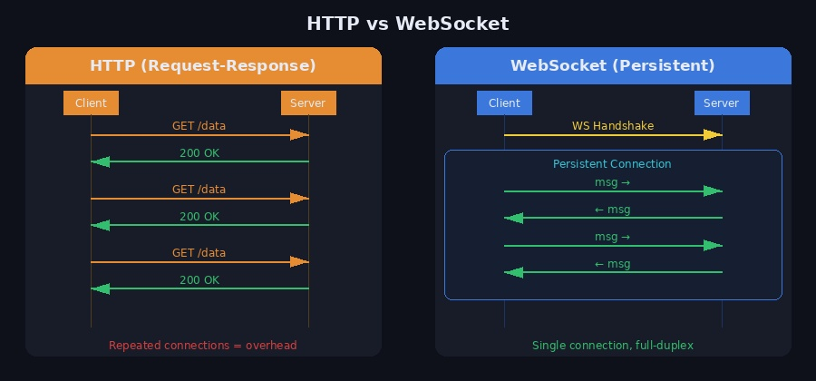
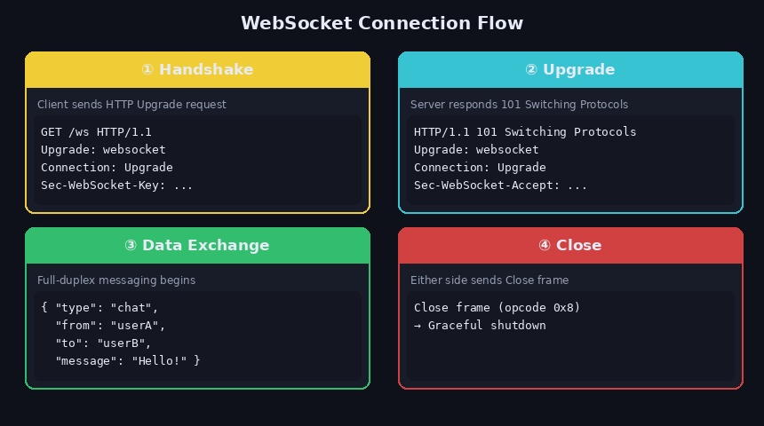
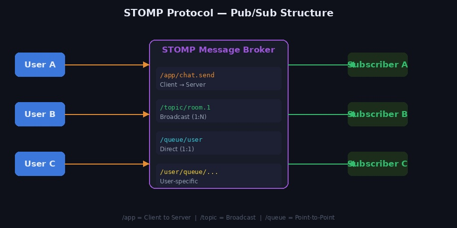
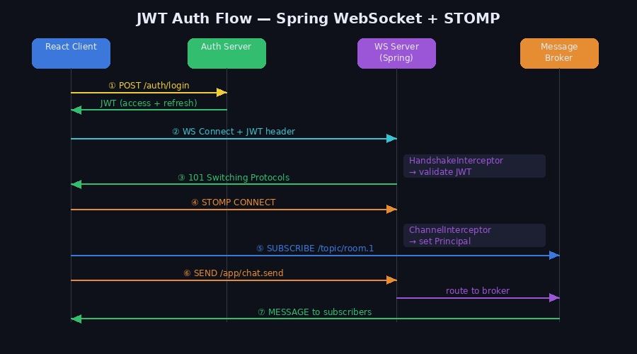
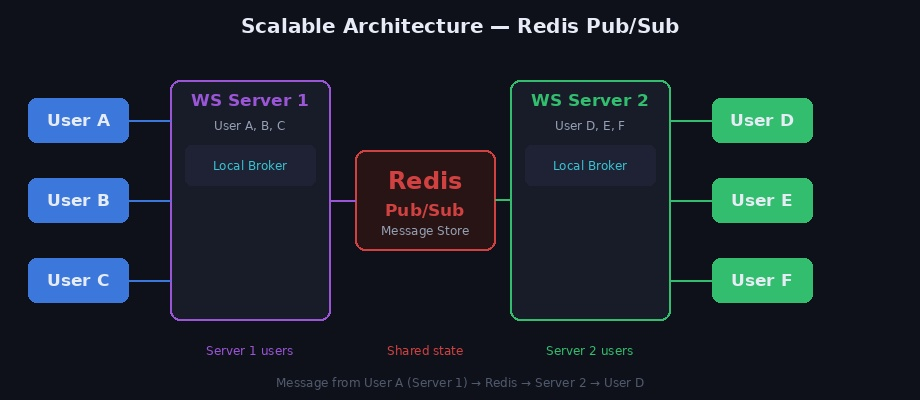

채팅, 실시간 알림, 주식 시세처럼 서버에서 클라이언트로 데이터를 즉시 밀어줘야 하는 기능을 구현할 때 가장 먼저 떠오르는 기술이 **WebSocket**입니다. 기존 HTTP 방식의 한계를 어떻게 해결하는지, 그리고 실무에서 어떻게 구성하는지를 순서대로 정리합니다.

---

## 1. WebSocket이란?

WebSocket은 클라이언트와 서버가 **하나의 연결을 유지한 채 양방향으로 실시간 통신**하는 프로토콜입니다. HTTP를 기반으로 업그레이드 핸드셰이크가 이루어진 뒤, 이후 모든 통신은 WebSocket 프레임으로 처리됩니다.



### HTTP와의 차이

| 구분 | HTTP | WebSocket |
|------|------|-----------|
| 연결 방식 | 요청마다 연결/종료 | 한 번 연결 후 유지 |
| 통신 방향 | 클라이언트 → 서버 (단방향) | 양방향 |
| 실시간성 | 낮음 (폴링 필요) | 매우 높음 |
| 오버헤드 | 매 요청마다 헤더 포함 | 최초 핸드셰이크 이후 최소화 |
| 사용 예 | REST API | 채팅, 알림, 실시간 대시보드 |

HTTP 방식으로 실시간성을 흉내 내려면 **폴링(Polling)** 이나 **롱 폴링(Long Polling)** 을 써야 하는데, 불필요한 요청이 많아져 서버 부하가 증가합니다. WebSocket은 이 문제를 단일 연결로 해결합니다.

---

## 2. 연결 흐름



WebSocket 통신은 네 단계로 이루어집니다.

**① Handshake**: 클라이언트가 HTTP 업그레이드 요청을 보냅니다.

```
GET /ws HTTP/1.1
Host: example.com
Upgrade: websocket
Connection: Upgrade
Sec-WebSocket-Key: dGhlIHNhbXBsZSBub25jZQ==
Sec-WebSocket-Version: 13
```

**② Upgrade**: 서버가 101 응답으로 WebSocket 연결을 수락합니다.

```
HTTP/1.1 101 Switching Protocols
Upgrade: websocket
Connection: Upgrade
Sec-WebSocket-Accept: s3pPLMBiTxaQ9kYGzzhZRbK+xOo=
```

**③ Data Exchange**: 이후부터는 양방향으로 자유롭게 메시지를 주고받습니다.

```json
{
  "type": "chat",
  "from": "userA",
  "to": "userB",
  "message": "안녕하세요!"
}
```

**④ Close**: 어느 쪽이든 Close 프레임을 보내 연결을 종료합니다.

---

## 3. 구현 방식 선택

실무에서는 두 가지 방식을 상황에 따라 선택합니다.

| | 순수 WebSocket | STOMP + WebSocket |
|--|--------------|-------------------|
| 복잡도 | 낮음 | 높음 |
| 연결/유저 관리 | 직접 구현 | 프레임워크 처리 |
| Pub/Sub | 직접 구현 | 기본 제공 |
| 채팅방 구조 | 구현 복잡 | `/topic` 으로 간단 |
| 적합한 상황 | 간단한 1:1, IoT | 채팅방, 브로드캐스트 |

---

## 4. 순수 WebSocket 구현

### Node.js 서버

```bash
npm install ws
```

```javascript
const WebSocket = require('ws');
const wss = new WebSocket.Server({ port: 8080 });

// userId → socket 매핑
const clients = new Map();

wss.on('connection', (ws) => {
  ws.on('message', (data) => {
    const msg = JSON.parse(data);

    // 최초 연결 시 유저 등록
    if (msg.type === 'register') {
      clients.set(msg.userId, ws);
      return;
    }

    // 특정 유저에게 메시지 전달
    if (msg.type === 'chat') {
      const targetSocket = clients.get(msg.to);
      if (targetSocket && targetSocket.readyState === WebSocket.OPEN) {
        targetSocket.send(JSON.stringify({
          from: msg.from,
          message: msg.message,
          timestamp: new Date().toISOString(),
        }));
      }
    }
  });

  // 연결 종료 시 클라이언트 제거
  ws.on('close', () => {
    for (const [key, value] of clients) {
      if (value === ws) {
        clients.delete(key);
        break;
      }
    }
  });
});
```

### React 클라이언트

```javascript
import { useEffect, useRef } from 'react';

function Chat() {
  const socketRef = useRef(null);

  useEffect(() => {
    socketRef.current = new WebSocket('ws://localhost:8080');

    socketRef.current.onopen = () => {
      // 연결 직후 유저 등록
      socketRef.current.send(JSON.stringify({
        type: 'register',
        userId: 'userA',
      }));
    };

    socketRef.current.onmessage = (event) => {
      const msg = JSON.parse(event.data);
      console.log('받은 메시지:', msg);
    };

    socketRef.current.onerror = (error) => {
      console.error('WebSocket error:', error);
    };

    return () => socketRef.current.close();
  }, []);

  const sendMessage = () => {
    socketRef.current.send(JSON.stringify({
      type: 'chat',
      from: 'userA',
      to: 'userB',
      message: '안녕하세요!',
    }));
  };

  return <button onClick={sendMessage}>메시지 보내기</button>;
}
```

---

## 5. STOMP + Spring WebSocket

Spring 환경에서는 STOMP(Simple Text Oriented Messaging Protocol)를 함께 사용하는 것이 일반적입니다. Pub/Sub 구조로 채팅방, 브로드캐스트를 쉽게 구현할 수 있습니다.



### STOMP 주요 경로

| 경로 | 방향 | 용도 |
|------|------|------|
| `/app/**` | 클라이언트 → 서버 | 메시지 전송 엔드포인트 |
| `/topic/**` | 서버 → 다수 유저 | 채팅방 브로드캐스트 |
| `/queue/**` | 서버 → 특정 유저 | 1:1 메시지 |
| `/user/queue/**` | 서버 → 인증된 특정 유저 | Principal 기반 개인 메시지 |

### WebSocket 설정

```java
@Configuration
@EnableWebSocketMessageBroker
public class WebSocketConfig implements WebSocketMessageBrokerConfigurer {

    @Override
    public void registerStompEndpoints(StompEndpointRegistry registry) {
        registry.addEndpoint("/ws-chat")
                .setAllowedOriginPatterns("*")
                .withSockJS();  // 브라우저 호환성 fallback
    }

    @Override
    public void configureMessageBroker(MessageBrokerRegistry registry) {
        registry.setApplicationDestinationPrefixes("/app");
        registry.enableSimpleBroker("/topic", "/queue");
        registry.setUserDestinationPrefix("/user");
    }
}
```

### 메시지 DTO

```java
@Getter
@NoArgsConstructor
@AllArgsConstructor
public class ChatMessage {
    private String roomId;
    private String sender;
    private String message;
    private LocalDateTime timestamp;
}
```

### Chat Controller

```java
@Controller
public class ChatController {

    private final SimpMessagingTemplate messagingTemplate;

    public ChatController(SimpMessagingTemplate messagingTemplate) {
        this.messagingTemplate = messagingTemplate;
    }

    // 채팅방 브로드캐스트
    @MessageMapping("/chat.send")
    public void sendToRoom(ChatMessage message) {
        messagingTemplate.convertAndSend(
            "/topic/chat.room." + message.getRoomId(),
            message
        );
    }

    // 1:1 메시지
    @MessageMapping("/chat.private")
    public void sendToUser(ChatMessage message) {
        messagingTemplate.convertAndSendToUser(
            message.getReceiver(),
            "/queue/chat",
            message
        );
    }
}
```

---

## 6. JWT 인증 (Spring + STOMP)

WebSocket도 HTTP와 마찬가지로 인증이 필수입니다. Spring에서는 **HandshakeInterceptor**와 **ChannelInterceptor** 두 단계로 JWT를 검증합니다.



### HandshakeInterceptor — WS 연결 시점 검증

```java
@Component
public class JwtHandshakeInterceptor implements HandshakeInterceptor {

    private final JwtProvider jwtProvider;

    public JwtHandshakeInterceptor(JwtProvider jwtProvider) {
        this.jwtProvider = jwtProvider;
    }

    @Override
    public boolean beforeHandshake(
            ServerHttpRequest request,
            ServerHttpResponse response,
            WebSocketHandler wsHandler,
            Map<String, Object> attributes) {

        String token = extractToken(request);
        if (token != null && jwtProvider.validate(token)) {
            String userId = jwtProvider.getUserId(token);
            attributes.put("userId", userId);  // 세션에 저장
            return true;
        }
        return false;  // false 반환 시 연결 거부
    }

    @Override
    public void afterHandshake(
            ServerHttpRequest request,
            ServerHttpResponse response,
            WebSocketHandler wsHandler,
            Exception ex) {}

    private String extractToken(ServerHttpRequest request) {
        List<String> auth = request.getHeaders().get("Authorization");
        if (auth != null && !auth.isEmpty()) {
            return auth.get(0).replace("Bearer ", "");
        }
        return null;
    }
}
```

### ChannelInterceptor — STOMP CONNECT 시점 검증

```java
@Component
public class StompAuthInterceptor implements ChannelInterceptor {

    @Override
    public Message<?> preSend(Message<?> message, MessageChannel channel) {
        StompHeaderAccessor accessor =
            MessageHeaderAccessor.getAccessor(message, StompHeaderAccessor.class);

        if (StompCommand.CONNECT.equals(accessor.getCommand())) {
            String userId = (String) accessor.getSessionAttributes().get("userId");
            if (userId != null) {
                // Principal 설정 → /user/queue 경로 사용 가능해짐
                accessor.setUser(new UsernamePasswordAuthenticationToken(userId, null));
            }
        }
        return message;
    }
}
```

> `ChannelInterceptor`에서 `Principal`을 설정해야 `/user/queue/**` 경로가 정상 동작합니다.

### 설정에 인터셉터 등록

```java
@Override
public void registerStompEndpoints(StompEndpointRegistry registry) {
    registry.addEndpoint("/ws-chat")
            .addInterceptors(jwtHandshakeInterceptor)  // 추가
            .setAllowedOriginPatterns("*")
            .withSockJS();
}

@Override
public void configureClientInboundChannel(ChannelRegistration registration) {
    registration.interceptors(stompAuthInterceptor);   // 추가
}
```

### React STOMP 클라이언트 (JWT 포함)

```bash
npm install @stomp/stompjs sockjs-client
```

```javascript
import { Client } from '@stomp/stompjs';
import SockJS from 'sockjs-client';

const client = new Client({
  webSocketFactory: () => new SockJS('http://localhost:8080/ws-chat'),

  // JWT를 CONNECT 헤더로 전달
  connectHeaders: {
    Authorization: 'Bearer ' + localStorage.getItem('accessToken'),
  },

  onConnect: () => {
    // 채팅방 구독
    client.subscribe('/topic/chat.room.1', (msg) => {
      const message = JSON.parse(msg.body);
      console.log('받은 메시지:', message);
    });

    // 개인 메시지 구독
    client.subscribe('/user/queue/chat', (msg) => {
      const message = JSON.parse(msg.body);
      console.log('개인 메시지:', message);
    });
  },

  onStompError: (frame) => {
    console.error('STOMP error:', frame);
  },
});

client.activate();

// 메시지 전송
const sendMessage = (roomId, content) => {
  client.publish({
    destination: '/app/chat.send',
    body: JSON.stringify({
      roomId,
      sender: 'userA',
      message: content,
      timestamp: new Date().toISOString(),
    }),
  });
};
```

---

## 7. 확장성 — Redis Pub/Sub

서버가 단일 인스턴스일 때는 SimpleBroker로 충분하지만, **서버가 여러 대로 늘어나면** 문제가 생깁니다. User A가 Server 1에 연결되어 있고 User B가 Server 2에 연결되어 있으면, Server 1에서 보낸 메시지가 User B에게 도달하지 않습니다.



### 해결 방법: Redis Pub/Sub (또는 RabbitMQ)

```
User A (Server 1) → 메시지 발행 → Redis Channel
                                         ↓
                              모든 서버가 구독 중
                                         ↓
                           Server 2 → User B에게 전달
```

### Spring에서 Redis STOMP 브로커 연동

```java
@Override
public void configureMessageBroker(MessageBrokerRegistry registry) {
    registry.setApplicationDestinationPrefixes("/app");

    // SimpleBroker 대신 외부 브로커 사용
    registry.enableStompBrokerRelay("/topic", "/queue")
            .setRelayHost("localhost")
            .setRelayPort(61613)        // RabbitMQ STOMP 포트
            .setClientLogin("guest")
            .setClientPasscode("guest");

    registry.setUserDestinationPrefix("/user");
}
```

### 실무 선택 기준

```
소규모 / 단일 서버   → SimpleBroker (설정 최소)
중규모 / 다중 서버   → Redis Pub/Sub
대규모 / 메시지 신뢰성 필요 → RabbitMQ / Kafka
```

---

## 8. 실무에서 반드시 고려할 것들

### 인증 & 보안

WebSocket 연결 시 JWT 검증은 필수입니다. Handshake + STOMP CONNECT 두 단계에서 이중으로 검증하는 것이 권장됩니다. 토큰 만료 시 클라이언트에서 재연결 로직도 구현해야 합니다.

### 연결 상태 관리

```javascript
// 재연결 로직 예시 (@stomp/stompjs)
const client = new Client({
  // ...
  reconnectDelay: 5000,       // 5초 후 자동 재연결
  heartbeatIncoming: 4000,    // 서버 heartbeat 주기
  heartbeatOutgoing: 4000,    // 클라이언트 heartbeat 주기
});
```

### 메시지 저장 전략

실시간 전송과 DB 저장을 분리해 처리합니다.

```
WebSocket 전송 (즉시)
    ↕ (비동기)
DB 저장 (비동기 처리 / Kafka 큐 활용)
```

### 다중 디바이스 대응

같은 유저가 여러 기기로 접속하는 경우, Map 대신 `userId → List<WebSocket>` 형태로 관리하거나 Redis에 세션 정보를 공유해야 합니다.

---

## 9. 순서 정리

WebSocket을 처음 공부하거나 프로젝트에 적용할 때 아래 순서로 접근하면 이해하기 쉽습니다.

```
1단계 : WebSocket 기본 개념과 HTTP와의 차이
2단계 : 순수 WebSocket으로 1:1 채팅 구현
3단계 : JWT 인증 추가
4단계 : 채팅방(1:N) 구조 확장
5단계 : STOMP + Spring 적용
6단계 : Redis 연동으로 다중 서버 확장
```

---

## 참고 자료

- [WebSocket API (MDN)](https://developer.mozilla.org/ko/docs/Web/API/WebSocket)
- [Spring WebSocket 공식 문서](https://docs.spring.io/spring-framework/docs/current/reference/html/web.html#websocket)
- [@stomp/stompjs 공식 문서](https://stomp-js.github.io/stomp-websocket/)
- [SockJS 공식 문서](https://github.com/sockjs/sockjs-client)
- Claude AI